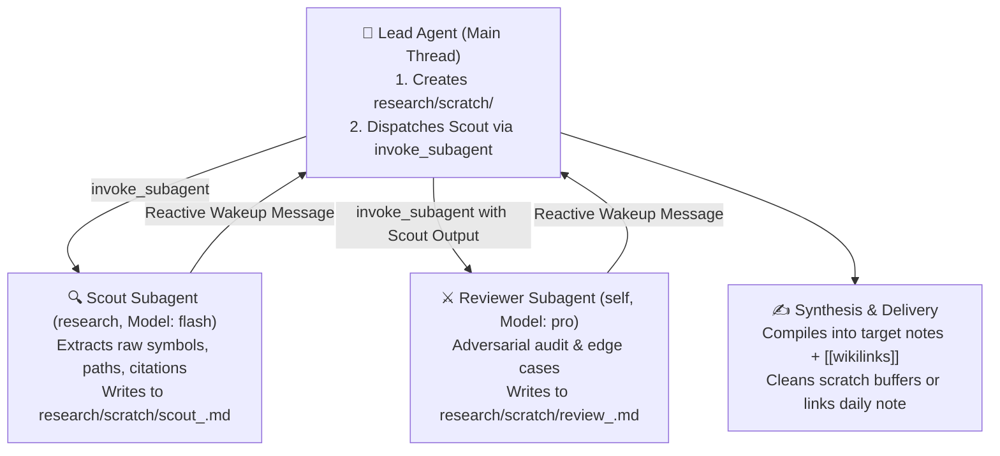

# Agent Teams Orchestration Skill

Activate this skill whenever the user asks to:
- Form an "agent team", "subagent swarm", or "autonomous research crew".
- Run bounded overnight work ("I sleep, the machine stays awake").
- Perform multi-role research or refactoring with adversarial review.
- Follow the Ayush Kumar Shah / Claude Code Agent Teams pattern.
- Execute or delegate via `/agent-teams-orchestration` or `/teamwork-preview`.

---

## 1. Concrete Subagent Mapping (Antigravity Runtime)

In Antigravity, subagents are spawned via the native `invoke_subagent` tool using registered types (`research` and `self`). 

> [!IMPORTANT]
> **Do NOT use `TypeName: "teamwork_preview"`**. In standard Antigravity environments, `teamwork_preview` is an unregistered or disabled preview engine (`subagent "teamwork_preview" not found or not allowed`). Always spawn native Antigravity subagent types directly:

| Role | Antigravity Type | Model | Capabilities & Sandbox | Target Scratch Buffer |
| :--- | :--- | :--- | :--- | :--- |
| **Scout** | `research` | `flash` | Read-only codebase explorer, file reader, web/URL search. High speed, zero speculation. | `research/scratch/scout_<task>.md` |
| **Reviewer** | `self` | `pro` | Adversarial skeptic. Runs tests, audits edge cases, checks SMT invariants, hunts unearned claims. | `research/scratch/review_<task>.md` |
| **Writer** | `self` (or Lead) | `inherit` | Synthesizes strictly from reviewed evidence. Drafts final target deliverables. | `research/notes/<task>.md` |
| **Lead** | *Main Session* | *Current* | Orchestrator. Dispatches subagents, arbitrates conflicts, enforces token/step budgets, compiles graph links. | Final delivery & git tracking |

---

## 2. Mandatory Autonomous Execution Protocol

**When this skill is activated to execute a task, the Lead agent MUST NOT perform the entire exploration and review serially in the main thread.** The Lead agent must execute the following dispatch lifecycle:



### Step 1: Pre-flight Isolation Setup
Ensure the scratch directory exists before dispatching:
- Create `research/scratch/` if it does not exist.
- Ensure subagents are assigned strictly disjoint file targets.

### Step 2: Dispatch the Scout Subagent
Call `invoke_subagent` with `TypeName: "research"`, `Model: "flash"`, and a bounded prompt:
```json
{
  "Subagents": [
    {
      "TypeName": "research",
      "Model": "flash",
      "Role": "Scout: <Domain Task>",
      "Prompt": "You are the Scout agent. Find relevant sources, symbol definitions, file paths, and empirical data for <task>. Write your raw findings to research/scratch/scout_<task>.md. Never theorize or speculate. Stop once complete."
    }
  ]
}
```
*Stop calling tools to wait for the runtime's reactive wakeup upon Scout completion.*

### Step 3: Dispatch the Reviewer Subagent
Upon receiving the Scout's report, dispatch the Reviewer via `invoke_subagent` with `TypeName: "self"` and `Model: "pro"`:
```json
{
  "Subagents": [
    {
      "TypeName": "self",
      "Model": "pro",
      "Role": "Reviewer: <Domain Task>",
      "Prompt": "You are the Reviewer agent (Adversarial Skeptic). Audit the Scout's findings in research/scratch/scout_<task>.md. Verify claims, test edge cases, and run relevant validation scripts. Record approved findings and flagged risks in research/scratch/review_<task>.md."
    }
  ]
}
```
*Stop calling tools to wait for reactive completion.*

### Step 4: Final Synthesis & Knowledge Graph Grounding
The Lead agent (or a dispatched Writer) compiles the approved findings into the permanent target document:
1. Every claim must have a verbatim source link beside it.
2. Ground the document into the Obsidian knowledge base using `[[Concept]]` and `[[Project]]` wikilinks.
3. Classify claims using `ARCH-RFC-001` epistemic tiers: `FORMALLY_PROVEN`, `EMPIRICALLY_VERIFIED`, or `HEURISTIC_HYPOTHESIS`.

---

## 3. Concurrency & Isolation Invariants (CRITICAL)

To prevent race conditions, file corruption, and multi-agent merge collisions:

1. **Strict File Separation:**
   Subagents **MUST NEVER** edit the same file concurrently. 
   - Scout writes to: `research/scratch/scout_<task>.md`
   - Reviewer writes to: `research/scratch/review_<task>.md`
   - Writer compiles to the target note: `research/notes/<YYYY-MM-DD>_<task>.md`
2. **Workspace Isolation (`invoke_subagent`):**
   When subagents perform code refactoring or test runs, specify `Workspace: 'branch'` to fork an isolated git worktree so concurrent workers do not collide.
3. **Reactive Wakeups (Zero-Polling):**
   Never spin up an agent and poll in a `while` loop. Let the subagent complete asynchronously; the runtime automatically wakes the Lead agent upon completion.

---

## 4. Bounded Execution Safeguards ("I sleep, the machine stays awake")

For long-running or overnight tasks, **NEVER launch unbounded loops**. Always establish:

1. **Explicit Stop Criteria:**
   - E.g., *"Stop after evaluating 3 papers"* or *"Halt when all unit tests pass"*.
2. **Budget & Iteration Caps:**
   - Cap subagent recursions to prevent runaway token spend.
3. **Pre-flight Sandbox:**
   - Commit work to an isolated feature branch (`git checkout -b feature/...`).
   - Never push unverified overnight code directly to `main`.
4. **Morning Review Packet:**
   - Always conclude with a structured summary (`walkthrough.md` or a populated `daily-note.md`) detailing:
     - What was tested / verified.
     - What claims passed adversarial review.
     - Exact git diff and pending decisions requiring human approval.

---

## 5. Integration with `/teamwork-preview`

When the user invokes `/teamwork-preview` or requests an interactive multi-agent project plan:
1. Use `prompt_draft.md` to elicit requirements and define acceptance criteria.
2. In Step 2 (Requested team), configure the Scout-Reviewer-Writer division of labor.
3. When the user approves ("go" / "launch"):
   - **Do NOT** call `invoke_subagent(TypeName: "teamwork_preview")`.
   - **DO** execute the Autonomous Execution Protocol above: call `invoke_subagent(TypeName: "research", Model: "flash")` for the Scout phase, followed by the Reviewer phase.
