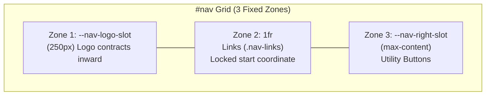

# Fluid Wordmark Collapse & Navigation Fixation

This skill provides architectural patterns, motion kinematics, and CSS containment rules for implementing high-craft, collapsible brand wordmarks modeled after Anthropic's flagship navigation interaction (`ANTHROP\C` → `A\`).

It transforms verbose brand names into acronym monograms in-place while guaranteeing zero horizontal displacement across adjacent navigation links and controls.

---

## 1. Core Architectural Principles

### A. The In-Place Syllable Decomposition Pattern
Never place a full brand name and its acronym side-by-side (e.g. `Full Name · ABC`), only to abruptly vanish the full name on scroll. Instead, decompose the wordmark into semantic root initials and collapsible trailing syllables:

```html
<a href="/" class="nav-logo" aria-label="Aaradhya Dev Tamrakar">
  <span class="nav-brand-text" aria-hidden="true">
    <span class="nav-word"><span class="nav-initial">A</span><span class="nav-rest">aradhya</span></span>
    <span class="nav-word"><span class="nav-initial">D</span><span class="nav-rest">ev</span></span>
    <span class="nav-word"><span class="nav-initial">T</span><span class="nav-rest">amrakar</span></span>
    <span class="nav-dot">.</span>
  </span>
</a>
```

### B. Accessibility & Screen Reader Invariants
- Apply `aria-label="Full Brand Name"` to the parent anchor `<a>` so assistive technologies announce the complete name in natural prose.
- Mark the decomposed visual container with `aria-hidden="true"` to prevent screen readers from announcing fragmented syllables (e.g. "A aradhya D ev T amrakar dot").

---

## 2. The 3-Zone Fixed-Slot Layout (Anti-Displacement)

When words contract from ~250px to ~60px, adjacent elements will violently slide leftward unless isolated by a dedicated grid slot reservation.



### Implementation Rules

1. **Define Explicit Slot Variables on `#nav`**:
   ```css
   #nav,
   noscript > nav {
     --nav-logo-slot: 250px;
     --nav-right-slot: max-content;

     position: fixed;
     top: 0; left: 0; right: 0;
     z-index: 100;

     display: grid;
     grid-template-columns: var(--nav-logo-slot) 1fr var(--nav-right-slot);
     column-gap: 1.5rem;
     align-items: center;

     /* Keep horizontal padding constant; tighten vertical padding on scroll */
     padding: max(1.75rem, env(safe-area-inset-top, 1.75rem)) 
              max(2.5rem, env(safe-area-inset-right, 2.5rem)) 
              1.75rem 
              max(3rem, env(safe-area-inset-left, 3rem));
   }
   ```

2. **Anchor the Logo to the Slot Origin**:
   ```css
   .nav-logo {
     width: var(--nav-logo-slot, 250px);
     min-width: var(--nav-logo-slot, 250px);
     justify-content: flex-start;
   }
   ```

3. **Lock Navigation Links & Right Controls**:
   - Set `.nav-links { margin-left: 0.5rem; }` so link coordinates depend deterministically on the grid boundary, never on dynamic logo width.
   - Maintain constant padding on `.nav-links a` and `.nav-cta` (`CONNECT`) across both scrolled and unscrolled states. Never shrink button padding on scroll if it causes horizontal jitter.

> Detailed mathematical derivation and responsive breakpoints: see [references/fixed-slot-architecture.md](references/fixed-slot-architecture.md).

---

## 3. Motion Kinematics & GPU Compositing

### A. The Trailing Syllable Collapse Engine
Animate the collapsible spans (`.nav-rest`) using calibrated spring kinematics:

```css
.nav-brand-text {
  display: inline-flex;
  align-items: baseline;
  gap: 0.28em;
  will-change: gap;
  transition: gap 0.45s cubic-bezier(0.16, 1, 0.3, 1);
}

.nav-word {
  display: inline-flex;
  align-items: baseline;
}

.nav-initial {
  font-family: var(--serif);
  font-size: inherit;
  font-weight: 500;
  color: var(--heading);
  letter-spacing: 0.02em;
  display: inline-block;
}

.nav-rest {
  font-family: var(--serif);
  font-size: inherit;
  font-weight: 400;
  color: var(--muted);
  display: inline-block;
  max-width: 140px;
  opacity: 0.88;
  overflow: hidden;
  white-space: nowrap;
  vertical-align: baseline;
  transform: scaleX(1) translateX(0);
  transform-origin: left baseline;
  will-change: max-width, opacity, transform;
  -webkit-backface-visibility: hidden;
  backface-visibility: hidden;
  transition:
    max-width 0.45s cubic-bezier(0.16, 1, 0.3, 1),
    opacity 0.3s cubic-bezier(0.16, 1, 0.3, 1),
    transform 0.4s cubic-bezier(0.16, 1, 0.3, 1);
}

/* Scrolled State */
#nav.scrolled .nav-rest {
  max-width: 0;
  opacity: 0;
  transform: scaleX(0.75) translateX(-4px);
  pointer-events: none;
}

#nav.scrolled .nav-brand-text {
  gap: 0.04em;
}
```

### B. Interactive Hover-to-Peek Preview
On desktop viewports, hovering over `.nav-logo` while scrolled unfolds the full name preview into the reserved empty space of Zone 1 without displacing adjacent elements:

```css
@media (hover: hover) and (min-width: 901px) {
  #nav.scrolled .nav-logo:hover .nav-rest {
    max-width: 140px;
    opacity: 0.95;
    transform: scaleX(1) translateX(0);
    pointer-events: auto;
  }
  #nav.scrolled .nav-logo:hover .nav-brand-text {
    gap: 0.28em;
  }
}
```

---

## 4. Critical Traps & Anti-Patterns

### ❌ Never Use `contain: inline-size`
Applying `contain: inline-size` to auto-width text segments causes the browser layout engine to treat the element as containing 0px of content, instantly collapsing and clipping all inner characters upon page load.
*(See [references/css-gotchas.md](references/css-gotchas.md) for root-cause analysis).*

### ❌ Avoid Fixed-Container `animation-timeline: scroll()`
Do not bind `@supports (animation-timeline: scroll())` directly to `position: fixed` navbars with pixel ranges. Chromium/Blink evaluates fixed-element scroll timelines at 100% progress before scrolling begins, prematurely hiding the full name. Use passive RAF scroll listeners toggling a `.scrolled` class.

### ♿ Accessibility & Reduced Motion
Always disable animated transitions under reduced-motion preferences:
```css
@media (prefers-reduced-motion: reduce) {
  .nav-rest,
  .nav-brand-text {
    transition: none !important;
    animation: none !important;
  }
  #nav.scrolled .nav-rest {
    max-width: 0 !important;
    opacity: 0 !important;
    transform: none !important;
  }
}
```

---

## 5. Additional Resources

### Reference Files
- [references/fixed-slot-architecture.md](references/fixed-slot-architecture.md) — Grid math and responsive breakpoint scaling.
- [references/css-gotchas.md](references/css-gotchas.md) — Technical post-mortem on CSS containment and Blink scroll-timeline bugs.

### Ready-to-Use Boilerplates
- [examples/vanilla-html-css.html](examples/vanilla-html-css.html) — Single-file, zero-dependency demo.
- [examples/react-tailwind.tsx](examples/react-tailwind.tsx) — Production React / Tailwind CSS component.
