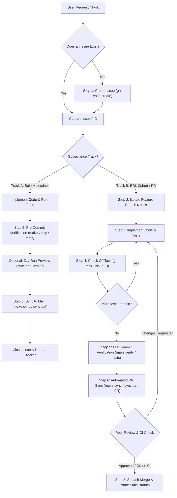

# Default GitHub Development Workflow

This skill defines the canonical standard operating procedure (SOP) for all software development, feature additions, bug fixes, refactors, and version control across GitHub repositories.

---

## 1. Golden Rules & Invariants

1. **Issue Anchoring**: All non-trivial code modifications must link to a tracked GitHub issue with complete sidebar metadata (`--assignee <EXPLICIT_USERNAME>`, `--label "<labels>"`). Attach the issue to its respective project Milestone (`gh issue edit <ID> --milestone "<Milestone>"`). The issue number (`#<ID>`) serves as the permanent tracking anchor for branches, commits, PRs, and audit comments.
2. **Branch Isolation**: Never commit multi-step features or refactors directly to `main` in team or cohort environments. Always branch off `main` using `<type>/<slug>-#<ID>`.
3. **Checkpoint Task Tracking**: Check off acceptance criteria in the issue body progressively as tasks complete (`gh-task --issue <ID> --task "<name>"` or `gh-task --issue <ID> --index <N>`).
4. **Verification Gate**: Never commit or push without passing local linters (`ruff`, `eslint`), formatters, and test suites (`pytest`, `npm test`, `Invoke-Pester`). Universal Makefile entrypoints (`make test`, `make lint`, `make format`, `make verify`) are recommended wherever a `Makefile` is present. 100% pass rate required; zero errors tolerated.
5. **Ecosystem Synchronization (`Makefile`, `sync.bat`, `sync.ps1`, `sync.sh`)**: When `sync.ps1`, `sync.bat`, `sync.sh`, `scripts/sync.ps1`, `scripts/sync.bat`, `scripts/sync.sh`, or a `Makefile` with a `sync` target is present in the repository, direct `git commit`, `git add`, or `git push` commands are **strictly forbidden**. All version control must run through `make sync` (or `.\sync.bat`, `.\scripts\sync.bat`, `./sync.sh`, or `pwsh -File ...`).
   - **Zero-Friction Wrapper & Native Help**: Windows environments must prioritize `.\sync.bat` (or `make.bat`) to bypass PowerShell `ExecutionPolicy` on fresh clones. All `sync.bat` scripts must provide native help routing (`/?`, `-help`, `--help`) documenting common usage, `-SkipCI`, `-WhatIf`, `-PullOnly`, `-Status`, and BRL `-PR`.
   - **Root Decluttering Architecture**: To satisfy academic and open-source evaluation standards (TAs, external reviewers), keep the repository root clean by maintaining the root `Makefile` (canonical POSIX interface) and `make.bat` (zero-dependency Windows dispatcher) at root, while organizing underlying sync engines under `scripts/` (`scripts/sync.ps1`, `scripts/sync.bat`, `scripts/sync.sh`). Root `sync.bat` may be retained as a lightweight compatibility forwarder shim.
   - **Cross-Platform Parity**: Unix/Linux/macOS environments execute `make sync` or `./sync.sh` without requiring PowerShell dependencies.
6. **Selective CI Runner Bypass & Workflow Hardening (`-SkipCI`, Path Whitelisting & Concurrency)**:
   - **Path Whitelisting in Workflows**: All CI workflows (`.github/workflows/*.yml`) should enforce explicit `paths:` whitelisting for core executable assets (`src/**`, `sim/**`, `tools/**`, `schemas/**`, `scripts/**`, `requirements*.txt`, `audit.bat`, `sim.bat`, workflow files), preventing high-churn research, reports, dev-logs, and documentation files from needlessly consuming GitHub Actions runner quotas.
   - **Concurrency Governance**: Enforce `concurrency: group: <workflow>-${{ github.ref }} cancel-in-progress: true` to instantly terminate redundant intermediate builds when rapid pushes occur. Always include `workflow_dispatch:` for manual on-demand triggers.
   - **Selective Runner Bypass Switch (`-SkipCI`)**: To explicitly bypass remote runner execution for doc/state updates, use `.\sync.bat -SkipCI` (aliases `-NoCI`, `-SkipActions`) or `make sync ARGS="-SkipCI"`.
   - **Staged Auto-Detection Engine**: `sync.ps1` automatically captures staged changes (`git diff --cached --name-only`) and appends `[skip ci]` when only non-code/operational assets (`research/**`, `report/**`, `graphify-out/**`, `orchestrator-state/**`, `dev-logs/**`, `*.md`, `.obsidian/**`, etc.) are staged.
7. **Dry-Run Preview Safety Gate (`-WhatIf` / `-DryRun`)**:
   - Preview changes, staged file count, diff churn, auto-generated commit message, secret scans, and CI bypass evaluation without altering Git state via `.\sync.bat -WhatIf`.
8. **Dual-Track Governance & PR Review Dispatch**:
   - **Track A: Solo Maintainer Velocity Bridge (`DEC-003-A`)**: Direct commits and pushes via `.\sync.bat -m "..."` are authorized strictly for the solo repository administrator (`AaradhyaDT`), provided local deterministic verification gates pass 100% prior to pushing.
   - **Track B: BRL Cohort & Contributor Automated PR Standard**: All multi-contributor feature work and cohort initiatives **MUST** execute the automated Pull Request workflow (`.\sync.bat -PR -m "type(scope): summary" -Issue <ID> -Reviewer <handle>`).
   - **Explicit Usernames**: Always assign explicit GitHub usernames (e.g. `--assignee AaradhyaDT`, `--reviewer tiixsha`). Never use ambiguous `@me` in collaborative repositories.
   - **Reciprocal Peer Review**: When Developer A opens a PR, request review from Developer B; when Developer B opens a PR, request review from Developer A.
9. **Collaborative Privacy & Boundary Isolation (Zero Personal Leakage)**:
   > [!CAUTION]
   > **Never commit or log personal developer resources into collaborative/public repositories.**
   > Personal NotebookLM IDs, private journals, personal notes, and local machine configs found in global agent rules are strictly for local assistant tooling context. They must **never** be written into shared repository documentation, Markdown files, or committed artifacts.
10. **Release SHA & Commit History Linking Integrity**:
    - Whenever documenting version releases, "What's New" logs (`releases.js`), changelogs, or repository milestones, **NEVER** use placeholder/synthetic strings (e.g., `rel50`, `rel55`, `upg47`, `xtool20`).
    - Every commit reference must link to an authentic 7–40 hex Git commit short SHA (`https://github.com/<owner>/<repo>/commit/<sha>`) that resolves directly on GitHub.
    - For automated releases, resolve `git rev-parse --short HEAD` dynamically and enforce CI validation gates (`scripts/verify.py`).
11. **Agent Rules Architecture (`AGENTS.md` Single Source of Truth)**:
    - Always maintain full operational guidelines, verification rules, and ecosystem invariants in `AGENTS.md`.
    - Keep `GEMINI.md` lean by referencing `[@AGENTS.md](AGENTS.md)` in backticks to prevent documentation duplication and rule drift across tools.

---

## 2. Decision Tree & Workflow Paths



---

## 3. Step-by-Step Procedure

### Step 1: Scoping & Issue Initialization

Define requirements, acceptance criteria, and technical boundaries before touching code.

1. **Formulate Issue Body**:
   Follow conventional title style: `[<Type>] <Concise Imperative Summary>`. Include an **Overview**, **Scope / Non-Goals**, and a markdown checklist of **Tasks** (`- [ ] <task>`).
   See [templates.md](examples/templates.md) for pre-built formats.

2. **Create via GitHub CLI**:
   ```bash
   gh issue create \
     --title "[Feature] Add Statistical Parity Disparity Metric" \
     --assignee "AaradhyaDT" \
     --label "enhancement,WP4" \
     --body "$(cat << 'EOF'
   ## Overview
   Implement statistical parity difference calculation with BCa confidence intervals.

   ## Tasks
   - [ ] Implement mathematical metric in src/fairness/metrics.py
   - [ ] Add unit tests with synthetic distribution fixtures
   - [ ] Verify test suite passing (pytest) and linting (ruff)
   EOF
   )"
   ```

3. **Record Issue Number**: Note `#<ISSUE_NUMBER>` (e.g., `#28`).

4. **Enrich Issue Metadata (Type, Milestone, Relationships & Projects)**:
   - **Set Native Issue Type** (`Bug`, `Feature`, `Task`):
     ```bash
     gh api -X PATCH repos/{owner}/{repo}/issues/<ISSUE_NUMBER> -f type="Feature"
     ```
   - **Verify Milestones & Attach**:
     ```bash
     # List active milestones via REST API:
     gh api repos/{owner}/{repo}/milestones --jq '.[].title'
     
     # Attach issue to milestone:
     gh issue edit <ISSUE_NUMBER> --milestone "<Milestone Title>"
     ```
   - **Link Sub-Issue Relationships** (Parent ↔ Child hierarchy):
     ```bash
     # Capture GraphQL node IDs for parent and child:
     # gh api graphql -f query='query { repository(owner: "{owner}", name: "{repo}") { issue(number: <NUM>) { id } } }'
     gh api graphql -f query='mutation { addSubIssue(input: { issueId: "<PARENT_NODE_ID>", subIssueId: "<CHILD_NODE_ID>" }) { issue { id } } }'
     ```
   - **Cross-Repo Project Board Tracking (ProjectsV2)**:
     If the target repository belongs to an organization where member project creation is restricted, create and maintain the project board on the personal user namespace (`gh project create --owner @me --title "..."`), link the board to your repository mirror (`linkProjectV2ToRepository`), and add organization issues cross-repo using `addProjectV2ItemById`.

---

### Step 2: Branch Isolation (Track B)

Isolate development on a dedicated feature or bugfix branch.

1. **Ensure Base is Up to Date**:
   ```bash
   git switch main
   git pull origin main
   ```

2. **Create and Switch to Branch**:
   Convention: `<type>/<short-slug>-#<ISSUE_NUMBER>`.
   ```bash
   git switch -c feat/statistical-parity-#28
   ```
   *(Note: When using `.\sync.bat -PR`, branch creation and isolation are automated).*

---

### Step 3: Implement Changes

1. Follow repository coding guidelines, type hinting, and docstring conventions (e.g. NumPy docstring format).
2. Respect diagnostic/architectural boundaries and frozen schemas.
3. Keep diffs minimal, focused, and clean.

---

### Step 4: Checkpoint Task Tracking

Provide transparent progress by updating the issue checklist.

Use the global `gh-task` (or `toggle-issue-task`) utility from any terminal:

```bash
# List current tasks
gh-task --issue 28 --list

# Toggle a specific task by substring (marks [x])
gh-task --issue 28 --task "metrics.py"

# Toggle a task by 1-based index
gh-task --issue 28 --index 2

# Mark all tasks complete
gh-task --issue 28 --all
```

For major progress milestones, post an informative audit comment:
```bash
gh issue comment 28 --body "Completed metric math and unit test fixtures. 85 tests passing."
```

---

### Step 5: Pre-Commit Verification Gate

Enforce local verification before staging. Zero errors tolerated.

#### Universal Makefile Entrypoints (Recommended across all POSIX & CI environments)
```bash
make test        # Run unit & integration test suites
make lint        # Run static linter checks
make format      # Check or apply code formatting
make verify      # Run deterministic AST, lint, and commit SHA integrity checks
```

#### Language-Specific CLI Fallbacks
```powershell
# Python environments
uv run --extra dev ruff check src/
uv run --extra dev ruff format --check src/
uv run --extra dev pytest

# Node.js/TypeScript environments
npm run lint
npm test

# PowerShell environments
Invoke-Pester .\tests\launch_user_n.Tests.ps1 -Output Detailed
```

#### CI/CD Workflow Hardening Standard (`.github/workflows/*.yml`)
When configuring remote GitHub Actions pipelines, enforce selective executable asset triggers, concurrency cancellation, and manual dispatch:
```yaml
name: Deterministic verification

on:
  push:
    branches: ["**"]
    paths:
      - "src/**"
      - "sim/**"
      - "tools/**"
      - "schemas/**"
      - "scripts/**"
      - "requirements*.txt"
      - "audit.bat"
      - "sim.bat"
      - ".github/workflows/verification.yml"
  pull_request:
    paths:
      - "src/**"
      - "sim/**"
      - "tools/**"
      - "schemas/**"
      - "scripts/**"
      - "requirements*.txt"
      - "audit.bat"
      - "sim.bat"
      - ".github/workflows/verification.yml"
  workflow_dispatch:

concurrency:
  group: verification-${{ github.ref }}
  cancel-in-progress: true

permissions:
  contents: read
```
This guarantees that documentation commits, research transcripts, and operational state logs do not trigger unnecessary remote runner queues, while executable code and scripts undergo rigorous verification.

---

### Step 6: Multi-Remote Ecosystem Synchronization

Check the repository for synchronization automation in order of precedence:
1. **Root `Makefile` / `make.bat`**: Universal entrypoint across Linux, macOS, and Windows.
2. **Root or `scripts/` Wrapper**: `.\sync.bat`, `.\scripts\sync.bat`, `./scripts/sync.sh`, or `pwsh -File scripts/sync.ps1`.

#### Mode 1: Track A — Solo Maintainer Velocity Bridge
Authorized strictly for repository maintainer operations on `main`:
```bash
# Universal Makefile Entrypoint (Cross-Platform)
make sync ARGS="-WhatIf"                                                  # Dry-run preview without altering Git state
make sync ARGS="-m 'feat(fairness): add statistical parity metric (#28)'"  # Routine or major feature sync
make sync ARGS="-SkipCI -m 'docs(memory): update team notes (#28)'"       # Explicit CI runner bypass
make sync ARGS="-PullOnly"                                                # Safe rebase pull only

# Windows make.bat Dispatcher (Native CMD/PowerShell without GNU Make)
make sync -WhatIf
make sync -m "feat(fairness): add statistical parity metric (#28)"
make sync -SkipCI -m "docs(memory): update team notes (#28)"
make sync -PullOnly

# Direct Windows Batch Wrapper (Root or scripts/)
.\sync.bat -m "feat(fairness): add statistical parity metric (#28)"
.\scripts\sync.bat -m "feat(fairness): add statistical parity metric (#28)"
.\sync.bat -WhatIf -SkipCI                                                # Preview dry-run with CI suppression
.\sync.bat -Status                                                        # Display ecosystem branch telemetry
.\sync.bat /?                                                             # Native help dispatch (-help, --help)

# Direct POSIX Shell Wrapper (Linux / macOS without PowerShell)
./scripts/sync.sh -m "feat(fairness): add statistical parity metric (#28)"
```

#### Mode 2: Track B — Automated BRL Pull Request Workflow
Enforces institutional governance for cohort members and contributors:
```bash
# Universal Makefile Entrypoint
make sync ARGS="-PR -m 'feat(p2p): campus swarm marketplace' -Issue 28 -Reviewer tiixsha"

# Windows make.bat Dispatcher
make sync -PR -m "feat(p2p): campus swarm marketplace" -Issue 28 -Reviewer tiixsha

# Direct Windows Batch Wrapper
.\sync.bat -PR -m "feat(p2p): campus swarm marketplace" -Issue 28 -Reviewer tiixsha
```
_What this automates:_
1. Derives branch slug (`feat/p2p-campus-swarm-marketplace-#28`).
2. Isolates feature branch from latest `main`.
3. Runs staged secret scanner and deterministic verification gates (`audit.bat`, reconciliation).
4. Pushes feature branch to `origin`.
5. Opens Pull Request via `gh pr create` with issue closing keyword (`Closes #28`) and reviewer assignment.

#### Mode 3: Standard Repositories (No sync wrapper or Makefile sync target)
```bash
git add -A
git commit -m "feat(fairness): add statistical parity disparity metric (#28)"
git push -u origin feat/statistical-parity-#28
```

---

### Step 7: Pull Request Creation & Review Dispatch (Track B)

If not using `sync.bat -PR`, open the PR manually via GitHub CLI with complete metadata:

```bash
gh pr create \
  --base main \
  --head feat/statistical-parity-#28 \
  --title "feat(fairness): add statistical parity disparity metric (#28)" \
  --assignee "AaradhyaDT" \
  --reviewer "tiixsha" \
  --milestone "<Milestone Title>" \
  --label "enhancement,WP4" \
  --body "$(cat << 'EOF'
## Summary
- Implemented statistical parity difference in src/fairness/metrics.py.
- Added fixtures and assertions in src/tests/test_metrics.py.

Closes #28

## Verification
- uv run --extra dev ruff check src/: 100% passing (0 errors).
- uv run --extra dev pytest: 86 passed in 19.4s.
EOF
)"
```

> [!IMPORTANT]
> - **Never use `@me` in multi-developer repositories**: Always use explicit usernames (`--assignee AaradhyaDT --reviewer tiixsha`) so PRs are deterministically assigned.
> - **Reciprocal Review Standard**: Follow the project's peer review convention (Aaradhya opens $\to$ Tisha reviews; Tisha opens $\to$ Aaradhya reviews).

#### Post Issue Cross-Reference Tracking Comment
Immediately notify and link the tracked issue thread:
```bash
gh issue comment <ISSUE_NUMBER> --body "🔗 **Pull Request Attached**: #<PR_NUMBER> (https://github.com/<owner>/<repo>/pull/<PR_NUMBER>)"
```

#### Retroactive PR-to-Issue Linking & Milestone Backfilling
If an open or previously merged PR lacks issue resolution keywords (`Closes #<ID>`) or milestone attachment:
```bash
gh pr edit <PR_NUMBER> --body "## 📌 Purpose
Feature implementation summary.

## 🔗 Related Issues
Closes #<ISSUE_NUMBER>

## 🧪 Testing & Verification
- [x] Unit tests passing (pytest)
- [x] Linter clean (ruff)"

gh pr edit <PR_NUMBER> --milestone "<Milestone Title>"
gh issue edit <ISSUE_NUMBER> --milestone "<Milestone Title>"
```

---

### Step 8: Post-PR Iteration & Branch Cleanup

1. **Addressing Review Feedback**:
   Make edits, rerun verification tests, and run `.\sync.bat -m "fix(fairness): address review comments (#28)"`. New commits automatically attach to the open PR.

2. **Closing Tracked Issues with Verifiable Evidence**:
   When resolving an anchored issue (either upon PR merge or via maintainer Track A), always close with authentic verification proof and head commit SHA:
   ```bash
   gh issue close <ISSUE_NUMBER> --comment "Completed in commit <SHORT_SHA>. Verified 100% test pass (X tests passing, 0 lint errors, dual-layer verification certified)."
   ```

3. **After PR Merge**:
   Switch back to `main`, pull the merged changes, and prune stale local branches:
   ```powershell
   git switch main
   git pull origin main
   
   # Prune local branches whose remote counterparts are gone
   git branch -vv | Select-String ': gone]' | ForEach-Object { ($_.Line.Trim() -split '\s+')[0] } | ForEach-Object { git branch -d $_ }
   ```

---

## 4. Supporting Resources

- **`scripts/toggle_issue_task.py`**: Global task checkbox toggler (aliased to `gh-task` and `toggle-issue-task` in system PATH).
- **`references/gh-cli-cheatsheet.md`**: Complete reference for `gh issue`, `gh pr`, `gh api` commands.
- **`references/multi-remote-sync.md`**: Architectural reference for `Makefile`, `make.bat`, `sync.bat`/`sync.ps1`, `sync.sh`, `-SkipCI`, and `-WhatIf`.
- **`examples/templates.md`**: Issue and PR templates for features, bug fixes, refactors, and research tracks.
- **Root `Makefile` & `make.bat`**: Universal cross-platform build and synchronization dispatchers.
- **`scripts/sync.sh`**: POSIX shell companion for multi-remote synchronization on Linux/macOS.
