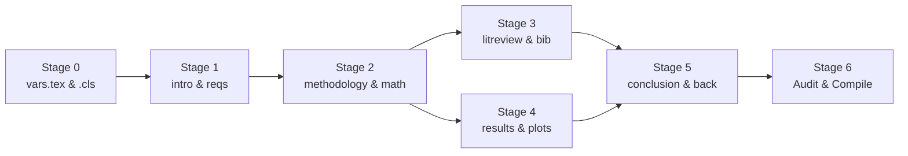

# LaTeX Thesis & Presentation Architect — Calm-Authority Academic Standard

This skill fuses **Anthropic Calm Authority** (`writing-like-claude`) with **CPM Orchestration & Context Firebreaks** (`adaptive-workflow`) to architect, draft, audit, and compile formal IEEE-compliant engineering thesis reports, project proposals, and Beamer defense presentations.

It natively incorporates two production-ready, pure-format open-source templates:
1. **Academic Engineering Report Template**: [`latex-engineering-report-template`](https://github.com/Aaradhya-Dev-Tamrakar/latex-engineering-report-template) (`engineering-report.cls`)
2. **Academic Beamer Defense Template**: [`latex-beamer-presentation-template`](https://github.com/Aaradhya-Dev-Tamrakar/latex-beamer-presentation-template) (`beamer-presentation.cls`)

---

## 1. Core Philosophy: The Whiteboard Test & Empirical Proof

In engineering research and high-stakes defense examinations, credibility is never asserted through marketing adjectives:

$$\text{Trust} = \text{Precision} + \text{Scope Boundaries} + \text{Empirical Proof}$$

> **The Whiteboard Test**: Write as if explaining an engineered system to a senior faculty panel, external examiner, or regulatory auditor at a whiteboard. Not selling. Not performing. Just explaining.

### The Three Foundational Pillars
1. **Calm-Authority Academic Voice**: 1-sentence declarative theses, strict hype blacklist, active verbs, and functional precision in defining architectures and metrics.
2. **Deterministic Empirical Rigor**: Subgroup sample size guards ($n \ge 30$), 95% bootstrap confidence intervals, hypothesis significance testing ($p < 0.05$), and explicit descoping cut-lists.
3. **CPM DAG Concurrency & Context Firebreak**: Mathematical stage gating of chapter dependencies, isolating chapter drafting contexts ($<5{,}000$ tokens) to prevent cross-reference hallucinations and token saturation.

---

## 2. Fast-Path Pre-Flight Decision Gate (Zero-AI Route)

Before writing prose or prompting models, execute deterministic local CLI fast paths:

| Task / Intent | Action & Fast Path Command | Target Artifact |
| :--- | :--- | :--- |
| **Scaffold Full Project (Report + Slides)** | `python scripts/scaffold_thesis.py <dir> --template full-pack --title "..." --author1 "..."` | Dual workspaces: `report/` and `presentation/` |
| **Scaffold Engineering Report** | `python scripts/scaffold_thesis.py <dir> --template report --title "..." --author1 "..."` | Full workspace with `engineering-report.cls`, `vars.tex`, `main.tex` |
| **Scaffold Beamer Defense Deck** | `python scripts/scaffold_thesis.py <dir> --template beamer --title "..." --author1 "..."` | Widescreen 16:9 Beamer deck with 18 slide templates |
| **Scaffold Capstone Monograph** | `python scripts/scaffold_thesis.py <dir> --template capstone --title "..." --author1 "..."` | Capstone thesis workspace with `at_fuse_aif.cls` |
| **Audit Calm Authority & Integrity** | `python scripts/audit_latex_thesis.py <target-dir>` | Checks hype words, broken `\cref`s, missing bib keys, $n \ge 30$ |
| **Compile to PDF** | `python scripts/compile_thesis.py <target-dir>` | Automated multi-pass `latexmk` / `pdflatex` + `makeglossaries` |
| **Ecosystem Sync** | `.\sync.bat -m "docs(thesis): <summary>"` | Version control with pre-commit sanity scans |

---

## 3. The 10 Invariants of LaTeX Thesis Architecture

Every document drafted or audited under this skill must satisfy these ten invariants:

1. **Title = Declarative Factual Scope**: Specific noun phrase stating the exact system and domain (*"A Diagnostic Framework for Demographic Bias Auditing in Facial Analysis Systems"*).
2. **1-Sentence Empirical Thesis**: Opening sentence of abstract, chapter, or section must state the complete takeaway or technical breakthrough.
3. **Strict Hype Blacklist**: Zero tolerance for marketing superlatives (*revolutionary, game-changing, groundbreaking, unleash, supercharge, seamless, cutting-edge, magic, next-gen*). Replace with measurable mechanics. Consult [`references/calm-authority-academic-voice.md`](references/calm-authority-academic-voice.md).
4. **Explicit Scope Boundaries & Descoping Cut-Lists**: Dedicate dedicated prose in Chapter 1 and Chapter 4 to what the system does **not** do. Explicitly list descoped datasets or deferred algorithms.
5. **Statistical Rigor & The $n \ge 30$ Guardrail**: Demographic cohorts with $n < 30$ observations must be suppressed or flagged as statistically insufficient (`insufficient_sample = True`), never scored. Pair point estimates with 95% bootstrap confidence intervals.
6. **IEEE 830 Requirement Phrasing**: Formulate Functional Requirements (`FR-xxx`) using strict IEEE 830 "shall" statements. Quantify Non-Functional Requirements (`NFR-xxx`) with numeric thresholds.
7. **SOLID Principles Mapped to Concrete Code**: Map every SOLID principle directly to an architectural module and design pattern (Adapter, Strategy, Builder, Factory, Facade) rather than reciting textbook definitions.
8. **Regulatory & Standards Grounding**: Trace system capabilities to external standards: EU AI Act (Article 10, Annex IV), NIST AI RMF (Govern, Map, Measure, Manage), and IEEE standards. Consult [`references/regulatory-and-standards-matrix.md`](references/regulatory-and-standards-matrix.md).
9. **Formal LaTeX Typographic Standard**: Use `engineering-report.cls` (12pt `scrreprt`, Times font via `newtxmath`, `microtype`, `booktabs` without vertical lines, and `cleveref` for `\cref{...}`).
10. **Actionable Conclusion over Redundant Summaries**: Conclude with empirical metric highlights, limitations revisited with integrity, and open scientific research directions.

---

## 4. Multi-Template Scaffolding Options

Templates are stored under `assets/templates/`:

```
assets/templates/
├── engineering-report/  # Academic engineering report (engineering-report.cls)
│   ├── main.tex         # Modular master document
│   ├── vars.tex         # Metadata variables
│   ├── src/             # frontmatter (certificate, declar, copyright), chapters, backmatter
│   └── 0_draft.md .. 3_final.md # Stage-by-stage project guidance
├── beamer-presentation/ # Minimalist 16:9 Beamer deck (beamer-presentation.cls)
│   ├── main_proposal_presentation.tex  # Proposal defense
│   ├── main_mid_presentation.tex       # Mid-term progress defense
│   ├── main_final_presentation.tex     # Final thesis defense
│   └── src/slides/      # 18 modular slide files (01-title through 18-qna)
└── fuse-aif/            # Fellowship capstone report (at_fuse_aif.cls)
```

Full engineering guidelines: [`references/academic-engineering-guidelines.md`](references/academic-engineering-guidelines.md).

---

## 5. CPM Concurrency & Context Firebreak Protocol

When authoring or updating large thesis reports, enforce the **Context Firebreak** (`INV-CTX-FIREBREAK`) to prevent prompt bloat and cross-reference drift:



- **Cognitive Roles**:
  - **Scout** (`research` subagent): Harvests authentic paper citations, equations, and regulatory text into `references.bib`.
  - **Reviewer** (`self`, pro): Runs `audit_latex_thesis.py` to hunt for banned hype words, broken `\cref` targets, missing BibTeX keys, and checks $n \ge 30$ sample size rules.
  - **Writer** (`self`): Synthesizes calm-authority LaTeX chapters or Beamer frames in isolation ($<5{,}000$ tokens per session).
  - **Lead**: Coordinates critical paths, compiles PDF via `compile_thesis.py`, and inspects output logs.

Orchestration details: [`references/cpm-thesis-orchestration.md`](references/cpm-thesis-orchestration.md).

---

## 6. Deterministic Verification Gate

Before finalizing any thesis or submitting a PR:
1. **Run Style & Structural Audit**:
   ```powershell
   python scripts/audit_latex_thesis.py <path-to-report>
   ```
   *Target: 0 hype violations, 0 broken references, 0 missing citations, PASS on sample size guards.*

2. **Run PDF Compilation**:
   ```powershell
   python scripts/compile_thesis.py <path-to-report>
   ```
   *Target: Clean PDF exit code 0, 0 undefined citations `[?]`, 0 undefined references `??`.*

---

## 7. Additional Resources

- **`references/academic-engineering-guidelines.md`**: Academic project lifecycle, signature blocks & Beamer protocols.
- **`references/calm-authority-academic-voice.md`**: Academic voice standards, banned vocabulary list, and equation styling.
- **`references/thesis-structure-and-invariants.md`**: Section-by-section requirements and typography standards.
- **`references/cpm-thesis-orchestration.md`**: Mathematical CPM chapter DAG and multi-agent roles.
- **`references/regulatory-and-standards-matrix.md`**: EU AI Act, NIST AI RMF, and IEEE standards alignment templates.
- **`assets/templates/`**: Production-ready LaTeX boilerplates, class files, and makeglossaries configuration.
