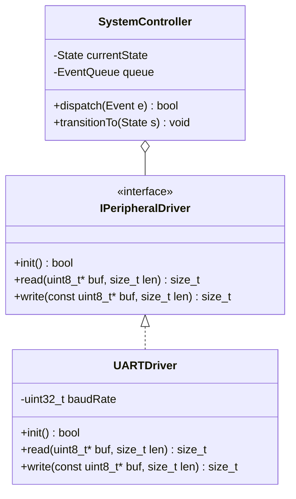
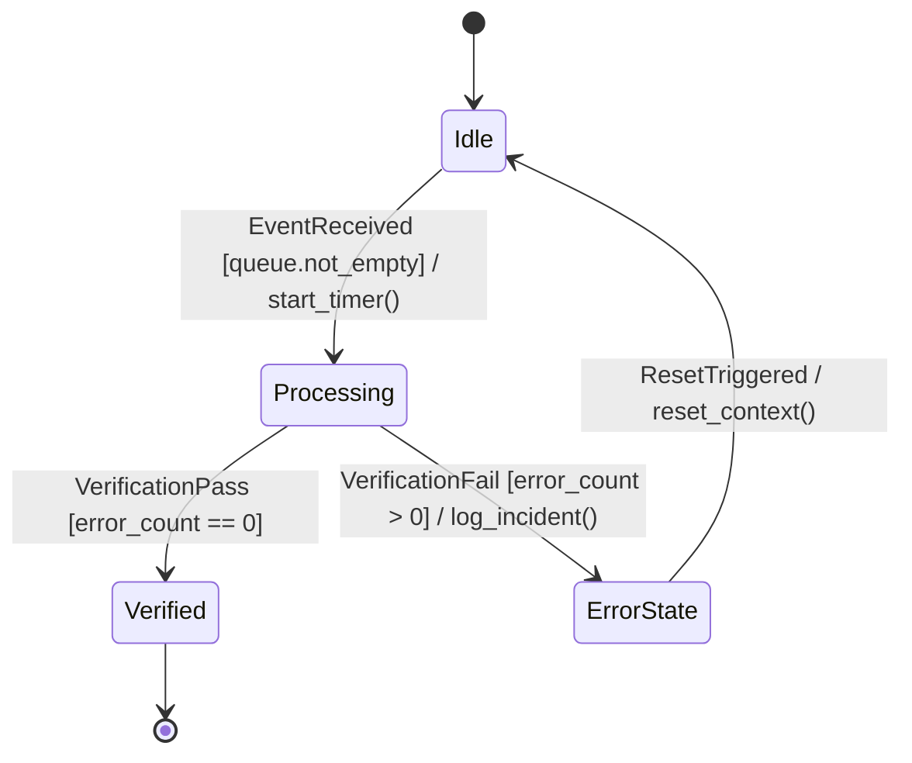

# Object-Oriented Software Engineering & Architectural Modeler (`oose-architecture-modeler`)

Derived from **CT 657 (Object-Oriented Software Engineering)**, **CT 451 (Object-Oriented Programming in C++)**, and **CT 765.02 (Agile Software Development)** in the BE ECIE curriculum.

This skill equips agents to translate ambiguous software requirements into rigorous, decoupled object-oriented system architectures with strict interface contracts and comprehensive test matrices.

---

## 1. Operating Rules & Modeling Guidelines

1. **Format Standards:** All diagrams must use clean GitHub Flavored Markdown `mermaid` fenced code blocks.
2. **Subsystem Partitioning (OOSE 5.3 & 5.4):**
   - High cohesion within subsystems; low coupling across subsystems.
   - Distinct boundary separation: Presentation / API, Domain Logic, Data Access / Persistence, and External Integrations.
3. **Formal Capability Contracts:**
   - Any externalized tool or service boundary must adhere to JSON Schema contracts matching [`schemas/capability.contract.v1.json`](../../schemas/capability.contract.v1.json).
4. **Test Case Traceability (OOSE 6.4 & 6.5):**
   - Every class interface must define positive tests, negative edge tests (nulls, overflows, boundary conditions), and inter-class collaboration tests.

---

## 2. Core Capabilities & Workflows

### Capability A: Structural UML Modeling (Class & Component Diagrams)
When the user asks to design or refactor a software subsystem:
- Identify classes, attributes, access visibility (`+`, `-`, `#`), and methods with parameter/return types.
- Declare relationships: Inheritance (`<|--`), Composition (`*--`), Aggregation (`o--`), Association (`-->`), and Dependency (`..>`).

### Capability B: Behavioral & Interaction Modeling (Sequence & Statechart)
When designing state machines or multi-agent execution flows:
- Sequence diagrams model asynchronous message passing, activation bars, and return payloads.
- Statechart diagrams model event-driven state transitions with guard conditions `[condition]` and actions.

### Capability C: Inter-Class Test Case Design Matrix (OOSE 6.5)
Generate comprehensive test specification matrices:

| Test ID | Target Component | Method Under Test | Input Vector / State | Expected Behavioral Invariant | Classification |
| :--- | :--- | :--- | :--- | :--- | :--- |
| `TC-SYS-01` | `SystemController` | `dispatch(Event)` | Null event pointer | Throws `InvalidArgumentException`, state unaltered | Boundary Test |
| `TC-SYS-02` | `SystemController` | `transitionTo(State)` | Invalid state transition | Rejects transition, increments security error counter | Negative Test |
| `TC-SYS-03` | `UARTDriver` | `read(buf, len)` | Buffer length 0 | Returns 0 bytes read, no bus cycle executed | Zero-Input Test |
