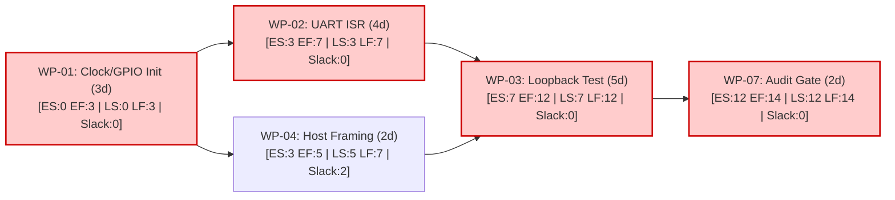

# Project Management & Workflow Orchestrator (`pm-workflow-orchestrator`)

Derived from **CT 658 (Project Management)**, **CE 615 (Engineering Economics)**, and **ME 708 (Organization and Management)** in the BE ECIE curriculum.

This skill equips agents to decompose complex engineering endeavors into hierarchical, trackable Work Breakdown Structures (WBS), model dependency critical paths (CPM/PERT), enforce bounded execution budgets, and generate tracked GitHub issues (`- [ ]`).

---

## 1. Operating Rules & Workflow Principles

1. **The 100% Rule of WBS (CT 658 Section 7):**
   - The hierarchical WBS must include 100% of the work defined by the project scope and capture all deliverables (internal, external, interim).
   - Work packages at the lowest level must be uniquely identifiable, measurable, and assigned a deterministic completion condition.
2. **Issue Anchoring Integration (`github-workflow`):**
   - WBS work packages directly populate GitHub issue descriptions as tracked task checkboxes (`- [ ]`).
3. **Critical Path Priority (CPM):**
   - Zero-slack tasks are flagged as `CRITICAL_PATH`. Any delay in these activities delays overall completion.
4. **Economic Resource Budgeting (CE 615):**
   - Every complex multi-agent plan must define a bounded execution budget (max tokens, max time, max tool iterations) to prevent runaway recursive execution loops.

---

## 2. Core Capabilities & Workflows

### Capability A: Work Breakdown Structure (WBS) Generation
When scoping a new project or milestone:
- Decompose into Level 1 (Project/Milestone), Level 2 (Major Subsystems/Deliverables), and Level 3 (Work Packages).

```text
1.0 Project Root: Central Capability Mesh
  ├── 1.1 Firmware & Hardware Subsystem
  │     ├── 1.1.1 GPIO & Clock Initialization Driver [WP-01]
  │     ├── 1.1.2 UART Ring Buffer & ISR Scaffolding [WP-02]
  │     └── 1.1.3 Hardware Loopback Verification Test [WP-03]
  ├── 1.2 Host Control Plane
  │     ├── 1.2.1 Protocol Framing & CRC-32 Validation [WP-04]
  │     └── 1.2.2 CLI Telemetry Dashboard [WP-05]
  └── 1.3 Verification & Quality Assurance
        ├── 1.3.1 Deterministic Simulation Harness [WP-06]
        └── 1.3.2 Formal Audit Certification [WP-07]
```

### Capability B: Critical Path Method (CPM/PERT) Modeling
Compute Early Start ($ES$), Early Finish ($EF$), Late Start ($LS$), Late Finish ($LF$), and Total Slack ($TS = LF - EF$):


*(Nodes in red represent the Critical Path: `WP-01 -> WP-02 -> WP-03 -> WP-07` with Duration = 14 days)*

### Capability C: Earned Value Management (EVM) Health Check
Assess active milestone velocity using standard formulas:
* **Cost Variance ($CV$):** $EV - AC$ ($>0$ under budget, $<0$ over budget)
* **Schedule Variance ($SV$):** $EV - PV$ ($>0$ ahead of schedule, $<0$ behind schedule)
* **Cost Performance Index ($CPI$):** $EV / AC$ ($>1.0$ efficient)
* **Schedule Performance Index ($SPI$):** $EV / PV$ ($>1.0$ accelerated)

### Capability D: GitHub Issue Task Decomposition Template
```markdown
## Requirements & Scope Baseline
Formulate the scope statement for this release.

## Acceptance Criteria & WBS Tasks
- [ ] WP-01: Bare-metal clock configuration & pinout header verification
- [ ] WP-02: Implement ring buffer with overflow protection in `src/drivers/uart.c`
- [ ] WP-03: Add loopback unit tests in `tests/test_loopback.py`
- [ ] WP-04: Execute deterministic audit gate (`.\audit.bat`) with zero errors

## Bounded Stopping Budget
- Time limit: 45 minutes
- Token allocation: 35,000 tokens
```
