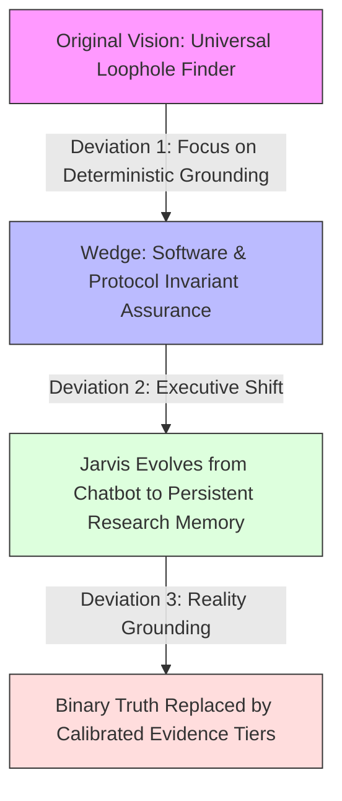

# Personal Tool Ecosystem & Jarvis Architecture — Brainstorm Log

> **Session Date:** 2026-09-10  
> **Repository:** `F:\Aaradhya-Dev-Tamrakar\brainstorm`  
> **Scope:** Interconnecting actual tools across `F:\AaradhyaDT`, `F:\Aaradhya-Dev-Tamrakar`, and `F:\FuseAIF2026` into a unified modular ecosystem / personal Jarvis.

---

## 1. Executive Summary & The Core Breakthrough

### The Initial Question
> *"I want to create something that can connect every tool I make... actual tools only, and just a brainstorm for now."*

Historically, projects were built as isolated, highly capable islands:
- A C# .NET 10 desktop app for Windows NT kernel memory management.
- An ESP32-S3 wearable and gateway pipeline for clinical fall detection.
- A Python/Fusion 360 add-in for conversational CAD via MCP.
- A multi-account Google NotebookLM aggregator.
- An Android super-app in Jetpack Compose.
- A project-centric AI workspace and multi-model multiplexer.
- Speed readers, format converters, and autonomous worker fleets.

### The Paradigm Shift: From Apps to Autonomous Capability Modules
> *"I am thinking every project from a module-like viewpoint of whatever the end result may be as a whole integration. Solving niche problems locally, cloud, or hybrid, while also being able to define and create new methods and workflows into existence due to the variable modules."*

This is the **Unix Philosophy elevated to the AI, OS, and IoT era**:
- Individual tools are **Lego blocks (Capability Nodes)**.
- Each node solves a niche problem across **Local, Cloud, or Hybrid** environments.
- Standardized interfaces between modules enable the **dynamic synthesis of emergent workflows** that no single tool could achieve alone.

### The Ultimate Conceptual Model: Jarvis as the Cognitive Interface (Not Just a Chatbot)
A traditional chatbot is a "brain in a jar"—it only responds with passive text.
In this architecture, **"Jarvis" is not a single product or monolithic app; it is the natural-language cognitive and executive interface**:
* **Intelligent Listener & Reasoner:** Listens in natural language, resolves ambiguity, decomposes high-level intent, and explains execution results.
* **Executive Decoupling:** Jarvis doesn't need to implement every task natively. It knows how to compose and orchestrate the underlying **Capability Mesh** to accomplish goals.
* **The Cognitive Triad:**
  1. **Sensory Organs:** Browser DOM (Screen Q&A), video/media (yt-dlp-live), edge kinematics (SPARK), and hardware telemetry.
  2. **Executive Actuators (Hands):** Bare-metal OS optimization (NovaOptimizer), 3D CAD modeling (Fusion 360), publication-quality documents (md2pdf), and distributed agent execution (Claude Fleet).
  3. **Deep Memory & Ground Truth:** Multi-account cloud notebooks (Super-NLM), project SQLite FTS5 (Nexus), and formal proof engines (AI Constraint Solver).

---

## 2. Tool Inventory: The 13 Foundational Modules

| # | Tool / Module | Location | Tech Stack | Execution Context | Core Superpower |
|---|---|---|---|---|---|
| 1 | **Super-NLM Hub** | `F:\Aaradhya-Dev-Tamrakar\super-nlm` | Python (FastAPI), React, MCP | Cloud / Hybrid | Multi-account Google NotebookLM aggregator, cross-notebook synthesis, MCP round-robin agent rotation |
| 2 | **Autodesk Fusion 360 MCP** | `F:\Aaradhya-Dev-Tamrakar\Autodesk-Fusion-360-MCP-Server` | Python, Fusion 360 API, MCP | Local Desktop | Conversational 3D CAD, parametric modeling automation via AI / MCP |
| 3 | **NovaOptimizer** | `F:\Aaradhya-Dev-Tamrakar\system-optimizer` | C# .NET 10, WPF, Win32/NT APIs | Local (Bare Metal) | Micro-footprint Windows OS tuning, deep RAM cache purge (`EmptyWorkingSet`, standby list), process priority boosting |
| 4 | **SPARK Wearable Gateway** | `F:\Aaradhya-Dev-Tamrakar\SPARK` | C/C++ (ESP32-S3), Python, SHAP, BLE | Edge Hardware / Local | Two-layer edge fall detection, sensor kinematics, SHAP clinical explainability, automated PDF reporting |
| 5 | **Nexus** | `F:\AaradhyaDT\Nexus` | FastAPI, React (Vite), SQLite FTS5 | Local / Hybrid | Project-centric AI workspace, prompt multiplexing across parallel LLMs, contextual note memory |
| 6 | **Claude Worker Fleet (v2)** | `F:\Aaradhya-Dev-Tamrakar\Claude-Desktop` | FastAPI coordinator, SQLite WAL, PowerShell | Local / Distributed | Multi-profile session persistence, distributed DAG task worker fleet, SKU pipeline decomposition |
| 7 | **BiasAperture** | `F:\Aaradhya-Dev-Tamrakar\BiasAperture`<br/>`F:\FuseAIF2026\fuseai-fellowship` | PyTorch, Python CLI, LaTeX | Local / Compute | Demographic bias auditing framework for vision models, disparity metrics, automated LaTeX/PDF generation |
| 8 | **Alpha-SuperApp** | `F:\Aaradhya-Dev-Tamrakar\Alpha-SuperApp` | Kotlin 2.2, Jetpack Compose, Android 16 (SDK 36) | Mobile Device | Mobile super-app: Computer Vision, BLE hardware control, Personal Finance, AI assistants |
| 9 | **Screen Q&A** | `F:\Aaradhya-Dev-Tamrakar\screen-qa-extension` | Chrome MV3 (JS), Gemini Flash | Ambient Browser | Ambient browser intelligence, instant question extraction and zero-click overlay response |
| 10 | **md2pdf-desktop** | `F:\Aaradhya-Dev-Tamrakar\md2pdf-desktop` | Python, Tkinter, Pandoc, wkhtmltopdf | Local Desktop | Publication-quality Markdown-to-PDF rendering pipeline |
| 11 | **yt-dlp-live** | `F:\AaradhyaDT\yt-dlp-live` | PowerShell, yt-dlp, FFmpeg | Local Daemon | Resilient live stream capture daemon, auto-cut, and lossless remuxing/relaying |
| 12 | **AI Constraint Solver** | `F:\AaradhyaDT\AI` | Python, FastAPI, CLI | Local Microservice | Cryptarithmetic and combinatorial constraint satisfaction solver with JSON metrics reporting |
| 13 | **RSVP Reader** | `F:\AaradhyaDT\rsvp-reading` | Svelte, Vite | Local Web | High-speed RSVP reader with Optimal Recognition Point (ORP) highlighting for EPUB/PDF |

---

## 3. The 4 Functional Module Archetypes

```
┌──────────────────────────────────────────────────────────────────────────────┐
│                            THE 4 MODULE ARCHETYPES                           │
├──────────────────────┬──────────────────────┬────────────────────────────────┤
│ 1. INGESTION / SENSE │ 2. COMPUTE / ENGINE  │ 3. GOVERNANCE / OPTIMIZATION   │
│ (Capture the World)  │ (Transform & Solve)  │ (Protect & Accelerate)         │
├──────────────────────┼──────────────────────┼────────────────────────────────┤
│ • SPARK (Kinematics) │ • Super-NLM (Cloud)  │ • NovaOptimizer (RAM/Threads)  │
│ • Screen Q&A (DOM)   │ • Fusion 360 (CAD)   │ • BiasAperture (Fairness Eval) │
│ • yt-dlp-live (Media)│ • AI Solver (Logic)  │ • Claude Coordinator (DAG Quota│
├──────────────────────┴──────────────────────┴────────────────────────────────┤
│                             4. HUMAN COGNITION / HUD                         │
│                  (Deliver the Result at the Speed of Thought)                │
│ • RSVP Reader (Visual WPM)  •  md2pdf (Publishing)  •  Alpha-SuperApp (Mobile)│
└──────────────────────────────────────────────────────────────────────────────┘
```

---

## 4. Emergent Compound Workflows (The "Why")

When these independent modules are linked via standard plugs, novel workflows emerge dynamically:

### Pipeline A: The High-Bandwidth Rapid Learning Loop
$$\text{Screen Q\&A / Browser} \xrightarrow{\text{extract}} \text{Super-NLM Hub} \xrightarrow{\text{synthesize}} \text{md2pdf} \xrightarrow{\text{render}} \text{RSVP Reader}$$
* **Flow:** Clip technical papers or articles $\rightarrow$ Multi-account Google NotebookLM synthesizes the core concepts $\rightarrow$ md2pdf compiles formatted document $\rightarrow$ RSVP Reader flashes the key takeaways at 750 WPM with ORP highlighting.

### Pipeline B: The Autonomous Heavy Compute & Auditing Loop
$$\text{Claude Worker Fleet} \xrightarrow{\text{task}} \text{NovaOptimizer} \xrightarrow{\text{purge/prioritize}} \text{BiasAperture} \xrightarrow{\text{audit}} \text{Alpha-SuperApp}$$
* **Flow:** Coordinator schedules heavy demographic vision auditing $\rightarrow$ NovaOptimizer purges Windows standby cache and assigns high thread priority $\rightarrow$ PyTorch inference executes without memory throttling $\rightarrow$ Results notify phone via Alpha-SuperApp.

### Pipeline C: The Physical Prototype Design Loop
$$\text{SPARK Telemetry} \xrightarrow{\text{dimensions}} \text{Fusion 360 MCP} \xrightarrow{\text{parametric CAD}} \text{md2pdf} \xrightarrow{\text{dossier}}$$
* **Flow:** Kinematic and sensor dimension constraints stream from SPARK $\rightarrow$ Fusion 360 MCP parametrically updates the 3D TPU enclosure model $\rightarrow$ md2pdf generates a unified hardware/clinical engineering dossier.

### Pipeline D: The Autonomous Invariant & Arbitrage Discovery Loop
$$\text{Screen Q\&A / Super-NLM} \xrightarrow{\text{ingest}} \text{Nexus} \xrightarrow{\text{formalize}} \text{Claude Fleet / AI Solver} \xrightarrow{\text{adversarial SMT}} \text{Deterministic Sandbox} \xrightarrow{\text{verify}} \text{md2pdf / RSVP}$$
* **Problem Reframing:** Moving past fragile heuristic "loophole bots" into a mathematically grounded **Systemic Invariant & Constraint Divergence Engine**:
  $$\text{Observable Executable State} \neq \text{Intended Statutory / Invariant Specification}$$
  Works across software protocols, DeFi/EVM invariants, IAM access-control policies, platform terms/promotions, and cross-border regulatory thresholds.
* **The 5-Stage Automated Discovery Architecture:**
  1. **Sense & Ingestion:** `Screen Q&A` captures live DOM/TOS text, `Super-NLM` synthesizes multi-source regulatory/statutory corpuses, and `yt-dlp-live` ingests audiovisual filings.
  2. **Semantic Formalization:** `Nexus` coordinates LLMs to convert natural language rules, treaty clauses, and protocol invariants into declarative logic (SMT-LIB, Z3 constraints, Datalog/Catala).
  3. **Adversarial Red-Teaming:** `Claude Worker Fleet` conducts parallel hypothesis generation, mutates edge-case assumptions, and schedules state exploration via `AI Constraint Solver` (`F:\AaradhyaDT\AI`).
  4. **Deterministic Sandbox Verification:** An automated execution sandbox (Z3 solver, local EVM testnet, or API mock harness) deterministically executes the exploit/arbitrage tuple. Hallucinated pseudo-loopholes are autonomously discarded.
  5. **Dossier Compilation & Rapid Review:** `md2pdf` compiles an audit-grade evidence dossier (proof tree, invariant delta, remediation patch), while `RSVP Reader` enables high-speed human cognitive review and `Alpha-SuperApp` issues priority push telemetry.

---

## 5. Architectural Blueprint: The 4-Tier Jarvis Engine

### 5.1 The 4-Tier Architectural Stack
Decoupling the cognitive interface from the underlying execution fabric yields a scalable, 4-tier stack:

```
┌────────────────────────────────────────────────────────────────────────────────┐
│ 1. JARVIS COGNITIVE INTERFACE (The Mind)                                       │
│    Listen ──> Understand ──> Reason ──> Plan ──> Explain ──> Natural Telemetry │
│    • Preserves unified human UX across desktop, browser HUD, and mobile.       │
│    • Translates human goals into multi-domain task plans without code lock-in. │
└───────────────────────────────────────┬────────────────────────────────────────┘
                                        │ High-Level Intent & Hypotheses
┌───────────────────────────────────────▼────────────────────────────────────────┐
│ 2. ORCHESTRATION LAYER (The Nervous System)                                    │
│    Task Decomposition │ Capability Selection │ Workflow DAG │ State / Memory   │
│    • Nexus Cortex multiplexes models; Claude Fleet coordinates task DAGs.      │
│    • Dynamic capability discovery via MCP & Semantic Contracts.                │
└───────────────────────────────────────┬────────────────────────────────────────┘
                                        │ Typed Capability Invocations
┌───────────────────────────────────────▼────────────────────────────────────────┐
│ 3. CAPABILITY MESH (The Body)                                                  │
│    • Ingestion/Sensory : Screen Q&A (DOM), Super-NLM (Notebooks), yt-dlp-live   │
│    • Heavy Compute     : Claude Worker Fleet, BiasAperture, Fusion 360 MCP     │
│    • Logic & Solvers   : AI Constraint Solver (F:\AaradhyaDT\AI)               │
│    • Bare-Metal Tuning : NovaOptimizer (Windows NT Kernel WorkingSet / Cache)  │
│    • Cognitive HUD     : md2pdf (Publishing), RSVP Reader (Optimal Eye WPM)    │
└───────────────────────────────────────┬────────────────────────────────────────┘
                                        │ Direct System Operations & Telemetry
┌───────────────────────────────────────▼────────────────────────────────────────┐
│ 4. VERIFICATION / REALITY LAYER (The Ground Truth)                             │
│    • SMT/Z3 Formal Solvers   • Local EVM / Anvil Sandboxes                     │
│    • Deterministic API Mocks • Win32 NT Kernel APIs • Executable Test Suites   │
│    • Autonomous Hallucination Pruning: Unproven candidates are discarded.      │
└────────────────────────────────────────────────────────────────────────────────┘
```

### 5.2 The Non-Invasive Tool Manifest Pattern (`tool.manifest.json`)
To integrate existing and future tools without rewriting their codebases, each repository can feature a lightweight declarative manifest:

```json
{
  "$schema": "https://aaradhyadt.dev/schemas/tool.manifest.v1.json",
  "name": "NovaOptimizer",
  "category": "governance",
  "runtime": "dotnet10",
  "entrypoint": "bin/Release/NovaOptimizer.exe",
  "capabilities": [
    {
      "name": "purge_memory",
      "description": "Purges Windows Standby Cache and working sets via NT kernel APIs",
      "command": "--purge-standby --silent"
    },
    {
      "name": "boost_process",
      "description": "Sets process CPU priority to High and locks core affinity",
      "args": ["--pid", "{pid}", "--priority", "high"]
    }
  ]
}
```

### 5.3 Upgrading to Semantic Capability Contracts (`capability.contract.v1.json`)
To allow the Jarvis Cortex to autonomously compose verification pipelines (such as Pipeline D) without hallucinating capability boundaries, manifests declare strict **Semantic Contracts** specifying determinism, side effects, and verification tiers:

```json
{
  "$schema": "https://aaradhyadt.dev/schemas/capability.contract.v1.json",
  "module": "AI-Constraint-Solver",
  "location": "F:\\AaradhyaDT\\AI",
  "runtime": "python3.11",
  "capabilities": [
    {
      "id": "solve_combinatorial_invariants",
      "category": "formal_verification",
      "deterministic": true,
      "side_effects": false,
      "verification_tier": "formal_smt",
      "inputs": {
        "variables": "array<EntityVariable>",
        "invariants": "array<ConstraintExpression>",
        "objective": "maximize | minimize | find_counterexample"
      },
      "outputs": {
        "satisfiable": "boolean",
        "counterexample_state": "object | null",
        "proof_tree": "string | null",
        "execution_time_ms": "number"
      }
    }
  ]
}
```

A central orchestrator scanner crawls specified workspace roots, registers capabilities, and exposes them directly to the AI Cortex via **Model Context Protocol (MCP)** or a local REST API.

### 5.4 The Strategic Wedge vs. Platform Vision
* **The Platform Risk:** 13 heterogeneous modules across multiple languages (.NET 10, C/C++, Python, Kotlin, Svelte) and execution layers create an enormous integration surface. Polishing the ecosystem indefinitely without demonstrating a single undeniable capability leads to premature platform exhaustion.
* **The Flagship Wedge:** **Adversarial Assurance for Software, API, and Protocol Invariants**.
  - Grounded by DARPA's 2025 AI Cyber Challenge (AIxCC), which demonstrated autonomous Cyber Reasoning Systems finding and patching vulnerabilities across 54M lines of code at ~$152 per task.
  - Software provides an unambiguous ground-truth loop:
    $$\text{Target Code / Spec} \longrightarrow \text{Instrument} \longrightarrow \text{Execute} \longrightarrow \text{Observe Crash / State Violation}$$
* **Expansion Trajectory:**
  $$\text{Software / Code} \xrightarrow{\text{phase 1}} \text{API State Machines} \xrightarrow{\text{phase 2}} \text{Smart Contracts} \xrightarrow{\text{phase 3}} \text{Platform TOS / Arbitrage} \xrightarrow{\text{phase 4}} \text{Regulatory Thresholds}$$

### 5.5 Domain Feasibility Matrix & Commercial Framing
Rather than marketing an "exploit generator" (civil/legal liability), the commercial framing is **Adversarial Assurance for Complex Rule Systems** (defensive risk auditing, invariant verification, and continuous compliance stress-testing):

| Domain | Feasibility | Ground Truth Mechanism | Practical Complexity & Bottlenecks |
|---|:---:|---|---|
| **Software & Systems Code** | **8.5 / 10** | Compilers, debuggers, memory sanitizers (ASan), symbolic execution. | Solved baseline (DARPA AIxCC). Requires scalable AST extraction. |
| **API & Protocol Edge Cases** | **8.0 / 10** | Mock harnesses, OpenAPI schema fuzzing, status assertion. | State transitions often weakly enforced across microservices. |
| **Smart Contracts & DeFi** | **8.0 / 10** | Local EVM forks (Anvil/Hardhat), invariant assertion engines. | High economic stakes; requires flash-loan and reentrancy modeling. |
| **Platform Terms & Promotions** | **7.0 / 10** | Simulated checkout state machines, combinatorial solvers. | Fast half-life; platform telemetry patches loopholes quickly. |
| **Contract Clause Interactions** | **7.0 / 10** | Deontic logic engines, cross-referencing definitions. | Ambiguous open-texture language; subjective counterparty intent. |
| **Regulatory & Tax Thresholds** | **5.5 / 10** | Case-law RAG + SMT solvers (Catala, Datalog). | General Anti-Avoidance Rules (GAAR) and judicial discretion lack code sandboxes. |
| **Autonomous Universal Loophole AI** | **2.5 / 10** | None (Ill-defined concept). | "Loophole" is not a formal mathematical concept without specific system rules. |

---

## 6. Next Steps & Tactical Sequencing

When ready to transition from brainstorm to iterative prototyping:
1. **Define the Primary Interface**: Decide whether Jarvis is summoned via a global hotkey HUD (Raycast/Spotlight style), a secondary-monitor web dashboard (Nexus 2.0), or mobile (Alpha-SuperApp).
2. **First Proof-of-Concept Link**: Connect 2 high-value complementary modules first (e.g., *Super-NLM + RSVP Reader*, or *NovaOptimizer + Worker Fleet*).
3. **Execute the Strategic Wedge in `F:\AaradhyaDT\AI`**: Write a bounded Z3 invariant verification script targeting an API or token balance constraint to prove Tier 4 reality grounding.
4. **Draft the Minimal Standard Manifest**: Establish a uniform `tool.manifest.json` and `capability.contract.v1.json` standard for new tools going forward.

---

## 7. R&D Strategic Evaluation, 5-Horizon Forecast & Feasibility Analysis

> **Evaluation Date:** 2026-09-10  
> **Status:** Formal R&D Roadmap Logged  
> **Target Wedge:** Adversarial Invariant & State Machine Assurance  

### 7.1 The Research Thesis: Why Continue as an R&D Direction

Rather than pursuing an ill-defined "universal loophole finder" or rushing into premature productization, continuing this program as a **formal R&D trajectory** provides asymmetric leverage. The core architecture sits at the direct convergence of four major 2025–2026 AI systems paradigms:
1. **Natural-Language Executive Orchestration:** Moving beyond chat interfaces to intent-decoupling executive planners that treat tools as typed capability meshes.
2. **Automated Hypothesis Generation (Conjecture Machines):** Using LLMs to brainstorm edge cases, counterexamples, and parameter mutations across complex specifications.
3. **Neurosymbolic Verification Grounding:** Filtering probabilistic agent hallucinations through deterministic SMT solvers (Z3, CVC5), local sandboxes (Anvil, Docker), and compiler sanitizers.
4. **Autonomous Cyber Reasoning Systems (CRS):** Empirically validated by DARPA's 2025 AI Cyber Challenge (AIxCC), proving that autonomous agents combined with program analysis and symbolic execution can discover and patch vulnerabilities across tens of millions of lines of code at scale.

```
                  ┌─────────────────────────────────────────┐
                  │       Natural-Language Intent           │
                  │   (Jarvis Executive Planning Layer)     │
                  └────────────────────┬────────────────────┘
                                       │
                  ┌────────────────────▼────────────────────┐
                  │    Automated Hypothesis Generation      │
                  │  (Nexus Cortex / Claude Worker Fleet)   │
                  └────────────────────┬────────────────────┘
                                       │
                  ┌────────────────────▼────────────────────┐
                  │   Formal Constraint Representation      │
                  │       (SMT-LIB, Z3, Datalog)            │
                  └────────────────────┬────────────────────┘
                                       │
                  ┌────────────────────▼────────────────────┐
                  │  Deterministic Reality Verification     │
                  │ (Solvers, EVM Fork, API Mock Sandbox)   │
                  └────────────────────┬────────────────────┘
                                       │
              ┌────────────────────────┴────────────────────────┐
              ▼                                                 ▼
      [DISCARD / PRUNE]                                 [VERIFIED DISCOVERY]
   Hallucinated Loopholes                            Audit Dossier & Exploit Tuple
  (Pruned with Zero Noise)                           (md2pdf / RSVP Cognitive Review)
```

---

### 7.2 The Research Director Paradigm: Neutralizing Non-Pro Coding

A non-professional coding background is **not a structural barrier** for this specific R&D program, provided the division of responsibilities is maintained:

* **The Principal Investigator (Your Role):**
  - Problem selection, domain constraint specification, and acceptance criteria.
  - Architectural decoupling and semantic contract schema definitions.
  - Verification design: Deciding what constitutes acceptable proof vs. statistical noise.
  - Evaluating empirical output traces to detect specification drift.
* **The Machine Implementation Layer (AI & Tools):**
  - **Frontier Coding Agents (Antigravity, Claude 3.7 / Opus, Gemini 2.0 / 3.0):** Write boilerplate glue code, AST parsers, FastAPI routers, and Z3 wrapper scripts.
  - **Deterministic Solvers (Z3, CVC5, Soufflé):** Perform exact combinatorial state space searches and mathematical counterexample generation.
  - **Execution Sandboxes (Anvil/Foundry, Schemathesis, Docker):** Execute the generated counterexamples to prove physical or software reality.
  - **Knowledge Extraction (Super-NLM Hub):** Crawls and synthesizes multi-source statutory, RFC, and API documentation into structured context.
* **The Critical Safeguard:** While agents generate the implementation syntax, the researcher must inspect the logical structure of constraints. If an agent writes a vacuous constraint (e.g., $x > 5 \land x < 2$), the solver returns `unsat` not because the system is safe, but because the specification was contradictory. Understanding constraint logic prevents false negatives.

---

### 7.3 The 5 Compounding Personal & Technical Benefits

| # | Benefit | Concrete Value Realization |
|---|---|---|
| **1** | **The Persistent "Cyborg Workbench"** | Jarvis becomes a unified executive system across desktop, browser, and mobile. Future projects (in CAD, bare-metal tuning, health sensing, or publishing) become immediately callable nodes in the mesh rather than isolated, forgotten codebases. |
| **2** | **Frontier Neurosymbolic Competence** | Shifts expertise from fragile prompt engineering and basic RAG to neurosymbolic orchestration: pairing probabilistic models with deterministic solvers and automated evaluation harnesses. |
| **3** | **Enterprise-Grade Defensive Assurance** | The exact engine that detects invariant divergence in software or APIs is an enterprise-grade security and compliance auditor. Organizations spend millions stress-testing financial state machines, access-control rules, and protocol invariants. |
| **4** | **100x Solo Research Leverage** | A single human researcher, backed by an autonomous ingest $\rightarrow$ formalize $\rightarrow$ solve $\rightarrow$ verify pipeline, can explore multi-endpoint state spaces that previously required a dedicated security audit team. |
| **5** | **Publishable IP & Benchmarks** | The Semantic Capability Contract standard and empirical data on planted invariant rediscovery provide a defensible foundation for open-source frameworks or formal academic research publications. |

---

### 7.4 Five-Horizon Result Forecast (0 to 36+ Months)

```
  Horizon 1 (0-3 mo)     Horizon 2 (3-9 mo)     Horizon 3 (9-18 mo)    Horizon 4 (18-36 mo)    Horizon 5 (36+ mo)
┌────────────────────┐ ┌────────────────────┐ ┌────────────────────┐ ┌────────────────────┐ ┌────────────────────┐
│ Synthetic Invariant│ │ Real-World API &   │ │ Smart Contract &   │ │ Semi-Formal        │ │ Autonomous Systems │
│ Rediscovery Bench  │ │ State Machine Wedge│ │ Economic Arbitrage │ │ Cross-Domain Rules │ │ Researcher         │
└────────────────────┘ └────────────────────┘ └────────────────────┘ └────────────────────┘ └────────────────────┘
```

#### Horizon 1: The Synthetic Invariant Rediscovery Benchmark (Months 0–3)
* **Objective:** Establish the closed-loop baseline on a bounded, deterministic target.
* **Target System:** A mock ledger or API with 5 endpoints and 3 strict invariants (e.g., "Account balance never drops below zero", "Revoked token cannot execute transfer").
* **Deliverable:** Natural language spec $\rightarrow$ LLM extracts Z3 constraints $\rightarrow$ Z3 finds planted concurrency/integer bug $\rightarrow$ Python test harness executes the trace $\rightarrow$ md2pdf renders audit report.
* **Realistic Metrics:** 70–85% false candidate generation by LLMs, but 100% of false candidates rejected by the solver/sandbox. 1 verified planted vulnerability rediscovered autonomously.

#### Horizon 2: Real-World API & State Machine Assurance (Months 3–9)
* **Objective:** Deploy the engine against real open-source microservices and OpenAPI schemas.
* **Target System:** E-commerce backends (e.g., Medusa, Saleor) or OAuth2 authentication flows.
* **Deliverable:** Automated translation of OpenAPI specifications into state transition machines; discovering multi-step ordering bugs (e.g., double-coupon redemption, race conditions between cart modification and checkout).
* **Realistic Metrics:** Identification of real edge cases, leading to verifiable bug disclosures or security pull requests.

#### Horizon 3: Multi-Contract & Protocol Invariant Auditing (Months 9–18)
* **Objective:** Expand into deterministic execution environments with high economic stakes.
* **Target System:** EVM testnets (Anvil), automated market maker (AMM) invariants, and flash-loan transaction paths.
* **Deliverable:** Formal modeling of balance conservation invariants across multi-contract interactions where each contract is sound in isolation but divergent when composed.
* **Realistic Metrics:** Verified non-trivial cross-contract state divergence under simulated market conditions.

#### Horizon 4: Cross-Domain Regulatory & Terms Arbitrage (Months 18–36)
* **Objective:** Stress-test semi-formal rule systems (billing tiers, platform terms of service, tax thresholds).
* **Target System:** SaaS subscription upgrade/downgrade state machines, shipping rate matrix combinations, and regional regulatory exemption thresholds.
* **Realistic Metrics:** Machine-assisted discovery of policy inconsistencies, requiring human-in-the-loop validation to account for legal ambiguity.

#### Horizon 5: The Autonomous Systems Researcher (Months 36+)
* **Objective:** Jarvis functions as an autonomous research platform.
* **Capability:** Given a repository or specification, autonomously determines required ingest modules, forms hypotheses, synthesizes formal invariants, instruments sandboxes, executes fuzzing/solving loops, and delivers verified remediation dossiers without step-by-step human intervention.

---

### 7.5 Deviation Safeguards & The 4 Critical Traps



#### Trap 1: The "Grand Unified Platform" Quagmire
* **Failure Mode:** Spending 12 months writing glue code, manifests, and connectors across all 13 modules (.NET, ESP32, Svelte, Kotlin) without running a single empirical experiment.
* **Safeguard (The Rule of Two):** Only connect two modules when a specific, falsifiable experiment demands it. Leave unused modules on their respective git branches until needed.

#### Trap 2: The "Formalization Hallucination" Trap
* **Failure Mode:** Asking an LLM to generate Z3 or SMT-LIB constraints directly from text, resulting in subtle mathematical tautologies or syntax bugs that falsely "prove" a phantom vulnerability.
* **Safeguard (Closed-Loop Replay):** Every counterexample produced by an SMT solver must be programmatically compiled into an executable test script and run against a real runtime or mock sandbox. If the replay fails to reproduce the divergence, the candidate is discarded.

#### Trap 3: The "Mock Fidelity Mirage"
* **Failure Mode:** Proving an invariant violation in an over-simplified simulation that does not reflect real-world execution constraints.
* **Safeguard (Calibrated Evidence Tiers):** Classify all findings into strict evidence tiers rather than asserting unqualified "truth."

#### Trap 4: The Legal & "Universal" Open-Texture Fallacy
* **Failure Mode:** Attempting to run SMT solvers on natural language laws or platform terms containing intentional judicial open texture (e.g., "reasonable commercial efforts", "good faith", GAAR anti-avoidance doctrines).
* **Safeguard (Executable Boundary Constraint):** Restrict automated discovery strictly to systems with deterministic, executable state transitions (code, APIs, network protocols, EVM bytecode).

---

### 7.6 Calibrated Evidence Tiers

Every finding generated by the engine must carry an immutable evidence classification:

```
┌────────────────────────────────────────────────────────────────────────┐
│                        CALIBRATED EVIDENCE TIERS                       │
├──────────────────────────┬─────────────────────────────────────────────┤
│ TIER 1: FORMALLY_PROVEN  │ Exhaustive mathematical proof via SMT / Z3  │
│                          │ within a closed, bounded formal model.      │
├──────────────────────────┼─────────────────────────────────────────────┤
│ TIER 2: EMPIRICALLY_VERIFIED│ Counterexample replayed and confirmed in   │
│                          │ an actual execution runtime or sandbox.     │
├──────────────────────────┼─────────────────────────────────────────────┤
│ TIER 3: STATISTICALLY_OBSERVED│ Discovered via high-iteration fuzzing; │
│                          │ reproducible with high empirical confidence.│
├──────────────────────────┼─────────────────────────────────────────────┤
│ TIER 4: HEURISTIC_HYPOTHESIS│ LLM-generated conjecture; unproven and   │
│                          │ untrusted until submitted to Tiers 1-3.     │
└──────────────────────────┴─────────────────────────────────────────────┘
```

---

### 7.7 Domain Feasibility & Resource Allocation Scorecard

| Domain | Feasibility | Enabling Open & AI Resources | Primary Technical Bottleneck |
|---|:---:|---|---|
| **Software Systems & Memory** | **8.5 / 10** | Compilers, ASan sanitizers, Z3 Python bindings, LibFuzzer | Automated AST extraction from legacy code |
| **API State Machines & Auth** | **8.0 / 10** | OpenAPI schemas, Schemathesis, Playwright, Antigravity | Weakly enforced multi-service state transitions |
| **Smart Contracts & DeFi** | **8.0 / 10** | Foundry/Anvil local forks, Slither, Mythril, Halmos | Modeling multi-pool flash loan atomic transactions |
| **Platform Terms & Billing** | **7.0 / 10** | Headless browser automation, combinatorial solvers | Rate limits, dynamic bot filters, untracked changes |
| **Contract Clause Logic** | **6.5 / 10** | Deontic logic frameworks, cross-reference parsers | Ambiguous natural language and subjective intent |
| **Regulatory & Tax Thresholds** | **5.5 / 10** | Catala formal language, case-law RAG | Judicial discretion and statutory anti-abuse rules |
| **Universal Loophole AI** | **2.5 / 10** | None (Conceptually ill-posed without system rules) | Absence of formal, machine-verifiable ground truth |

---

### 7.8 The First 3 Controlled Experiments (Zero Code Lock-In)

To bootstrap this R&D program with minimal boilerplate:

1. **Experiment 1 — Bounded Z3 Invariant Replay (`F:\AaradhyaDT\AI`):**
   - Create a Python state machine modeling a dual-balance wallet with a subtle race/ordering bug.
   - Prompt an LLM to generate the Z3 constraint model.
   - Run Z3, extract the counterexample state, and programmatically execute the trace against the Python class to observe the invariant failure.
2. **Experiment 2 — Semantic Contract Schema & Validator:**
   - Formalize the JSON schema for `capability.contract.v1.json`.
   - Annotate `AI-Constraint-Solver` and `NovaOptimizer`.
   - Write a 50-line discovery scanner that registers these tools and exposes them to the local agent environment.
3. **Experiment 3 — Autonomous Pruning Telemetry:**
   - Prompt an LLM to generate 20 edge-case hypotheses for a mock API (10 valid, 10 flawed).
   - Measure the **Autonomous Pruning Ratio**:
     $$\text{Pruning Efficiency} = \frac{\text{Hallucinated Hypotheses Rejected by Solver}}{\text{Total Hypotheses Generated}}$$
   - Verify that 100% of flawed hypotheses are discarded before reaching the human review layer.

---

### 7.9 Economic Strategy: Zero-Cost Bootstrapping & The Superlinear Compute Threshold

> *"Building the operating system before buying the mainframe."*

```
┌────────────────────────────────────────────────────────────────────────────────────────┐
│                        PHASE 1: ARCHITECTURE-RICH ($0 STACK)                           │
│  Free Gemini API • Local Models (LM Studio) • Z3 SMT • SQLite • Anvil • Git Automation │
│  Focus: Maximum leverage per token, crisp invariant formulation, and zero-cost filters │
└───────────────────────────────────────────┬────────────────────────────────────────────┘
                                            │ Superlinear Scaling Transition
                                            │ (Injecting Subscriptions & API Credits)
┌───────────────────────────────────────────▼────────────────────────────────────────────┐
│                       PHASE 2: INTELLIGENCE INJECTION (SCALED)                         │
│  Frontier Reasoning • Distributed Worker Fleets • High-Throughput Parallel Sandboxes   │
│  Focus: Scaling search space from 10 to 10,000 hypotheses without architectural redesign│
└────────────────────────────────────────────────────────────────────────────────────────┘
```

#### The Capital Asymmetry: Why Constraints Breed Superior Architecture
Building an autonomous discovery engine on **free tiers, open-source solvers, and zero subscriptions** is not a limitation—it is a competitive design filter:
* **The Token Burn Trap:** Teams with large API budgets frequently build sloppy, brute-force agent loops: thousands of unconstrained LLM calls generating redundant context, hallucinatory debates, and expensive noise.
* **The High-Efficiency Funnel:** Operating with quota limits forces the construction of an intelligent **evaluation funnel**. Cheap or free models generate hypotheses, fast deterministic filters discard syntax errors, SMT solvers prune mathematical impossibilities, and frontier models or paid compute are reserved exclusively for complex counterexample synthesis:

```
[1,000 Hypotheses]          ───> Generated via Free Gemini Flash / Local LM Studio
        │
        ▼
 [100 Well-Formed ASTs]     ───> Filtered via Fast Static Rule Checkers (0 cost)
        │
        ▼
   [20 SMT Assertions]      ───> Solved via Z3 / CVC5 Formal Engine (0 cost)
        │
        ▼
  [3 Executable Traces]     ───> Replayed in Deterministic Sandbox / Mock API (0 cost)
        │
        ▼
  [1 Verified Discovery]    ───> Synthesized & Explained via High-Reasoning Frontier LLM
```

#### The 4 Scaling Thresholds
When paid AI subscriptions or dedicated compute budgets are eventually introduced, the system does not need an architectural rewrite. It experiences a **superlinear capability jump** across four distinct thresholds:

1. **Threshold 1 — Reasoning Access:** Transitioning from lightweight free models to frontier reasoning models increases formalization accuracy: fewer translation errors when converting ambiguous specifications into SMT-LIB constraints.
2. **Threshold 2 — Search Throughput:** Expanding from single-agent sequential runs to concurrent fleets (`Claude Worker Fleet`) allows the system to mutate hundreds of edge cases and adversarial scenarios in parallel.
3. **Threshold 3 — Verification Capacity:** Injecting cloud GPU/CPU compute scales the sandbox layer: running full-system integration tests, symbolic memory execution, or exhaustive protocol fuzzing clusters.
4. **Threshold 4 — Agentic Persistence:** Jarvis transitions from synchronous, turn-based commands to a persistent autonomous research daemon that maintains long-running state over days:
   ```text
   Research Question : RQ-042 [OAuth2 Concurrent Revocation Invariant]
   Status            : ACTIVE (Running 14 hours)
   Hypotheses Tested : 482
   Pruned by Z3      : 459 (Zero cost, mathematically false)
   Failed in Sandbox : 21 (Replay divergence)
   Verified Exploits : 2 (Evidence dossiers generated)
   Compute Spent     : $1.84
   ```

#### Economic Telemetry Metrics
To maintain empirical discipline across both Phase 1 and Phase 2, the Jarvis executive layer tracks three primary economic metrics:

$$\text{Discovery Cost Efficiency} = \frac{\text{Total Compute / API Spend}}{\text{Verified Invariant Divergences}}$$

$$\text{Funnel Pruning Ratio} = \frac{\text{Hypotheses Discarded by Zero-Cost Solvers}}{\text{Total Hypotheses Generated}}$$

$$\text{Human Intervention Index} = \frac{\text{Human Cognitive Minutes Required}}{\text{Verified Invariant Discovery}}$$

By driving the **Funnel Pruning Ratio** toward $98\%+$ during Phase 1, the architecture guarantees that when compute capital is injected in Phase 2, every dollar converts into genuine discovery leverage rather than wasted tokens.


