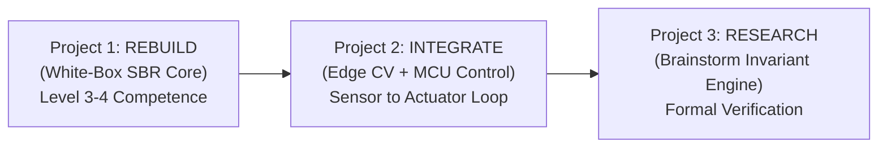

# ARCH-PLAN-003: Intelligent Systems Engineering & Research Conversion Roadmap
## Bridging Academic Breadth (BEIE) and Modern AI (AIF) into Verifiable Intelligent Systems

**Artifact ID:** `ARCH-PLAN-003`  
**Classification:** Strategic Career, Engineering Research & Educational Conversion Charter  
**Principal Architect:** Aaradhya Dev Tamrakar  
**Date:** September 24, 2026  
**Status:** ACTIVE / HIGH PRIORITY (P1)  
**Evidence Tier:** `E1` — Formal Strategic Plan & Execution Roadmap  
**Target Domain:** Intelligent Systems Engineering, Formal Verification, Autonomous Agents, Robotics & Embedded Control  
**Associated Repositories:** `brainstorm`, `SPARK`, `BiasAperture`, `super-nlm`  
**Upstream Provenance:** [`research/transcripts/2026-09-24_BEI-CAPABILITY-GAP-ANALYSIS_CONVERSATION.md`](../transcripts/2026-09-24_BEI-CAPABILITY-GAP-ANALYSIS_CONVERSATION.md)  
**Reference Specification:** [`research/references/BEIE_Complete_Syllabus_I_to_IV.md`](../references/BEIE_Complete_Syllabus_I_to_IV.md)  

---

## 1. Executive Context & Identity Anchor

This charter formally codifies the transition of Aaradhya Dev Tamrakar's engineering trajectory from an **AI-assisted developer** to an **AI-Native Systems & Research Engineer of Verifiable Intelligent Systems**.

The foundation rests on three synchronized pillars:
1. **Academic Substrate (BEIE):** Comprehensive curriculum breadth across engineering mathematics, signals, microprocessors, control, operating systems, and computer networks ([`BEIE_Complete_Syllabus_I_to_IV.md`](../references/BEIE_Complete_Syllabus_I_to_IV.md)).
2. **Applied ML Bridge (Fuse AIF):** Modern statistical ML, deep computer vision, sequential learning, transformer fine-tuning, RAG, and MLOps pipelines (Fusemachines AI Fellowship 2026).
3. **Research Apex (`brainstorm`):** Heterogeneous cognitive orchestration, capability contracts, and the dual-layer deterministic verification engine ([`INV-BMK-001`](../results/INV-BMK-001_results.json) via Z3 SMT-LIB2).

### 1.1 The Core Operating Principle: "High AI Leverage + High Personal Comprehension"
- **The Generation/Verification Asymmetry:** The marginal cost of code generation is zero; the cost of error detection is unbounded without formal invariants.
- **The Non-Negotiable Rule:** *Never leave an AI-created black box permanently black.* Every AI-generated subsystem must eventually pass through personal comprehension, debugging, and structural validation.

---

## 2. The 3-Layer Semester Attention Budget

The semester is defined as a **Conversion Semester**: transforming architectural breadth into verifiable empirical depth and externally legible artifacts.

```text
 ┌────────────────────────────────────────────────────────────────────────┐
 │ LAYER 1: THE FLAGSHIP RESEARCH SPINE (40% Attention Budget)            │
 │ Invariant Assurance Engine: SMT/Z3 + Sandbox Replay + Benchmark Dossier│
 └──────────────────────────────────┬─────────────────────────────────────┘
                                    │ Supported by
 ┌──────────────────────────────────▼─────────────────────────────────────┐
 │ LAYER 2: THE SKILL ENGINE & LEARNING DEPTH (30% Attention Budget)      │
 │ • Track A: Programming & Systems (Async lifetimes, testing, C/C++)    │
 │ • Track B: Applied ML & Production Systems (Fuse AIF Weeks 15–17)      │
 │ • Track C: Formal Verification (SMT encoding, property formulation)   │
 └──────────────────────────────────┬─────────────────────────────────────┘
                                    │ Externalized through
 ┌──────────────────────────────────▼─────────────────────────────────────┐
 │ LAYER 3: EXTERNALIZATION & REAL-WORLD CONVERGENCE (30% Attention)      │
 │ • 10%: BEIE Final Year Project Part A (Integrate with Layer 1)         │
 │ • 15%: High-Signal Internship (Only if real deployment / hardware)     │
 │ •  5%: Abroad Lab Pipeline (Build evidence first; seek audience later) │
 └────────────────────────────────────────────────────────────────────────┘
```

---

## 3. Five-Level Competence Benchmark

For every core technology across the stack, progress is measured against five discrete competence gates (Target: **Level 3–4 in Core Stack**):

- **Level 1 (Understand):** Draw the component block diagram and trace dataflow from memory without looking at code.
- **Level 2 (Modify):** Change state transitions, add features, and alter schema invariants without regressions.
- **Level 3 (Debug):** Diagnose race conditions, asynchronous timeouts, memory leaks, and solver timeouts independently.
- **Level 4 (Rebuild):** Open a blank project and implement the minimal core mechanism from first principles without AI prompting.
- **Level 5 (Defend):** Articulate and justify engineering trade-offs, formal limitations, and performance boundaries under adversarial review.

---

## 4. The Three-Project Sequential Execution Roadmap



### Project 1: Rebuild — SBR White-Box Audit (Hardware / Control Layer)
* **Objective:** Re-implement the core Self-Balancing Robot control stack from first principles without AI generation.
* **Competency Gates:**
  1. *Sensor Physics:* Read raw MPU6050 accelerometer and gyroscope registers via I2C. Characterize drift vs vibration noise.
  2. *State Estimation:* Hand-derive the Complementary Filter:
     $$\theta_{t} = \alpha (\theta_{t-1} + \omega \cdot \Delta t) + (1 - \alpha) \theta_{\text{acc}}$$
  3. *Control Law:* Implement discrete PID with anti-windup clamping and derivative kick mitigation.
  4. *Latency Audit:* Profile loop execution time on the MCU via GPIO toggle / oscilloscope to determine sampling jitter.

### Project 2: Integrate — Perception to Embedded Control (Systems Layer)
* **Objective:** Close the loop between software AI intelligence and physical actuation.
* **Pipeline:**
  $$\text{Camera / Sensor} \xrightarrow{\text{Edge Model (AIF CV)}} \text{Feature / Vector} \xrightarrow{\text{UART / Serial}} \text{MCU Planner} \xrightarrow{\text{PID / PWM}} \text{Actuators}$$
* **Competency Gates:**
  - Build robust serial packet framing with CRC8/16 checksum validation and baud-rate buffer overflow protection.
  - Implement a hard fail-safe invariant: If edge vision drops frames or hangs for $> 100\text{ ms}$, the MCU autonomously halts actuators.

### Project 3: Research — Invariant Assurance Benchmark (Research Layer)
* **Objective:** Formalize the Project 2 safety state machine into `brainstorm`'s SMT/Z3 headless invariant engine (`INV-BMK-001`).
* **Empirical Deliverables:**
  - Formulate valid invariants, planted violations, and negative controls.
  - Execute automated sandbox counterexample replay and record deterministic metrics into `research/results/`.
  - Compile the formal empirical dossier into `report/main.pdf`.

---

## 5. Strict Negative Constraints (The "Do-Not-Do" List)

1. ❌ **No Speculative Architecture Bloat:** Freeze new module charters in `brainstorm` (maintain 23 modules) until current systems achieve Level 4 reproducibility.
2. ❌ **No Course / Certificate Collecting:** Zero generic online course enrollments. Academic depth is bounded by BEIE; applied ML is bounded by Fuse AIF.
3. ❌ **No Low-Signal Internships:** Reject roles that do not offer real production deployments, hardware interfacing, or research supervision.
4. ❌ **No Premature Abroad Application Anxiety:** Build the verified research dossier first (`report/main.pdf` + reproducible benchmarks); market to research labs and universities in parallel.

---

## 6. Phased Timeline: The 1-Month Holiday Runway & Semester Launch

The upcoming festival holiday season (Dashain / Tihar / Chhath) introduces a **one-month protected incubation runway** prior to the formal start of the new academic semester and major project submissions.

```text
  NOW (Late Sept 2026)                      1 MONTH LATER (Late Oct / Nov 2026)
┌───────────────────────────────────────┐   ┌────────────────────────────────────────┐
│ PHASE 0: HOLIDAY INCUBATION RUNWAY    │   │ PHASE 1: FORMAL SEMESTER CONVERSION    │
│ • Clear Fuse AIF Backlog (W16 + W17)  │──►│ • Launch BEIE Major Project Part A     │
│ • White-Box SBR Rebuild (Project 1)   │   │ • Full 3-Layer Budget Allocation       │
│ • Deepen Python/C++ Concurrency       │   │ • External Calibration & Internships   │
│ • Distraction-free, zero-lecture zone │   │ • Formal Invariant Benchmark Dossier   │
└───────────────────────────────────────┘   └────────────────────────────────────────┘
```

### Phase 0: The 1-Month Holiday Incubation Runway (Late Sept – Late Oct 2026)
* **Objective:** Exploit the total absence of academic lectures and institutional deadlines to build first-principles depth.
* **Key Milestones:**
  1. **AIF Clearance:** Complete Fuse AIF Week 16 (Agentic Harness) and Week 17 (MLOps, due Sept 26).
  2. **Project 1 Rebuild:** Implement the Self-Balancing Robot core loop without AI generation. Derive complementary filter equations on paper; write the discrete PID in C/C++; audit sampling latency with hardware timers.
  3. **Concurrency & Memory Dissection:** Master Python `asyncio` lifecycle (task cancellation, exception bubbling) and POSIX/Windows IPC buffer mechanics without prompting.

### Phase 1: Post-Holiday Semester Launch (Late Oct / Nov 2026 Onward)
* **Objective:** Deploy the 3-Layer attention budget under active academic semester constraints.
* **Key Milestones:**
  1. **BEIE Major Project Part A:** Submit the Project 2 architecture (Perception $\to$ Edge Inference $\to$ MCU Control) as the official capstone proposal.
  2. **Layer 1 Benchmark Publication:** Finalize the headless Invariant Assurance Benchmark (`INV-BMK-001`) into a standalone, reproducible dossier.
  3. **Targeted External Pipeline:** Selectively interview for high-signal embedded/AI systems internships.

---

## 7. Epistemic Certification

This plan is formally recorded under `ARCH-PLAN-003` and linked into `brainstorm`'s dual-layer verification substrate. Any deviation or major milestone completion must be recorded in `research/decisions/` and verified via `.\sync.ps1`.
