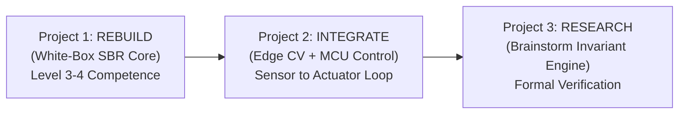

# ARCH-PLAN-003: Intelligent Systems Engineering & Research Conversion Roadmap
## Bridging Academic Breadth (BEIE) and Modern AI (AIF) into Verifiable Intelligent Systems

**Artifact ID:** `ARCH-PLAN-003`  
**Classification:** Strategic Career, Engineering Research & Educational Conversion Charter  
**Principal Architect:** Aaradhya Dev Tamrakar  
**Date:** September 24, 2026  
**Status:** ACTIVE / HIGH PRIORITY (P1)  
**Evidence Tier:** `E1` — Formal Strategic Plan & Execution Roadmap  
**Target Domain:** Intelligent Systems Engineering, Formal Verification, Autonomous Agents, Robotics & Embedded Control  
**Associated Repositories:** `brainstorm`, `SPARK`, `BiasAperture`, `super-nlm`  
**Upstream Provenance:** [`research/transcripts/2026-09-24_BEI-CAPABILITY-GAP-ANALYSIS_CONVERSATION.md`](../transcripts/2026-09-24_BEI-CAPABILITY-GAP-ANALYSIS_CONVERSATION.md)  
**Reference Specification:** [`research/references/BEIE_Complete_Syllabus_I_to_IV.md`](../references/BEIE_Complete_Syllabus_I_to_IV.md)  

---

## 1. Executive Context & Identity Anchor

This charter formally codifies the transition of Aaradhya Dev Tamrakar's engineering trajectory from an **AI-assisted developer** to an **AI-Native Systems & Research Engineer of Verifiable Intelligent Systems**.

The foundation rests on three synchronized pillars:
1. **Academic Substrate (BEIE):** Comprehensive curriculum breadth across engineering mathematics, signals, microprocessors, control, operating systems, and computer networks ([`BEIE_Complete_Syllabus_I_to_IV.md`](../references/BEIE_Complete_Syllabus_I_to_IV.md)).
2. **Applied ML Bridge (Fuse AIF):** Modern statistical ML, deep computer vision, sequential learning, transformer fine-tuning, RAG, and MLOps pipelines (Fusemachines AI Fellowship 2026).
3. **Research Apex (`brainstorm`):** Heterogeneous cognitive orchestration, capability contracts, and the dual-layer deterministic verification engine ([`INV-BMK-001`](../results/INV-BMK-001_results.json) via Z3 SMT-LIB2).

### 1.1 The Core Operating Principle: "High AI Leverage + High Personal Comprehension"
- **The Generation/Verification Asymmetry:** The marginal cost of code generation is zero; the cost of error detection is unbounded without formal invariants.
- **The Non-Negotiable Rule:** *Never leave an AI-created black box permanently black.* Every AI-generated subsystem must eventually pass through personal comprehension, debugging, and structural validation.

### 1.2 The "Option Value vs. Realized Value" Paradox
A 3.5-year retrospective reveals strong accumulation of **option value** (broad capability to enter embedded AI, robotics, agentic systems, or formal verification). However, marginal returns on accumulating additional breadth are now falling. 
Option value converts into **realized career and research capital** only through:
$$\text{Existing Baseline} \longrightarrow \text{One Deep Project} \longrightarrow \text{One Strong Result} \longrightarrow \text{External Evaluation} \longrightarrow \text{High-Signal Opportunity}$$

---

## 2. The 3-Layer Semester Attention Budget

The semester is defined as a **Conversion Semester**: transforming architectural breadth into verifiable empirical depth and externally legible artifacts.

```text
 ┌────────────────────────────────────────────────────────────────────────┐
 │ LAYER 1: THE FLAGSHIP RESEARCH SPINE (40% Attention Budget)            │
 │ Invariant Assurance Engine: SMT/Z3 + Sandbox Replay + Benchmark Dossier│
 └──────────────────────────────────┬─────────────────────────────────────┘
                                    │ Supported by
 ┌──────────────────────────────────▼─────────────────────────────────────┐
 │ LAYER 2: THE SKILL ENGINE & LEARNING DEPTH (30% Attention Budget)      │
 │ • Track A: Programming & Systems (Async lifetimes, testing, C/C++)    │
 │ • Track B: Applied ML & Production Systems (Fuse AIF Weeks 15–17)      │
 │ • Track C: Formal Verification (SMT encoding, property formulation)   │
 └──────────────────────────────────┬─────────────────────────────────────┘
                                    │ Externalized through
 ┌──────────────────────────────────▼─────────────────────────────────────┐
 │ LAYER 3: EXTERNALIZATION & REAL-WORLD CONVERGENCE (30% Attention)      │
 │ • 10%: BEIE Final Year Project Part A (Integrate with Layer 1)         │
 │ • 15%: High-Signal Internship / Lab RA (Only real hardware/deployment) │
 │ •  5%: Abroad Lab Pipeline (Build evidence first; seek audience later) │
 └────────────────────────────────────────────────────────────────────────┘
```

---

## 3. Five-Level Competence Benchmark

For every core technology across the stack, progress is measured against five discrete competence gates (Target: **Level 3–4 in Core Stack**):

- **Level 1 (Understand):** Draw the component block diagram and trace dataflow from memory without looking at code.
- **Level 2 (Modify):** Change state transitions, add features, and alter schema invariants without regressions.
- **Level 3 (Debug):** Diagnose race conditions, asynchronous timeouts, memory leaks, and solver timeouts independently.
- **Level 4 (Rebuild):** Open a blank project and implement the minimal core mechanism from first principles without AI prompting.
- **Level 5 (Defend):** Articulate and justify engineering trade-offs, formal limitations, and performance boundaries under adversarial review.

---

## 4. The Three-Project Sequential Execution Roadmap



### Project 1: Rebuild — SBR White-Box Audit (Hardware / Control Layer)
* **Objective:** Re-implement the core Self-Balancing Robot control stack from first principles without AI generation.
* **Competency Gates:**
  1. *Sensor Physics:* Read raw MPU6050 accelerometer and gyroscope registers via I2C. Characterize drift vs vibration noise.
  2. *State Estimation:* Hand-derive the Complementary Filter:
     $$\theta_{t} = \alpha (\theta_{t-1} + \omega \cdot \Delta t) + (1 - \alpha) \theta_{\text{acc}}$$
  3. *Control Law:* Implement discrete PID with anti-windup clamping and derivative kick mitigation.
  4. *Latency Audit:* Profile loop execution time on the MCU via GPIO toggle / oscilloscope to determine sampling jitter.

### Project 2: Integrate — Perception to Embedded Control (Systems Layer)
* **Objective:** Close the loop between software AI intelligence and physical actuation.
* **Pipeline:**
  $$\text{Camera / Sensor} \xrightarrow{\text{Edge Model (AIF CV)}} \text{Feature / Vector} \xrightarrow{\text{UART / Serial}} \text{MCU Planner} \xrightarrow{\text{PID / PWM}} \text{Actuators}$$
* **Competency Gates:**
  - Build robust serial packet framing with CRC8/16 checksum validation and baud-rate buffer overflow protection.
  - Implement a hard fail-safe invariant: If edge vision drops frames or hangs for $> 100\text{ ms}$, the MCU autonomously halts actuators.

### Project 3: Research — Invariant Assurance Benchmark (Research Layer)
* **Objective:** Formalize the Project 2 safety state machine into `brainstorm`'s SMT/Z3 headless invariant engine (`INV-BMK-001`).
* **Empirical Deliverables:**
  - Formulate valid invariants, planted violations, and negative controls.
  - Execute automated sandbox counterexample replay and record deterministic metrics into `research/results/`.
  - Compile the formal empirical dossier into `report/main.pdf`.

---

## 5. Layer 3 Execution: External Calibration & Opportunity Pipeline

To eliminate the **4.0/10 External Calibration void**, self-directed projects must yield an **external transfer of trust**: *"An external researcher, engineer, lab or company has evaluated my work closely enough to grant responsibility for a real problem."*

### 5.1 Local Research Lab Targets (Kathmandu Valley)
Approach local research groups with a **Research Proposition** rather than a generic internship inquiry (Active Tracker: [`research/notes/KU_LAB_OUTREACH_TRACKER.md`](../notes/KU_LAB_OUTREACH_TRACKER.md)):
- **Kathmandu University — RAVI Lab:** Focuses on robotics, autonomous systems, visual intelligence, sensor fusion, and real-time decision systems. (100% overlap with SBR, CV, and embedded control). *Dispatched: 2026-09-24; Follow-up Due: 2026-10-01*.
- **KU — Data Science & AI Lab:** Welcomes student researchers for applied ML and intelligent system pipelines. *Dispatched: 2026-09-24; Follow-up Due: 2026-10-02*.
- **KU — AI & Smart Systems Research Lab:** Practical on-device deployments (healthcare, sensors). Direct match for SPARK. *Dispatched: 2026-09-24; Follow-up Due: 2026-10-02*.
- **Approach Hierarchy:** Research Assistant $\to$ Research Trainee $\to$ Lab Volunteer $\to$ Collaborator $\to$ Intern.

### 5.2 The International Research Pipeline
- **EPFL E3 Fellowship (Switzerland) [URGENT]:**
  - Excellence in Engineering Early Research Program for Bachelor/Master engineering students ($\ge 2$nd year).
  - Portal Opens: October 2026. **HARD APPLICATION DEADLINE: NOVEMBER 1, 2026**.
  - Package: CV, Statement of Purpose, Transcript, References, 3 Lab Choices.
- **Structural Ineligibility Filter (Zero-Waste Constraint):**
  - ❌ *Mitacs Globalink 2027:* Ineligible (Nepal not a partner country).
  - ❌ *DAAD RISE Germany:* Ineligible (Restricted to students enrolled in US/Canada/UK/Ireland).
- **Direct PI Cold-Outreach Funnel:** Maintain an experimental contact set of 20 researchers (10 Nepal, 10 International) tracking responses, feedback, and project intersections.

### 5.3 Reusable Research Application Pack (`/Aaradhya-Research-Pack`)
Maintain a standardized, single-source dossier:
1. `CV.pdf` (1 page, systems/engineering focused).
2. **One-Page Research Profile** ([`RESEARCH_PROFILE.md`](../../RESEARCH_PROFILE.md)): Answers *"What concrete engineering/research value does Aaradhya contribute on Day 1?"*
3. **SPARK 1-Pager** ([`research/notes/SPARK_1PAGE.md`](../notes/SPARK_1PAGE.md)): 1-page empirical brief with AUC metrics and benchmark charts.
4. **Brainstorm Ecosystem 1-Pager** ([`research/notes/BRAINSTORM_1PAGE.md`](../notes/BRAINSTORM_1PAGE.md)): 1-page formal grounding of capability mesh and invariant verification.
5. `Transcript.pdf` (Official university grades).

### 5.4 DataCamp Assessed Certification Engine
Utilize existing DataCamp access for **assessed skill tests** rather than vanity course completion:
- Primary Target: **AI Engineer for Developers Associate** (assessed on programming for AI, model development, AI governance, production systems).
- Secondary Target: **Machine Learning Engineer** (Docker, MLflow, CI/CD, MLOps) or **Python Developer Associate**.

---

## 6. Strict Negative Constraints (The "Do-Not-Do" List)

1. ❌ **No Speculative Architecture Bloat:** Freeze new module charters in `brainstorm` (maintain 23 modules) until current systems achieve Level 4 reproducibility.
2. ❌ **No Course / Certificate Collecting:** Zero generic online course enrollments. Academic depth is bounded by BEIE; applied ML is bounded by Fuse AIF.
3. ❌ **No Low-Signal Internships:** Reject roles that do not offer real production deployments, hardware interfacing, or research supervision.
4. ❌ **No Premature Abroad Application Anxiety:** Build the verified research dossier first (`report/main.pdf` + reproducible benchmarks); market to research labs and universities in parallel.

---

## 7. Phased Timeline: Board Exam Defense, Holiday Runway & Semester Launch

```text
  NOW — OCT 4 (10 Days)                   OCT 5 — OCT 15 (Holiday Buffer)                 OCT 16 — NOV 1 (Sprint)                         NOV 2026 ONWARD
┌──────────────────────────────────────┐  ┌──────────────────────────────────────────┐   ┌───────────────────────────────────────────┐   ┌───────────────────────────────┐
│ PHASE -1: BOARD EXAM LOCKDOWN (P0)   │  │ PHASE 0A: RESEARCH PACK & NEPAL LABS (P1)│   │ PHASE 0B: EPFL E3 & BENCHMARK SPRINT (P1) │   │ PHASE 1: FORMAL SEMESTER (P1) │
│ • 100% Academic GPA & Exam Defense   │─►│ • Assemble /Aaradhya-Research-Pack       │──►│ • Submit EPFL E3 Application (Due Nov 1)  │──►│ • Launch BEIE Major Project A │
│ • Minimal AIF Maintenance (W17 Sept 26)││ • Pitch 10 Nepal Labs (KU RAVI/DataSci)  │   │ • Execute INV-BMK-001 Benchmark Suite     │   │ • Full 3-Layer Budget Rollout │
│ • ZERO Research Context-Switching    │  │ • DataCamp AI Engineer Assessment        │   │ • White-Box SBR Rebuild (Project 1)       │   │ • Second External Outreach    │
└──────────────────────────────────────┘  └──────────────────────────────────────────┘   └───────────────────────────────────────────┘   └───────────────────────────────┘
```

### Phase -1: The Board Exam Defense & Lockdown (Sept 24 – Oct 4, 2026) [PRIORITY: P0]
* **Objective:** Academic transcript and GPA protection. University board exams represent a hard, unrecoverable constraint for future graduate admissions, fellowships, and degree completion.
* **Operating Rules:**
  1. **Zero Architecture Churn:** Complete freeze on new repository tools, refactors, and research charters.
  2. **AIF Minimal Maintenance:** Efficiently complete and submit Fuse AIF Week 17 (MLOps, due Sept 26) and Week 16 backlog to maintain standing without encroaching on exam revision hours.
  3. **Cognitive Focus:** 100% mental bandwidth dedicated to syllabus mastery and board exam papers.
  4. **Outreach Status:** First wave to 3 KU Labs (RAVI, DSAI, AISSR) dispatched on Sept 24. Follow-up dates windowed for Oct 1–2. *Do not stress over inbox latency during exam hours.*

### Phase 0A: Research Pack & Response Management (Oct 5 – Oct 15, 2026) [PRIORITY: P1]
* **Milestones:**
  1. Finalize PDF rendering of the prepared 1-page Research Profile ([`RESEARCH_PROFILE.md`](../../RESEARCH_PROFILE.md)) and briefs ([`research/notes/SPARK_1PAGE.md`](../notes/SPARK_1PAGE.md), [`research/notes/BRAINSTORM_1PAGE.md`](../notes/BRAINSTORM_1PAGE.md)).
  2. Handle KU lab follow-ups and inquiries per [`research/notes/KU_LAB_OUTREACH_TRACKER.md`](../notes/KU_LAB_OUTREACH_TRACKER.md).
  3. Complete the DataCamp AI Engineer for Developers Associate assessed exam.

### Phase 0B: EPFL E3 Submission & Systems Rebuild Sprint (Oct 16 – Nov 1, 2026) [PRIORITY: P1]
* **Milestones:**
  1. Finalize and submit the **EPFL E3 Fellowship Application** prior to the **November 1, 2026 deadline**.
  2. Package existing certified benchmark results (`research/results/INV-BMK-001_results.json`) into the formal research report (`report/main.pdf`).
  3. Hand-derive and write the Project 1 SBR white-box complementary filter and PID loop in C/C++.

### Phase 1: Post-Holiday Semester Launch (Nov 2026 Onward) [PRIORITY: P1]
* **Milestones:**
  1. Submit the Perception $\to$ Inference $\to$ Actuation $\to$ Invariant Verification architecture as the official BEIE Major Project Part A capstone proposal.
  2. Initiate the second outreach wave to international PIs with the published empirical benchmark dossier.

---

## 8. Epistemic Certification

This plan is formally recorded under `ARCH-PLAN-003` and linked into `brainstorm`'s dual-layer verification substrate. Any deviation or major milestone completion must be recorded in `research/decisions/` and verified via `.\sync.ps1`.

