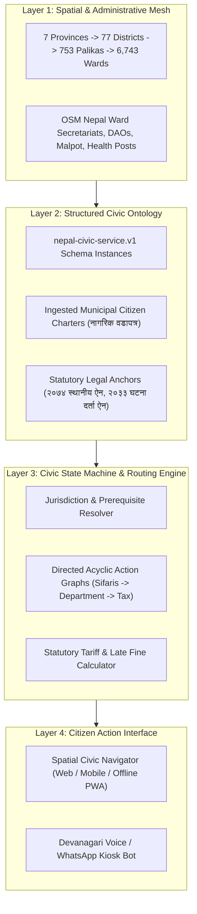

# ARCH-SPEC-008: Nepal Civic Action & Spatial Knowledge Substrate (NagarikGraph)

> **Artifact ID:** `ARCH-SPEC-008`  
> **Title:** Nepal Civic Action & Spatial Knowledge Substrate (NagarikGraph)  
> **Version:** `1.0.0`  
> **Status:** `PROPOSED`  
> **Principal Architect:** Aaradhya Dev Tamrakar  
> **Discipline:** Digital Public Infrastructure (DPI), Civic Tech, Spatial Knowledge Graphs & Legal Informatics  
> **Created Date:** 2026-09-29  
> **Evidence Tier:** `E2` (Architectural Design & Formal Contract Validated)  
> **Repository:** `F:\Aaradhya-Dev-Tamrakar\brainstorm`  
> **Upstream Trace:** [`schemas/nepal-civic-service.v1.json`](../../schemas/nepal-civic-service.v1.json), [`research/hypotheses/HYP-008-CIVIC-ACTION-GRAPH-DETERMINISM.yaml`](../hypotheses/HYP-008-CIVIC-ACTION-GRAPH-DETERMINISM.yaml), [`research/architectures/ARCH-SPEC-005-NEPALI-OCR-DOCX-ENGINE.md`](ARCH-SPEC-005-NEPALI-OCR-DOCX-ENGINE.md)  
> **Downstream Trace:** `sim/nepal_law_harvester.py`, NagarikGraph API, Spatial Civic Action Navigator  

---

## 1. Executive Summary & Problem Space

In Nepal's public governance ecosystem, citizens encounter severe frictional barriers when attempting to complete statutory or administrative tasks (vital registration, property tax, ward recommendations, company incorporation, citizenship endorsement). This friction manifests as:
1. **Pervasive Information Asymmetry:** Citizens routinely endure the *"कागजात नपुगेको"* (incomplete dossier) cycle, resulting in an estimated 35%–50% first-visit rejection rate at public counters.
2. **Extractive Intermediation:** Unauthorized middle-men (*दलाल*) exploit ambiguous procedures outside land revenue (*मालपोत*), transport (*यातायात*), and district administration (*प्रशासन*) offices, charging arbitrary fees (NPR 500 to 10,000) for simple procedural navigation.
3. **Statutory Disconnect:** Under Section 87 of the *Good Governance (Management and Operation) Act 2064* and Section 75 of the *Local Government Operation Act 2074*, every public authority is legally mandated to maintain an explicit Citizen Charter (*नागरिक वडापत्र*). However, these charters remain trapped in physical enamel wall boards, unstructured municipal Word/PDF tables, or obscure `.gov.np` portals.

**NagarikGraph** solves this by unifying **Geospatial Administrative Topography** with **Deterministic Civic State Machines**, transforming passive map tiles into an executable citizen action layer.

---

## 2. Multi-Layer System Architecture

---

## 3. Structural Dimensions

### 3.1 Geospatial & Administrative Spine (Where)
* **Administrative Hierarchy:**
  $$\text{Federal} \to 7\text{ Provinces} \to 77\text{ Districts} \to 753\text{ Local Levels (गाउँ/नगरपालिका)} \to 6,743\text{ Wards}$$
* **Geometry Engine:** Ingestion of Survey Department / MoFAGA GeoJSON polygon boundaries.
* **Point of Interest (POI) Anchor:** Exact centroids and physical entrance coordinates of Ward Secretariats, District Administration Offices, Land Revenue Offices, and Postal Counters tagged with OpenStreetMap IDs.

### 3.2 Civic Service State Machine (What & How)
Every public service is formalized under [`schemas/nepal-civic-service.v1.json`](../../schemas/nepal-civic-service.v1.json):
* **Deterministic Prerequisite Array:** Exact set of verified physical/digital documents required prior to queueing.
* **Statutory SLA:** Maximum legally permitted processing duration (e.g., "सोही दिन" / same-day vs. 3 working days).
* **Statutory Fee Schedule:** Distinction between zero-fee statutory rights (e.g., birth registration within 35 days) vs. scheduled municipal taxes.
* **Escalation Path:** Designation of the statutory Grievance Redressal Officer (*गुनासो सुन्ने अधिकारी*) with direct statutory escalation timelines.

### 3.3 Ingestion & Legacy Font Normalization Pipeline
* Government municipal portals frequently publish citizen charters in PDF tables rendered using legacy 8-bit Devanagari fonts (Preeti, Kantipur).
* The ingestion pipeline routes scraped municipal documents through the Syllabic AST Transcoder (`ARCH-SPEC-005`) to produce canonical UTF-8 Devanagari before structured LLM extraction.

---

## 4. Empirical Evaluation Protocol

1. **Benchmark Cohort:** 50 representative municipal citizen charters extracted across 5 distinct local level tiers:
   - Metropolitan Cities (*महानगरपालिका*): Kathmandu, Lalitpur, Pokhara.
   - Sub-Metropolitan Cities (*उपमहानगरपालिका*): Dharan, Hetauda.
   - Municipalities (*नगरपालिका*): Banepa, Dhulikhel.
   - Rural Municipalities (*गाउँपालिका*): Helambu, Namche.
2. **Verification Gates:**
   - **Schema Conformance:** 100% pass rate against `schemas/nepal-civic-service.v1.json`.
   - **Statutory Linkage:** Every service record must cite at least one explicit clause from national or local acts.
   - **Zero-Hallucination Rate:** Automated cross-check of fees and document lists against official published gazettes.

---

## 5. Security & Privacy Invariants

* **INV-CIVIC-001 (Zero PII Ingestion):** The NagarikGraph substrate indexes public procedures, administrative rules, and office geolocations. It never retains or logs citizen identity documents, citizenship numbers, or personal queries.
* **INV-CIVIC-002 (Statutory Provenance):** No civic service entry may be served without an explicit citation to a published government act, regulation, or officially endorsed municipal citizen charter.
