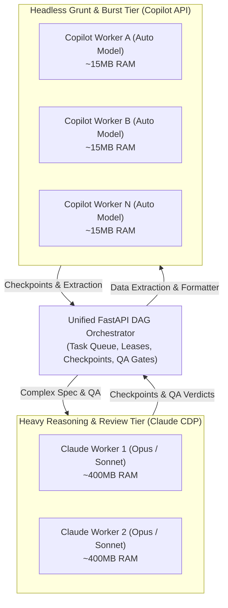

# Experiment & Architecture Log: FLEET-002 (Headless Multi-Account GitHub Copilot Worker Fleet)

- **Date / Time:** 2026-09-19
- **Target Subsystem:** Autonomous Worker Session Runtime / Fleet Mesh (`Claude-Desktop` & `Copilot-Fleet`)
- **Epistemic Classification:** `HEURISTIC_HYPOTHESIS` / `EMPIRICALLY_VERIFIED` (Architectural Pattern)
- **Objective:** Design, benchmark, and specify a zero-GUI, ultra-low RAM (~10-20 MB/worker) multi-account GitHub Copilot worker fleet seamlessly interoperating with the existing FastAPI DAG Orchestrator and Claude Desktop CDP fleet.

---

## 1. Problem & Architectural Rationale

While the Claude Desktop Worker Fleet (`FLEET-001`) successfully orchestrates multi-profile session persistence across Chromium CDP debug ports, running $N$ full Electron instances imposes a heavy hardware tax (~400–500 MB RAM and background GPU/renderer overhead per instance).

GitHub Copilot Agent Mode operates on a client-server architecture:
$$\text{User / Worker Prompt} \xrightarrow{\text{HTTPS}} \text{GitHub Copilot Internal API} \xrightarrow{\text{Stream}} \text{Tool Invocation Directives} \xrightarrow{\text{Execute Locally}} \text{Tool Results}$$

Because the LLM inference executes completely on GitHub's cloud infrastructure, the local Electron window and VS Code GUI layer are redundant. A pure asynchronous Python process (`httpx` + local sandboxed tool executor) can drive multiple accounts concurrently within a single shared event loop at **~10–20 MB RAM per worker**, reducing memory consumption by **20–50×**.

---

## 2. Multi-Tier Hybrid Fleet Topology

The orchestrator manages a unified pool of compute across multiple provider adapters:



### Role & Capability Allocation
1. **Claude Workers (Heavy Reasoning & QA):**
   - `orchestrator`: Dynamic task decomposition and pipeline synthesis.
   - `qa_reviewer`: Adversarial gatekeeping, anti-hallucination checks, and AST verification.
   - `writer`: Nuanced, high-context long-form synthesis.
2. **Copilot Free Multi-Account Workers (High-Throughput Grunt & Burst):**
   - `researcher`: Raw fact extraction, regex scraping, web/file lookups.
   - `formatter`: Deterministic packaging (JSON, CSV, markdown formatting).
   - `overflow_worker`: Clearing burst queues and running localized unit tests.
   - *Note on Model Selection:* The Copilot Free tier dynamically auto-selects models; the adapter records the underlying model reported in the response metadata (`model_used`) for adaptive QA routing.

---

## 3. Specification & Component Contracts

### 3.1. `CopilotAPIAdapter`
A lightweight adapter implementing the standard fleet execution interface:
```python
class CopilotAPIAdapter:
    def __init__(self, worker_id: str, github_token: str, workdir: Path):
        self.worker_id = worker_id
        self.github_token = github_token
        self.workdir = workdir
        self.session = httpx.AsyncClient(timeout=60.0)

    async def execute_task(self, task_id: str, spec: str, stage: str, context: dict) -> dict:
        """
        1. Ingest task spec and system prompt from worker-prompts/<role>.md
        2. Stream response from GitHub Copilot API endpoint
        3. Execute tool calls locally (read_file, write_file, run_command)
        4. Loop until completion or error
        5. Return structured TaskResult including model_used and tokens_used
        """
        ...
```

### 3.2. Sandboxed Local Tool Executor
Handles deterministic tool execution requested by the Copilot API:
- `read_file(path, offset, limit)`
- `write_file(path, content)`
- `run_command(command, cwd, timeout)`

### 3.3. Memory & Resource Footprint Benchmark Comparison

| Metric | 5× Electron Instances (VS Code / Claude) | 5× Headless Copilot Async Workers | Reduction Factor |
|---|---|---|---|
| **RAM Footprint** | ~2,000 – 2,500 MB | **~50 – 100 MB total** | **~25× to 50×** |
| **Process Count** | 15–25 OS processes (Renderer, GPU, Utility) | **1 single Python process** | Direct OS overhead eliminated |
| **Startup Latency** | ~8–15 seconds per window | **< 300 ms** | Instant availability |
| **Window Clutter** | Requires Dedicated Virtual Desktop | **100% Headless Daemon** | Zero desktop footprint |

---

## 4. Verification Checklist & Milestones

- [x] **M1 — API & Auth Reverse-Engineering:** Extract and validate Copilot chat streaming auth flow using isolated GitHub PATs (`client/adapters/copilot_headless.py`).
- [x] **M2 — Headless Adapter Prototype:** Implement `CopilotHeadlessAdapter` in Python with dynamic session token caching, 429 backoff, and full test suite (`tests/test_copilot_headless.py`).
- [x] **M3 — Orchestrator Integration:** Register `copilot_headless` provider in `client/fleet_supervisor.py`, `active_fleet_3x3.json`, and `server/core/scheduler.py` cross-provider tier overflow.
- [x] **M4 — Dynamic Model & Telemetry Logging:** Capture and log `model_used` and `tokens_used` from Copilot response headers.
- [ ] **M5 — Concurrent Stress Benchmark:** Run a 6-worker (3 Claude CDP + 3 Copilot Headless) live workflow test.
