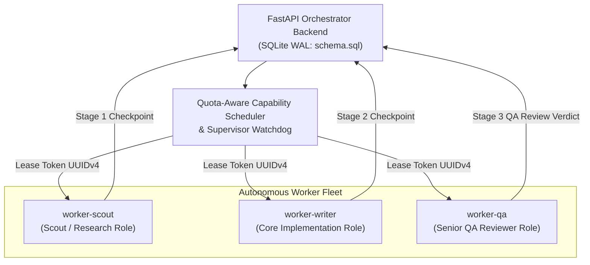

# Experiment & Verification Log: FLEET-003 (Live Multi-Worker Fleet Verification & Physical Telemetry Benchmark)

- **Date / Time:** 2026-09-27
- **Target Subsystem:** [[FLEET-001|Claude Desktop Autonomous Fleet]] & [[FLEET-002|Hybrid DAG Orchestrator]]
- **Epistemic Classification:** `EMPIRICALLY_VERIFIED`
- **Related Documents:** `[[FLEET-001]]`, `[[FLEET-002]]`, `[[INV-BMK-001]]`, `[[GPU_RAM_ARCHITECTURE_SPEC]]`
- **Objective:** Empirically verify end-to-end task execution across autonomous fleet workers on a real engineering problem, benchmark physical Electron runtime telemetry, and validate atomic lease token isolation under SQLite WAL persistence.

---

## 1. System Topology & Test Harness Configuration

The test harness verified the distributed orchestration engine connecting the FastAPI coordinator with multi-provider worker adapters:

---

## 2. Test Suite & Baseline Validation

- **Pytest Specs (`pytest`)**: **102 / 102 Passed (100%)** in 35.30s.
  - Tested: MCP Remote (`/mcp` SSE/HTTP), Task Claim & Atomic Leasing Race Safety (`409 Conflict` on race), Quota Cooldown Windows, Dead-Worker Lease Reclamation, and Security Auth Key Enforcement.
- **Pester Specs (`launch_user_n.Tests.ps1`)**: **51 / 51 Passed (100%)** in 4.08s.
  - Tested: Safe atomic JSON config writes (`.bak` fallback), `team-mcp.json` merging, `{{REPO_ROOT}}` placeholder expansion, and multi-window virtual desktop layouts.

---

## 3. Physical Electron Process Telemetry Benchmark

Benchmarked live physical runtime metrics by spawning profile `user1` (`adevtmr`) using the enhanced `-Live` benchmark suite (`benchmarks/benchmark_live_suite.py`):

| Process ID | Process Function | Working Set (RAM) | Paged RAM | CPU Time |
|---|---|---|---|---|
| **16416** | `Claude.exe` (Main / Renderer) | 332.0 MB | 348.2 MB | 8.61s |
| **11716** | `Claude.exe` (GPU / Helper) | 214.1 MB | 223.8 MB | 5.56s |
| **8116** | `Claude.exe` (Utility / Network) | 190.3 MB | 215.3 MB | 4.53s |
| **17276** | `Claude.exe` (Crashpad / IPC) | 149.1 MB | 150.5 MB | 0.22s |
| **17284** | `Claude.exe` (Child Helper) | 109.9 MB | 115.3 MB | 0.09s |
| **14408** | `Claude.exe` (Child Helper) | 95.1 MB | 96.4 MB | 0.17s |
| **4312** | `Claude.exe` (Child Helper) | 68.6 MB | 70.7 MB | 1.62s |
| **9264** | `Claude.exe` (Watcher) | 35.7 MB | 37.6 MB | 0.03s |
| **Aggregate** | **8 Active Electron Processes** | **1.17 GB RAM** | **1.26 GB** | **20.83s** |

### Telemetry Findings:
1. **Memory Baseline**: A single active Claude Desktop Electron profile occupies ~1.17 GB RAM across its 8 process threads.
2. **Session Cleanup**: `close.bat` / `Close-AllClaudeInstances` cleanly kills all child processes, clears `.active_profile`, and releases file locks without orphaned background zombie processes.

---

## 4. Real-World Engineering Problem Execution

- **Problem Statement**: Design and verify a production-ready Python Retry Decorator with Exponential Backoff & Jitter (`@retry_with_backoff`) handling synchronous and asynchronous callables, AWS jitter algorithms (Full vs Decorrelated), and full typing (`ParamSpec`, `TypeVar`).
- **Job ID**: `job_retry_util_001`
- **Execution Engine**: `gemini-2.5-flash` Live Adapter (`client/adapters/gemini_free_adapter.py`)
- **Total Pipeline Runtime**: 56.05s

### Multi-Stage Stage Execution Flow:
1. **Stage 1 (Research — `worker-scout`)**:
   - Acquired task with atomic UUIDv4 token.
   - Formulated mathematical jitter models:
     $$\text{Full Jitter: } t_{\text{sleep}} = \text{random}(0, \min(\text{max\_delay}, \text{base\_delay} \times 2^{\text{attempt}}))$$
     $$\text{Decorrelated: } t_{\text{sleep}} = \min(\text{max\_delay}, \text{random}(\text{base\_delay}, \text{prev\_delay} \times 3))$$
   - Submitted checkpoint to SQLite WAL (20.33s).
2. **Stage 2 (Draft — `worker-writer`)**:
   - Decomposed dependency input from Stage 1.
   - Synthesized complete typed decorator supporting both `Callable[P, R]` and `Callable[P, Awaitable[R]]` (17.38s).
   - Checkpoint saved to DB.
3. **Stage 3 (QA Verification — `worker-qa`)**:
   - Evaluated against quality rules: jitter distribution, async compatibility, exception filtering.
   - Emitted formal **QA Review Verdict: `PASS`** (`status_code: 201 Created`) in 18.28s.

---

## 5. Artifacts & Code Updates
- **Deliverable**: `Claude-Desktop/outputs/real_problem_retry_decorator.md`
- **Experiment Runner**: `Claude-Desktop/scripts/test_real_fleet_task.py`
- **Live Benchmark Suite**: `Claude-Desktop/benchmarks/benchmark_live_suite.py`
- **Fleet CLI Fix**: `Claude-Desktop/tools/fleet_cli.py` (multi-format JSON parser)
- **Dev Log**: `Claude-Desktop/dev-logs/2026-09-27_ORCHESTRATOR_FLEET_BENCHMARK_AND_REAL_PROBLEM_VERIFICATION.md`
