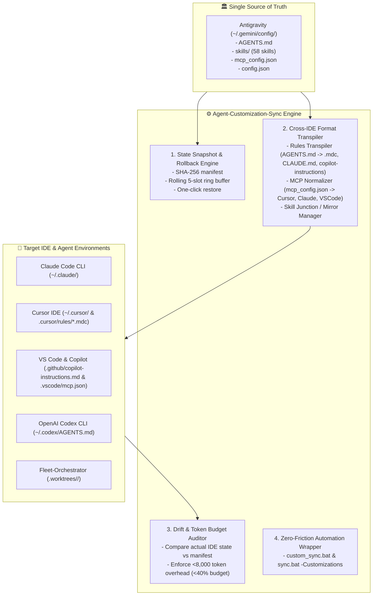

# Epistemic Record & Session Handoff: Antigravity Customization State Saving & Cross-IDE Syncing Engine

- **Date:** 2026-10-09T13:08:00+05:45
- **Author:** Aaradhya / Gemini Antigravity
- **Epistemic Classification:** `EMPIRICALLY_VERIFIED`
- **Target Repositories:** `brainstorm`, `Fleet-Orchestrator`, `Agent-Customization-Sync` (Proposed)
- **Active Commit Provenance:**
  - `Fleet-Orchestrator`: [`4476946`](https://github.com/AaradhyaDT/Fleet-Orchestrator/commit/4476946) (`feat(bridge): implement antigravity context bridge and native copilot custom instructions projection`)
  - `brainstorm`: [`eab8051`](https://github.com/Aaradhya-Dev-Tamrakar/brainstorm/commit/eab8051) (`feat(workflow): expand antigravity app scope to fleet orchestrator with live chat and customization projection (v3.5)`)
- **Active Plan Artifact:** [`plan_antigravity_customization_state_sync.md`](file:///C:/Users/Aaradhya/.gemini/antigravity/brain/664fca28-933a-496c-9b32-db063b31db99/plan_antigravity_customization_state_sync.md)

---

## 1. Verified Session Achievements & Ground Truth

### A. Antigravity Scope Expansion to Fleet-Orchestrator (Delivered & Verified)
1. **Bridge Engine (`client/antigravity_bridge.py`)**:
   - Auto-discovers active Antigravity conversation directory in `~/.gemini/antigravity/brain/` via modification timestamp.
   - Distills living chat session goals, user directives, active plan artifacts (`plan_*.md`), and customization rules into formal `antigravity_scope` JSON (< 1,500 token ceiling).
   - Injects `TASK_CONTEXT.md` and `.github/copilot-instructions.md` into ephemeral worker worktrees (`.worktrees/<task_id>/`).
   - Implements `cleanup_worktree_context()` to unlink projected files prior to git commit, guaranteeing 100% clean commit histories (`feat({task_id}): ...`).
2. **Copilot CLI Adapter (`client/adapters/copilot_cli_adapter.py`)**:
   - Omits `--no-custom-instructions` when `antigravity_scope` or `AGENTS.md` is present, allowing native ingestion of repository rules by `copilot.exe`.
   - Injects authoritative `ANTIGRAVITY SESSION DIRECTIVES` ASCII header into prompt payloads.
3. **Queue Worker & Fleet CLI**:
   - Auto-resolves Antigravity scope during task acquisition.
   - Full 180-test regression suite passed in 46.81s (`pytest tests/ -v`).
4. **Adaptive Workflow Specification v3.5.0**:
   - Added Section 7: **Antigravity Scope Expansion & Living Chat Context Injection** to `SKILL.md`.
   - Created reference specification: `references/antigravity-chat-context-injection.md`.
   - Triple-mirror deployment across `.agents/skills/`, `tools/skills/`, and `~/.gemini/config/skills/` with 100% SHA-256 byte parity.
   - Dual-layer verification passed (Layer 1 structural audit across 608 files; Layer 2 behavioral reproducibility with 36 tests and 12 Z3 SMT invariants).

---

## 2. The New Initiative: Customization State Saving & Cross-IDE Syncing Engine

### A. User Request & Vision
> "I am also planning customization state saving and syncing methods for Antigravity, so that I can utilize it in IDEs as well as other apps similar to it. /plan"
> "Should a separate repo be used for this?" -> **Confirmed: YES.**

### B. Architectural Decision: Dedicated Repository (`Agent-Customization-Sync`)
1. **The "Agent Dotfiles" Invariant**: A dedicated repository allows cloning and instant single-command provisioning of all agent rules, skills, and MCP servers on new workstations, laptops, or VMs without cloning the entire heavy `brainstorm` monorepo.
2. **Credential & Local Path Isolation**: Machine-local paths and MCP credential tokens stay cleanly separated from public or capstone research code.
3. **Global CLI Usability**: Can be installed as an editable global Python tool (`pip install -e .`), making `custom-sync audit` and `custom-sync push` runnable from any directory.
4. **Ecosystem Integration**: Follows the established BRL standard—standalone repository in `F:\Aaradhya-Dev-Tamrakar\Agent-Customization-Sync` with an ecosystem tracking branch in `brainstorm` (`customization-sync`) via `.\sync.ps1 -NewTool`.

---

## 3. Four Core Subsystems Designed in Plan



### 1. State Snapshot & Rollback Engine (`snapshot_engine.py`)
- Captures full inventory of `~/.gemini/config/` (AGENTS.md, skills/, mcp_config.json, config.json).
- Generates `customization_manifest.json` with cryptographic SHA-256 digests and token estimates.
- Archives timestamped bundles into `~/.gemini/snapshots/customizations/snapshot_<timestamp>.zip`.
- Implements instant rollback (`custom-sync restore --latest` or `--id <id>`).

### 2. Cross-IDE Format Transpiler (`transpilers/`)
- **Rules Transpiler**:
  - Ingests canonical `AGENTS.md`.
  - Transpiles to `CLAUDE.md` for Claude Code.
  - Transpiles to `.cursor/rules/*.mdc` (extracting sections with YAML frontmatter `globs: ["*"]` and `alwaysApply: true`) + legacy `.cursorrules`.
  - Transpiles to `.github/copilot-instructions.md` for Copilot.
  - Transpiles to `~/.codex/AGENTS.md` for OpenAI Codex.
- **MCP Normalizer**:
  - Ingests `~/.gemini/config/mcp_config.json`.
  - Translates to Cursor format (`~/.cursor/mcp.json`).
  - Translates to Claude Code format (`~/.claude/settings.json` or `.mcp.json`).
  - Translates to VS Code format (`.vscode/mcp.json`).
- **Skills Linker**:
  - Manages Windows Directory Junctions (`mklink /J`) from `~/.gemini/config/skills/` to `~/.claude/skills/` and `~/.cursor/skills-cursor/`.
  - Live edit in any IDE instantly updates across all without disk duplication. Fallback to copy-mirror mode supported.

### 3. Drift & Token Budget Auditor (`auditor.py`)
- Live discrepancy comparison across Antigravity, Claude Code, Cursor, and VS Code.
- Token overhead validator enforcing $< 8{,}000$ tokens static overhead ($\ge 60\%$ headroom) per `CUSTOMIZATION_TOKEN_OPTIMIZATION_GUIDE.md`.

### 4. Zero-Friction Automation Wrapper (`custom_sync.bat`)
- Windows batch wrapper bypassing ExecutionPolicy:
  ```powershell
  .\custom_sync.bat audit             # Audit drift across Cursor, Claude, Antigravity
  .\custom_sync.bat snapshot          # Create recovery checkpoint
  .\custom_sync.bat push -All         # Transpile and sync state to all IDEs
  .\custom_sync.bat restore -Latest   # Instant rollback to safe state
  ```

---

## 4. New Chat Prompt (Copy & Paste to Resume)

To start the next session immediately, copy and paste this prompt:

```text
Resume the Customization State Saving & Cross-IDE Syncing Engine implementation as documented in research/notes/2026-10-09_HANDOFF_CUSTOMIZATION_STATE_SYNC.md and the approved plan artifact C:\Users\Aaradhya\.gemini\antigravity\brain\664fca28-933a-496c-9b32-db063b31db99\plan_antigravity_customization_state_sync.md.

We have approved creating a dedicated repository:
- Repository Path: F:\Aaradhya-Dev-Tamrakar\Agent-Customization-Sync
- Ecosystem Branch in brainstorm: customization-sync

Bootstrap the new repository, implement the 4 core subsystems (snapshot engine, rules/mcp/skills transpilers, drift auditor, and custom_sync.bat), author the pytest test suite, and register the tool in brainstorm. Enforce the Anthropic Calm Authority writing style and "good work >>> fast work" quality standard.
```
