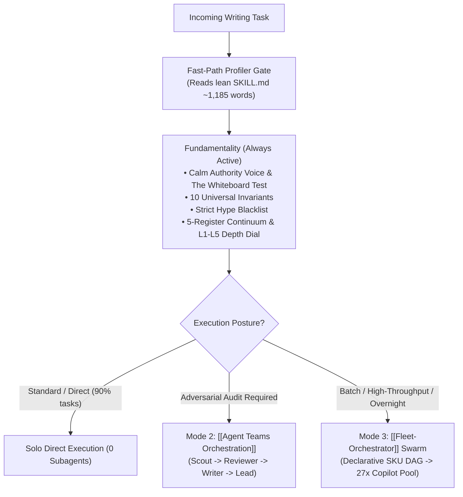

# Unified & Adaptive Anthropic Technical Writing Standard (`writing-like-claude`)

## 1. Executive Summary & Epistemic Calibration

`[EMPIRICALLY_VERIFIED]` This research note synthesizes the unified editorial architecture, mathematical verification mechanics, and multi-tier disclosure standards derived from Anthropic's authoritative literature:
1. **Frontier Model Release Reports**: `anthropic.com/claude-haiku-5-5`
2. **Formal System Cards**: *Claude Haiku 5.5 System Card* (144 pages, October 2026)
3. **Developer Platforms & SDK Specs**: `platform.claude.com/docs/en/models/haiku-5-5/migration-guide` & `browser-use-sdk`
4. **Trust Governance & Safe Access**: *Life Sciences Verification Program (LSVP)* & *Threat Intelligence Reports*
5. **Engineering Dog-Fooding Blogs**: `claude.com/blog` and `claude.com/resources/articles`

Rather than bifurcating into separate blog vs. report skills, the capability is unified into **`writing-like-claude`**, an adaptive engine that scales from 100-word micro-summaries to 30,000-word formal regulatory filings while preserving the core equation of trust:
$$\text{Trust} = \text{Precision} + \text{Scope Boundaries} + \text{Empirical Proof}$$

---

## 2. Decoupled Architecture: Fundamentality vs. Capability

A central architectural decision of this standard is the explicit separation between **Writing Fundamentality** and **Orchestration Capabilities**:



- **Anti-Bloat Invariant**: `SKILL.md` is strictly bounded to **$\le 1,400$ words** (actual: 1,185 words). Micro-tasks execute via the Fast-Path with **0 reference file loads**, guaranteeing zero cognitive pollution or prompt bloat.
- **Solo Direct Baseline**: Tasks execute instantaneously without spawning subagents unless explicitly demanded.

---

## 3. The 5-Register Continuum & 5-Tier Depth Dial

The skill organizes writing across 5 orthogonal registers mapped to calibrated depth tiers:

| Tier | Register & Surface | Target Words | Required Invariant Artifacts |
| :--- | :--- | :--- | :--- |
| **`L1`** | **Micro-Surface** (PRs, READMEs, [[Portfolio Website Tracker]]) | 100–300 | 1-Sentence Thesis, 3–4 active imperative bullets, explicit non-goals, 1 minimal code snippet. |
| **`L2`** | **Narrative Engineering** (Case Studies, GA Announcements) | 800–1,500 | The Whiteboard Test, the Before State with metrics, system architecture diagram, warts & failures. |
| **`L3`** | **Technical Spec** (Developer Migration, SDK Guides) | 1,000–3,000 | Model ID pills, before/after JSON request diffs, breaking change matrix, parameter checklist. |
| **`L4`** | **Model Launch Dossier** (Release Announcements) | 2,000–5,000 | Pinned Benchmark Grid (Subject, Predecessor, Competitor, Frontier Reference), Pareto log-scale curves, effort scaling, pricing table, System Card link. |
| **`L5`** | **Formal System Card** (Regulatory & Safety Dossiers) | 5,000–30,000+ | 9-Part Blueprint: RSP catastrophic thresholds (CB-1/2, AECI), Cyber benchmarks, Harmlessness/Refusal curves, Agentic safety, Alignment audits, Model welfare. |

---

## 4. Ecosystem Interoperability & Cross-Links

This standard formalizes bidirectional interoperability with 8 ecosystem components:
- **[[Compliance Report Harmonizer]]**: `writing-like-claude` provides the semantic content and $n < 30$ sample suppression logic, which `compliance-report-harmonizer` formats into air-gapped HTML and Blink-engine print PDFs.
- **[[Portfolio Project Manager]]**: Supplies the 3-bullet active-verb manifest for `AaradhyaDT.github.io` (`scripts/add_project.py`).
- **[[GitHub Workflow]]**: Generates PR descriptions and issue WBS tasks with authentic Git commit SHAs.
- **[[Super-NLM]]**: Ingests JSON-LD formatted technical reports directly into NotebookLM research fleets (`95a79d26...` personal, `2c00f5a4...` SPARK, `99bee3c6...` BiasAperture).
- **[[Graphify]]**: Maintains knowledge graph topology and concept traceability.
- **[[Adaptive Workflow]]**: Serves as the universal technical writing authority in `references/skill-matrix.md`.

---

## 5. Verification & Reproducibility Gate

All publications are deterministically audited via the companion CLI tool:
```powershell
python C:\Users\Aaradhya\.gemini\config\skills\writing-like-claude\scripts\audit_calm_writing.py --all examples/
```
Target: 0 banned hype adjectives, 100% invariant compliance across all 5 tiers.
