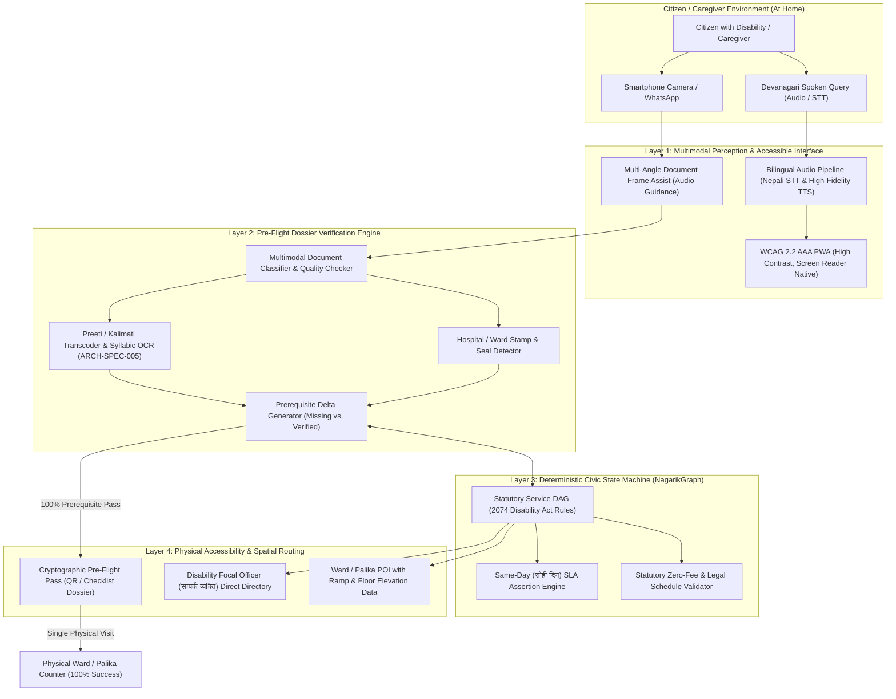

# Research & Product Plan: One-Shot Assistive Civic Navigator & Pre-Flight Dossier Verifier for Persons with Disabilities (Sahaj-Sewa / Nagarik-Access)

**ID:** `PLAN-A11Y-001`  
**Date:** 2026-10-08  
**Status:** Active Research & Competition Plan  
**Principal Architect:** Aaradhya Dev Tamrakar  
**Discipline:** Assistive Technology (a11y), Digital Public Infrastructure (DPI), Multimodal Document Intelligence, Civic Knowledge Graphs  
**Target Competition:** AIDA Impact Challenge 2026 ("AI Without Barriers") — Research & Innovation Tracks  
**Evidence Tier:** `E2` (Architectural Design & Formal Contract Validated)  
**Repository:** `F:\Aaradhya-Dev-Tamrakar\brainstorm`  
**Upstream Specifications:** [`ARCH-SPEC-008`](../architectures/ARCH-SPEC-008-NEPAL-CIVIC-ACTION-GRAPH.md), [`schemas/nepal-civic-service.v1.json`](../../schemas/nepal-civic-service.v1.json), [`ARCH-SPEC-005`](../architectures/ARCH-SPEC-005-NEPALI-OCR-DOCX-ENGINE.md), [`PLAN-NISR-001`](PLAN-NISR-001_PROGRAM_CHARTER.md)  
**Authoritative Statutory Grounding:**
- *Act Relating to Rights of Persons with Disabilities, 2074 (अपाङ्गता भएका व्यक्तिको अधिकार सम्बन्धी ऐन, २०७४)*
- *Rules Relating to Rights of Persons with Disabilities, 2077 (अपाङ्गता भएका व्यक्तिको अधिकार सम्बन्धी नियमावली, २०७७)*
- *Local Government Operation Act, 2074 (स्थानीय सरकार सञ्चालन ऐन, २०७४)*
- *Good Governance (Management and Operation) Act, 2064 (सुशासन ऐन, २०६४)*

---

## 1. Executive Summary & Problem Space

In Nepal, administrative friction at public counters (Ward Secretariats, District Administration Offices, Land Revenue Offices) results in an estimated **35%–50% first-visit rejection rate** (*"कागजात नपुगेको"* / incomplete dossier) for general citizens.

For **Persons with Disabilities (PwDs)**—specifically individuals with visual impairments, hearing impairments, chronic mobility restrictions (wheelchair users, cerebral palsy), and neurodivergent citizens—this administrative failure is **not an inconvenience; it is a disabling socio-economic wall**:

1. **Hostile Architectural Infrastructure:** Most Ward Secretariats and government offices in Nepal are housed in rented multi-story residential buildings without ramps, elevators, tactile paving, or accessible restrooms. Citizens with mobility impairments must often be physically carried upstairs by relatives.
2. **Prohibitive Out-of-Pocket Mobility Costs:** Inaccessible public transportation forces PwDs and their caregivers to hire private ambulances or taxis (NPR 1,500 to 5,000 per trip). Making 3 to 4 repeated trips to rectify missing documents often consumes a month's worth of household income.
3. **The Disability Benefit Paradox:** To access the basic rights guaranteed to them by law—the **Disability Identity Card (*अपाङ्गता परिचयपत्र*)**, social security allowance (*सामाजिक सुरक्षा भत्ता*), assistive device subsidies, and free healthcare quotas—a citizen must navigate the most physically and procedurally fragmented bureaucratic obstacle course in the country.
4. **Predatory Intermediation:** Because procedural requirements are opaque and buried in unstructured PDFs or painted enamel boards, unauthorized middlemen (*दलाल*) exploit PwD families, extracting NPR 2,000 to 10,000 in arbitrary fees.

### The "One-Shot" System Invariant
> **Invariant `INV-A11Y-ONE-SHOT`:** A person with a disability must never be required to make more than **one physical trip** to a public counter to complete a statutory administrative procedure.

This plan establishes the architecture for **Sahaj-Sewa (Nagarik-Access)**: a multimodal, voice-first assistive AI engine that performs **pre-flight document verification from home**, matches statutory checklists against the 2074 Disability Act, provides physical accessibility telemetry for government offices, and guides citizens through an auditory conversational interface.

---

## 2. Central Research Questions (CRQs)

* **CRQ-1 (Multimodal Pre-Flight Verification Accuracy):** How reliably can a lightweight vision-language model verify the statutory completeness of heterogeneous, degraded Devanagari administrative documents (identifying missing hospital committee seals, blurred registration stamps, and mismatched photo specs) from casual smartphone camera captures prior to office departure?
* **CRQ-2 (Auditory & Conversational State Grounding):** How can a localized Devanagari voice agent guide low-vision, blind, or low-literacy citizens through multi-step administrative DAGs without conversational drift, ungrounded legal hallucination, or fee misrepresentation?
* **CRQ-3 (Spatial Accessibility Telemetry & Traversal Minimization):** How does pairing statutory citizen charters with OpenStreetMap spatial accessibility metadata (ramp availability, counter floor elevation, elevator status, and disability focal officer direct lines) reduce physical mobility friction and prevent administrative counter bounce?

---

## 3. Multi-Layer System Architecture



---

## 4. Key Subsystems & Technical Implementation

### 4.1 Subsystem A: Voice-First Devanagari Conversational Interface
* **Design Rationale:** Visually impaired citizens and families with low smartphone literacy cannot navigate multi-tab web portals.
* **Mechanism:**
  * Native audio-in, audio-out conversational loop.
  * Understands conversational colloquial Nepali (*"मेरो बाबुको क कार्ड बनाउन के के चाहिन्छ ?"*).
  * Direct speech output explaining each required document in simple, non-legalistic Nepali.
  * Built using low-latency Web Speech APIs with fallback to Whisper Devanagari models.

### 4.2 Subsystem B: Multimodal Pre-Flight Dossier Verifier
* **The "Pre-Flight" Metaphor:** Similar to airline pre-boarding document verification, the citizen photographs their documents on a table at home.
* **Document Evaluation Pipeline:**
  1. **Document Identity:** Classifies whether the image is a Citizenship Certificate (*नागरिकता*), Medical Recommendation (*अस्पतालको सिफारिस*), Passport Photo (*फोटो*), or Ward Residence Sifaris (*वडा सिफारिस*).
  2. **Seal & Stamp Integrity:** Verifies presence of the hospital round stamp (*अस्पतालको छाप*) and doctor's signature/NMC registration number.
  3. **Photo Standards:** Confirms 3 copies of passport-sized photos are ready.
  4. **Delta Audit:** If any document is missing or illegible, the system issues an auditory alert: *"अस्पतालको सिफारिसमा डाक्टरको हस्ताक्षर वा छाप प्रस्ट देखिएन, कृपया फेरि फोटो खिच्नुहोस्"* (Doctor's seal not clear, please retake).
  5. **Pass Certificate:** Only when all prerequisites are satisfied does the engine generate the **One-Shot Travel Dossier** with a clear green status.

### 4.3 Subsystem C: Disability Rights Statutory State Machine (`schemas/nepal-civic-service.v1.json`)
Every procedure is formally grounded in statutory law:

| Statutory Procedure | Governing Legal Anchor | Card / Benefit Tier | Statutory Fee | Mandated SLA |
| :--- | :--- | :--- | :--- | :--- |
| **Disability Card Recommendation** | अपाङ्गता भएका व्यक्तिको अधिकार सम्बन्धी ऐन, २०७४ (दफा ४) | Red / Blue / Yellow / White | **NPR 0** (Statutory Free) | Same Day (*सोही दिन*) |
| **Palika Assessment Evaluation** | नियमावली, २०७७ (नियम ३, स्थानीय समन्वय समिति) | Classification Committee Check | **NPR 0** | Scheduled Meeting Day |
| **Social Security Allowance** | सामाजिक सुरक्षा ऐन, २०७५ (दफा ७) | Red (NPR 4,000/mo), Blue (NPR 2,128/mo) | **NPR 0** | Within 7 days of card |
| **Assistive Device Subsidy** | अपाङ्गता ऐन, २०७४ (दफा २४) | Wheelchairs, White Canes, Hearing Aids | **NPR 0** / Subsidized | Municipal Quota |

### 4.4 Subsystem D: Spatial & Architectural Accessibility Telemetry
NagarikGraph integrates OpenStreetMap POI data enriched with physical access metadata:
* **`ramp_available` (bool):** Presence of wheelchair-accessible entrance ramp ($\le 1:12$ slope).
* **`service_counter_floor` (int):** Floor number of the Social Development Desk (*सामाजिक विकास शाखा*). If $>1$, flags lack of elevator.
* **`focal_officer_contact` (string):** Direct municipal phone number of the designated Disability Focal Officer (*अपाङ्गता सम्पर्क व्यक्ति*).
* **`hearing_sign_support` (bool):** Availability of certified Nepali Sign Language (NSL) staff or video relay access.

---

## 5. Formal Schema Instance: Disability Identity Card Service

See accompanying artifact: [`schemas/examples/disability-id-card.civic.json`](../../schemas/examples/disability-id-card.civic.json).

```json
{
  "$schema": "https://aaradhyadt.dev/schemas/nepal-civic-service.v1.json",
  "service_id": "NEP-CIVIC-A11Y-001",
  "canonical_name_ne": "अपाङ्गता परिचयपत्र सिफारिस तथा वितरण",
  "canonical_name_en": "Disability Identity Card Recommendation & Issuance",
  "category": "social_security",
  "jurisdiction_level": "ward_secretariat",
  "governing_statutes": [
    {
      "act_name_ne": "अपाङ्गता भएका व्यक्तिको अधिकार सम्बन्धी ऐन, २०७४",
      "section_clause": "दफा ४ तथा दफा ५",
      "gazette_reference": "२०७४/०६/२९"
    }
  ],
  "prerequisites": [
    {
      "document_name_ne": "अनुसूची १ बमोजिमको भरिएको निवेदन फाराम",
      "mandatory": true
    },
    {
      "document_name_ne": "नेपाल सरकारबाट मान्यता प्राप्त चिकित्सक वा अस्पतालको अपाङ्गता प्रमाणित हुने स्वास्थ्य परीक्षण प्रतिवेदन",
      "mandatory": true
    },
    {
      "document_name_ne": "नेपाली नागरिकताको प्रमाणपत्रको प्रतिलिपि (नाबालकको हकमा जन्मदर्ता र अभिभावकको नागरिकता)",
      "mandatory": true
    },
    {
      "document_name_ne": "अपाङ्गताको प्रकृति देखिने ३ प्रति पासपोर्ट साइजको फोटो",
      "mandatory": true
    }
  ],
  "fee_structure": {
    "is_statutory_free": true,
    "standard_fee_npr": 0
  },
  "statutory_sla": {
    "max_duration_unit": "working_days",
    "max_duration_value": 1,
    "sla_display_ne": "कागजात रुजु भई समन्वय समितिको निर्णय पश्चात् सोही दिन"
  }
}
```

---

## 6. Empirical Evaluation Protocol (`EXP-A11Y-001`)

To validate the system empirically before deployment:

### 6.1 Benchmark Cohort & Test Corpus
* **Sample Size:** 50 simulated citizen application dossiers representing the 4 disability tiers across 5 local levels (Kathmandu, Lalitpur, Pokhara, Banepa, Helambu).
* **Controlled Defect Injections:**
  * 15 dossiers with missing hospital stamp or doctor registration number.
  * 10 dossiers with mismatched photo specifications.
  * 10 dossiers with missing ward residence recommendation.
  * 15 pristine, complete dossiers.

### 6.2 Primary Evaluation Metrics
1. **Pre-Flight Prediction Precision & Recall ($\ge 98\%$):** System correctly halts 100% of defective dossiers at home and greenlights 100% of valid ones.
2. **Office Visit Reduction Factor ($VRF$):**
   $$VRF = \frac{\bar{V}_{\text{baseline}} - \bar{V}_{\text{system}}}{\bar{V}_{\text{baseline}}}$$
   * Target: Reduce average in-person visits from $\bar{V}_{\text{baseline}} = 3.4$ to $\bar{V}_{\text{system}} = 1.0$ (a 70.5% reduction in physical travel burden).
3. **Economic Savings per Beneficiary:**
   * Eliminates 2–3 private taxi trips: saving NPR 3,000–8,000 per family.
   * Eliminates middleman facilitation fees: saving NPR 2,000–5,000.

---

## 7. AIDA Impact Challenge 2026 Strategic Alignment

| Challenge Requirement | Project Execution in Sahaj-Sewa (Nagarik-Access) |
| :--- | :--- |
| **Theme: "AI Without Barriers"** | Eliminates both the **digital/informational barrier** (via Devanagari voice AI) and the **physical/architectural barrier** (via pre-flight dossier verification guaranteeing one-shot completion). |
| **Target Beneficiaries** | Persons with physical, visual, auditory, and cognitive disabilities in Nepal seeking statutory rights under Act 2074. |
| **Track Selection** | **Primary: Innovation Challenge (Product Prototype, Team of 3–4)**<br>Deliverable: Functional PWA with live camera document check + Devanagari audio guidance.<br>**Secondary: Research Challenge (AI Research for Accessibility)**<br>Deliverable: Formal empirical paper on multimodal document triage for low-resource civic accessibility. |
| **Prizes & Milestones** | Eligible for Innovation Challenge Winner (NPR 30,000), Best Innovative Product (NPR 15,000), or Research Challenge Winner (NPR 15,000). |
| **Deadline** | **16 October 2026** (Registration & Submission). |

---

## 8. Epistemic Invariants & Safety Guarantees

* **`INV-A11Y-001` (Zero PII & Medical Data Ingestion):** The vision and speech models process documents client-side or in ephemeral memory. No national identity numbers, medical diagnosis reports, or citizen photos are stored or logged to external servers.
* **`INV-A11Y-002` (Statutory Citation Mandate):** Every checklist item and instruction must provide a traceable clause link to the *Act Relating to Rights of Persons with Disabilities, 2074* or *Rules 2077*.
* **`INV-A11Y-003` (Anti-Extortion & Free Status Assertion):** The system explicitly displays and speaks: *"अपाङ्गता परिचयपत्रको लागि कुनै पनि सरकारी दस्तुर लाग्दैन"* (No government fee is charged for the disability identity card), disarming unauthorized middlemen on site.
