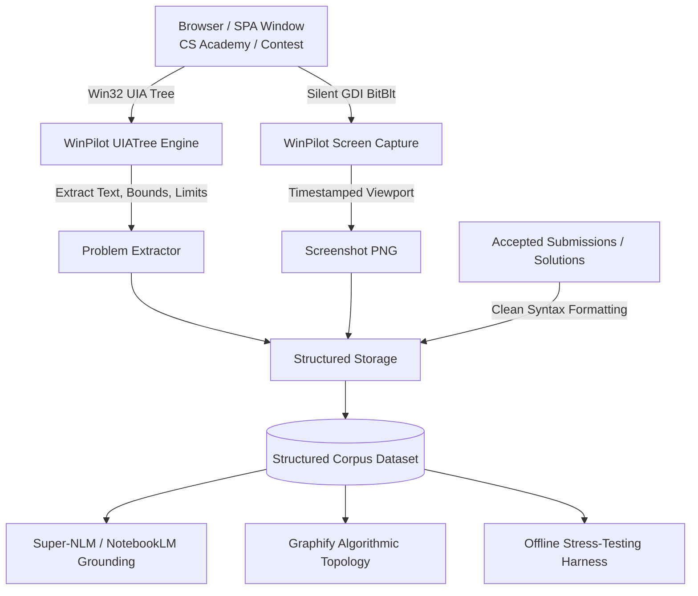

# Research Plan: Competitive Programming Corpus & Autonomous Extraction Pipeline
**ID:** `PLAN-CP-001`  
**Date:** 2026-09-27  
**Status:** In Progress / Active Execution  
**Authors:** Aaradhya Dev Tamrakar, Antigravity Agent  
**Context:** IEEE PreXtreme 20.0, CS Academy, IEEEXtreme

---

## 1. Executive Summary & Objective

Build an autonomous, high-fidelity competitive programming (CP) problem-solution archival engine. The system leverages **WinPilot** (OS-level UI Automation + BitBlt screen perception) to bypass SPA/WebSocket client-side rendering restrictions, archiving complete problem statements, mathematical formulas, I/O limits, and 100-point accepted solutions into a structured corpus.

This corpus serves as:
1. Grounded context sources for **Super-NLM / NotebookLM** (acting as an algorithmic oracle).
2. Topological input for **Graphify** knowledge graphs (mapping problem classes, constraints, and algorithmic paradigms).
3. Supervised fine-tuning / evaluation datasets for offline local models (Qwen-Coder / DeepSeek-Coder).
4. Automated counter-example generation and stress-testing harnesses during live contests.

---

## 2. Extraction Pipeline Architecture (WinPilot-Driven)



### Components:
* **UIA & DOM Traversal:** Traverses Chromium accessibility tree (`Document` -> `Text`, `ListItem`, `DataItem`, `Table`, `Row`, `Custom`) to extract:
  * **Problem View (`/contest/archive/task/<slug>/`):** Problem description, LaTeX/KaTeX math, input/output specifications, time/memory limits, subtasks, and sample cases.
  * **Submissions Index (`/contest/archive/submissions/`):** Filter jobs by status (`Accepted` / `Done`), contest task, score (`100 points`), extracting Job ID (`Job #7549997`, `#7550065`), timestamp, user handle (`CoreShift`, `smith`), and task references (`Task id #128`, `Contest #136`).
  * **Submission Result Detail (`/submission/<job_id>`):** Full source code (Python, C++, Java), language runtime metadata, summary metrics (Verdict points, CPU time usage, Memory usage, Source code byte size), compilation logs, and detailed per-testcase execution table (Test Number, CPU usage, Memory usage, Result verdict).
* **Silent Screen Capture:** Native GDI `BitBlt` capture (`Screen.capture_to_file` and MCP `capture_screenshot` with `output_path`) saves high-resolution visual evidence of rendered KaTeX equations, geometry figures, and submission test breakdowns without OS popups.
* **Corpus Storage Schema:**
  ```text
  research/datasets/competitive-programming/
  └── csacademy/
      └── <task_slug>/
          ├── problem.json               # Structured metadata (title, limits, constraints, subtasks)
          ├── statement.md               # Markdown problem statement with KaTeX math
          ├── viewport_problem.png       # Raw screenshot of problem statement captured via WinPilot
          ├── analysis.md                # Algorithmic paradigm, time/space complexity, proof invariant
          └── submissions/
              ├── index.json             # List of archived jobs (Job IDs, users, scores, runtimes)
              └── <job_id>/
                  ├── metadata.json      # User, timestamp, verdict points, CPU ms, Memory MB, source bytes
                  ├── solution.<ext>     # Clean source code extracted from editor/viewer (py, cpp, etc.)
                  ├── results.json       # Per-test-case execution breakdown (Test #, CPU ms, Mem KB, Result)
                  └── viewport_run.png   # Screenshot of submission verdict & test table
  ```

---

## 3. High-Value Downstream Applications

### 3.1 NotebookLM Algorithmic Oracle
* **Problem:** General-purpose LLMs hallucinate subtle DP state transitions or miss edge cases at $N \ge 10^5$.
* **Solution:** Ingest vetted 100-point solutions into a dedicated NotebookLM notebook via `super-nlm`. Querying the notebook yields proven mathematical invariants and boundary checks directly grounded in accepted competitive submissions.

### 3.2 Graphify Knowledge Graph Mapping
* Model problem tags, constraints, and algorithmic paradigms in an interconnected graph:
  $$\text{Task} \xrightarrow{\text{requires}} \text{Paradigm} \xrightarrow{\text{bounded by}} \text{Time Complexity}$$
* Enables rapid constraint-based retrieval during contests (e.g., $N \le 300$, convex polygon, grazing rope $\implies$ radial sweep + exterior angle sector decomposition).

### 3.3 Dynamic Offline Stress-Testing Harness
* Pair the accepted solution with a randomized input fuzzer.
* WinPilot / Antigravity can pit candidate code against the accepted reference solution, isolating the exact minimal failing input within seconds.

---

## 4. Work Executed (2026-09-27)

1. **WinPilot Integration & Verification:**
   * Validated WinPilot virtual environment (`F:\Aaradhya-Dev-Tamrakar\Utility\windows-pilot\.venv\Scripts\python.exe`).
   * Successfully attached to live Chrome window (`CS Academy - Google Chrome`, HWND 598136).
   * Verified UIA extraction on CS Academy SPA tasks:
     * Extracted `Addition` task and UI action targets (`Compile`, `Run input`, `Run examples`, `Submit`).
     * Extracted `Tale` task (convex polygon grazing rope geometry, subtasks, limits, and sample cases).
2. **WinPilot Image Saving Capability:**
   * Upgraded `winpilot.mcp_server.capture_screenshot` with an `output_path` parameter to save PNG/JPEG files directly to disk while returning metadata and base64 payloads.
   * Tested and verified silent desktop and window captures (`Screen.capture_to_file`).
3. **Agent Skill Provisioning:**
   * Created and registered dedicated skill: [`C:\Users\Aaradhya\.gemini\config\skills\winpilot\SKILL.md`](file:///C:/Users/Aaradhya/.gemini/config/skills/winpilot/SKILL.md) covering runtime resolution, window management, BitBlt screen perception, UIA DOM inspection, and input simulation.
