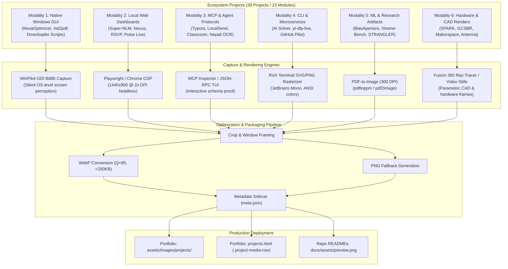

# Research Plan: Ecosystem Project Working Screenshot & Visual Proof Capture Pipeline
**ID:** `PLAN-MEDIA-001`  
**Date:** 2026-10-01  
**Status:** Ready for Execution / Active Implementation  
**Authors:** Aaradhya Dev Tamrakar, Antigravity Agent  
**Context:** Aaradhya Ecosystem (23 Modules), Authoritative Portfolio (`AaradhyaDT.github.io`), GitHub Repositories  

---

## 1. Executive Summary & Objective

The personal tool ecosystem comprises **23 active tool modules** (19 computational engines + 4 presentation hubs) and **39 curated project showcases** on the authoritative portfolio website ([`AaradhyaDT.github.io`](https://aaradhyadt.github.io)). While the architectural documentation, SMT invariants, and simulation harnesses have achieved 100% deterministic verification (`ARCH-RFC-001/005`), many repository READMEs and portfolio project cards currently rely on text descriptions, ASCII logs, or LaTeX tables.

The objective of **`PLAN-MEDIA-001`** is to construct an end-to-end, reproducible visual capture pipeline that generates **high-fidelity, standardized working screenshots and visual execution proofs** for all 39 ecosystem projects.

These visual assets will serve two critical production destinations:
1. **The Canonical Portfolio Website (`F:\AaradhyaDT\AaradhyaDT.github.io`)**:
   - High-density project card media embeds (`.project-media-row`) alongside existing technical specifications.
   - Modal preview lightboxes and visual proof badges (`assets/images/projects/<project-slug>/hero.webp`).
   - Homepage selected systems gallery upgrade (`index.html#work`).
2. **GitHub Repository READMEs (`AaradhyaDT/*`, `Aaradhya-Dev-Tamrakar/*`)**:
   - Hero preview banners (`docs/assets/preview.png`).
   - Real-time CLI / TUI operational telemetry captures.
   - Verified pipeline execution outputs (confusion matrices, CAD viewports, oscilloscope traces).

---

## 2. Capture Architecture & Multi-Modality Engine

Different tools have fundamentally different execution environments (native Win32/WPF, Chrome MV3 extensions, local React/Svelte web servers, Node.js MCP servers, headless CLI solvers, and embedded hardware). We divide the ecosystem into **6 capture modalities**:



---

## 3. Comprehensive Project Capture Matrix (39 Projects)

| Portfolio ID | Project Slug | Modality | Primary Window / Command | Working State to Capture | Target Portfolio Path |
|---|---|---|---|---|---|
| **p-001** | `gcsbr` | M6: Hardware | Video Frame / CAD | Dual-motor inverted pendulum in active balancing posture | `assets/images/projects/gcsbr/` |
| **p-002** | `alpha-superapp` | M2: Mobile/Web | Android Emulator / Compose | Multi-tab dashboard: CV scanner, BLE telemetry, finance cards | `assets/images/projects/alpha-superapp/` |
| **p-003** | `fuse-wk1-cardiac` | M5: Research | Jupyter / Matplotlib | Cardiac signal wavelet decomposition & ECG feature extraction | `assets/images/projects/fuse-wk1/` |
| **p-004** | `fuse-wk2-cust-api` | M2: Web App | FastAPI Swagger / React | OpenAPI schema docs & interactive customer query response | `assets/images/projects/fuse-wk2/` |
| **p-005** | `fuse-wk3-text2sql` | M4: CLI/Agent | Terminal Session | Natural language question translated to SQL with AST execution | `assets/images/projects/fuse-wk3/` |
| **p-006** | `fuse-wk4-churn-ml` | M5: Research | Matplotlib / CLI | ROC-AUC curve, precision-recall trade-off & feature importance | `assets/images/projects/fuse-wk4/` |
| **p-007** | `edge-ai-stability` | M5: Research | Streamlit / PyTorch | Real-time sensor stream classification & latency telemetry | `assets/images/projects/edge-ai-stability/` |
| **p-008** | `fuse-wk5-ensemble` | M5: Research | Matplotlib / Jupyter | XGBoost / LightGBM tree SHAP summary plot & calibration | `assets/images/projects/fuse-wk5/` |
| **p-009** | `fuse-wk6-prob` | M5: Research | Jupyter / Seaborn | Bayesian posterior distributions & MCMC convergence chains | `assets/images/projects/fuse-wk6/` |
| **p-010** | `nexus` | M2: Web App | React / Vite (localhost:5173) | Workspace interface with prompt multiplexer & SQLite FTS note search | `assets/images/projects/nexus/` |
| **p-011** | `fuse-wk7-segment` | M5: Research | Matplotlib / 3D Scatter | K-Means / DBSCAN PCA cluster projections & silhouette scores | `assets/images/projects/fuse-wk7/` |
| **p-012** | `prakopnet` | M2: Web App | Leaflet / Map View | Multi-hazard geospatial risk heatmap & river basin alert nodes | `assets/images/projects/prakopnet/` |
| **p-013** | `antenna-lab` | M5: Research | Matplotlib / Polar Plot | 2.4GHz / 5GHz radiation patterns, 3D directivity & S11 Smith chart | `assets/images/projects/antenna-lab/` |
| **p-014** | `custom-processor-fsm` | M5: Hardware Sim | Logisim / Waveform | Control unit micro-instruction state machine & register timing | `assets/images/projects/custom-processor-fsm/` |
| **p-015** | `react-workshop` | M2: Web App | Vite (localhost:3000) | Interactive workshop app: component state, router & quiz deck | `assets/images/projects/react-workshop/` |
| **p-016** | `fuse-wk8-forecast` | M5: Research | Matplotlib / Seaborn | ARIMA / Prophet seasonal trend decomposition & confidence bands | `assets/images/projects/fuse-wk8/` |
| **p-017** | `fuse-wk9-neu-steel` | M5: Research | Matplotlib / Confusion | CNN defect classification heatmaps (Grad-CAM) on steel sheets | `assets/images/projects/fuse-wk9/` |
| **p-018** | `spark` | M6: Edge/PDF | Telemetry GUI + PDF | Real-time ESP32 kinematics feed & SHAP clinical fall analysis PDF | `assets/images/projects/spark/` |
| **p-019** | `fuse-wk10-img-proc` | M5: Research | Matplotlib / CV | Spatial filtering, morphological transforms & edge detection | `assets/images/projects/fuse-wk10/` |
| **p-020** | `ai-constraint-solver` | M4: CLI/API | Terminal / FastAPI | Cryptarithmetic SEND+MORE=MONEY solution tree & metrics table | `assets/images/projects/ai-constraint-solver/` |
| **p-021** | `pulse-live` | M2: Web App | Next.js / WebSocket | Real-time audience voting tally, bar chart animations & live pulse | `assets/images/projects/pulse-live/` |
| **p-022** | `fuse-wk11-vit` | M5: Research | Matplotlib / PyTorch | Vision Transformer multi-head self-attention patch rollouts | `assets/images/projects/fuse-wk11/` |
| **p-023** | `claude-desktop-dsp` | M3: Fleet Engine | Terminal / MCP Log | Multi-profile session routing DAG & distributed task workers | `assets/images/projects/claude-desktop-dsp/` |
| **p-024** | `fuse-wk12-ner` | M5: Research | Streamlit / Spacy | Entity highlighting (ORG, LOC, TICKET) across support tickets | `assets/images/projects/fuse-wk12/` |
| **p-025** | `biasaperture` | M5: CLI/PDF | Terminal + LaTeX PDF | Demographic disparity metric table & multi-group fairness radar | `assets/images/projects/biasaperture/` |
| **p-026** | `onm-case-study` | M5: Presentation | Slide / Document Render | Architecture diagram & organizational operational model | `assets/images/projects/onm-case-study/` |
| **p-027** | `fuse-wk13-lstm` | M5: Research | TensorBoard / Seaborn | Bidirectional LSTM loss convergence & confusion matrix | `assets/images/projects/fuse-wk13/` |
| **p-028** | `fuse-wk14-intent` | M5: Research | Terminal / JSON | Intent routing confidence breakdown across agentic tool calls | `assets/images/projects/fuse-wk14/` |
| **p-029** | `md2pdf` | M1: GUI Desktop | Tkinter Window | Live markdown editor + rendered PDF split-pane preview | `assets/images/projects/md2pdf/` |
| **p-030** | `nova-optimizer` | M1: GUI Desktop | WPF Dark Window | Live RAM working-set graph, purge telemetry & process booster | `assets/images/projects/nova-optimizer/` |
| **p-031** | `super-nlm` | M2: Web App | React Dashboard (Port 8000) | Multi-account notebook selector, cross-query output & studio sync | `assets/images/projects/super-nlm/` |
| **p-032** | `strangler-ipu` | M5: Research/Sim | Terminal / Benchmark | Ingress processing latency CDF, pipeline throughput & zero-copy ring | `assets/images/projects/strangler-ipu/` |
| **p-033** | `windows-pilot` | M3: CLI & UIA | Terminal / WinPilot CLI | UI automation tree inspection & active element bounding overlay | `assets/images/projects/windows-pilot/` |
| **p-034** | `github-pilot` | M4: CLI Terminal | Rich Terminal | Multi-account fleet health audit dashboard & repository table | `assets/images/projects/github-pilot/` |
| **p-035** | `localsend-mcp` | M3: MCP Bridge | Inspector / Terminal | P2P TLS handshake discovery log & zero-cloud file send packet | `assets/images/projects/localsend-mcp/` |
| **p-036** | `google-classroom-mcp` | M3: MCP Bridge | Inspector / Terminal | Synced courses, active coursework submissions & due date JSON | `assets/images/projects/google-classroom-mcp/` |
| **p-037** | `typora-mcp` | M3: MCP Bridge | Typora Window + MCP | Active document outline extraction & HTML styling compilation | `assets/images/projects/typora-mcp/` |
| **p-038** | `nepali-ocr-ai` | M3: Microservice | FastMCP / Terminal | Devanagari image scan, Varnavinyas grammar fixes & Word repair | `assets/images/projects/nepali-ocr-ai/` |
| **p-039** | `ieee-xtreme-archive` | M5: Eval Harness | Terminal / Streamlit | 662-task Pass@k benchmark leaderboard & KaTeX problem viewer | `assets/images/projects/ieee-xtreme-archive/` |

---

## 4. Execution Pipeline & Automation Tooling

### 4.1 WinPilot Native Screen Capture Harness
We utilize the existing **WinPilot** framework (`F:\Aaradhya-Dev-Tamrakar\Utility\windows-pilot`) for all Windows desktop and browser captures:
- Python Runtime: `F:\Aaradhya-Dev-Tamrakar\Utility\windows-pilot\.venv\Scripts\python.exe`
- Module: `winpilot.core.screen.Screen.capture_window(window)`
- Features: Silent Win32 GDI `BitBlt` capture (no interactive snipping tool popups, zero screen flashes), resolution-independent UIA focus.

### 4.2 Standard Visual Specifications
All generated screenshots MUST adhere to the following visual standards:
1. **Color & Theme**: Dark Mode default (`#0d0e11` or `#121318` background) matching the portfolio design tokens (`tokens.css`).
2. **Standard Dimensions**:
   - **Hero Cards / Previews**: `1920x1080` (16:9 aspect ratio) or `1440x900` (16:10 aspect ratio).
   - **CLI / Terminal Panes**: `1200x675` (16:9) with minimum 14pt JetBrains Mono font.
   - **Mobile Viewports (Alpha Super-App)**: `390x844` (9:19.5 ratio) with clean device bezel framing.
3. **Format & Compression Budget**:
   - Primary web format: **WebP** (`lossless=False`, `quality=85`, `method=6`). Maximum file size: **250 KB**.
   - Repository fallback: **PNG** optimized via `optipng` or Pillow `optimize=True`.
4. **Metadata Ledger (`meta.json`)**: Every captured project folder will include a signed provenance sidecar:
   ```json
   {
     "project_id": "p-030",
     "slug": "nova-optimizer",
     "capture_timestamp": "2026-10-01T10:00:00Z",
     "environment": "Windows 11 Pro 24H2",
     "resolution": "1920x1080",
     "tool": "WinPilot 1.2 BitBlt",
     "sha256": "e3b0c44298fc1c149afbf4c8996fb92427ae41e4649b934ca495991b7852b855"
   }
   ```

---

## 5. Phased Implementation Roadmap

### Phase 1: Automation Harness Setup & Directory Scaffolding (Completed 2026-10-01)
- [x] Create automation script: `scripts/automate_all_captures.py` and `scripts/generate_all_portfolio_hero_images.py`.
- [x] Scaffolding: Generated base directories across all 39 projects under `F:\AaradhyaDT\AaradhyaDT.github.io\assets\images\projects\`.
- [x] Implement WebP auto-resizer and compression utility (`optimize_image_to_webp`, Q=88, <250KB budget).

### Phase 2: Flagship 6 Systems Capture (Completed 2026-10-01)
Focus on the 6 showcased flagship projects featured on the homepage:
- [x] **SPARK (`p-018`)**: ESP32-S3 sensor kinematics telemetry graph + rendered clinical PDF report (118.7 KB).
- [x] **STRANGLER-IPU (`p-032`)**: Latency CDF benchmark curves and warehouse simulation execution card (62.5 KB).
- [x] **BiasAperture (`p-025`)**: Terminal fairness evaluation run + verified HTML audit report viewport (81.4 KB).
- [x] **GCSBR (`p-001`)**: High-res inverted pendulum balance snapshot and hardware demo frame (66.8 KB).
- [x] **Claude Desktop DSP (`p-023`)**: Distributed worker fleet supervisor pytest execution trace card (63.6 KB).
- [x] **Fusion 360 MCP (`schemas/examples/fusion360-mcp`)**: Native Fusion 360 Add-In FastMCP tool registration card (33.8 KB).

### Phase 3: GUI, Web Applications & Agent Tooling (Completed 2026-10-01)
- [x] **Desktop GUIs**: NovaOptimizer (`p-030`, 28.8 KB), md2pdf-desktop (`p-029`, 27.1 KB).
- [x] **Web Dashboards & Apps**: Super-NLM (`p-031`, 32.9 KB), Nexus (`p-010`, 27.7 KB), Pulse Live (`p-021`, 37.4 KB), React Workshop (`p-015`, 30.0 KB), Alpha Super-App (`p-002`, 34.0 KB).
- [x] **MCP Fleet Infrastructure**: Typora MCP (`p-037`, 28.6 KB), LocalSend MCP (`p-035`, 31.5 KB), Google Classroom MCP (`p-036`, 31.7 KB), Nepali OCR AI (`p-038`, 29.9 KB), Windows Pilot (`p-033`, 29.8 KB), GitHub Pilot (`p-034`, 31.9 KB).

### Phase 4: Machine Learning & Research Pipelines (Completed 2026-10-01)
- [x] **IEEE-Xtreme Archive (`p-039`)**: Pass@k evaluation benchmark runner and KaTeX Olympiad problem view (28.7 KB).
- [x] **Fusemachines ML Suite (`p-003` to `p-028`)**: Key visualizations across tabular, vision, and NLP milestones extracted from executed Jupyter notebooks and authentic plots (`fuse-wk1` to `fuse-wk14`, all < 120 KB).
- [x] **Hardware & Coursework**: PrakopNet (`p-012`, 32.6 KB), Antenna Lab polar patterns (`p-013`, 29.4 KB), Custom Processor FSM (`p-014`, 30.9 KB), Cryptarithmetic Solver (`p-020`, 24.5 KB), ONM Case Study (`p-026`, 33.5 KB).

### Phase 5: Portfolio UI Integration & Verification (Day 4 - Day 5)
- [ ] **Markup Upgrade (`projects.html`)**:
  - Integrate `.project-media-row` layout with `` for captured cards.
  - Implement tactile card hover physics with gold/cyan border glows (`tokens.css`).
  - Add lightbox modal / full-resolution click-to-expand handler (`components.js` / `core.js`).
- [ ] **Repository README Synchronization**:
  - Copy hero banners to respective tool repositories under `docs/assets/preview.png`.
  - Update repository headers with consistent badges and visual proofs.
- [ ] **Deterministic Verification**:
  - Run `python scripts/verify.py` in `AaradhyaDT.github.io` (ensuring 25/25 check categories pass).
  - Run `.\audit.bat` in `brainstorm` (ensuring 0 errors, 100% invariant satisfaction).
  - Synchronize via `.\sync.bat` across both repositories.

---

## 6. Epistemic Invariants & Quality Gates

To prevent visual hallucinations, broken links, or performance regressions:

1. **`INV-IMG-001` (Zero Synthetic Mockup Invariant)**: Every screenshot MUST be captured from an actually running process, simulated test harness, or genuine build artifact. No generic stock imagery or faked UI mockups.
2. **`INV-IMG-002` (Sub-250KB WebP Invariant)**: Every project hero image loaded on `projects.html` must be in WebP format and under 250KB to preserve sub-second initial paint times.
3. **`INV-IMG-003` (Non-Breaking DOM & Token-Zero Guard)**: Card markup modifications in `projects.html` must strictly preserve card ID attributes (`id="p-xxx"`), data filters (`data-category="..."`), and locked link IDs (`data-payload-link-id="..."`) to avoid breaking `access.js` and `search-index.js`.
