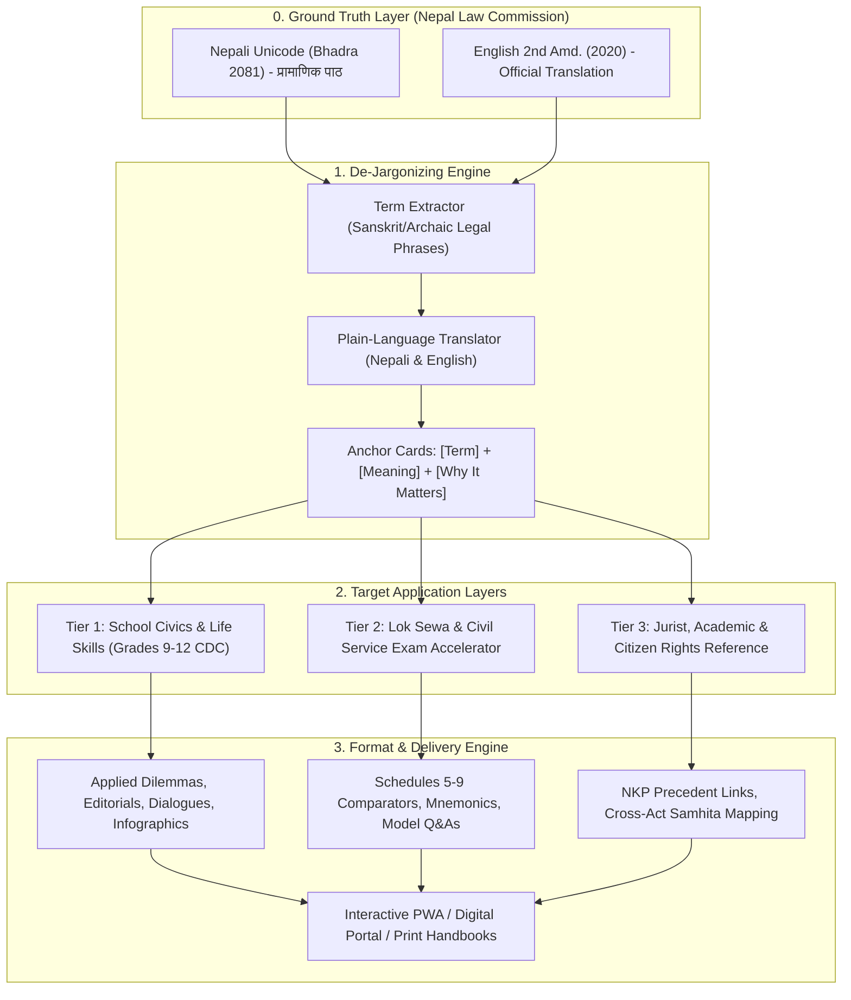

# Research & Product Plan: Constitution of Nepal Plain-Language & Multi-Tier Explanation Engine

**ID:** `PLAN-NEP-CONST-001`  
**Date:** 2026-09-28  
**Status:** In Progress / Active Execution  
**Principal Architect:** Aaradhya Dev Tamrakar, Antigravity Agent  
**Context:** Digital Product Development, Legal AI Grounding, Civic Education & Lok Sewa  
**Authoritative Corpus Sources:**
- **Nepal Law Commission (English, 2nd Amendment):** `Constitution of Nepal (2nd amd. English)_xf33zb3.pdf`
- **Nepal Law Commission (Nepali, Bhadra 2081 Unicode):** `नेपालको संविधान unicode भाद्र २०८१_mtbuyjt.pdf`
- **Super-NLM Grounding Notebook ID:** `e5ec3947-68f1-4a5c-bafc-c5a8a4ddc32b`

---

## 1. Executive Summary & Problem Formulation

The Constitution of Nepal (२०७२) serves as the supreme law of the state, governing fundamental rights, separation of powers, and the three-tier federal architecture (Federal, Provincial, Local). However, direct citizen engagement, student comprehension, and competitive exam preparation face severe **linguistic and structural barriers**:

1. **Linguistic Alienation:** The text is encoded in dense, Sanskritized legal phrasing (*तत्सम शब्दहरू*: e.g., *निवारक नजरबन्द, परमादेश, उत्प्रेषण, समानुपातिक समावेशी, अवशिष्ट अधिकार*) that confuses students, citizens, and educators.
2. **Context Disconnect in Schooling:** CDC Compulsory Social Studies (*सामाजिक अध्ययन तथा जीवनोपयोगी शिक्षा*) in Grades 9–12 tests conceptual application, editorial writing, debates, and civic life skills—yet students are presented with either dry legal text or rote notes.
3. **Legal Citation & Temporal Drift Risk in AI:** Pure generative LLM fine-tuning hallucinates non-existent Section/Article numbers, invents fictitious Supreme Court precedents (*नेकाप नजिरहरू*), and quotes repealed provisions (*खारेज भएका व्यवस्थाहरू*).

This project designs a **Bilingual, Multi-Tier Explanatory Digital Product & Legal Knowledge Pipeline** that transforms the authoritative constitutional text into accessible, verified cognitive layers.

---

## 2. Multi-Tier Cognitive Architecture

### Cognitive Layer Specifications:

| Tier | Target Persona | Primary Need | Content Output Format |
| :--- | :--- | :--- | :--- |
| **Tier 1: School & Civics** | Grades 9–12 SEE & NEB students, educators, parents | Applied civic awareness, zero rote memorization, creative exam formats | Realistic dilemmas ("The Road Widening Case"), sample *संवाद* (dialogues), *सम्पादकीय* (editorials), and system-thinking infographics. |
| **Tier 2: Lok Sewa & Careers** | Section Officer, Nayab Subba, TSC, Police, Banking aspirants | High-yield retention, exact article numbers, schedule power divisions | Comparative tables (Schedules 5–9), mnemonic acronyms for 31 Fundamental Rights, structured subjective answer blueprints. |
| **Tier 3: Jurist & Public** | Law students (BALLB/LLB), junior advocates, diaspora, civil society | Doctrinal consistency, precedent context, enforceable rights | Supreme Court landmark rulings (*नेकाप*), writ jurisdiction explanations (Articles 133 & 144), and cross-statute references to Muluki Codes. |

---

## 3. Data Grounding & Invariant Pipeline

To eliminate hallucination and uphold epistemic calibration (ARCH-RFC-001):

1. **Authentic Corpus Grounding:**
   - Primary text: Nepal Law Commission Bhadra 2081 Unicode edition (`नेपालको संविधान unicode भाद्र २०८१_mtbuyjt.pdf`).
   - English reference: Nepal Law Commission 2nd Amendment edition (`Constitution of Nepal (2nd amd. English)_xf33zb3.pdf`).
   - Deprecated: Discarded outdated 2072-11-16 draft from `ag.gov.np` which omitted the 2077 Second Amendment (Schedule 3 coat-of-arms map).
2. **Super-NLM Fleet Orchestration:**
   - Grounded notebook instantiated at UUID: `e5ec3947-68f1-4a5c-bafc-c5a8a4ddc32b`.
   - Connected across multi-profile Google fleet (`default`, `dev83`, `adt2061`, etc.) with automated Pro-fleet execution.
   - Dual-source extraction verifies every simplified card against exact paragraph and page citations.

---

## 4. Phase-Wise Execution Roadmap

### Phase 1: MVP — The Fundamental Rights Matrix (Articles 16–48)
- [ ] De-jargonize Part 3 (Articles 16 through 46) and Fundamental Duties (Article 48).
- [ ] Build 3-part Anchor Cards for the top 50 legal terms (e.g., *निवारक नजरबन्द, गैरकानुनी थुना, दोहोरो खतरा, यातना विरुद्धको हक*).
- [ ] Generate 10 sample CDC Social Studies application sets (Editorials, Dialogues, Dilemma breakdowns).
- [ ] Format into mobile-friendly markdown prototype.

### Phase 2: Federal Division & The Power Matrices (Schedules 5–9)
- [ ] Deconstruct Federal, Provincial, and Local power lists into an interactive "Who Owns What Problem?" guide.
- [ ] Produce comparative tabular summaries resolving concurrent jurisdictions (Schedules 7 & 9).
- [ ] Add visual flowcharts detailing Legislative, Executive, and Judicial interactions.

### Phase 3: Packaging & Digital Delivery
- [ ] Deploy lightweight responsive PWA / web viewer with side-by-side English/Nepali toggles.
- [ ] Create printable PDF cheat-sheet bundles for exam seasons (Magh–Baisakh).
- [ ] Integrate local payment channels (eSewa, Khalti, Fonepay) for direct digital distribution.
