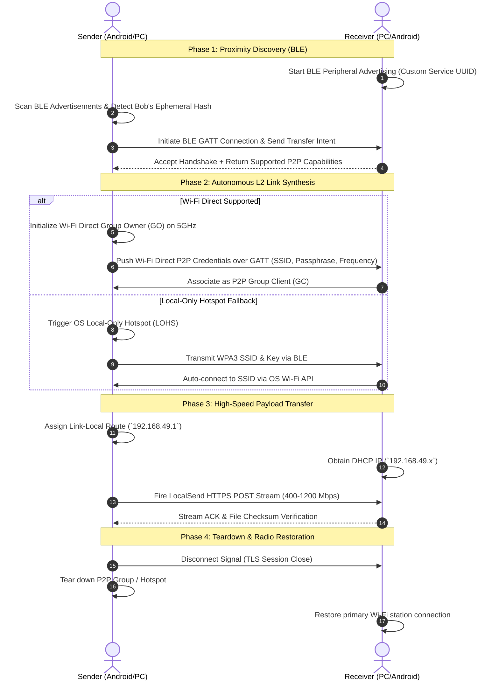

# Research Plan: Zero-Router Direct Transport Engine (AirDrop/Quick Share Parity)
**ID:** `PLAN-P2P-001`  
**Date:** 2026-09-27  
**Status:** Architectural Specification & Roadmap  
**Authors:** Aaradhya Dev Tamrakar, Antigravity Agent  
**Context:** LocalSend Fork / Custom Direct Link Layer for Android, Windows, and Linux

---

## 1. Executive Summary & Objective

Standard cross-platform file transfer solutions like **LocalSend** operate purely at OSI Layer 7 (Application Layer) over an established IP Local Area Network (LAN). While secure and robust, this introduces a fatal dependency: **both devices must be connected to the same Wi-Fi router or access point**. When users are outdoors, on public Wi-Fi with Client Isolation, or in transit, discovery and transfer fail.

**Objective:** Upgrade LocalSend’s transport architecture by decoupling discovery and link negotiation from external infrastructure, introducing a hybrid **Layer-2/Layer-3 Direct Transport Engine**:
1. **Zero-Router Proximity Discovery:** BLE (Bluetooth Low Energy) beaconing and GATT handshaking to locate peers without an active subnet.
2. **Autonomous Physical Link Formation:** Programmatic spin-up of high-speed Wi-Fi Direct (P2P Group) or Local-Only Hotspot (LOHS) over 5GHz/6GHz radios.
3. **Payload Stream Execution:** Tunneling LocalSend's battle-tested chunked TLS HTTP/REST engine directly across the newly formed link-local subnet (`192.168.49.0/24`).

> **Platform Scope Constraint:** Full zero-click P2P parity is explicitly targeted for **Android, Windows 10/11, and Linux**. Apple iOS is treated strictly as an out-of-band legacy fallback (requiring standard LAN or dynamic QR-code Hotspot handoff) due to iOS sandboxing blocking third-party AWDL frame injection.

---

## 2. Protocol Architecture & Layer Decomposition

```
┌────────────────────────────────────────────────────────────────────────┐
│                   Application Layer: LocalSend Core                    │
│    (UI State, Chunked File Hashing, Resume Logic, TLS Certificates)    │
├────────────────────────────────────────────────────────────────────────┤
│                   Adaptive Transport Orchestrator                      │
├───────────────────────────────────┬────────────────────────────────────┤
│     Standard Mode (Infrastructure)│    Direct Link Mode (Zero-Router)  │
├───────────────────────────────────┼────────────────────────────────────┤
│ L7 Discovery: mDNS (`:5353`)      │ L1/L2 Discovery: BLE Beacon (GATT) │
│ L3 Routing: Router DHCP Subnet    │ L2 Peering: Wi-Fi Direct (P2P GO)  │
│ L2 Link: 802.11 Station (BSSID)   │ L3 Link: Link-Local IP (192.168.49)│
└───────────────────────────────────┴────────────────────────────────────┘
```

### 2.1 State Transition Sequence



---

## 3. Platform-Specific Native Implementations

### 3.1 Android Integration (Kotlin Platform Channel)
* **BLE Controller:** `BluetoothLeAdvertiser` + `BluetoothLeScanner` with 128-bit Service UUID.
* **Wi-Fi Direct Primary:** `WifiP2pManager.createGroup()` using `WIFI_P2P_SERVICE` with explicit 5GHz channel preference.
* **Hotspot Fallback:** `WifiManager.startLocalOnlyHotspot()` for devices with non-compliant Wi-Fi Direct chipsets.
* **Permissions Profile:** `NEARBY_WIFI_DEVICES`, `BLUETOOTH_ADVERTISE`, `BLUETOOTH_CONNECT`, `BLUETOOTH_SCAN`.

### 3.2 Windows 10 / 11 Integration (C++ / WinRT)
* **BLE Discovery:** `Windows.Devices.Bluetooth.Advertisement.BluetoothLEAdvertisementWatcher` running as an OS service or system tray daemon.
* **Wi-Fi Direct Listener:** `Windows.Devices.WiFiDirect.WiFiDirectConnectionListener` to accept incoming P2P connections from Android/Linux.
* **Wi-Fi Direct Connector:** `WiFiDirectDevice.FromIdAsync()` to associate with an Android Group Owner.
* **Bandwidth Capacity:** Physical PHY rates up to 1.2 Gbps on 802.11ax (Wi-Fi 6).

### 3.3 Linux Integration (Rust / D-Bus Daemon)
* **BLE Stack:** BlueZ D-Bus API (`org.bluez.LEAdvertisement1`, `org.bluez.GattManager1`).
* **Wi-Fi Direct Stack:** `wpa_supplicant` P2P D-Bus interface (`fi.w1.wpa_supplicant1.Interface.P2PDevice`).

---

## 4. Implementation Pathways & Milestones

| Milestone | Deliverable | Scope |
| :---: | :--- | :--- |
| **M1: Specification & FFI Blueprint** | Protocol schema & Dart FFI contracts | Define BLE advertising packet structure and GATT state machine. |
| **M2: Android Native Transport Module** | Kotlin `DirectTransportPlugin` | Implement `WifiP2pManager` + BLE GATT exchange. |
| **M3: Windows WinRT Transport Module** | C++/WinRT `DirectTransportPlugin` | Implement `WiFiDirectConnectionListener` + BLE Watcher. |
| **M4: LocalSend Core Adaptation** | Flutter Transport Switcher | Add dynamic transport routing: switch between mDNS/LAN and Direct P2P. |
| **M5: Benchmark & Stress Testing** | Throughput & Latency Dossier | Measure connection setup latency (<3.5s target) and transfer throughput (>50 MB/s). |

---

## 5. Epistemic Governance & Invariant Rules
* **INV-P2P-001 (Zero-Data-Leak):** BLE advertising packets must never expose persistent hardware MAC addresses or identifiable user names; use rotating ephemeral hashes derived from an ECDH public key.
* **INV-P2P-002 (Radio State Restoration):** On transfer completion, error, or cancellation, the device Wi-Fi radio must deterministically revert to its pre-existing station association within 1500 ms.
