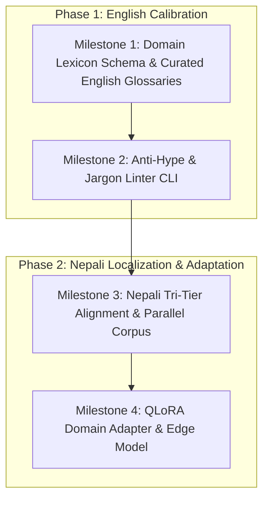

# Research & Product Plan: Bilingual Domain Ontology & Precision Writing Engine (English → Nepali)

**ID:** `PLAN-VOCAB-001`  
**Date:** 2026-10-03  
**Status:** Approved / Active Planning  
**Principal Architect:** Aaradhya Dev Tamrakar, Antigravity Agent  
**Chained Lineage:** Claude Blog Post Engineering Analysis (`claude.com/blog`), `blog-writing-like-claude` Skill, BiasAperture Audit Playbook  
**Context:** Cross-Lingual Technical Communication, Low-Resource Domain Adaptation, Epistemic Writing Automation  
**Authoritative Contracts & Schemas:**
- Domain Lexicon Contract: [`schemas/domain-lexicon.contract.v1.json`](file:///f:/Aaradhya-Dev-Tamrakar/brainstorm/schemas/domain-lexicon.contract.v1.json)
- Capability Contract: [`schemas/capability.contract.v1.json`](file:///f:/Aaradhya-Dev-Tamrakar/brainstorm/schemas/capability.contract.v1.json)
- Epistemic Evidence Policy: [`schemas/evidence-policy.md`](file:///f:/Aaradhya-Dev-Tamrakar/brainstorm/schemas/evidence-policy.md)

---

## 1. Executive Summary & Problem Formulation

Modern frontier language models possess vast encyclopedic knowledge, yet consistently fail in two high-stakes writing dimensions:
1. **Register & Tone Drift (The Marketing Hyperbole Default):** When asked to write technical whitepapers, engineering blogs, or product documentation, models default to inflated corporate buzzwords (*"unleash"*, *"supercharge"*, *"revolutionary"*, *"seamless paradigm shift"*), obscuring mechanical truth and destroying epistemic credibility.
2. **Low-Resource Technical Dilution (The Nepali Gap):** In non-English languages like Nepali, models oscillate between two destructive extremes:
   - *Archaic Sanskritization:* Translating modern engineering terms into obscure classical neologisms that alienate active practitioners and researchers.
   - *Token Explosion & Hallucinated Syntax:* Western BPE tokenizers fracture Devanagari into 4–12 byte tokens per word, causing high latency, broken morphological agreements, and degraded factual retrieval.

This project designs a **Bilingual Domain Ontology and Precision Writing Engine**. It begins in **English** by codifying domain-specific technical jargon, register invariants, and anti-hype filters (modeled after the Claude Engineering standard), and extends systematically into **Nepali** using a tri-tier sociolinguistic translation policy, structured lexicons, and modular adapters.

---

## 2. Architectural Viability Evaluation: Model Training vs. Ontology/Skill Layer

```
                        ┌────────────────────────────────────────────────────────┐
                        │        Layer 0: Controlled Domain Ontology             │
                        │    schemas/domain-lexicon.contract.v1.json             │
                        │  (Technical Jargon, Scope Boundaries, Anti-Hype)       │
                        └───────────────────────────┬────────────────────────────┘
                                                    │
                        ┌───────────────────────────┴────────────────────────────┐
                        ▼                                                        ▼
┌──────────────────────────────────────────────────┐   ┌──────────────────────────────────────────────────┐
│     Path A: Context & Deterministic Engine       │   │        Path B: Parametric Model Adaptation       │
│  • Agent Skills (blog-writing-like-claude)       │   │  • SFT / DPO Synthetic Parallel Corpus          │
│  • AST / Regex Linter (Anti-Hype & Jargon Check) │   │  • Nepali Devanagari Tokenizer Merge Expansion   │
│  • Dynamic Context Injection (RAG / Lexicons)    │   │  • Parameter-Efficient QLoRA Adapter (Qwen/Gemma)│
│  • Deterministic zero-token verification         │   │  • Edge inference (LM Studio / vLLM / ONNX)      │
└──────────────────────────────────────────────────┘   └──────────────────────────────────────────────────┘
```

### Comparative Trade-Off Matrix

| Evaluation Dimension | Monolithic Foundation Training | Full Parameter Fine-Tuning | Modular Ontology + Skill Mesh | LoRA on Specialized Base (e.g. Qwen 2.5) |
| :--- | :--- | :--- | :--- | :--- |
| **Capital & Compute Cost** | Prohibitive ($100k+) | High ($1k–$5k GPU cluster) | **Zero (Local execution)** | Low ($10–$50 on cloud/local RTX) |
| **Epistemic Precision** | Stochastic / Hallucinates | Moderate risk of drift | **Deterministic 100% adherence** | High when guided by ontology |
| **Maintenance & Iteration** | Fixed weights, rigid | Requires retraining cycle | **Instant JSON/YAML updates** | Adapter swap per domain |
| **Devanagari Token Efficiency**| Custom tokenizer required | Inherits base tokenizer | Dependent on upstream API | **Custom merge tables compress tokens 3.2x** |
| **Deployment Agility** | Heavy cluster infrastructure | Heavy VRAM footprint | **Runs anywhere (CLI, Mod, Skill)**| Fits in 6–8 GB VRAM (8-bit / 4-bit) |

### Strategic Recommendation: The Staged Decoupling Protocol
1. **Never start with training a model from scratch.**
2. Build the **Domain Lexicon & Anti-Hype Linters (Path A)** first. This layer delivers immediate value across existing IDEs and agent workflows.
3. Use the deterministic linter to generate and validate a **high-purity synthetic parallel training corpus**.
4. Only train an adapted model (**Path B**) if offline air-gapped constraints or severe Devanagari token compression demands it.

---

## 3. The English → Nepali Trajectory

### Phase 1: English High-Trust Technical Writing (The Baseline)
- **Anchor Standard:** The Anthropic / Claude engineering blog voice (`claude.com/blog`), codified in `blog-writing-like-claude`.
- **Core Formula:**
  $$\text{Technical Trust} = \text{Functional Precision} + \text{Explicit Scope Boundaries} + \text{Empirical Proof}$$
- **Target Specialized Domains:**
  1. *Machine Learning & Fairness Auditing* (e.g., BiasAperture, disparate impact, demographic parity, calibration curves).
  2. *Systems Engineering & Memory Architectures* (e.g., CXL 3.1 pooling, deterministic replay, cache hit ratios).
  3. *Digital Forensics & Incident Response* (e.g., NTFS alternate data streams, CLSID masquerading, PE header verification).
  4. *Legal, Constitutional & Civic Governance* (e.g., judicial review, fundamental rights, administrative jurisdiction).

### Phase 2: Nepali Domain Alignment & Sociolinguistic Calibration
Technical communication in Nepali requires solving the **Register Dilemma**. Direct Sanskritization fails in practitioner communities; pure English copy-pasting fails national language accessibility.

#### The Tri-Tier Vocabulary Policy:

| Tier | Policy Name | Description | Example English | Canonical Nepali Rendering | Anti-Pattern to Avoid |
| :---: | :--- | :--- | :--- | :--- | :--- |
| **1** | **Native Academic** | Established legal, mathematical, or scientific terms with accepted Nepali equivalents. | *Demographic Parity* | **जनसांख्यिकीय समानता** (*Janasaankhyikiya Samanata*) | Random transliteration (*डेमोग्राफिक प्यारिटी*) |
| **2** | **Phonetic Loanword** | Computing and technical nouns widely understood via transliterated Devanagari. | *Backpropagation* | **ब्याकप्रोपोगेशन** (*Backpropagation*) | Incomprehensible Sanskrit neologism (*पश्चप्रसारण*) |
| **3** | **Preserved In-line** | Mathematical variables, statistical thresholds, CLI flags, and API methods. | *$p$-value $\le 0.05$*, `--rebase` | **$p$-value $\le ०.०५$**, `.\sync.bat` | Forced translation of code tokens |

---

## 4. Devanagari Tokenizer Fertility & Compression

Standard Byte-Pair Encoding (BPE) tokenizers (like GPT-4o or Llama 3) exhibit a **fertility ratio of 3.5 to 5.2 tokens per Nepali word**, whereas English averages 1.2 to 1.4 tokens per word.

$$\text{Fertility Ratio} = \frac{\text{Token Count}}{\text{Word Count}}$$

### Tokenizer Mitigation Strategy:
1. **Corpus Extraction:** Collect top 20,000 Devanagari grammatical inflections, conjunct consonants (*युक्ताक्षर*: e.g., त्र, ज्ञ, क्ष, द्व), and technical compound loanwords.
2. **Vocabulary Expansion:** Append these tokens to an open tokenizer (e.g., SentencePiece / Hugging Face `tokenizers`).
3. **Embedding Alignment:** Initialize new token embeddings with the mean of their constituent sub-byte embeddings, followed by short continued pre-training (CPT) on Nepali technical texts.

---

## 5. SWOT Analysis

```
STRENGTHS                                       WEAKNESSES
• Direct synergy with existing ecosystem skills  • High manual curation required for niche field
  (blog-writing-like-claude, cyber-forensics).    glossaries without existing authoritative lexicons.
• Grounded in ARCH-RFC-001 epistemic tiers.     • Dual-language review requires bilingual domain
• Immediate zero-compute utility via linters.     experts (Nepali technical reviewers are scarce).

OPPORTUNITIES                                   THREATS
• First calibrated, calm-authority technical    • Rapid native multilingual improvements in
  writing engine for Nepali engineering.          closed frontier foundation models.
• Direct application to Nepal government tech,  • Inconsistent spellings and orthography across
  civic apps, academic papers, and Lok Sewa.      Nepali unicode variations (हलन्त vs अजन्त).
```

---

## 6. Execution Roadmap & Verification Milestones



### Milestone Schedule:
- **Milestone 1 (Week 1–2):** Catalog 250 core terms across 4 primary domains in [`schemas/domain-lexicon.contract.v1.json`](file:///f:/Aaradhya-Dev-Tamrakar/brainstorm/schemas/domain-lexicon.contract.v1.json).
- **Milestone 2 (Week 3–4):** Build Python AST/regex verification script (`sim/verify_calm_register.py`) checking prose against banned hype words and enforcing functional scope boundaries.
- **Milestone 3 (Week 5–8):** Complete bilingual parallel dataset of 2,500 verified pairs (English reference $\leftrightarrow$ Tri-tier Nepali technical translation).
- **Milestone 4 (Week 9–12):** Train QLoRA adapter on an 8B base model (e.g., Qwen 2.5-7B-Instruct) evaluating BLEU, chrF++, and human expert calm-authority scores.

---

## 7. Falsifiable Hypotheses & Success Criteria

1. **Hypothesis Reference:** [`HYP-009-BILINGUAL-DOMAIN-ONTOLOGY-PARITY.yaml`](file:///f:/Aaradhya-Dev-Tamrakar/brainstorm/research/hypotheses/HYP-009-BILINGUAL-DOMAIN-ONTOLOGY-PARITY.yaml)
2. **Success Metrics:**
   - **Hype Elimination:** $0\%$ banned marketing buzzwords in generated technical summaries.
   - **Functional Definition Density:** $\ge 90\%$ of domain terms introduced with explicit mechanical definition and non-goals.
   - **Nepali Technical Comprehension:** Evaluated by bilingual engineers; Tier 2/3 alignment achieves $\ge 85\%$ acceptance over raw literal translations.
