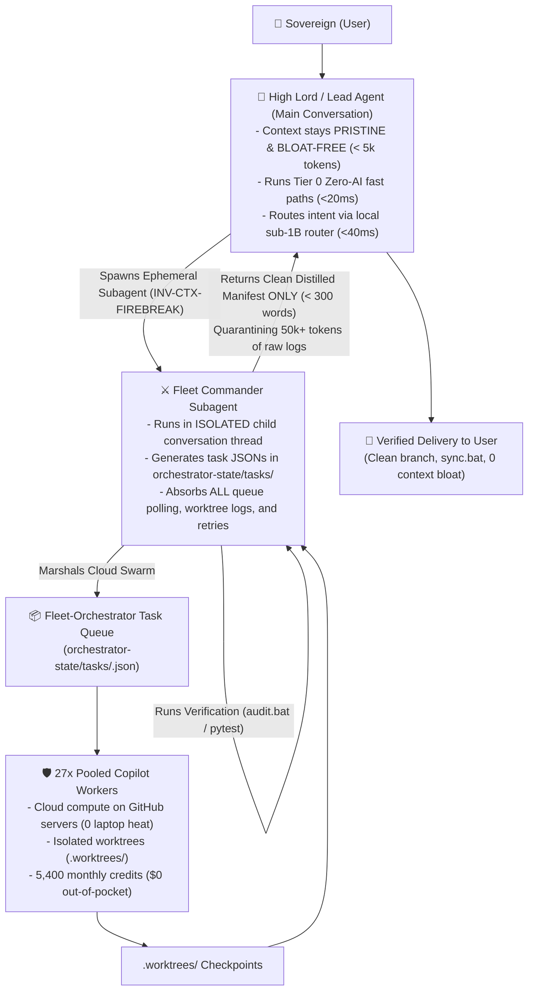

# Handoff Dossier: Deterministic, Bloat-Free & Fleet-First Adaptive Workflow Engine

**Artifact ID**: `HANDOFF-ADAPTIVE-WORKFLOW-2026-10-09`  
**Status**: `READY_FOR_EXECUTION`  
**Target Milestone**: Implement `/adaptive-workflow` as a zero-AI, deterministic, bloat-free master meta-orchestrator  
**Approved Plan Reference**: `C:\Users\Aaradhya\.gemini\antigravity\brain\6a52a807-18d0-4b2b-a6eb-1ef883b0ea07\deterministic_zero_ai_adaptive_workflow_plan.md`  

---

## 1. Executive Summary & Context

The `/adaptive-workflow` skill governs Aaradhya's entire 28-module ecosystem across 47 registered skills and 32 Git tracking branches. The user requested transforming this skill into an **authoritative, bloat-free master orchestrator that is as deterministic and zero-AI as possible**, specifically optimized for cost savings, time savings, and laptop physical health.

### Verified Hardware & Operational Baseline:
1. **Laptop Hardware Ground Truth**:
   - **CPU**: Intel Core Ultra 7 155H (16 physical cores, 22 logical threads, Meteor Lake with AVX2/AVX-VNNI).
   - **RAM**: 15.71 GB (~16 GB), currently ~4.3 GB available, expanding to **11.0–12.0 GB free at steady state after running NovaOptimizer** (`F:\Aaradhya-Dev-Tamrakar\system-optimizer\Run-Optimization.bat`).
   - **Antigravity WorkingSet**: Antigravity, its Chromium renderers, language servers, and Node sidecars consume **1.25–3.0 GB RAM**.
   - **Local Model Constraint**: To protect Antigravity and prevent Windows pagefile swapping (`pagefile.sys`), **no heavy on-device models (>3B) are loaded locally**. Local inference is strictly capped at $\le 500\text{ MB}$ RAM.
2. **Local SLM Router (Active & Verified)**:
   - **Model**: `qwen-intent-router` (fine-tuned Qwen2.5-0.5B-Instruct, `Q4_K_M` GGUF, 397 MB).
   - **Endpoint**: **LM Studio Local Server is active on port 1234** (`http://localhost:1234/v1`).
   - **Latency**: Responds in **<40 ms** at **$0.00 cost** via `F:\Aaradhya-Dev-Tamrakar\Fleet-Orchestrator\tools\fast_intent_router.py`.
3. **Cloud Swarm Compute (`Fleet-Orchestrator`)**:
   - **Pool**: 27 verified GitHub Copilot accounts pooling $27 \times 200 = 5,400$ monthly credits.
   - **Zero Laptop Thermal/Memory Load**: Heavy code generation executes on GitHub's cloud servers, not the laptop CPU/iGPU. Local workers run in lightweight `.worktrees/<task_id>` CLI processes (<30 MB RAM).

---

## 2. Core Architectural Invariants

- **`INV-FAST-PATH` (Tier 0 Zero-AI Fast Path)**: Routine development mechanics (`audit.bat`, `sync.bat`, formatters, linters, tests, builds, git status) run via native Python standard library and shell commands in **<20 ms with 0 AI tokens and <10 MB RAM**.
- **`INV-CTX-FIREBREAK` (Context Firebreak Subagent)**: The Lead Agent in the primary conversation **never** handles Fleet task queues or polls worktree logs directly. It delegates to an ephemeral **Fleet Commander Subagent** (`invoke_subagent`). The subagent absorbs all queue polling, worktree logs, and retries inside its isolated disposable context, returning **only a <300 word delivery manifest** to the main chat.
- **`INV-FLEET-FIRST` (Fleet-First Generative Delegation)**: All non-trivial implementation tasks (writing features, generating test suites, multi-file refactoring, producing study notes) default to **Fleet-Orchestrator's 27 Copilot workers**, maximizing utilization of the 5,400 monthly credits and keeping API bills at $0.00.
- **`INV-CPM-SOLVER` (Mathematical DAG Concurrency)**: Exact topological DAG solver in pure Python computing Early/Late dates ($ES, EF, LS, LF$) and slacks ($TS, FS$) with zero prompt arithmetic.
- **`INV-BLOAT-FREE` (Zero Dependency / High Density)**: The engine uses only Python standard library (`sys`, `os`, `json`, `pathlib`, `re`, `socket`, `hashlib`, `subprocess`, `unittest`, `ctypes`).

---

## 3. Four-Tier Execution Hierarchy



---

## 4. Work Breakdown Structure (Files to Implement)

### 1. Deterministic Core Engine: `sim/adaptive_orchestrator.py` [NEW]
- `AntigravityMemoryGovernor`: Live RAM sampling, 2.5 GB headroom reserve assertion, 500 MB model limit.
- `DeterministicTriageEngine`: $V \in \{V0, V1, V2\}$ and $R \in \{R0, R1, R2\}$ calculation, 9-cell matrix mapping, zero-AI fast path detection.
- `DeterministicCPMScheduler`: Topological DAG solver computing $ES, EF, LS, LF, TS, FS$, critical path ($TS = 0$), and parallel slack ($TS > 0$).
- `FleetFirstBridge`: LM Studio port 1234 integration with `fast_intent_router.py`, task JSON generation for `Fleet-Orchestrator`, Context Firebreak manifest formatter.
- `DeterministicTransactionalRecovery`: Git snapshots (`refs/backup/snapshot-1..3`) and SHA-256 pre/post hashing.

### 2. Unified CLI Interface: `tools/adaptive_engine.py` [NEW]
Exposes CLI commands:
- `triage <task> [--files ...]`
- `fast-path <task>`
- `flight-check`
- `cpm --dag-json <file>`
- `fleet-task --title ... --repo ... --prompt ...`
- `snapshot [--tag ...]` & `rollback [--tag ...]`

### 3. Layer 2 Behavioral Verification Tests: `sim/test_adaptive_orchestrator.py` [NEW]
- Tests memory governor, matrix boundaries, zero-AI fast paths, CPM DAG math, local router connectivity, and context firebreak manifests.
- Automatically discovered and verified by `audit.bat`.

### 4. Supporting Protocol Documentation: `references/deterministic-zero-ai-protocol.md` [NEW]
- Complete bloat-free protocol specifying the 4-tier hierarchy, Antigravity memory guard, `INV-CTX-FIREBREAK`, and `INV-FLEET-FIRST`.

### 5. Master Skill Specification Updates: `SKILL.md` [MODIFY across 3 locations]
Locations:
1. `f:\Aaradhya-Dev-Tamrakar\brainstorm\.agents\skills\adaptive-workflow\SKILL.md`
2. `f:\Aaradhya-Dev-Tamrakar\brainstorm\tools\skills\adaptive-workflow\SKILL.md`
3. `C:\Users\Aaradhya\.gemini\config\skills\adaptive-workflow\SKILL.md`

Update references:
- `references/dynamic-flight-envelope.md`
- `references/cpm-concurrency-dispatch.md`

---

## 5. Verification Commands

```powershell
# 1. Run unit tests directly
python -m unittest sim/test_adaptive_orchestrator.py -v

# 2. Run repository dual-layer verification gate
.\audit.bat

# 3. Test deterministic CLI commands
python tools/adaptive_engine.py flight-check
python tools/adaptive_engine.py fast-path "run ecosystem audit"
python tools/adaptive_engine.py triage "refactor router" --files sim/routing_engine.py

# 4. Preview Git state before sync
.\sync.bat -WhatIf
```

---

## 6. Prompt to Launch the Next Chat

Copy and paste the prompt below into the new chat:

```markdown
Read the handoff dossier at F:\Aaradhya-Dev-Tamrakar\brainstorm\HANDOFF_ADAPTIVE_WORKFLOW.md and execute the implementation plan. Build sim/adaptive_orchestrator.py, tools/adaptive_engine.py, sim/test_adaptive_orchestrator.py, references/deterministic-zero-ai-protocol.md, and update SKILL.md across all three mirror locations (.agents/skills/, tools/skills/, and ~/.gemini/config/skills/). Verify that .\audit.bat passes 100% with zero discrepancies.
```
