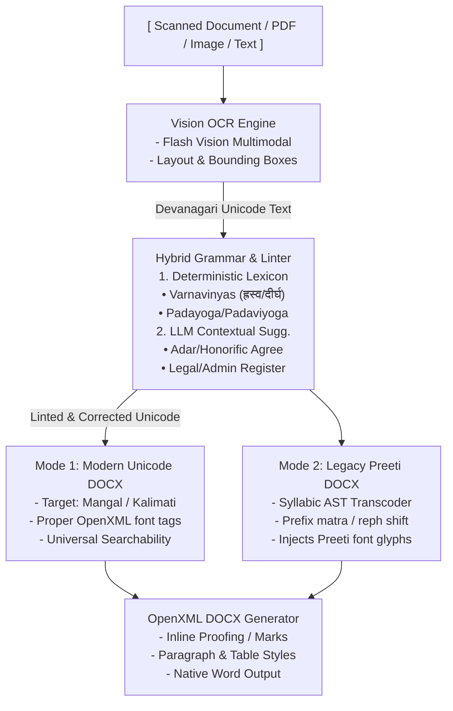
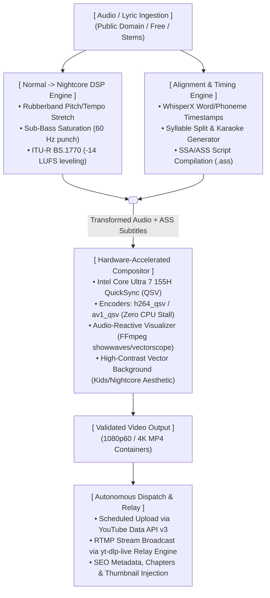
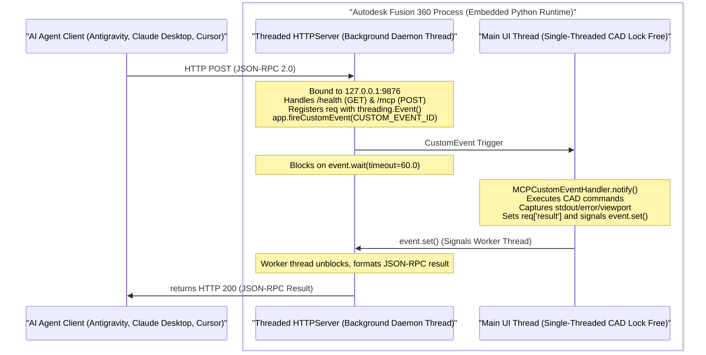
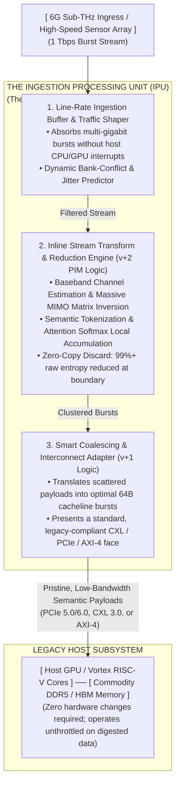
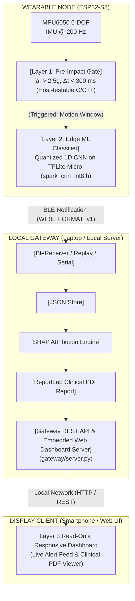
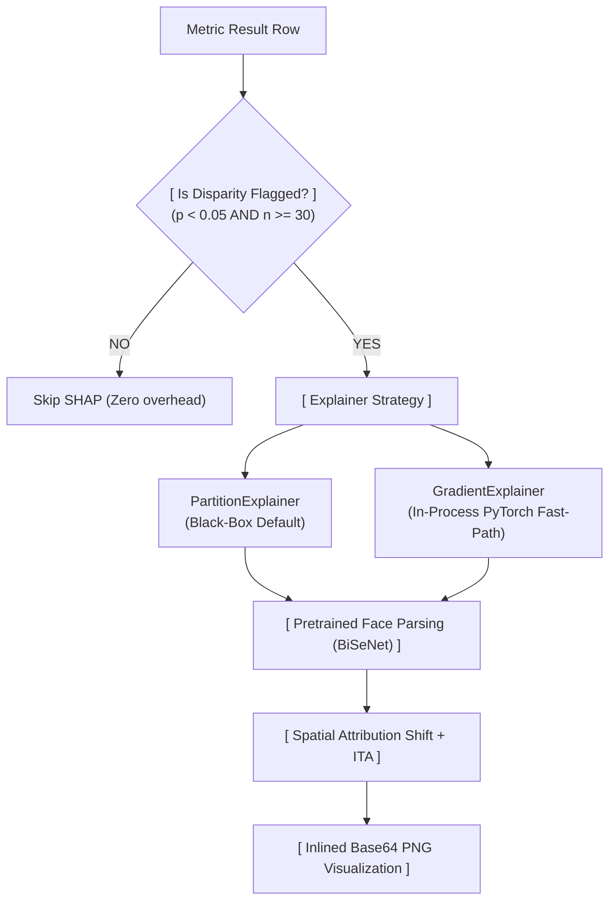
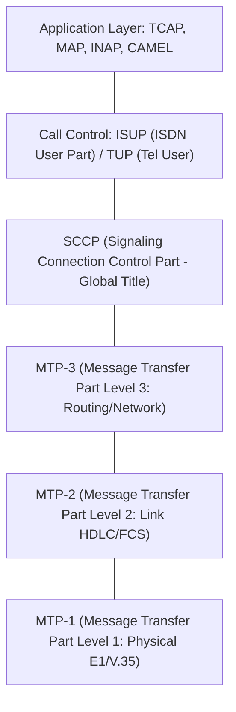
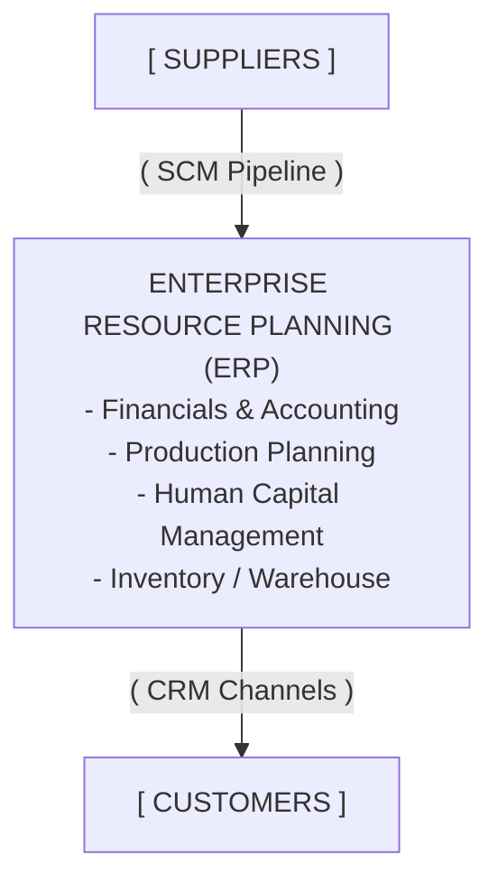

# Mermaid Syntax Review & Conversions

**Reviewer Agent Audit Report**
- Validated node syntax, ensuring labels containing special characters (parentheses, slashes, brackets) are safely enclosed in double quotes (e.g., `id["Label"]`).
- Replaced ASCII multi-line blocks with ` ` inside Mermaid strings for semantic preservation.
- Ensured arrows and relationships correctly model the original ASCII data flow without broken syntaxes.

---

### Target 1: ARCH-SPEC-005 (Lipikaar-AI Pipeline)

### Target 2: ARCH-SPEC-004 (YouTube Transformer Cluster)

### Target 3: ARCH-SPEC-006 (Fusion 360 MCP Bridge)

### Target 4: ARCH-SPEC-002 (IPU System Topology)

### Target 5: SPARK README.md

### Target 6: BiasAperture (Conditional SHAP Pipeline)

### Target 7: super-nlm telecom_guide.md (SS7 Protocol Stack)

### Target 8: super-nlm is_guide.md (ERP, SCM, CRM Matrix)

