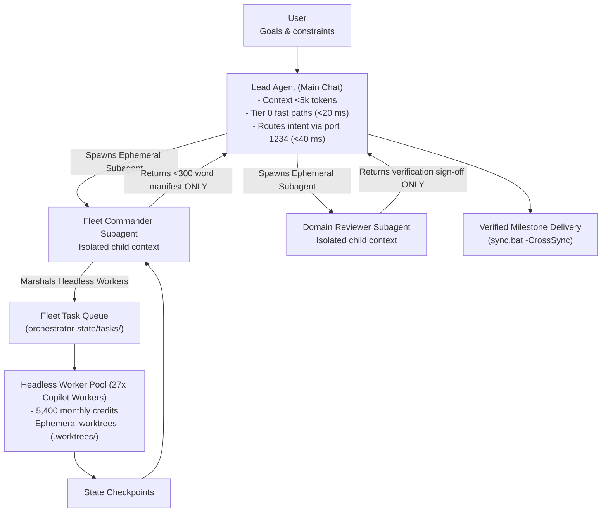

# Adaptive Workflow Orchestrator (`adaptive-workflow`)

Universal meta-orchestrator governing Aaradhya's tool ecosystem (28 modules, 32 tracking branches). Enforces an absolute context firebreak (`INV-CTX-FIREBREAK`), schedules tasks via mathematical Critical Path Method (CPM), marshals the 27-worker Fleet-Orchestrator pool, protects IDE memory via the Antigravity Memory Guard, and guarantees zero-drift deterministic execution across all repositories.

---

## 1. Command Hierarchy & Context Firebreak



### Hierarchy Responsibilities:
1. **Lead Agent**: Triages intent via `python tools/adaptive_engine.py triage`. Runs Tier 0 fast paths instantly ($0 tokens). Solves CPM critical path ($TS = 0$). Never manages queues or polls logs directly; delegates batch workloads to an ephemeral Fleet Commander subagent (`invoke_subagent`), keeping chat history $<5,000$ tokens (`INV-CTX-FIREBREAK`).
2. **Domain Commanders**: Flattened at Depth 1 (no child subagents). Writes task JSONs to `orchestrator-state/tasks/`. Absorbs raw CLI output, logs, and retries. Returns **only a <300 word delivery manifest** to the Lead Agent.
3. **Headless Worker Pool**: 27 pooled accounts executing in `.worktrees/<task_id>`, committing to task branches without polluting `main`.

Protocols: [`references/fleet-command-architecture.md`](references/fleet-command-architecture.md).

---

## 2. 4-Tier Execution Hierarchy & Fast Paths

| Tier | Target Workload | Backend | Cost | Latency / RAM |
| :--- | :--- | :--- | :--- | :--- |
| **Tier 0** | Routine: `audit.bat`, `sync.bat`, lint, test, DAG math, git status | Native Python / shell | **$0.00** | **<20 ms** / **<10 MB** |
| **Tier 1A** | Intent triage, matrix cell routing | `qwen-intent-router` (port 1234) | **$0.00** | **30-50 ms** / **380 MB** |
| **Tier 1B** | Multi-file coding, refactoring, batch tests | `Fleet-Orchestrator` (27 workers) | **$0.00** | Cloud / **<30 MB** |
| **Tier 2** | Interactive conversational reasoning | Gemini 3.8 Flash / Flash-Lite API | **<$0.001** | Sub-second / **0 MB** |
| **Tier 3** | Complex deadlocks after test failure | Claude Opus/Sonnet, Gemini Pro | Standard API | Gated on test failure |

Fast-path triggers: [`references/deterministic-zero-ai-protocol.md`](references/deterministic-zero-ai-protocol.md).

---

## 3. Mathematical CPM Concurrency

Schedule dates, critical paths, and slacks are computed mathematically via pure Python in [`sim/adaptive_orchestrator.py`](../../sim/adaptive_orchestrator.py) with zero prompt arithmetic:

```powershell
python tools/adaptive_engine.py cpm --dag-json path/to/dag.json
```

- **Dates**: $ES_j = \max_{i \in Pred(j)} EF_i$, $EF_j = ES_j + D_j$; $LF_i = \min_{j \in Succ(i)} LS_j$, $LS_i = LF_i - D_i$.
- **Slacks**: Total Slack $TS_i = LF_i - EF_i$; Free Slack $FS_i = \min_{j \in Succ(i)} ES_j - EF_i$.
- **Critical Path**: Tasks with $TS = 0$ (sequential). Parallel branches with $TS > 0$ dispatch concurrently.

Mechanics: [`references/cpm-concurrency-dispatch.md`](references/cpm-concurrency-dispatch.md).

---

## 4. 2D Orthogonal Execution Matrix

Routes tasks by decoupling Workload Volume ($V0 \le 2$, $V1 = 3-15$, $V2 > 15$ files) from Blast Criticality ($R0 \le 0.10$, $R1 = 0.10-0.35$, $R2 > 0.35$):

$$C = \min\left(1.0, \max\left(0.0, \frac{2|D| + |T_{\text{ind}}|}{2(N - 1)}\right)\right), \quad N = 28$$

```powershell
python tools/adaptive_engine.py triage "refactor router" --files sim/routing_engine.py
```

| Cell | Policy | Mechanism | Concurrency |
| :--- | :--- | :--- | :--- |
| **(V0, R0)** | `DIRECT_FAST` | Direct in-turn or Tier 0 fast path | In-turn |
| **(V0, R1)** | `BRANCH_GUARD` | Isolated branch with test gate | 1 subagent |
| **(V0, R2)** | `SURGICAL_LOCK` | Sequential edit with git snapshots | Sequential |
| **(V1, R0)** | `CONCURRENT_LOCAL` | Parallel edits; pre/post SHA-256 | Up to 4 tasks |
| **(V1, R1)** | `STAR_SUBAGENTS` | Disjoint subagents on scratch files | 3 subagents |
| **(V1, R2)** | `DECOUPLED_SLICES` | Micro-PR branches (`split-to-prs`) | Sequential |
| **(V2, R0)** | `FLEET_SWARM` | Fleet-Orchestrator cloud pool | Up to 27 workers |
| **(V2, R1)** | `THROTTLED_FLEET` | Batched sub-PR slices via Fleet | Throttled batch |
| **(V2, R2)** | `STRICT_INTERLOCK` | Halted; requires user confirmation | Blocked |

Matrix reference: [`references/orthogonal-execution-matrix.md`](references/orthogonal-execution-matrix.md).

---

## 5. Memory Guard & Flight Envelope

Protects Antigravity IDE stability and enforces Banker's safety:
- **Reserve Floor**: $2,048\text{ MB}$ free RAM permanently reserved for Antigravity.
- **Worker Concurrency**: $\text{raw\_workers} = \lfloor (\text{Available RAM} - 2048) / 256 \rfloor$.
  - $[2048, 2303]\text{ MB} \implies 0$ workers (strictly preserves reserve).
  - $[2304, 4096]\text{ MB} \implies 1-8$ workers.
- **Rate Governor**: Targets $L_{\text{target}} = 1200\text{ ms}$. Damping factor $\alpha = \max(0.1, \min(1.0, 1.0 - 0.5 e_L))$. On $\ge 2$ rate limit excursions (HTTP 429) within 60s, multiplier $M$ is halved to $\max(0.25, M/2)$ with a 120s recovery window. Successes ramp $M$ by $+0.1$ up to $1.0$.

Envelope reference: [`references/dynamic-flight-envelope.md`](references/dynamic-flight-envelope.md).

---

## 6. Transactional Recovery & Fencing

- **Rolling Snapshots**: `python tools/adaptive_engine.py snapshot --tag <name>` captures recovery refs in `refs/backup/snapshot-1..3`. Rollback: `python tools/adaptive_engine.py rollback --tag <name>`.
- **Pre-Existing File Guard (`INV-PRE-EXIST-GUARD`)**: Backs up pre-existing files to `<git_common_dir>/projection_backups/<task_id>/` outside git tracking, restoring them upon teardown.
- **Orchestrator Fencing (`INV-FENCE-TOKEN`)**: Monotonic integer tokens reject split-brain writes from stale or evicted workers.

Recovery reference: [`references/transactional-recovery.md`](references/transactional-recovery.md).

---

## 7. Supporting References & Verification

- **[`references/historical-provenance.md`](references/historical-provenance.md)**: Baseline lock ($v3.5.0 \to v3.7.0$) and invariant registry.
- **[`references/verification-gates.md`](references/verification-gates.md)**: Verification sequence (`INV-AUDIT-ORDER`) and ecosystem audit standards.
- **[`references/worker-availability-ledger.md`](references/worker-availability-ledger.md)**: Worker exhaustion tracking and 3-to-4 state mapping table.
- **[`references/quota-velocity-acceleration.md`](references/quota-velocity-acceleration.md)**: Credit trading for velocity acceleration.
- **[`references/antigravity-chat-context-injection.md`](references/antigravity-chat-context-injection.md)**: Customization projection into headless workers.
- **[`references/ecosystem-repos.md`](references/ecosystem-repos.md)**: Catalog across all 28 registered tool modules.
- **[`examples/routing-scenarios.md`](examples/routing-scenarios.md)**: Walkthroughs across domain archetypes.
