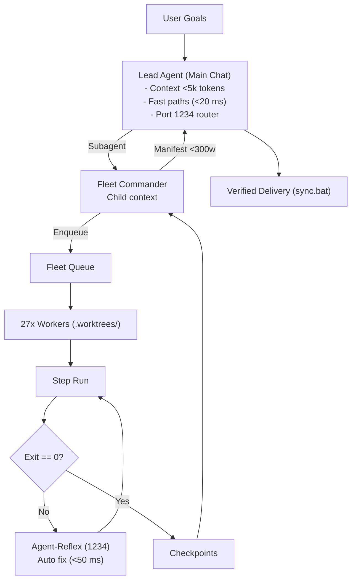

# Adaptive Workflow Orchestrator (`adaptive-workflow`)

Universal meta-orchestrator for Aaradhya's ecosystem (28 modules, 32 branches). Enforces context firebreak (`INV-CTX-FIREBREAK`), solves CPM DAGs mathematically, marshals 27-worker Fleet pool & Colab GPU accelerators, routes 8 domain archetypes with `ai-engineering-fellowship`, and drives Fleet Master Brain (3B/7B) with Agent-Reflex.

---

## 1. Command Hierarchy & Context Firebreak



### Hierarchy Responsibilities:
1. **Lead Agent**: Triage via `adaptive_engine.py triage`. Runs Tier 0 fast paths ($0 tokens). Solves CPM ($TS = 0$). Ephemeral Fleet Commander (`invoke_subagent`), context $<5,000$ tokens (`INV-CTX-FIREBREAK`).
2. **Domain Commanders**: Writes task JSONs to `orchestrator-state/tasks/`. Absorbs logs/retries. Returns **<300w manifest** to Lead.
3. **Headless Workers & Cloud**: 27 accounts in `.worktrees/<task_id>` + `ColabCloudAdapter` (zero local `.ipynb`).
4. **Agent-Reflex**: Intercepts tool errors at port 1234 (`[Error] -> [Fix]`) for sub-second recovery (`INV-AGENT-REFLEX`).

Protocols: [`references/fleet-command-architecture.md`](references/fleet-command-architecture.md).

---

## 2. Multi-Tier Execution Hierarchy & Fast Paths

| Tier | Workload | Backend | Cost | Latency / RAM |
| :--- | :--- | :--- | :--- | :--- |
| **Tier 0** | Routine: `audit.bat`, `sync.bat`, lint, test, DAG math | Shell / Python | **$0.00** | **<20 ms** / **<10 MB** |
| **Tier 1A** | Intent triage, time allocation, matrix routing | `fleet-master-3b` / `qwen-router` | **$0.00** | **30-50 ms** / **380MB–1.8GB** |
| **Tier 1B** | Agent-Reflex self-healing & action prefetch | `fleet-master-3b` (port 1234) | **$0.00** | **<50 ms** / **~1.8 GB** |
| **Tier 1C** | Multi-file coding, batch tasks, test generation | `Fleet-Orchestrator` (27 workers) | **$0.00** | Cloud / **<30 MB** |
| **Tier 1D** | Deep refactoring, test fixes, invariant audits | `fleet-master-7b` ($\ge 8\text{GB}$ RAM) | **$0.00** | **300-800 ms** / **~4.36 GB** |
| **Tier 1E** | Cloud GPU/TPU training, CUDA, remote `.ipynb` | `colab-cloud-accelerator` | Compute units | Cloud VM / **0 MB** |
| **Tier 2** | Interactive conversational reasoning | Gemini 3.8 Flash / Lite | **<$0.001** | Sub-second / **0 MB** |
| **Tier 3** | Complex deadlocks after test failure | Claude Opus, Gemini Pro | Standard API | Gated on failure |

Fast paths: [`references/deterministic-zero-ai-protocol.md`](references/deterministic-zero-ai-protocol.md).
Models: [`references/fleet-master-brain-models.md`](references/fleet-master-brain-models.md).
Reflex: [`references/agent-reflex-and-tool-speculator.md`](references/agent-reflex-and-tool-speculator.md).

---

## 3. Mathematical CPM Concurrency

Schedule dates, critical paths, and slacks are solved in Python in [`sim/adaptive_orchestrator.py`](../../sim/adaptive_orchestrator.py) with zero prompt arithmetic:

```powershell
python tools/adaptive_engine.py cpm --dag-json path/to/dag.json
```

- **Dates**: $ES_j = \max_{i \in Pred(j)} EF_i$, $EF_j = ES_j + D_j$; $LF_i = \min_{j \in Succ(i)} LS_j$, $LS_i = LF_i - D_i$.
- **Slacks**: $TS_i = LF_i - EF_i$; $FS_i = \min_{j \in Succ(i)} ES_j - EF_i$.
- **Critical Path**: Tasks with $TS = 0$ (sequential). Parallel branches with $TS > 0$ dispatch concurrently.

Mechanics: [`references/cpm-concurrency-dispatch.md`](references/cpm-concurrency-dispatch.md).

---

## 4. 2D Orthogonal Execution Matrix

Routes tasks by decoupling Workload Volume ($V0 \le 2$, $V1 = 3-15$, $V2 > 15$ files) from Blast Criticality ($R0 \le 0.10$, $R1 = 0.10-0.35$, $R2 > 0.35$):

$$C = \min\left(1.0, \max\left(0.0, \frac{2|D| + |T_{\text{ind}}|}{2(N - 1)}\right)\right), \quad N = 28$$

```powershell
python tools/adaptive_engine.py triage "refactor router" --files sim/routing_engine.py
```

| Cell | Policy | Mechanism | Concurrency |
| :--- | :--- | :--- | :--- |
| **(V0, R0)** | `DIRECT_FAST` | In-turn or Tier 0 fast path | In-turn |
| **(V0, R1)** | `BRANCH_GUARD` | Isolated branch with test gate | 1 subagent |
| **(V0, R2)** | `SURGICAL_LOCK` | Sequential edit with git snapshots | Sequential |
| **(V1, R0)** | `CONCURRENT_LOCAL` | Parallel edits; pre/post SHA-256 | Up to 4 |
| **(V1, R1)** | `STAR_SUBAGENTS` | Disjoint subagents on scratch files | 3 subagents |
| **(V1, R2)** | `DECOUPLED_SLICES` | Micro-PR branches (`split-to-prs`) | Sequential |
| **(V2, R0)** | `FLEET_SWARM` | Fleet-Orchestrator cloud pool | Up to 27 |
| **(V2, R1)** | `THROTTLED_FLEET` | Batched sub-PR slices via Fleet | Throttled |
| **(V2, R2)** | `STRICT_INTERLOCK` | Halted; requires confirmation | Blocked |

Matrix reference: [`references/orthogonal-execution-matrix.md`](references/orthogonal-execution-matrix.md).

---

## 5. Memory Guard & Flight Envelope

Enforces Antigravity IDE stability and Banker's safety:
- **Reserve Floor**: $2,048\text{ MB}$ free RAM permanently reserved for Antigravity IDE.
- **Worker Concurrency**: $\lfloor (\text{Free RAM} - 2048) / 256 \rfloor$. $[2048, 2303]\text{MB} \implies 0$; $[2304, 4096]\text{MB} \implies 1\text{–}8$.
- **Rate Governor**: Targets $L_{\text{target}} = 1200\text{ms}$. On $\ge 2$ HTTP 429s in 60s, multiplier $M$ halved to $\max(0.25, M/2)$ with 120s recovery window. Successes ramp $M$ by $+0.1$ up to $1.0$.

Envelope reference: [`references/dynamic-flight-envelope.md`](references/dynamic-flight-envelope.md).

---

## 6. Transactional Recovery & Fencing

- **Rolling Snapshots**: `tools/adaptive_engine.py snapshot --tag <name>` (rollback: `rollback --tag <name>`).
- **Pre-Existing File Guard (`INV-PRE-EXIST-GUARD`)**: Backs up pre-existing files to `<git_common_dir>/projection_backups/<task_id>/` outside git tracking, restoring on teardown.
- **Fencing Tokens (`INV-FENCE-TOKEN`)**: Monotonic integer tokens reject split-brain writes from stale workers.

Recovery reference: [`references/transactional-recovery.md`](references/transactional-recovery.md).

---

## 7. Supporting References & Verification

- [`references/skill-matrix.md`](references/skill-matrix.md): 8-archetype routing & fellowship matrix.
- [`references/agent-reflex-and-tool-speculator.md`](references/agent-reflex-and-tool-speculator.md): Agent-Reflex & Tool-Speculator.
- [`references/fleet-master-brain-models.md`](references/fleet-master-brain-models.md): Dual-model (3B/7B), A100 training, Drive retrieval.
- [`references/historical-provenance.md`](references/historical-provenance.md): Baseline lock ($v3.5.0 \to v3.10.0$) & 15 invariants.
- [`references/verification-gates.md`](references/verification-gates.md): Verification sequence (`INV-AUDIT-ORDER`).
- [`references/worker-availability-ledger.md`](references/worker-availability-ledger.md): Worker exhaustion & state mapping table.
- [`references/quota-velocity-acceleration.md`](references/quota-velocity-acceleration.md): Credit trading for velocity.
- [`references/antigravity-chat-context-injection.md`](references/antigravity-chat-context-injection.md): Customization projection to workers.
- [`references/ecosystem-repos.md`](references/ecosystem-repos.md): Catalog of 28 registered tool modules.
- [`examples/routing-scenarios.md`](examples/routing-scenarios.md): Walkthroughs across domain archetypes.
