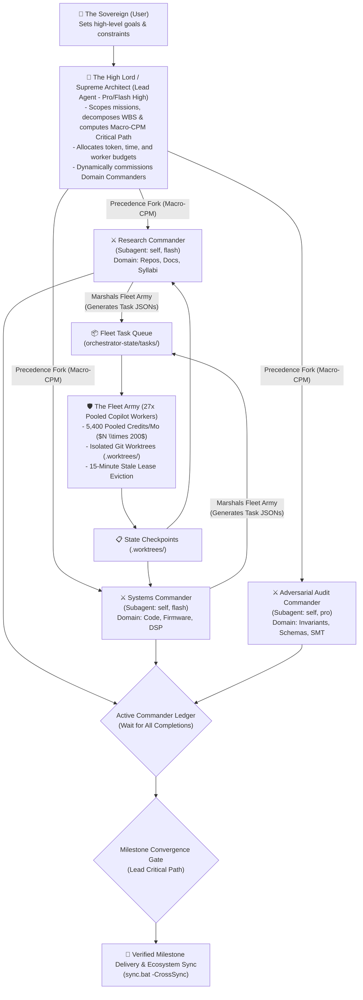

# Adaptive Workflow Orchestrator (`adaptive-workflow`)

This skill defines the universal meta-orchestrator for Aaradhya's multi-tool ecosystem. It operates on the **Sovereign-Commander-Fleet Army** command hierarchy, schedules parallel tasks via **Critical Path Method (CPM)** concurrency, marshals the 27-worker **Fleet-Orchestrator** pool, expands the **Antigravity app scope** into headless workers via live chat and customization projection, governs execution via a **2D Orthogonal Execution Matrix** and **Dynamic Flight Envelope**, leverages **Quota-for-Speed Acceleration** (`TURBO`), monitors burnt-out accounts via the **Worker Availability Ledger**, enforces the **Anthropic Calm Authority** engineering standard, and guarantees zero-drift deterministic execution across all repositories.

---

## 1. The Sovereign-Commander-Fleet Command Hierarchy

Manage complex endeavors through a strict 3-tier division of labor:



### Hierarchy Responsibilities:
1. **Tier 1: The High Lord / Supreme Architect (Lead Agent)**:
   - Evaluates incoming user intent, determines task scale, and builds the WBS.
   - Computes the Macro-CPM Critical Path ($TS = 0$).
   - Spawns Domain Commanders at Depth 1 using `invoke_subagent`.
   - Maintains the Active Commander Completion Ledger; never advances past milestone gates prematurely.
2. **Tier 2: The Domain Commanders (Autonomous Subagents)**:
   - Governed by strict Depth-1 flattening: Commanders do not spawn child AI subagents.
   - Programmatically marshal the **Fleet Army** by generating declarative task JSONs in `Fleet-Orchestrator/orchestrator-state/tasks/`.
   - Keep executive scratch buffers constrained to $\le 1,200$ words per manifest.
3. **Tier 3: The Fleet Army (27 Headless Pooled Workers & Local Microservices)**:
   - 27 verified Copilot accounts (`copilot-w1` through `copilot-w27`) pooling 5,400 AI credits/month.
   - Execute in ephemeral `.worktrees/<task_id>`, committing locally to task branches without polluting `main`.
   - Subject to 15-minute stale lease eviction to prevent queue deadlocks.

```python
# Canonical Commander Dispatch & Completion Ledger Check
def dispatch_and_track_commanders(commanders: list[dict]) -> bool:
    ledger = CompletionLedger(expected_ids=[c["conversation_id"] for c in commanders])
    while not ledger.is_convergence_gate_unlocked():
        event = await_reactive_wakeup()
        ledger.record_completion(event.subagent_id, event.payload)
    return True
```

---

## 2. Dual-Layer CPM Concurrency Scheduling

Apply Critical Path Method principles from [`references/cpm-concurrency-dispatch.md`](references/cpm-concurrency-dispatch.md):

1. **Calculate Float / Slack**:
   $$TS_i = LF_i - EF_i = LS_i - ES_i$$
2. **Critical Path Activities ($TS = 0$)**:
   Linear milestone activities that dictate project completion time. Managed sequentially by the High Lord and the Adversarial Reviewer.
3. **Non-Critical Slack Activities ($TS > 0$)**:
   Activities with positive float whose dependency predecessors are satisfied are eligible for **immediate parallel execution** via concurrent subagents or fleet workers.
4. **Milestone Convergence Invariant**:
   All parallel branches must synchronize and record verified completions in the Active Completion Ledger before the High Lord triggers the convergence gate.

---

## 3. The 2D Orthogonal Execution Matrix

Decouple **Workload Volume ($V$)** from **Blast Criticality ($R$)** using the [2D Orthogonal Execution Matrix](references/orthogonal-execution-matrix.md):

```json
{
  "matrix_lookup": {
    "(V0, R0)": "DIRECT_FAST",
    "(V0, R1)": "BRANCH_GUARD",
    "(V0, R2)": "SURGICAL_LOCK",
    "(V1, R0)": "CONCURRENT_LOCAL",
    "(V1, R1)": "STAR_SUBAGENTS",
    "(V1, R2)": "DECOUPLED_SLICES",
    "(V2, R0)": "FLEET_SWARM",
    "(V2, R1)": "THROTTLED_FLEET",
    "(V2, R2)": "STRICT_INTERLOCK_BLOCKED"
  }
}
```

- **Criticality Score ($C$)**: Computed via Knowledge Graph centrality:
  $$C = \frac{\text{Direct Dependents} + 2 \times \text{Transitive Dependents}}{\text{Total Ecosystem Modules}}$$
- **Safety Interlock**: Cell `(V2, R2)` blocks monolithic edits to foundational schemas; task must be partitioned via `split-to-prs` unless `-ForceMaintainer` is passed.

---

## 4. The Dynamic Flight Envelope (Fly-By-Wire Governor)

During execution, the orchestrator acts as a fly-by-wire flight control computer matching [`references/dynamic-flight-envelope.md`](references/dynamic-flight-envelope.md):

1. **Closed-Loop PID Rate Damping**:
   - Error signal $e(t) = \text{Target Throughput} - \text{API Rate Limit / Latency Penalty}$.
   - If API latency drifts $> 2000\text{ ms}$ or HTTP $429$ rate limits occur, active worker concurrency is automatically halved.
2. **Git Worktree Limiting**:
   - Caps concurrent worktree creation calls to 4 with randomized jitter ($100\text{ms}-1500\text{ms}$) to prevent `.git/index.lock` collisions.
3. **Banker's Resource Safety**:
   - Asserts available host RAM $> 2\text{ GB}$ before claiming new subagents or workers.

---

## 5. Transactional Recovery & Rolling Snapshot Ring Buffer

Treat every execution as a reversible transaction matching [`references/transactional-recovery.md`](references/transactional-recovery.md):

1. **Rolling 3-Snapshot Ring Buffer**:
   - Captures atomic, non-destructive Git checkpoints in `refs/backup/snapshot-1`, `-2`, `-3` prior to file mutations.
2. **Microsecond Rollback**:
   - If any verification gate fails or tests regress, execute an immediate restore:
     ```powershell
     git reset --hard refs/backup/snapshot-1
     ```
3. **Cryptographic Integrity Triage**:
   - Pre/post BLAKE3 hashing via `cyber-forensics` verifies zero collateral file corruption.
4. **15-Minute Stale Lease Eviction**:
   - Hanging workers forfeit their lease at $900\text{s}$, automatically returning tasks to `"pending"` for worker rollover.

---

---

## 6. Quota-for-Speed Acceleration & Burnt-Out Worker Tracking

Trade pooled compute for wall-clock latency reductions matching [`references/quota-velocity-acceleration.md`](references/quota-velocity-acceleration.md) and [`references/worker-availability-ledger.md`](references/worker-availability-ledger.md):

1. **Velocity Profiles (`-Velocity turbo|balanced|economy`)**:
   - **`BALANCED` (Default)**: Moderate fanout ($3 - 4$ workers), balanced credit consumption, standard package slicing.
   - **`TURBO` (Explicit: `-Turbo`, `-Velocity turbo`)**: Maximum horizontal fanout (up to 27 workers), Hyper-Partitioning (1 file per worker), Hedged Speculative Racing, and Optimistic Pipeline Overlapping ($5\times - 10\times$ speedup).
   - **`ECONOMY` (Conservation)**: Throttled sequential execution ($1 - 2$ workers) strictly on the critical path ($TS = 0$).
2. **The Worker Availability Ledger**:
   - Ingests real-time telemetry from `Fleet-Orchestrator/orchestrator-state/live-status/<worker_id>.json`.
   - Classifies workers: `ACTIVE` (`credits_used < 200`), `COOLDOWN` (HTTP 429 rate limit), `EXHAUSTED` (`credits_used >= 200`).
   - Computes real-time **Fleet Health Ratio ($H$)**:
     $$H = \frac{N_{\text{avail}}}{N_{\text{total}}} = \frac{\sum [w.\text{status} = \text{'ACTIVE'}]}{27}$$
3. **Elastic Speedup Modification & Downshifting**:
   - When $H \ge 0.70$ ($N_{\text{avail}} \ge 19$): `FULL_TURBO` allowed.
   - When $0.35 \le H < 0.70$ ($10 \le N_{\text{avail}} < 19$): Clamped to `DAMPED_TURBO` (max 8 workers, hedged racing disabled).
   - When $H < 0.35$ ($N_{\text{avail}} < 10$): Downgraded to `BALANCED_FALLBACK` (2–4 workers).
   - When cooldowns expire (`now >= cooldown_until`), accounts return to `ACTIVE` and concurrency limits automatically elevate.
4. **Silent Rollover Engine**:
   - When an account hits quota or rate limits mid-execution, the orchestrator reclaims the task lease, reassigns it to the next healthy worker, and outputs a single status line:
     ```
     [FLEET-ROLLOVER] Account copilot-wX exhausted (200/200 credits) -> migrating task to copilot-wY (H=0.85)
     ```

---

## 7. Antigravity Scope Expansion & Living Chat Context Injection

`Fleet-Orchestrator` operates as an **extended physical execution runtime of Antigravity itself**, rather than a context-blind headless executor. Ephemeral worktree workers inherit living chat context, approved plans, and governing customization rules:

1. **Context Discovery & Distillation**:
   - The Antigravity bridge (`client/antigravity_bridge.py`) auto-discovers active conversation IDs by scanning `<appDataDir>/brain/`.
   - Extracts session goals, recent user prompts, and active plan artifacts (`plan_*.md`, `walkthrough.md`) within a bounded token budget ($< 1,500$ tokens).
   - Ingests active Antigravity skills, global rules, and repository invariants (`AGENTS.md`, `GEMINI.md`).
2. **Worktree Context Projection**:
   - Injects `TASK_CONTEXT.md` into the root of each ephemeral worktree (`.worktrees/<task_id>`) for transparent tool and search access.
   - Injects `.github/copilot-instructions.md` containing behavioral constraints, calm authority writing standards, and verification requirements.
   - Emits `.antigravity_projected` manifest tracking all ephemerally projected files.
3. **Native CLI Instruction Ingestion**:
   - `CopilotCLIAdapter` dynamically omits `--no-custom-instructions` when `antigravity_scope` is present, allowing `copilot.exe` to natively read repository rules.
   - Prepends an authoritative ASCII session directive header to task prompts.
4. **Pre-Commit Teardown Sanitization**:
   - Prior to staging and committing code in the worktree, `cleanup_worktree_context()` unlinks all projected files.
   - Guarantees authentic, pollution-free Git commit histories (`feat({task_id}): ...`) on feature branches.

---

## 8. The 5-Stage Adaptive Lifecycle

Execute every task through the standardized 5-stage lifecycle matching [`references/lifecycle-stages.md`](references/lifecycle-stages.md):

- **Stage 1 (Scope & Intent Discovery)**: Classify intent into one of seven archetypes; compute Criticality Score ($C$) and assign 2D Matrix cell.
- **Stage 2 (Route & Context Resolution)**: Activate primary/supporting skills from `skill-matrix.md`; check worker readiness and Fleet Health Ratio ($H$) against Flight Envelope.
- **Stage 3 (Plan & Decompose)**: Formulate WBS, select velocity profile (`BALANCED` vs `TURBO`), and select governance track (Track A maintainer vs Track B cohort PR); commit rolling recovery snapshot to `refs/backup/snapshot-1`.
- **Stage 4 (Calibrated Execution & Gate)**: Execute bounded tasks across active workers; monitor Silent Rollover; verify local tests and linters clean; execute microsecond rollback on regression.
- **Stage 5 (Sync & Delivery)**: Rotate snapshot ring buffer; update knowledge graph (`graphify update .`); synchronize via `sync.bat`.

---

## 9. Consolidated Supporting References

Consult these dedicated documents for detailed matrices, protocols, and working walkthroughs:

- **[`references/antigravity-chat-context-injection.md`](references/antigravity-chat-context-injection.md)**: Specifications for Antigravity bridge, worktree context projection, ephemeral instruction injection, and teardown sanitization.
- **[`references/quota-velocity-acceleration.md`](references/quota-velocity-acceleration.md)**: Specifications for Turbo mode, hyper-partitioning, hedged speculative racing, and pipeline overlapping.
- **[`references/worker-availability-ledger.md`](references/worker-availability-ledger.md)**: Burnt-out worker tracking, live-status telemetry schemas, Fleet Health Ratio $H$, and silent rollover.
- **[`references/orthogonal-execution-matrix.md`](references/orthogonal-execution-matrix.md)**: Master 9-cell Matrix, volume/criticality boundaries, and cell isolation policies.
- **[`references/dynamic-flight-envelope.md`](references/dynamic-flight-envelope.md)**: Fly-by-wire telemetry monitoring, PID rate damping, worktree jitter, Banker's safety checks, and velocity downshifting.
- **[`references/transactional-recovery.md`](references/transactional-recovery.md)**: Rolling 3-snapshot ring buffer, instant rollback protocol, BLAKE3 triage, and 15-minute lease eviction.
- **[`references/fleet-command-architecture.md`](references/fleet-command-architecture.md)**: Operational guide for Domain Commanders marshaling the 27-worker Fleet Army in `.worktrees/<task_id>`.
- **[`references/cpm-concurrency-dispatch.md`](references/cpm-concurrency-dispatch.md)**: Mathematical CPM scheduling (Macro vs Micro), slack formulas, and Active Completion Ledger.
- **[`references/ecosystem-repos.md`](references/ecosystem-repos.md)**: Directory of all 27 tool modules (23 computational engines, 4 presentation hubs) and 14 AEC-MCP servers.
- **[`references/calm-authority-writing.md`](references/calm-authority-writing.md)**: Tiers L1 through L5, 10 Invariants, Whiteboard test, and deterministic style auditing via `audit_calm_writing.py`.
- **[`references/cross-tool-chains.md`](references/cross-tool-chains.md)**: 6 high-value cross-repository execution pipelines.
- **[`references/skill-matrix.md`](references/skill-matrix.md)**: Complete archetype lookup table mapping domains to physical repositories, primary skills, and verification commands.
- **[`examples/routing-scenarios.md`](examples/routing-scenarios.md)**: 8 concrete walkthroughs including Commander-marshaled Fleet Army execution and multi-repo synchronization.

---

## 10. Baseline Lock & Historical Provenance

> **Day of Creation & Version Lock Invariant (`INV-EPI-002`)**:
> - **Creation Date**: 2026-10-09
> - **Baseline Lock**: 2026-10-09
> - **Specification Version**: `v3.5.0-locked`
> - **Principal Architect**: Aaradhya Dev Tamrakar
> - **Historical Description**: Locked on 2026-10-09 as the official Day of Creation of the Adaptive Workflow meta-orchestrator. Establishes the authoritative operational baseline governing all 28 personal tool modules, the Sovereign-Commander-Fleet hierarchy, the 2D Orthogonal Execution Matrix, and cross-IDE customization state synchronization.
