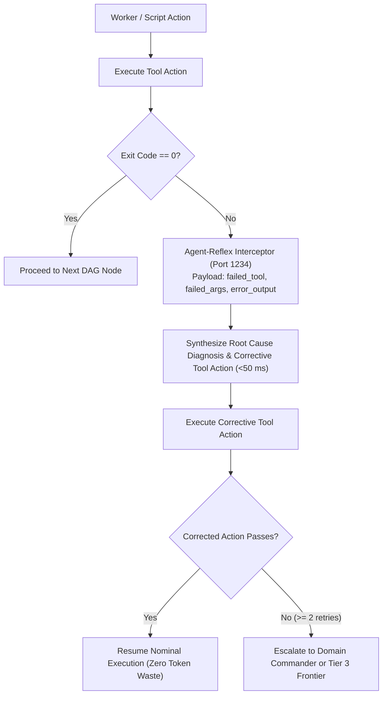

# Agent-Reflex & Tool-Speculator Protocols

This document details the architecture, datasets, and operational protocols for **Agent-Reflex** (autonomous self-healing error recovery) and **Tool-Speculator** (action DAG sequence prediction & cache prefetching), harvested from Antigravity chat histories.

---

## 1. Antigravity Trajectory Harvesting (`harvest_agent_trajectories.py`)

The empirical foundations of Agent-Reflex and Tool-Speculator were extracted from across **504 conversations** (~125 MB JSONL, 45,000+ planner steps, 40,000+ tool executions) in Antigravity brain history (`~/.gemini/antigravity/brain`).

### Extraction Pipeline:
- **Harvester Script**: [`Fleet-Orchestrator/tools/harvest_agent_trajectories.py`](../../../Fleet-Orchestrator/tools/harvest_agent_trajectories.py)
- **Automated Verification**: [`Fleet-Orchestrator/tests/test_harvest_agent_trajectories.py`](../../../Fleet-Orchestrator/tests/test_harvest_agent_trajectories.py) (3 unit tests, 100% pass rate).
- **Sanitization Invariant (`INV-TRAJECTORY-SANITIZE`)**:
  - Replaces absolute host paths (`C:\Users\Aaradhya\...`, `f:\Aaradhya-Dev-Tamrakar\...`) with generalized relative workspace paths.
  - Redacts authorization tokens, OAuth credentials, and sensitive session IDs.
  - Partitions datasets deterministically into 80% train / 20% evaluation splits.

### Harvested Dataset Inventory:

| Dataset | Objective | Samples | Train (80%) | Eval (20%) | Cloud Storage ID |
| :--- | :--- | :--- | :--- | :--- | :--- |
| **Agent-Reflex** | Self-Healing Error Recovery (`[Error] -> [Reasoning + Fix]`) | **2,285** | 1,828 | 457 | [`unified_fleet_train.jsonl`](https://drive.google.com/open?id=1Q3O5pUmJ5A4pZ2Gg5DUMoVHQEz2v-YWA) |
| **Tool-Speculator** | Multi-Step Action Sequence & Cache Prefetching | **1,685** | 1,348 | 337 | [`unified_fleet_train.jsonl`](https://drive.google.com/open?id=1Q3O5pUmJ5A4pZ2Gg5DUMoVHQEz2v-YWA) |
| **Unified Fleet SFT** | Time Allocation + Error Recovery + Sequence Planning | **4,729** | 3,783 | 946 | Permanent Drive ID: `1Q3O5pUmJ5A4pZ2Gg5DUMoVHQEz2v-YWA` |

---

## 2. Agent-Reflex Self-Healing Protocol (`INV-AGENT-REFLEX`)

When a headless worker, test suite, or automation command fails (`exited with code 1`, `ModuleNotFoundError`, syntax errors, or tracebacks), instead of exhausting the primary context or halting execution:



### Canonical Agent-Reflex JSON Schema:
```json
{
  "instruction": "You are Agent-Reflex, an autonomous self-healing error recovery engine for developer agent swarms. Given a failed tool action and its error output, diagnose the failure and output the exact corrective tool action in strict JSON format.",
  "input": "{\"failed_tool\": \"run_command\", \"failed_args\": {\"CommandLine\": \"pytest tests/test_fast_intent_router.py\"}, \"error_output\": \"ModuleNotFoundError: No module named 'fast_intent_router'\"}",
  "output": "{\"diagnosis\": \"Test execution failed because the working directory was not in PYTHONPATH or the file name changed.\", \"recovery_tool\": \"run_command\", \"recovery_args\": {\"CommandLine\": \"python -m pytest tests/test_fast_intent_router.py\"}}"
}
```

---

## 3. Tool-Speculator & Cache Prefetching (`INV-SPECULATIVE-PREFETCH`)

Tool-Speculator predicts the sequence of upcoming actions for a given request:

### Canonical Prediction Schema:
```json
{
  "instruction": "You are an Agentic Tool Speculator. Given a user development request, predict the sequence of tool actions required to fulfill the task in strict JSON format.",
  "input": "anything you'd flag? /plan",
  "output": "{\"tool_sequence\": [\"view_file\", \"view_file\", \"run_command\", \"run_command\", \"run_command\", \"run_command\", \"write_to_file\"]}"
}
```

### Prefetch Pipeline:
1. **Target File Warming**: If `view_file` or `replace_file_content` is predicted, the orchestrator warms file content and reads metadata into local cache in parallel.
2. **Environment Pre-Verification**: If `run_command` (e.g. `pytest`, `audit.bat`) is predicted, python environment and lockfiles are validated before execution begins.
3. **Zero Idle Latency**: Eliminates serial round-trip delays between action specification and tool invocation.
