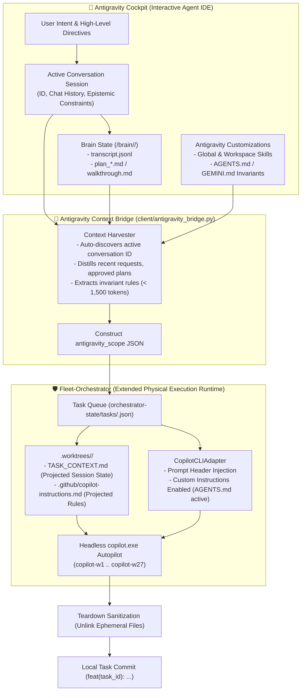

# Antigravity Scope Expansion & Living Chat Context Injection

This document specifies the protocols for extending Antigravity's cognitive app scope, living chat transcripts, active plans, and governing customization rules into [`Fleet-Orchestrator`](file:///F:/Aaradhya-Dev-Tamrakar/Fleet-Orchestrator) and headless worker runtimes.

---

## 1. Unified Runtime Architecture

In the expanded ecosystem model, `Fleet-Orchestrator` does not function as an isolated, context-blind execution sandbox; it serves as the **extended physical execution runtime of Antigravity itself**.

Every headless worker executing inside an ephemeral Git worktree operates under Antigravity's active session state, inheriting the interactive chat's goals, architectural decisions, and customization rules.



---

## 2. The `antigravity_scope` Task Schema

Task payloads enqueued to `orchestrator-state/tasks/<task_id>.json` incorporate the formal `antigravity_scope` object:

```json
{
  "id": "task_20261009_087",
  "kind": "code",
  "spec": "Scaffold dynamic PID rate damping governor in src/rate_limiter.py",
  "status": "pending",
  "antigravity_scope": {
    "chat_context": {
      "conversation_id": "664fca28-933a-496c-9b32-db063b31db99",
      "session_goal": "Expand Antigravity app scope to fleet orchestrator",
      "recent_user_requests": [
        "Also they should be able to utilize the customizations done in antigravity",
        "My mental model is like expanding the antigravity app scope itself to fleet orchestrator",
        "good work >>> fast work"
      ],
      "active_artifacts": [
        {
          "file": "plan_antigravity_fleet_scope_expansion.md",
          "title": "Implementation Plan: Expanding Antigravity App Scope to Fleet-Orchestrator",
          "path": "C:\\Users\\Aaradhya\\.gemini\\antigravity\\brain\\664fca28-933a-496c-9b32-db063b31db99\\plan_antigravity_fleet_scope_expansion.md"
        }
      ]
    },
    "antigravity_customizations": {
      "rules": [
        "Commit Integrity: Never use synthetic or placeholder SHAs; authentic 7-40 hex git commit hashes only.",
        "Version Control: Worktree-local commits authorized; root repo sync must run via sync.bat.",
        "Calm Authority Writing: Follow Anthropic Calm Authority Standard (declarative, zero hype superlatives).",
        "Verification Gate: Local test suite and linters must pass clean before completion.",
        "Worktree Isolation: Confine all file modifications strictly to assigned git worktree."
      ],
      "active_skills": [
        "adaptive-workflow",
        "writing-like-claude",
        "github-workflow",
        "systems-concurrency-harness"
      ],
      "repo_rules_path": "F:\\Aaradhya-Dev-Tamrakar\\brainstorm\\AGENTS.md"
    }
  }
}
```

---

## 3. Worktree Context Projection Protocol

When `copilot_queue_worker.py` claims a task and provisions an isolated Git worktree (`.worktrees/<task_id>`), it projects session state into two physical workspace files:

1. **`TASK_CONTEXT.md` (Workspace Root)**:
   - Contains the human- and model-readable briefing: active Conversation ID, user goal, key decisions, artifact locations, and skill constraints.
   - Accessible to model file-reading tools, grep searches, and child compilation scripts.
2. **`.github/copilot-instructions.md` (Ephemeral Task Instructions)**:
   - Injected into `.worktrees/<task_id>/.github/copilot-instructions.md`.
   - Natively loaded by `copilot.exe` as repository-level instructions, instructing the model on coding conventions, calm authority voice, and verification gates.
3. **Tracking Marker (`.antigravity_projected`)**:
   - A hidden file listing all ephemerally generated projection paths.

---

## 4. Prompt Payload Synthesis & Native Custom Instructions

To ensure zero loss of instructions across different CLI versions or subshell environments:

1. **Prompt Header Injection**:
   The adapter prepends an authoritative ASCII header to the `-p "<prompt>"` payload:
   ```
   ======================================================================
    ANTIGRAVITY SESSION DIRECTIVES & LIVING CHAT CONTEXT
   ======================================================================
   Conversation ID: 664fca28-933a-496c-9b32-db063b31db99
   Session Goal:    Expand Antigravity app scope to fleet orchestrator
   ...
   ======================================================================
   ```
2. **Native Instruction Ingestion**:
   `CopilotCLIAdapter` omits `--no-custom-instructions` when `antigravity_scope` or `AGENTS.md` is present, allowing `copilot.exe` to natively read repository rules without override suppression.

---

## 5. Teardown Sanitization & Commit Integrity Invariant

To preserve clean Git history and prevent ephemeral context artifacts from polluting repository branches:

- **Pre-Commit Unlink**:
  Prior to running `git add -A` and `git commit` in the worktree, `cleanup_worktree_context()` unlinks `TASK_CONTEXT.md`, `.github/copilot-instructions.md`, and `.antigravity_projected`.
- **Pure Code Commit**:
  Only authentic code changes, tests, and target documentation files are staged and committed (`feat({task_id}): automated implementation`).
- **Complete Worktree Prune**:
  Following checkpoint submission, the entire `.worktrees/<task_id>` directory is removed from disk and pruned from git metadata (`git worktree remove --force && git worktree prune`).
