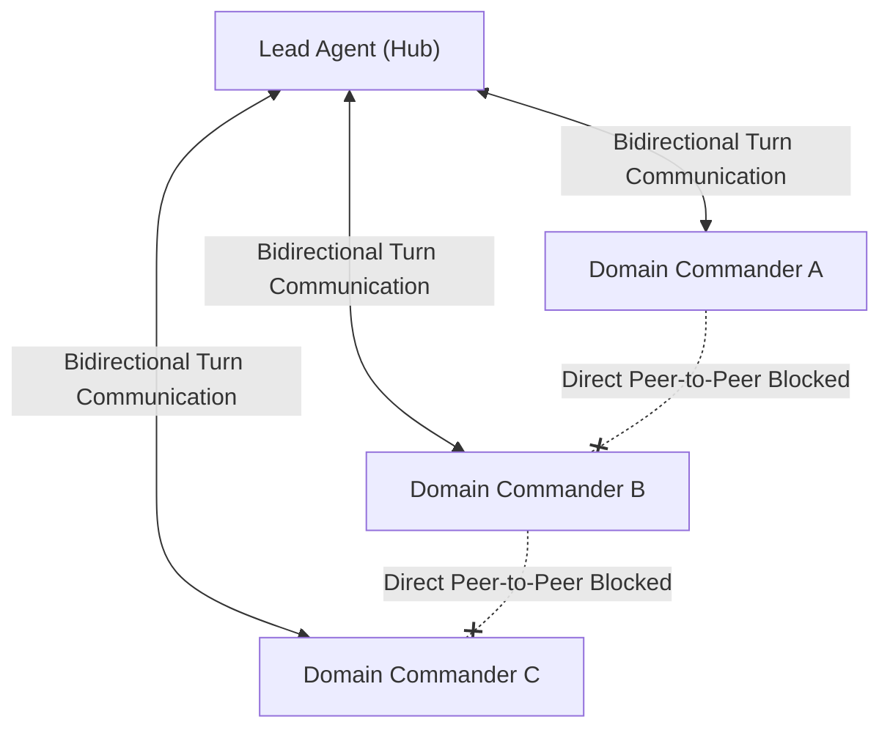

# Critical Path Method (CPM) Concurrency Scheduling

This document details the mathematical scheduling framework and multi-agent dispatch algorithms governing concurrent execution in `adaptive-workflow`.

Derived from **CT 658 (Project Management)** and **CE 615 (Engineering Economics)** in the BE curriculum.

---

## 1. Dual-Layer CPM Architecture

Execution scheduling operates across two distinct hierarchical layers:

1. **Macro-CPM (Lead Agent $\leftrightarrow$ Domain Commanders)**:
   - Governs strategic milestones across major architectural domains.
   - Operated by the Lead Agent using Antigravity's native `invoke_subagent`.
   - Communication follows a strict **Star Network (Hub-and-Spoke)** topology.
2. **Micro-CPM (Domain Commanders $\leftrightarrow$ Headless Workers)**:
   - Governs batch task queues and work package execution across the 27 pooled Copilot workers.
   - Operated by Domain Commanders via task JSONs in `Fleet-Orchestrator/orchestrator-state/tasks/`.

---

## 2. Mathematical Slack Formulas & Concurrency Invariants

### 1. Float / Slack Formulas
For any work package $i$:
- **Early Start ($ES_i$)**: Earliest time an activity can start based on predecessors:
  $$ES_i = \max_{p \in \text{Predecessors}(i)}(EF_p) \quad (\text{or } 0 \text{ if no predecessors})$$
- **Early Finish ($EF_i$)**: $ES_i + \text{Duration}_i$.
- **Project Duration ($T$)**: $T = \max_i(EF_i)$.
- **Late Finish ($LF_i$)**: Latest time an activity can finish without delaying the overall project:
  $$LF_i = \min_{s \in \text{Successors}(i)}(LS_s) \quad (\text{or } T \text{ if no successors})$$
- **Late Start ($LS_i$)**: $LF_i - \text{Duration}_i$.
- **Total Slack ($TS_i$)**:
  $$TS_i = LF_i - EF_i = LS_i - ES_i$$
- **Free Slack ($FS_i$)**:
  $$FS_i = \min_{s \in \text{Successors}(i)}(ES_s) - EF_i \quad (\text{or } T - EF_i \text{ if no successors})$$

### 2. Concurrency Invariants
1. **Critical Path Invariant ($TS = 0$)**:
   Activities with zero total slack dictate the completion milestone. These activities are held tightly and managed sequentially by the Lead Agent and the Adversarial Reviewer.
2. **Concurrency Eligibility Invariant ($TS > 0$)**:
   Any activity with positive slack ($TS > 0$) whose immediate dependency predecessors are fully satisfied is eligible for **immediate parallel execution** via concurrent subagents or fleet workers.
3. **Disjoint Workspace Invariant**:
   Concurrent execution units must never share mutable write targets:
   - Antigravity subagents must write to strictly disjoint scratch files (e.g., `scout_core.md`, `scout_aux.md`, `scout_calm.md`) or branch worktrees (`Workspace: 'branch'`).
   - Fleet workers must execute in isolated `.worktrees/<task_id>` directories.

---

## 3. Deterministic Python DAG Solver (`INV-CPM-SOLVER`)

Rather than hallucinating schedule dates via prompt arithmetic, the engine executes an exact topological sort DAG solver implemented in [`sim/adaptive_orchestrator.py`](../../../../sim/adaptive_orchestrator.py):

```python
from sim.adaptive_orchestrator import DeterministicCPMScheduler

tasks = [
    {"id": "A", "duration": 3, "predecessors": []},
    {"id": "B", "duration": 2, "predecessors": ["A"]},
    {"id": "C", "duration": 4, "predecessors": ["A"]},
    {"id": "D", "duration": 3, "predecessors": ["B", "C"]},
]

schedule = DeterministicCPMScheduler.calculate_schedule(tasks)
# Returns:
#   project_duration: 10.0
#   critical_path: ["A", "C", "D"]  (TS = 0)
#   parallel_slack: ["B"]           (TS = 2.0, FS = 2.0)
```

CLI Invocation:
```powershell
python tools/adaptive_engine.py cpm --dag-json path/to/dag.json
```

### Dynamic Cycle Detection & Diagnostics (`DAGCycleError`)
If a task specification contains circular dependencies (e.g. $A \to B \to A$), Kahn's algorithm topological sort stalls on the unresolved subgraph. Rather than failing with a generic error, the engine executes an iterative DFS back-edge detection pass and raises `DAGCycleError` (subclassing `ValueError`).

The structured error reports:
- **`cycle`**: Exact closed-loop dependency path (e.g. `['Alpha', 'Gamma', 'Beta', 'Alpha']`).
- **`unresolved_tasks`**: Complete list of tasks stalled by the cycle.
- **`remediation`**: Deterministic suggestion identifying which dependency edge to prune to restore acyclic execution.

When invoked via `tools/adaptive_engine.py cpm`, cyclic graphs return a structured JSON diagnostic payload with exit code 1.

---

## 4. The Active Completion Ledger Algorithm

In multi-agent environments, asynchronous child processes report completion independently. If the parent agent wakes up upon the first child completion and advances prematurely, remaining workers are orphaned.

### The Ledger State Machine:
```python
class CompletionLedger:
    def __init__(self, expected_ids: list[str]):
        self.pending = set(expected_ids)
        self.completed = {}

    def record_completion(self, subagent_id: str, payload: dict):
        if subagent_id in self.pending:
            self.pending.remove(subagent_id)
            self.completed[subagent_id] = payload

    def is_convergence_gate_unlocked(self) -> bool:
        return len(self.pending) == 0
```

### Protocol:
1. When dispatching $N$ concurrent subagents via `invoke_subagent`, record all assigned conversation IDs in the ledger.
2. Yield execution to await runtime wakeups.
3. Upon each child message, verify the ID against the ledger.
4. **Halt and yield** if `is_convergence_gate_unlocked() == False`.
5. Only advance to the Milestone Convergence Gate (e.g. Adversarial Review) when `len(pending) == 0`.

---

## 5. Star-Topology Governance Invariant

Subagents in Antigravity cannot horizontally discover or communicate with peer subagents. All horizontal cross-domain coordination must flow through the Lead Agent:



Commanders must synthesize domain findings independently and return them to the Lead Agent, who arbitrates conflicts and enforces global schema invariants.
