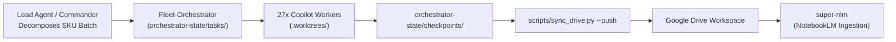
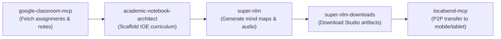
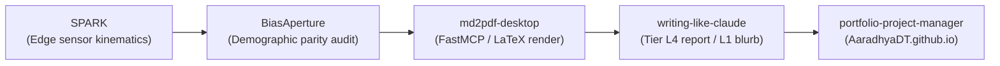
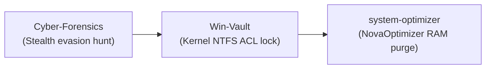
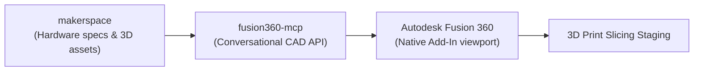
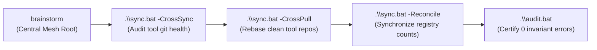
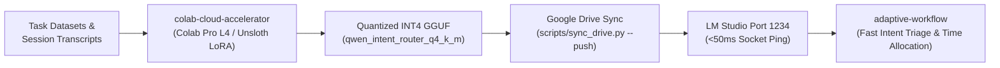
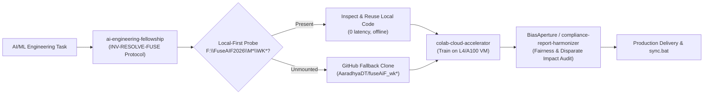

# Standardized Cross-Tool Ecosystem Pipelines

This document specifies the eight canonical cross-repository execution pipelines connecting computational engines, presentation hubs, and utility tools across Aaradhya's ecosystem.

---

## Pipeline 1: Fleet Batch Swarm to Google Drive & NotebookLM

Connects high-throughput autonomous batch generation to living Google Drive manifests and NotebookLM knowledge bases.

### Protocol:
1. Commander constructs declarative task JSON matching `claude_copilot_hybrid_cycle.json` or `iv_ii_course_study_pack.json`.
2. Headless workers claim atomic leases, execute inside ephemeral `.worktrees/<task_id>`, and commit changes to task branches.
3. Upon checkpoint completion, execute `python scripts/sync_drive.py --push` to update cloud drive files while preserving Google Drive `fileId` references.
4. Call `super-nlm.sync_notebooks` to trigger NotebookLM source indexing.

---

## Pipeline 2: Academic & Coursework Knowledge Pipeline

Bridges university curriculum management, assignment tracking, and multimedia study downloads.

### Protocol:
1. Query active assignments via `classroom.list_coursework`.
2. Scaffold semester directory using `academic-notebook-architect` (e.g. `academics/semester-7/`).
3. Sync notes to subject notebook via `super-nlm.query_notebook` or Drive sync.
4. Download generated audio overviews and mind maps using `super-nlm-downloads`.
5. Dispatch files to mobile devices over local Wi-Fi using `localsend-mcp`.

---

## Pipeline 3: Edge AI, Demographics & Calm Publishing

Bridges edge sensor models, demographic bias auditing, publication-grade PDF compilation, and portfolio onboarding.

### Protocol:
1. Generate classification logs or predictions in `SPARK` (`F:\Aaradhya-Dev-Tamrakar\SPARK`).
2. Audit statistical parity and disparate impact in `BiasAperture` (`pytest src/tests/`).
3. Compile technical audit dossier to PDF using `md2pdf-desktop` (`python test_md2pdf.py`).
4. Audit prose against calm authority standards using `audit_calm_writing.py --tier L4`.
5. Onboard project to `F:\AaradhyaDT\AaradhyaDT.github.io` with token-zero link encryption using `portfolio-project-manager`.

---

## Pipeline 4: Windows Host Security & Optimization

Coordinates digital forensics artifact hunting, kernel-level NTFS privacy locks, and OS tuning.

### Protocol:
1. Scan suspect folders for Alternate Data Streams (ADS) and CLSID masquerades:
   `pwsh F:\Aaradhya-Dev-Tamrakar\Cyber-Forensics\tests\test_evasion_hunter.ps1`.
2. Secure sensitive research data or credentials via kernel-level NTFS access denial:
   `.\Vault.bat` in `Win-Vault`.
3. Purge standby memory caches (`EmptyWorkingSet`) and boost foreground thread priorities:
   `.\Run.bat` in `system-optimizer`.

---

## Pipeline 5: Conversational CAD & Physical Fabrication

Bridges physical maker staging, conversational 3D CAD modeling, and parametric slicing.

### Protocol:
1. Read hardware mechanical envelope from `F:\Aaradhya-Dev-Tamrakar\makerspace`.
2. Execute conversational CAD primitives via `fusion360-mcp` (e.g. `create_box`, `create_cylinder`, `extrude_sketch`).
3. Verify viewport rendering and export STL/STEP to fabrication staging.

---

## Pipeline 6: Ecosystem Cross-Sync & Invariant Reconciliation

Executes automated synchronization, inventory accounting, and regression verification across all repositories.

### Protocol:
1. From `F:\Aaradhya-Dev-Tamrakar\brainstorm`, execute `.\sync.bat -CrossSync` to audit branch statuses across discovered repositories.
2. Execute `.\sync.bat -CrossPull` to safely rebase clean sibling repositories.
3. Run `.\sync.bat -Reconcile` to auto-synchronize counts across `ecosystem.registry.json` and documentation.
4. Execute `.\audit.bat` to certify 0 invariant errors across all 27 tool modules.

---

## Pipeline 7: Cloud GPU Acceleration, SLM Fine-Tuning & Edge Intent Routing

Connects transcript dataset harvesting, remote GPU fine-tuning in Google Colab, quantized INT4 GGUF cloud streaming, and local sub-50ms intent and time allocation routing.

### Protocol:
1. Harvest task datasets using `Fleet-Orchestrator/tests/test_harvest_task_time_dataset.py`.
2. Offload LoRA fine-tuning to Colab L4 GPU via `colab run` or `ColabCloudAdapter` using `notebooks/slm_time_router_forge.ipynb` (synced at `colab_train_intent_router`, Drive ID `1xlweNlXJ4maBCfUJVkReZLHMTWwKsYGh`).
3. Export quantized INT4 GGUF model and push to Google Drive via `scripts/upload_large_model_to_drive.py`.
4. Mount locally into LM Studio on port 1234 (`models/qwen_intent_router_q4_k_m.gguf`).
5. Route incoming tasks with sub-50ms latency and dynamic task time allocation.

---

## Pipeline 8: AI Fellowship Curriculum & Golden Reference Architecture Pipeline

Bridges incoming AI/ML engineering requirements with instructor-grade golden blueprints, local repository code (`F:\FuseAIF2026`), Google Colab GPU accelerators, and fairness compliance audits.

### Protocol:
1. When `/adaptive-workflow` triages an `AI_ENGINEERING_ML` task, invoke `ai-engineering-fellowship` to look up relevant week dossiers (`references/weeks/wk*.md`) and SOTA best practices.
2. Resolve code via `INV-RESOLVE-FUSE`: check local path `F:\FuseAIF2026\M{X}\WK{Y}` first; fall back to GitHub remote (`AaradhyaDT/fuseAiF_wk*`) if unmounted.
3. If heavy GPU training is required, offload execution to `colab-cloud-accelerator` (A100/L4 GPU) with automated `runtime.unassign()` teardown.
4. If auditing model fairness or demographic bias, route metrics through `BiasAperture` and format with `compliance-report-harmonizer`.
5. Stage and deliver verified changes via `.\sync.bat`.

