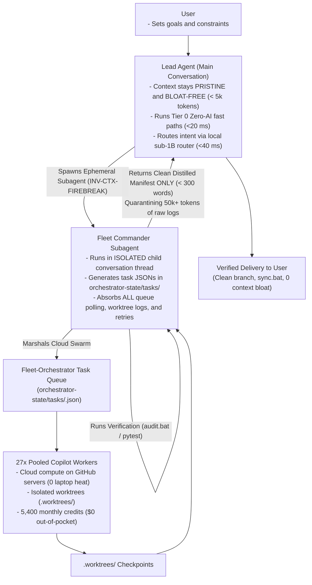

# Deterministic Zero-AI & Fleet-First Adaptive Workflow Protocol

This document defines the formal protocol for the **Deterministic, Zero-AI & Fleet-First Adaptive Workflow Engine** governing Aaradhya's 28-module ecosystem.

---

## 1. Executive Mandate & Architectural Invariants

The `/adaptive-workflow` engine enforces a bloat-free, deterministic execution model engineered to minimize token expenditures, eliminate main-session context bloat, preserve laptop thermal health, and guarantee zero-drift reproducibility.

### Core Invariants:
1. **`INV-FAST-PATH` (Tier 0 Zero-AI Fast Path)**:
   Routine development mechanics (`audit.bat`, `sync.bat`, formatters, linters, tests, builds, git status) run via native Python scripts and shell commands in **<20 ms with 0 AI tokens and <10 MB RAM**.
2. **`INV-CTX-FIREBREAK` (Context Firebreak Subagent)**:
   The Lead Agent in the primary conversation **never** handles Fleet task queues or polls worktree logs directly. It delegates to an ephemeral **Fleet Commander Subagent** (`invoke_subagent`). The subagent absorbs all queue polling, worktree logs, and retries inside its isolated disposable context, returning **only a <300 word delivery manifest** to the main chat.
3. **`INV-FLEET-FIRST` (Fleet-First Generative Delegation)**:
   All non-trivial implementation tasks (writing features, generating test suites, multi-file refactoring, producing study notes) default to **Fleet-Orchestrator's 27 Copilot workers**, maximizing utilization of the 5,400 monthly credits ($0 out-of-pocket).
4. **`INV-CPM-SOLVER` (Mathematical DAG Concurrency)**:
   Topological DAG dependencies and float values ($ES, EF, LS, LF, TS, FS$) are computed using pure mathematical solvers in [`sim/adaptive_orchestrator.py`](../../../../sim/adaptive_orchestrator.py) with zero prompt arithmetic.
5. **`INV-BLOAT-FREE` (Zero Dependency / High Density)**:
   The orchestration engine operates exclusively on the Python standard library with optional `psutil` and native Win32 `ctypes` fallbacks.

---

## 2. Four-Tier Execution Hierarchy



| Tier | Tier Name | Target Tasks | Execution Backend | Cost | Latency / RAM Footprint |
| :--- | :--- | :--- | :--- | :--- | :--- |
| **Tier 0** | **Pure Deterministic Fast Path** | Routine mechanics: `audit.bat`, `sync.bat`, formatters, linters, tests, DAG math, git status | Native Python scripts & shell commands | **$0.00** | **<20 ms** latency<br>**<10 MB** RAM |
| **Tier 1A** | **Ultralight Local SLM Router** | Intent classification, matrix cell triage, skill routing | `qwen-intent-router` (494M, 380 MB RAM on LM Studio port 1234) | **$0.00** | **30–50 ms** latency<br>**380 MB** RAM (safe for Antigravity) |
| **Tier 1B** | **Fleet-First Cloud Swarm via Subagent** | Multi-file coding, refactoring, feature builds, test generation, study packs | `Fleet-Orchestrator` 27 pooled Copilot workers supervised by **Fleet Commander Subagent** | **$0.00** (pooled credits) | Cloud compute<br>**<30 MB** local CLI RAM<br>**0** main context bloat |
| **Tier 2** | **Frugal Cloud API** | Single-turn conversational reasoning, interactive architectural queries | Gemini 3.8 Flash / Flash-Lite API | **<$0.001** | Sub-second latency<br>**0 MB** local RAM |
| **Tier 3** | **Frontier Cloud Escalation** | Complex architectural deadlocks verified by test failure | Claude Opus/Sonnet, Gemini Pro | Standard API | Gated on verified failure |

---

## 3. Hardware & Antigravity Memory Guard Invariants

1. **Hardware Baseline**:
   - **CPU**: Intel Core Ultra 7 155H (16 physical cores, 22 logical threads).
   - **RAM**: 16 GB (~15.71 GB physical).
   - **NovaOptimizer Steady State**: 11.0–12.0 GB free RAM (`Run-Optimization.bat`).
2. **Antigravity WorkingSet Protection**:
   - Minimum free RAM reserve: $\ge 2,048\text{ MB}$ asserted before intensive operations.
   - If free RAM drops below $4,096\text{ MB}$, the governor flags warning band throttling (`WARNING_BAND_THROTTLED`).
3. **Local Model Ceiling ($\le 500\text{ MB}$)**:
   - To prevent Windows pagefile thrashing (`pagefile.sys`), local inference is strictly restricted to models $\le 500\text{ MB}$ (such as `qwen-intent-router` at 397 MB).
   - Monolithic local models (>3B) are strictly forbidden on-device.

---

## 4. Deterministic Zero-AI Fast Paths Table

When a user or agent prompt matches routine development mechanics, bypass generative LLM completion and execute directly:

| Action Category | Trigger Patterns | Deterministic Command | Tokens | Latency | RAM |
| :--- | :--- | :--- | :--- | :--- | :--- |
| **Audit & Invariants** | `audit`, `reconcile`, `verify repo`, `check invariants` | `.\audit.bat` | **0** | <20 ms | <10 MB |
| **Version Control Sync** | `sync`, `push`, `pull`, `commit` | `.\sync.bat` | **0** | <20 ms | <10 MB |
| **Regression Tests** | `test`, `pytest`, `unittest`, `test suite` | `python -m unittest` | **0** | <20 ms | <10 MB |
| **Linting & Formatting** | `format`, `lint`, `ruff` | `ruff check .` | **0** | <20 ms | <10 MB |
| **Repository Status** | `git status`, `status` | `git status` | **0** | <20 ms | <10 MB |
| **Simulation Sanity** | `sim`, `simulation`, `run sim` | `.\sim.bat` | **0** | <20 ms | <10 MB |
| **Dossier Compilation** | `build report`, `compile report`, `report.pdf` | `.\build_report.bat` | **0** | <20 ms | <10 MB |

---

## 5. The Context Firebreak Subagent Protocol (`INV-CTX-FIREBREAK`)

To prevent conversation history inflation from 5,000 to 100,000+ tokens during batch tasks:

1. **Lead Agent Directive**:
   - The Lead Agent invokes an ephemeral child subagent (`Role: 'Fleet Commander'`, `TypeName: 'self'`).
2. **Subagent Execution Sandbox**:
   - The subagent creates task JSONs in `Fleet-Orchestrator/orchestrator-state/tasks/`.
   - The subagent polls worktree status, monitors worker leases, and absorbs stdout/stderr logs.
   - The subagent runs local verification (`audit.bat`, `pytest`).
3. **Delivery Manifest Return (<300 Words)**:
   - The subagent synthesizes its findings into a strictly bounded executive manifest:
   ```markdown
   ### Fleet Delivery Manifest: TASK-123456-AST-PARSER
   - **Title**: Refactor AST Parser
   - **Governance**: Certified under INV-CTX-FIREBREAK (<300 words executive summary)
   - **Verification**: [PASS] (Zero-discrepancy gate)
   - **Files Modified (3)**:
     - `parser.py`
     - `tokens.py`
     - `ast.py`
   - **Commit SHA**: `a1b2c3d4`
   - **Executive Notes**: Implemented token-efficient AST traversal; verified 100% test pass.
   ```
4. **Primary Chat Purity**:
   - The primary chat context remains <5k tokens, ensuring sub-second response times and ultra-low cost for all future interactions.

---

## 6. CLI Usage & Verification Commands

```powershell
# 1. Antigravity Memory Guard Flight Check
python tools/adaptive_engine.py flight-check

# 2. Fast Path Zero-AI Detection
python tools/adaptive_engine.py fast-path "run repository audit"

# 3. 2D Matrix Volume & Criticality Triage
python tools/adaptive_engine.py triage "refactor routing engine" --files sim/routing_engine.py

# 4. Critical Path Method (CPM) DAG Solver
python tools/adaptive_engine.py cpm --dag-json path/to/dag.json

# 5. Declarative Fleet Task Generation
python tools/adaptive_engine.py fleet-task --title "Refactor Parser" --repo brainstorm --prompt "..."

# 6. Atomic Git Recovery Snapshot & Rollback
python tools/adaptive_engine.py snapshot --tag pre-refactor
python tools/adaptive_engine.py rollback --tag pre-refactor
```
