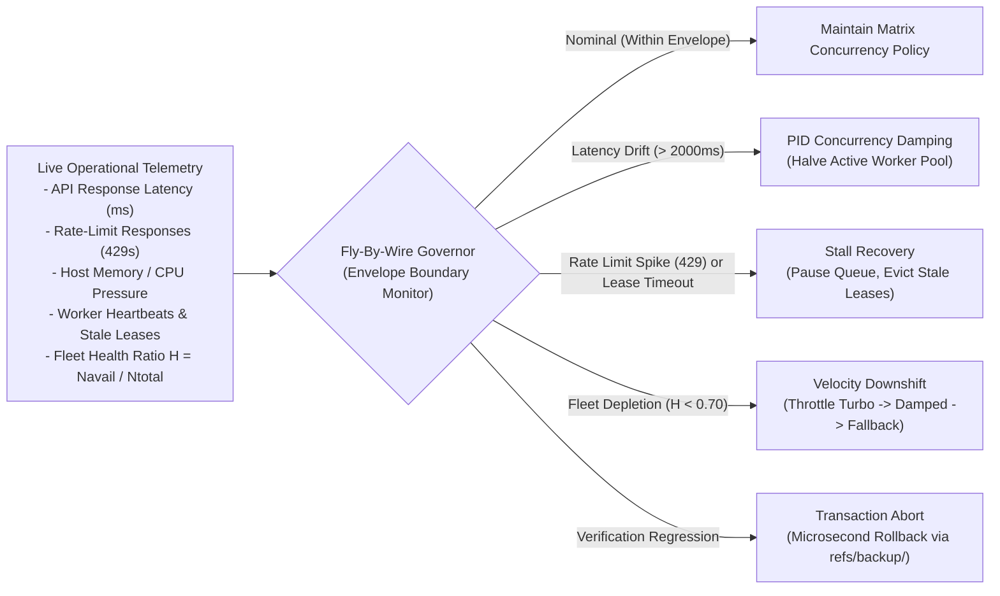

# The Dynamic Flight Envelope & Fly-By-Wire Governor

This document specifies the operational protocols for the **Dynamic Flight Envelope**, the real-time concurrency and safety governor for [`adaptive-workflow`](../SKILL.md).

Derived from **EX 509 (Control System)**, **CT 612 (Operating System)**, and **CT 658 (Project Management)** in the BE ECIE curriculum.

---

## 1. Flight Envelope Concept & Architecture

While the 2D Orthogonal Execution Matrix defines static policy limits, runtime conditions (API latency, host RAM, rate limits) fluctuate continuously. The **Dynamic Flight Envelope** acts as an avionics-style fly-by-wire governor, monitoring live operational telemetry to restrict concurrency and prevent environmental thrashing.



---

## 2. Telemetry Channels & Envelope Boundaries

The governor ingests telemetry across five continuous channels:

| Telemetry Channel | Nominal Boundary | Warning Threshold | Envelope Excursion Limit | Governor Action |
| :--- | :--- | :--- | :--- | :--- |
| **API Call Latency** | $\le 1200\text{ ms}$ | $1200 - 2500\text{ ms}$ | $> 2500\text{ ms}$ | Step down concurrency via PID damping ($K_d$) |
| **HTTP 429 Rate Limits** | 0 responses | 1 response / 60s | $\ge 2$ responses / 60s | Pause queue dispatch for 60s; halve pool |
| **Host System RAM** | $> 4\text{ GB}$ available | $2 - 4\text{ GB}$ available | $< 2\text{ GB}$ available | Block new worktrees via Banker's algorithm |
| **Worker Lease Age** | $< 300\text{ s}$ | $300 - 600\text{ s}$ | $> 900\text{ s}$ | Stale lease eviction; task rollover |
| **Fleet Health Ratio ($H$)** | $H \ge 0.70$ ($N_{\text{avail}} \ge 19$) | $0.35 \le H < 0.70$ ($10 \le N_{\text{avail}} < 19$) | $H < 0.35$ ($N_{\text{avail}} < 10$) | Throttle velocity profile; disable speculative racing |

---

## 3. Closed-Loop PID Concurrency Regulation

When operating in `STAR_SUBAGENTS` or `FLEET_SWARM`, the active concurrency pool $u(t)$ is continuously regulated using PID feedback:

$$u(t) = K_p \, e(t) + K_i \int_0^t e(\tau)\,d\tau + K_d \, \frac{de(t)}{dt}$$

Where:
- **Error Signal $e(t)$**: $\text{Target Throughput} - \text{Observed API Rate/Latency Penalty}$.
- **Proportional Term ($K_p = 0.6$)**: Scaled response to instantaneous backlog growth.
- **Integral Term ($K_i = 0.1$)**: Clears steady-state queue backlogs over time.
- **Derivative Term ($K_d = 0.3$)**: Dampens rate-of-change spikes, preventing overshooting worker allocations when rate limits approach.

### Envelope Damping Rules:
1. If an HTTP 429 rate limit is encountered, the derivative term immediately forces $u(t) \leftarrow \max(1, \lfloor u(t) / 2 \rfloor)$.
2. The governor maintains the reduced allocation until telemetry reports zero errors for at least 120 seconds.
3. Concurrency is restored gradually ($+1$ worker per successful batch checkpoint).

---

## 4. Banker's Deadlock Avoidance Validator

Before allocating resources for additional subagents or claiming new Git worktrees, the orchestrator executes the Banker's safety check matching [`systems-concurrency-harness`](file:///C:/Users/Aaradhya/.gemini/config/skills/systems-concurrency-harness):

```python
def is_safe_allocation(available_ram_mb: int, active_worktrees: int, requested_workers: int) -> bool:
    """
    Banker's Algorithm Safety Check for Host Resources.
    Guarantees that claiming new workers will not exhaust host resources.
    """
    RAM_PER_WORKER_MB = 256
    MAX_CONCURRENT_WORKTREES = 4
    MIN_HEADROOM_RAM_MB = 2048

    if active_worktrees + requested_workers > MAX_CONCURRENT_WORKTREES:
        return False
    
    projected_ram = available_ram_mb - (requested_workers * RAM_PER_WORKER_MB)
    return projected_ram >= MIN_HEADROOM_RAM_MB
```

If the safety check returns `False`, worker dispatch is queued until active worktrees complete and deallocate.

---

## 5. Earned Value Management (EVM) Velocity Monitoring

Milestone progress within the flight envelope is audited via EVM metrics matching [`pm-workflow-orchestrator`](file:///C:/Users/Aaradhya/.gemini/config/skills/pm-workflow-orchestrator):

- **Cost Performance Index ($CPI = EV / AC$)**: Efficiency of token and credit expenditure.
- **Schedule Performance Index ($SPI = EV / PV$)**: Progress velocity against planned WBS schedule.

### Velocity Intervention Gates:
- **$CPI < 0.80$**: Token consumption is 25% higher than budgeted deliverables. The governor pauses execution and prompts for scope verification.
- **$SPI < 0.70$**: Subagents or fleet workers are falling significantly behind schedule. The governor evaluates worktree logs for deadlocks and triggers lease rollbacks.

---

## 6. Dynamic Velocity Downshifting & Quota Protection Rules

To prevent rapid exhaustion of the pooled 5,400 monthly credits and maintain mission stability, the flight governor enforces automatic velocity downshifting based on the Fleet Health Ratio ($H$):

1. **Downshift from `FULL_TURBO` to `DAMPED_TURBO` ($H < 0.70$)**:
   - Triggered when more than 8 workers are in cooldown or exhausted ($N_{\text{avail}} < 19$).
   - Concurrency ceiling drops to $\min(N_{\text{avail}}, 8)$.
   - Hedged speculative racing is disabled to preserve quota.
   - Slicing shifts from atomic 1-file packages to 2–3 files per worker.
2. **Downshift to `BALANCED_FALLBACK` ($H < 0.35$)**:
   - Triggered when fewer than 10 active workers remain.
   - Concurrency ceiling is clamped to 2–4 workers.
   - Tasks execute sequentially across non-critical slack branches; speculative racing remains blocked.
3. **Emergency Downgrade to `ECONOMY` ($H < 0.15$)**:
   - Triggered when fewer than 4 active workers remain.
   - Concurrency is restricted to 1 sequential worker executing only critical-path ($TS = 0$) milestones.
4. **Resurgence Lift**:
   - As cooldown timers expire and accounts return to `ACTIVE` state, the governor recalculates $H$.
   - When $H \ge 0.70$, full `TURBO` capacity is automatically restored for subsequent work packages without manual reconfiguration.
