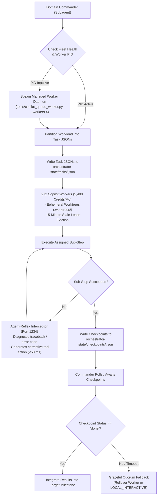

# Fleet Command Architecture: Marshaling the 27-Worker Swarm

This document specifies the operational protocols for Domain Commanders marshaling the **Fleet-Orchestrator pool** (`F:\Aaradhya-Dev-Tamrakar\Fleet-Orchestrator`) to execute high-volume, batch, or long-running tasks in parallel.

---

## 1. The Commander-to-Fleet Marshalling Model (`INV-CTX-FIREBREAK`)

In the Lead-Commander-Worker command hierarchy, the Lead Agent delegates execution-heavy tasks to ephemeral Domain Commanders (`invoke_subagent`). Domain Commanders marshal the headless Copilot worker pool rather than executing hundreds of repetitive steps in-turn. The subagent absorbs all queue polling, worktree logs, and retries, returning **only a <300 word executive manifest** back to the primary chat (`INV-CTX-FIREBREAK`).



---

## 2. Multi-Provider Adapter Mesh & Fleet Health

Fleet-Orchestrator aggregates heterogeneous compute providers into a unified execution mesh:
- **Fleet Master Brain (Local SLM Mesh)**: `fleet-master-3b` (1.8 GB Q4_K_M Daily Driver) and `fleet-master-7b` (4.36 GB Q4_K_M Powerhouse) serving on port 1234 for sub-50ms intent triage, task duration allocation, and Agent-Reflex self-healing.
- **Copilot CLI Workers**: 27 verified accounts (`copilot-w1` through `copilot-w27`) pooling $27 \times 200 = 5,400\text{ AI credits/month}$.
- **Copilot Headless REST**: Low-overhead asynchronous HTTP REST adapter (~15 MB RAM per worker).
- **Claude Desktop CDP**: Chrome DevTools Protocol adapter for adversarial QA review and architectural arbitration.
- **Gemini 3.8 Flash API**: High-speed contextual analysis via `google-genai` SDK v2.25.0.
- **Groq & Ollama Local**: Zero-latency classification and lightweight format translation.
- **ColabCloudAdapter (`client/adapters/colab_adapter.py`)**: Remote execution on Google Colab GPU (NVIDIA T4, L4 24GB, A100) and TPU (v5e/v6e) runtimes for heavy ML fine-tuning (`fleet_master_brain_forge.ipynb`), CUDA compilation, and notebook pipelines.
- **Credential Isolation**: Separate session home directories under `C:\Users\Aaradhya\.copilot-workers\worker_<N>_<username>`.

### Fleet Health Verification Commands:
```powershell
python "F:\Aaradhya-Dev-Tamrakar\Fleet-Orchestrator\tools\copilot_fleet.py" status
colab whoami                                    # Verify Colab OAuth2 / ADC credentials
pytest "F:\Aaradhya-Dev-Tamrakar\Fleet-Orchestrator\tests\"  # 207 automated tests (100% pass rate)
```
*Empirical Verification*: Confirmed 27/27 active ready Copilot workers and authenticated Google Colab cloud gateway (`aaradhyadevtmr@gmail.com`, quota project `agent-valley-2610`).

---

## 3. Task Schema & Enqueue Protocol

Commanders generate declarative task JSONs and write them directly into `F:\Aaradhya-Dev-Tamrakar\Fleet-Orchestrator\orchestrator-state\tasks\<task_id>.json`.

### Canonical Task Schema (with Antigravity Scope Projection):
```json
{
  "task_id": "task_20261009_batch_001",
  "sku_id": "claude_copilot_hybrid_cycle",
  "status": "pending",
  "priority": 1,
  "created_at": "2026-10-09T12:00:00Z",
  "lease_timeout_seconds": 900,
  "target_repo": "F:\\Aaradhya-Dev-Tamrakar\\SPARK",
  "pipeline": ["plan", "code", "qa_review"],
  "spec": {
    "objective": "Scaffold edge sensor calibration fixtures for IMU telemetry",
    "target_files": ["src/sensors/calibration.py", "tests/test_calibration.py"],
    "constraints": [
      "Strict type annotations on all exported methods",
      "100% pytest pass rate required before checkpoint write",
      "Confine all modifications to isolated git worktree"
    ]
  },
  "antigravity_scope": {
    "chat_context": {
      "conversation_id": "664fca28-933a-496c-9b32-db063b31db99",
      "session_goal": "Scaffold edge sensor calibration fixtures",
      "recent_user_requests": ["Ensure zero placeholder SHAs and verify tests clean"],
      "active_artifacts": [{"file": "plan_sensor_calibration.md", "title": "Sensor Calibration Plan"}]
    },
    "antigravity_customizations": {
      "rules": ["Commit integrity enforced", "Calm writing standard", "Isolated worktree commits"],
      "active_skills": ["embedded-firmware-scaffold", "dsp-signal-engine"],
      "repo_rules_path": "F:\\Aaradhya-Dev-Tamrakar\\SPARK\\AGENTS.md"
    }
  }
}
```

When claimed, `copilot_queue_worker.py` projects `antigravity_scope` into `TASK_CONTEXT.md` and `.github/copilot-instructions.md` within `.worktrees/<task_id>/`, allowing the headless worker to natively ingest active session directives.

---

## 4. Hardened Invariants for Fleet Operations

### Invariant 1: 15-Minute Stale Lease Eviction
If a headless worker crashes or hits an API timeout, tasks must not remain permanently locked:
- Tasks claimed by a worker acquire an atomic lease token and timestamp.
- If a task remains in `"claimed"` state for $> 900\text{ seconds}$ without an updated checkpoint, the scheduler automatically revokes the lease, logs a timeout fault, and resets the task to `"pending"` for worker rollover.

### Invariant 2: Lock-Free Worktree Spawning (`.git/index.lock` Protection)
- To prevent Git index collisions when multiple workers spawn concurrently, worktree additions must use randomized backoff retry jitter (100ms–1500ms).
- Simulataneous `git worktree add` operations are throttled to a maximum of 4 concurrent calls, while execution within established worktrees runs 27-wide in parallel.

### Invariant 3: Worktree Local Commit Authorization
- While repository rules mandate `.\sync.bat` for primary branch commits, headless workers executing inside ephemeral `.worktrees/<task_id>` are explicitly authorized to make local `git commit` calls to their task-specific branches.
- The final integration merge of finished task branches into `main` must strictly run through `.\sync.bat`.

### Invariant 4: Multi-Repo Confirmation Interlock ("Red Button")
- If a Commander plans a batch dispatch modifying files across $> 1$ repository:
  1. The Commander must output an **Execution Manifest Preview** (target repositories, file count, estimated credit burn).
  2. The Commander must pause and request user confirmation before writing task JSONs into the queue.

### Invariant 5: Strict VM Lifecycle & Non-TTY Cloud Execution (`INV-COLAB-LIFECYCLE`)
- All Colab tasks routed via `ColabCloudAdapter` or `colab-cloud-accelerator` must run non-interactively (`colab exec` with piped stdin or `colab run` with forwarded file args).
- Never invoke interactive TTY commands (`colab console`, `colab repl`, `colab drivemount`) inside automated worker daemons or headless agent turns.
- Rented VMs must be torn down immediately upon task completion (`colab stop -s <name>` in a strict finally block) to eliminate compute unit burn.
- Jupyter Notebook Invariant: Notebooks (`.ipynb`) are executed exclusively in the cloud via Google Colab, never headlessly on the local host.

---

## 5. Google Drive, Colab Notebooks & NotebookLM Synchronization

Deliverables and model pipelines in `Fleet-Orchestrator` sync directly with Google Drive folder `1wGq53okV7ZaFGSw2fWilEfxL4FEIVeIF` while preserving file IDs:
```powershell
python "F:\Aaradhya-Dev-Tamrakar\Fleet-Orchestrator\scripts\sync_drive.py" --push
```
- **Tracked Training Notebook**: [colab_train_intent_router](https://colab.research.google.com/drive/1xlweNlXJ4maBCfUJVkReZLHMTWwKsYGh) (ID: `1xlweNlXJ4maBCfUJVkReZLHMTWwKsYGh`) mirrored at `notebooks/slm_time_router_forge.ipynb`.
- **GGUF Model Artifacts**: Quantized model binaries (`qwen_intent_router_q4_k_m.gguf`) stream to Google Drive via resumable chunked upload (`upload_large_model_to_drive.py`) with zero Git repository bloat.

