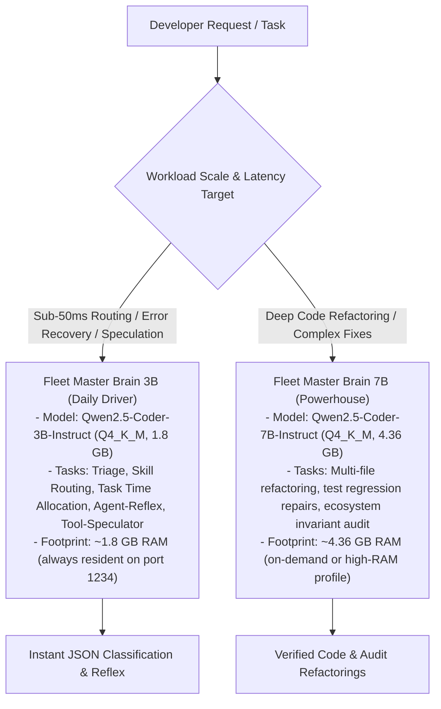

# Fleet Master Brain: Dual-Model Local SLM Architecture

This document defines the dual-model hierarchy, training specifications, cloud persistence, and local serving protocols for the **Fleet Master Brain** models powering Tier 1 execution.

---

## 1. Dual-Model Division of Labor

The local SLM layer is organized into a complementary two-tier hierarchy:



### Model Specifications:

| Property | Daily Driver (3B) | Powerhouse (7B) |
| :--- | :--- | :--- |
| **Base Model** | `unsloth/Qwen2.5-Coder-3B-Instruct-bnb-4bit` | `unsloth/Qwen2.5-Coder-7B-Instruct-bnb-4bit` |
| **Quantization** | `Q4_K_M` GGUF (~1.8 GB) | `Q4_K_M` GGUF (~4.36 GB) |
| **Primary Roles** | Intent routing, time allocation, Agent-Reflex error recovery, tool sequence prediction | Deep refactoring, test fixes, invariant audits, complex code gen |
| **Latency Target** | <50 ms | 300–800 ms |
| **RAM Footprint** | ~1.8 GB (well within 11GB free budget) | ~4.36 GB (preserves 2048 MB floor) |
| **Google Drive ID** | `1kZ7hIAeVM6T0AVDwU1bruWRtIaNMLTzR` | `1XnqLXF6F7-ibDrJdcZzw-XGRneVQ02Rd` |

---

## 2. Cloud Training Pipeline (`fleet_master_brain_forge.ipynb`)

Both models were trained on Google Colab Pro using an **NVIDIA A100 SXM4 GPU** (40GB/80GB VRAM):

### Training Hyperparameters:
- **LoRA Rank**: $r = 64$, $\alpha = 128$, target modules: all linear (`q, k, v, o, gate, up, down`).
- **Optimization**: `adamw_8bit`, `learning_rate = 2e-4`, `bf16 = True`, cosine schedule.
- **Dataset**: `dataset/unified_fleet_train.jsonl` (4,729 samples across time allocation, error reflexes, and action DAGs).
- **Training Epochs**: 3 epochs.
- **Colab Notebook**: [`notebooks/fleet_master_brain_forge.ipynb`](https://colab.research.google.com/drive/1VdTGqTDY32NM_yDchErn01c5fnvFA_uv) (Drive ID: `1VdTGqTDY32NM_yDchErn01c5fnvFA_uv`).

### Critical Cloud Invariants Enforced:
1. **FlashAttention-2 / SDPA Native (`INV-SLM-08`)**: Never install `xformers` on A100/L4 GPUs. PyTorch 2.x and Unsloth use pre-compiled SDPA/FlashAttention-2.
2. **Integer Warmup Steps (`INV-SLM-09`)**: `warmup_steps = 10` (never float `warmup_ratio` in `transformers >= 5.x`).
3. **Programmatic Auto-Teardown (`INV-SLM-10`)**: Final cell executes `from google.colab import runtime; runtime.unassign()` to release the A100 VM immediately after Drive persistence.
4. **Dynamic FIFO Queue Safety (`INV-SLM-11`)**: Appending or queueing notebook cells while training is active executes seamlessly via the Jupyter FIFO queue without kernel interruption.
5. **GGUF Suffix Guard (`INV-SLM-12`)**: Unsloth appends `_gguf` to export directories (`save_pretrained_gguf("fleet_model")` outputs to `fleet_model_gguf/`).

---

## 3. Resumable Model Retrieval (`INV-RESUMABLE-RETRIEVAL`)

Model weights are archived in Google Drive under `Super-NLM / Fleet-Orchestrator` (`1wGq53okV7ZaFGSw2fWilEfxL4FEIVeIF`) with reader permissions.

### Terminal Retrieval Command:
```powershell
# 1. Pull 3B Daily Driver (1.8 GB)
python -m gdown --continue "https://drive.google.com/uc?id=1kZ7hIAeVM6T0AVDwU1bruWRtIaNMLTzR" -O "models/fleet_master_brain_3b_q4km.gguf"

# 2. Pull 7B Powerhouse (4.36 GB)
python -m gdown --continue "https://drive.google.com/uc?id=1XnqLXF6F7-ibDrJdcZzw-XGRneVQ02Rd" -O "models/fleet_master_brain_7b_q4km.gguf"
```
*Note: `--continue` automatically bypasses Google Drive's large-file virus-scan prompt (`confirm=t`) and enables chunked resume on transient connection drops. Interrupted `.part` files are purged on cancellation.*

---

## 4. Local Deployment in LM Studio (Port 1234)

Deploy models for local inference without network dependencies:

```powershell
# Import into LM Studio catalog
lms import -c --user-repo aaradhya/fleet-master-3b -y "models/fleet_master_brain_3b_q4km.gguf"
lms import -c --user-repo aaradhya/fleet-master-7b -y "models/fleet_master_brain_7b_q4km.gguf"

# Start local OpenAI-compatible server
lms server start

# Load 3B model as primary router and reflex engine
lms load fleet-master-3b --identifier fleet-master-3b -y
```

### Fallback Guarantee (`INV-SLM-03`):
Client routing scripts (`fast_intent_router.py`, `adaptive_orchestrator.py`) execute a `<50ms` socket pre-check. If port 1234 is offline, execution falls back instantly to deterministic heuristics with `<1ms` latency.
