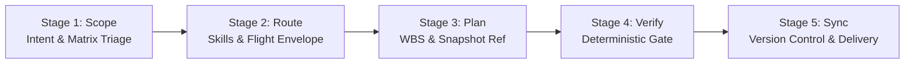

# The 5-Stage Adaptive Lifecycle Operating Procedure

This document specifies the standard operating procedure for the 5-stage lifecycle enforced by `adaptive-workflow`.



---

## Stage 1: Scope & Intent Discovery

### 1. Archetype Classification
Analyze incoming prompt text, referenced files, and user objectives against the seven core archetypes:
1. `ENGINEERING_DEV`: Code writing, debugging, refactoring, API integration, unit testing.
2. `DOMAIN_HARDWARE`: Bare-metal C/C++, DSP filters, control loops, RF link budgets, avionics math.
3. `DOMAIN_AEC_CAD`: 3D CAD modeling, BIM parameters, FEM frame solvers, GIS geospatial layers.
4. `RESEARCH_ACADEMIC`: IOE BE curriculum, NotebookLM fleets, paper dossiers, chat archives.
5. `FRONTEND_PRODUCT`: Web apps, UI components, design systems, portfolio updates.
6. `SWARM_ORCHESTRATION`: Multi-agent swarms, batch background execution, overnight runs.
7. `SYSADMIN_SECURITY`: DFIR triage, NTFS folder locks, desktop window automation, vault items.

### 2. Complexity Tier Assessment
Classify the task into one of two tiers:
- **Tier 1: Routine / Micro Tasks** ($\le 2$ target files, no schema/architectural shifts). Execute directly with local verification; no preliminary plan confirmation needed.
- **Tier 2: Multi-Step / Architectural Tasks** ($> 2$ files or cross-repo scope). Formulate and display an **Adaptive Execution Plan** before proceeding.

### 3. 2D Orthogonal Matrix Triage
Calculate the task coordinates across the [2D Orthogonal Execution Matrix](orthogonal-execution-matrix.md):
- **Workload Volume ($V$)**: $V0$ ($\le 2$ files), $V1$ ($3-15$ files), or $V2$ ($> 15$ files).
- **Blast Criticality ($R$)**: Computed via Knowledge Graph centrality score ($C$):
  $$C = \frac{\text{Direct Dependents} + 2 \times \text{Transitive Dependents}}{\text{Total Ecosystem Modules}}$$
  $R0$ ($C \le 0.10$), $R1$ ($0.10 < C \le 0.35$), or $R2$ ($C > 0.35$).
- Assign the target policy cell (e.g. `SURGICAL_LOCK`, `STAR_SUBAGENTS`, `FLEET_SWARM`).
- **Safety Interlock**: If cell is `(V2, R2)` (Batch Core), monolithic modification is blocked; task must be partitioned into micro-PRs via `split-to-prs` unless `-ForceMaintainer` is specified.

---

## Stage 2: Route & Pre-Flight Context Resolution

### 1. Progressive Skill Activation
- Identify primary and supporting skills from `references/skill-matrix.md`.
- Read the corresponding `SKILL.md` files on demand to retrieve specialized procedures. Never preload unused skills into context.

### 2. Dynamic Flight Envelope Pre-Flight Check
Audit host resource readiness against the [Dynamic Flight Envelope](dynamic-flight-envelope.md):
- Ingest telemetry: Verify host RAM $> 2\text{ GB}$ and assert absence of `.git/index.lock`.
- If dispatching batch tasks to `Fleet-Orchestrator`, verify that 27 Copilot accounts are active:
  ```powershell
  python "F:\Aaradhya-Dev-Tamrakar\Fleet-Orchestrator\tools\copilot_fleet.py" status
  ```
- **Worker Availability Check**: Read `orchestrator-state/live-status/` to calculate the Fleet Health Ratio ($H = N_{\text{avail}} / 27$). If $H < 0.70$, clamp requested `TURBO` concurrency down to `DAMPED_TURBO` or `BALANCED_FALLBACK` matching [worker-availability-ledger.md](worker-availability-ledger.md).
- If API latency drifts $> 2000\text{ ms}$ or rate limits are present, halve active worker concurrency.

### 3. Repository Invariant Discovery
Before executing file modifications or git commands, inspect the environment:
- **Sync Automation**: Check for root or script wrappers in order of precedence:
  1. `Makefile` / `make.bat` (Universal entrypoint)
  2. `.\sync.bat` / `.\sync.ps1`
  3. `scripts/sync.bat` / `scripts/sync.sh`
- **Agent Rules**: Verify presence of `AGENTS.md` and `GEMINI.md`. All authoritative rules reside in `AGENTS.md`.
- **Audit Engines**: Check for `audit.bat`, `sim.bat`, or `sim/reconciliation_engine.py`.

### 4. MCP Server Connectivity Check
Confirm that required external tools are available before attempting API calls (Bitwarden, Classroom, Super-NLM, LocalSend, Fusion 360).

---

## Stage 3: Plan & Decompose (Zero-Waste)

### 1. WBS Decomposition (`pm-workflow-orchestrator`)
Decompose multi-step tasks using the 100% Rule of WBS into uniquely identifiable work packages:
- Each work package must have a measurable completion criteria.
- Flag zero-slack activities as `CRITICAL_PATH` ($TS_i = 0$).
- Define a bounded stopping budget: Max duration, max tool iterations, token budget.

### 2. Governance Track Selection (`github-workflow`)
- **Track A (Solo Maintainer Velocity Bridge - `DEC-003-A`)**: Authorized for solo maintainer operations on `main`. Verified locally with 100% pass rate, synchronized via `.\sync.bat -m "type(scope): summary"`.
- **Track B (BRL Cohort & Contributor PR Standard)**: GitHub issue anchoring (`gh issue create`), branch isolation (`<type>/<slug>-#<id>`), progressive checkbox checking (`gh-task`), and PR dispatch via `.\sync.bat -PR`.

### 3. Velocity Profile Selection (`quota-velocity-acceleration.md`)
Select the operating compute-for-speed exchange:
- **`BALANCED` (Standard Default)**: $3 - 4$ workers, moderate credit consumption, standard package slicing.
- **`TURBO` (Explicit: `-Turbo`, `-Velocity turbo`)**: Maximum horizontal fanout (up to 27 workers), hyper-partitioning (1 file/worker), hedged racing, and pipeline overlapping ($5\times - 10\times$ speedup). Requires $H \ge 0.70$.
- **`ECONOMY` (Conservation)**: $1 - 2$ sequential workers strictly on the critical path ($TS = 0$).

### 4. Antigravity Scope & Living Chat Harvesting (`antigravity-chat-context-injection.md`)
Expand Antigravity's cognitive app scope into the dispatched work package:
- Harvest active Conversation ID, user intent, recent decisions, and approved plan artifacts from `brain/<conversation_id>/`.
- Assemble `antigravity_scope` (chat context + governing rules + active skills) and inject into task JSONs or subagent prompts.

### 5. Transactional Pre-Flight Snapshot Ref
Prior to modifying files for any task outside `(V0, R0)`, commit a lightweight snapshot pointer to the [Rolling 3-Snapshot Ring Buffer](transactional-recovery.md):
```powershell
$sha = git stash create "pre-flight-snapshot"
if ($sha) {
    git update-ref refs/backup/snapshot-1 $sha
}
```

---

## Stage 4: Calibrated Execution & Verification Gate

### 1. Worktree Context Projection & Native Instruction Loading
When workers provision `.worktrees/<task_id>`:
- Project `TASK_CONTEXT.md` and `.github/copilot-instructions.md` containing the harvested Antigravity scope.
- Headless `copilot.exe` natively loads repository rules without `--no-custom-instructions` suppression.
- Prior to worktree commit, execute `cleanup_worktree_context()` to sanitize ephemeral context files from git history.

### 2. Epistemic Calibrations (`ARCH-RFC-001`)
When generating findings or updating documentation, tag claims with appropriate evidence levels:
- `FORMALLY_PROVEN`: Verified via SMT/Z3 solvers or deductive formal logic.
- `EMPIRICALLY_VERIFIED`: Confirmed via executed deterministic scripts in `sim/`.
- `STATISTICALLY_OBSERVED`: Supported by benchmark runs with confidence intervals.
- `HEURISTIC_HYPOTHESIS`: Unverified architectural design or working assumption.

### 3. Deterministic Verification Gate
Zero errors tolerated before staging or committing changes:
- **Unit & Integration Tests**: `pytest`, `npm test`, `Invoke-Pester`.
- **Static Analysis & Linters**: `ruff check`, `ruff format --check`, `npm run lint`.
- **Ecosystem Integrity**: `.\audit.bat` or `python sim/reconciliation_engine.py --fix`.
- **Release SHA Linking**: No placeholder strings (e.g. `rel50`, `upg47`). All commit references must link to authentic 7–40 hex Git commit SHAs.

### 4. Silent Rollover & Quota Tracking (`worker-availability-ledger.md`)
If a worker encounters quota exhaustion (`credits_used >= 200`) or an HTTP 429 during execution, the orchestrator triggers silent rollover: reclaims task lease, migrates to the next healthy account, and emits a single status line (`[FLEET-ROLLOVER]...`) without user interruption.

### 5. Automated Rollback on Verification Failure
If any verification gate fails or tests regress, execute an immediate microsecond restore:
```powershell
git reset --hard refs/backup/snapshot-1
```
Perform cryptographic collateral triage via `cyber-forensics` BLAKE3 hashing to verify state integrity before retrying.

---

## Stage 5: Ecosystem Synchronization & Delivery

### 1. Synchronized Version Control
- When `sync.bat`, `sync.ps1`, or a `Makefile` with a `sync` target exists, raw `git commit`, `git add`, or `git push` are strictly prohibited.
- Windows environments: Prioritize `.\sync.bat` to bypass PowerShell `ExecutionPolicy` restrictions.
- Non-code churn (documentation, research transcripts, state logs): Append `-SkipCI` to conserve runner quotas.
- Preview changes beforehand: Use `.\sync.bat -WhatIf`.

### 2. Snapshot Ring Buffer Rotation
Upon clean, certified verification and push, rotate the rolling snapshot ring buffer (`snapshot-1` $\to$ `snapshot-2` $\to$ `snapshot-3`), retaining the last 3 safety checkpoints while preventing pointer bloat.

### 3. Knowledge Graph Reconciliation
Whenever modifying architectural specifications, RFCs, simulation scripts, or schemas:
- Run `graphify update .` to keep the persistent knowledge graph current.

### 4. Issue Closure
Close tracked GitHub issues with verifiable evidence and authentic commit SHA:
```bash
gh issue close <ISSUE_NUMBER> --comment "Completed in commit <SHORT_SHA>. Verified with zero errors."
```
