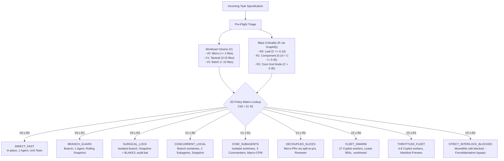

# The 2D Orthogonal Execution Matrix

This document defines the 2D Master Execution Policy Matrix governing [`adaptive-workflow`](../SKILL.md). It decouples **Workload Volume ($V$)** from **Blast Criticality ($R$)**, establishing deterministic concurrency allocations, workspace isolation boundaries, and verification gates for every task in the ecosystem.

---

## 1. The Orthogonal Dimensions

Execution policy is determined by the intersection of two independent parameters:

### Dimension 1: Workload Volume ($V$)
Quantified by affected file count and dependency depth:
- **`V0_MICRO`**: $\le 2$ target files. Focused single-concern edits, localized bugfixes, micro-refactors.
- **`V1_TACTICAL`**: $3 \dots 15$ target files. Multi-module feature development, API integration, subsystem refactoring.
- **`V2_BATCH`**: $> 15$ target files. High-volume migrations, curriculum scaffolding, bulk documentation, dataset transformations.

### Dimension 2: Blast Criticality ($R$)
Quantified by Knowledge Graph node centrality ($C$) via [`graphify`](file:///C:/Users/Aaradhya/.gemini/config/skills/graphify):
$$C = \frac{\text{Direct Dependents} + 2 \times \text{Transitive Dependents}}{\text{Total Ecosystem Modules}}$$

- **`R0_LEAF`** ($C \le 0.10$): Standalone scripts, doc archives, curriculum study guides, isolated presentations.
- **`R1_COMPONENT`** ($0.10 < C \le 0.35$): Standard domain repositories ([`SPARK`](file:///f:/Aaradhya-Dev-Tamrakar/SPARK), [`BiasAperture`](file:///f:/Aaradhya-Dev-Tamrakar/BiasAperture), [`Nexus`](file:///f:/AaradhyaDT/Nexus)).
- **`R2_CORE`** ($C > 0.35$): Foundational registries (`ecosystem.registry.json`), capability contracts (`capability.contract.v1.json`), and central audit gates (`audit.bat`).

---

## 2. The 9-Cell Master Policy Matrix

---

## 3. Cell Specifications & Operational Policies

### Cell `(V0, R0)` — `DIRECT_FAST`
- **Application**: Routine minor edits to leaf files or standalone utilities.
- **Concurrency**: 1 Lead Agent turn (no subagents, no fleet workers).
- **Workspace**: In-place edit in the active repository tree.
- **Recovery**: Optional snapshot; standard Git tracking.
- **Verification**: Fast local unit test or linter pass.

### Cell `(V0, R1)` — `BRANCH_GUARD`
- **Application**: Minor bugfix or targeted feature edit to standard domain repositories.
- **Concurrency**: 1 Lead Agent turn.
- **Workspace**: Isolated feature branch (`<type>/<slug>-#<id>`).
- **Recovery**: Rolling 3-snapshot ring buffer committed to `refs/backup/snapshot-1`.
- **Verification**: Full local test suite (`pytest` / `npm test`) and linter pass.

### Cell `(V0, R2)` — `SURGICAL_LOCK`
- **Application**: Targeted edit to central schema, registry, or root audit script.
- **Concurrency**: 1 Lead Agent turn with exclusive lock hierarchy. Zero async fanout.
- **Workspace**: Dedicated isolated branch; strictly zero collateral writes permitted.
- **Recovery**: Mandatory pre-flight snapshot + pre/post BLAKE3 cryptographic hash validation.
- **Verification**: Zero-discrepancy ecosystem audit (`audit.bat --fix`) verifying 586+ files and 12 SMT invariant properties.

### Cell `(V1, R0)` — `CONCURRENT_LOCAL`
- **Application**: Multi-file documentation generation or presentation asset builds.
- **Concurrency**: Lead Agent + 2 concurrent subagents (`self, flash`).
- **Workspace**: Branch worktrees or disjoint scratch buffers.
- **Recovery**: Rolling snapshot committed to `refs/backup/snapshot-1`.
- **Verification**: Build command pass (e.g. `npm run build` or Markdown linter).

### Cell `(V1, R1)` — `STAR_SUBAGENTS`
- **Application**: Multi-domain feature additions spanning firmware, DSP, and UI.
- **Concurrency**: Lead Agent + 3 Domain Commanders commissioned at Depth 1 via [`agent-teams-orchestration`](file:///C:/Users/Aaradhya/.gemini/config/skills/agent-teams-orchestration).
- **Workspace**: Isolated Git worktrees (`.worktrees/<task_id>`).
- **Scheduling**: Macro-CPM float allocation ($TS_i = LF_i - EF_i$). Critical path ($TS = 0$) held sequentially; slack tasks ($TS > 0$) run concurrently.
- **Recovery**: Rolling snapshot + BLAKE3 hash audit.
- **Verification**: Dual-layer verification gate; Star-Topology convergence ledger unlock.

### Cell `(V1, R2)` — `DECOUPLED_SLICES`
- **Application**: Architectural refactor touching multiple core interfaces.
- **Concurrency**: 1 Lead Agent + 1 Adversarial Reviewer (`self, pro`).
- **Workspace**: Decoupled micro-PR branches sliced via [`split-to-prs`](file:///C:/Users/Aaradhya/.gemini/config/skills/split-to-prs). Monolithic feature branches are forbidden.
- **Recovery**: Independent snapshot per micro-PR slice.
- **Verification**: Full regression suite pass per slice before next slice base is merged.

### Cell `(V2, R0)` — `FLEET_SWARM`
- **Application**: High-volume batch generation of curriculum notes, doc packs, or media transforms.
- **Concurrency**: 27 pooled Copilot CLI accounts (`copilot-w1` through `copilot-w27`) pooling 5,400 monthly credits.
- **Workspace**: Ephemeral `.worktrees/<task_id>` directories. Root tree remains untouched.
- **Recovery**: 15-minute lease timeout ($900\text{s}$) with automated worker rollover.
- **Verification**: Batch checkpoint validation and synthesis into target milestone.

### Cell `(V2, R1)` — `THROTTLED_FLEET`
- **Application**: Batch refactors across multiple standard domain modules.
- **Concurrency**: Throttled pool of 4 to 8 Copilot workers.
- **Workspace**: Ephemeral worktrees with randomized creation jitter ($100\text{ms}-1500\text{ms}$).
- **Governance**: Requires **Execution Manifest Preview** presented to user prior to queue writing.
- **Recovery**: Rolling snapshot + lease rollover.
- **Verification**: Full multi-repo regression test pass.

### Cell `(V2, R2)` — `STRICT_INTERLOCK_BLOCKED`
- **Application**: Large batch modifications targeting core architectural schemas or central gates.
- **Concurrency**: 0 (Execution is physically blocked).
- **Policy**: Monolithic batch modifications to foundational schemas are strictly prohibited to prevent ecosystem corruption.
- **Resolution**: The task must be partitioned into $V0$ or $V1$ work packages using `split-to-prs`.
- **Founder Override**: In accordance with `DEC-003-A` (Solo Maintainer Velocity Bridge), appending `-ForceMaintainer` bypasses this block for authorized founder-level schema migrations.
