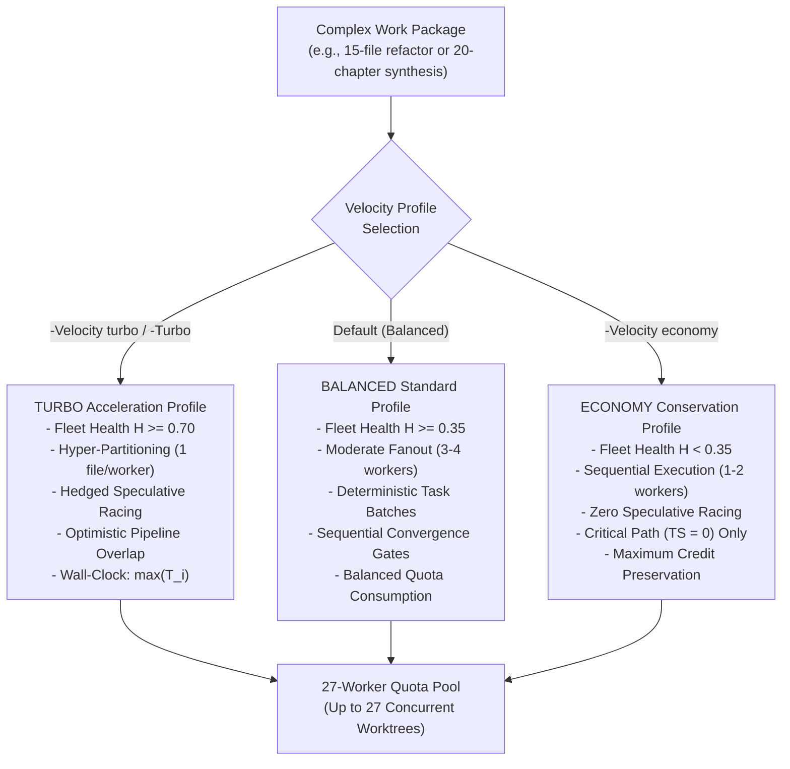

# Quota Velocity Acceleration & Compute-for-Speed Exchange

This document specifies the protocols for trading pooled monthly AI credits for wall-clock latency reductions in [`adaptive-workflow`](../SKILL.md) and `Fleet-Orchestrator`.

---

## 1. The Compute-for-Speed Exchange Model

In high-throughput multi-agent systems, execution latency can be reduced by distributing workloads across a larger pool of concurrent workers. By marshaling the **27 pooled GitHub Copilot accounts (5,400 monthly credits)**, `adaptive-workflow` trades idle compute capacity for a 5x to 10x reduction in total wall-clock duration.

---

## 2. Operating Velocity Profiles

The orchestrator recognizes three distinct velocity profiles:

| Profile | Concurrency Ceiling | Task Slicing Granularity | Hedged Racing | Wall-Clock Acceleration | Credit Burn Rate | Default Status |
| :--- | :---: | :--- | :---: | :---: | :---: | :--- |
| **`TURBO`** | Up to $N_{\text{avail}}$ (max 27) | Atomic (1 file per worker) | Enabled | $5\times - 10\times$ | High ($\le 27$ concurrent) | Explicit (`-Turbo`, `-Velocity turbo`) |
| **`BALANCED`** | $3 - 4$ workers | Module / Package (2–4 files) | Disabled | $2\times - 3\times$ | Moderate ($3 - 4$ concurrent) | **System Default** |
| **`ECONOMY`** | $1 - 2$ workers | Monolithic / Milestone | Disabled | Baseline ($1\times$) | Low ($1$ sequential) | Explicit / Auto-Downshifted |

### Policy Defaults:
- **Default Policy**: All tasks run under **`BALANCED`** to prevent unnecessary credit consumption on routine edits.
- **Turbo Invocation**: `TURBO` mode must be explicitly activated by passing `-Turbo`, `--turbo`, or `-Velocity turbo` to the command line.
- **Governor Interlock**: If `TURBO` is requested while the Fleet Health Ratio $H < 0.70$, the governor clamps concurrency to `DAMPED_TURBO` (max 8 workers) or `BALANCED_FALLBACK` to protect remaining accounts.

---

## 3. Acceleration Mechanisms

`TURBO` acceleration achieves low wall-clock completion times through three decoupled mechanics:

### 1. Hyper-Partitioning (Horizontal Acceleration)
- Slices large multi-file deliverables into atomic, disjoint work units (`task_001` through `task_00N`).
- Each unit is assigned an individual worker executing in an isolated Git worktree (`.worktrees/<task_id>`).
- Slashes total wall-clock duration from serial summation $\sum_{i=1}^N T_i$ to the maximum single-file duration:
  $$T_{\text{wall}} = \max_{1 \le i \le N} (T_i) + T_{\text{merge}}$$
- For a 15-file migration where each file requires 45 seconds, serial execution requires 675 seconds (~11 minutes); hyper-partitioned execution completes in ~60 seconds.

### 2. Hedged Speculative Racing (First-to-Pass Quorum)
- For high-variance algorithmic refactors, complex test failures, or flaky integration tasks, the orchestrator dispatches duplicate tasks with alternative prompt formulations to two distinct active accounts (`worker_A` and `worker_B`).
- Both workers execute concurrently in separate worktrees.
- The first worker to commit a checkpoint passing 100% of deterministic verification tests wins the race; the governor revokes the lease and cancels the trailing task.
- Eliminates the long-tail latency skew inherent in stochastic LLM code generation.

### 3. Optimistic Pipeline Overlap
- Rather than executing implementation, testing, and documentation sequentially across distinct phases, the orchestrator initiates downstream work units optimistically once interface contracts are committed:
  - **Worker A**: Generates implementation in `src/`.
  - **Worker B**: Drafts unit test harness in `tests/` based on interface types.
  - **Worker C**: Scaffolds technical documentation and reference markdown.
- When Worker A reaches checkpoint, Workers B and C immediately bind against the concrete artifact, reducing overall phase-transition latency.

---

## 4. Elastic Speedup Modification Matrix

Active concurrency dynamically scales with real-time fleet health as tracked in [`references/worker-availability-ledger.md`](worker-availability-ledger.md):

| Fleet Health Ratio ($H$) | Available Workers ($N_{\text{avail}}$) | Operating Velocity Profile | Max Concurrent Workers | Hedged Racing | Slicing Granularity |
| :--- | :---: | :--- | :---: | :---: | :--- |
| **$H \ge 0.70$** | $19 \dots 27$ | **`FULL_TURBO`** | Up to $N_{\text{avail}}$ (max 27) | Enabled | 1 file per worker (Hyper-Partitioned) |
| **$0.35 \le H < 0.70$** | $10 \dots 18$ | **`DAMPED_TURBO`** | $\min(N_{\text{avail}}, 8)$ | Disabled | $2 \dots 3$ files per worker |
| **$0.15 \le H < 0.35$** | $4 \dots 9$ | **`BALANCED_FALLBACK`** | $2 \dots 4$ workers | Disabled | Standard WBS packages |
| **$H < 0.15$** | $1 \dots 3$ | **`EMERGENCY_ECONOMY`** | 1 sequential worker | Disabled | Critical path ($TS=0$) only |

---

## 5. Concurrency & Safety Invariants

1. **Lock-Free Worktree Spawning (`.git/index.lock` Protection)**:
   - Simultaneous `git worktree add` commands are throttled to a maximum of 4 concurrent operations with randomized backoff jitter (100ms–1500ms).
   - Once worktrees are initialized, task execution runs fully parallel across all allocated workers.
2. **15-Minute Stale Lease Eviction ($900\text{s}$)**:
   - Tasks claimed by a worker must refresh their checkpoint within 900 seconds. Hanging or unresponsive tasks are evicted and re-queued.
3. **Local Commit Authorization**:
   - Headless workers are authorized to make local `git commit` calls strictly inside their assigned `.worktrees/<task_id>`.
   - Merging task branches into `main` must strictly run through `sync.bat`.
4. **Credit Ceiling Enforcement**:
   - A worker that reaches 200 used credits (`credits_used >= 200`) is immediately transitioned to `EXHAUSTED` state and removed from the active scheduling pool until monthly billing reset.
