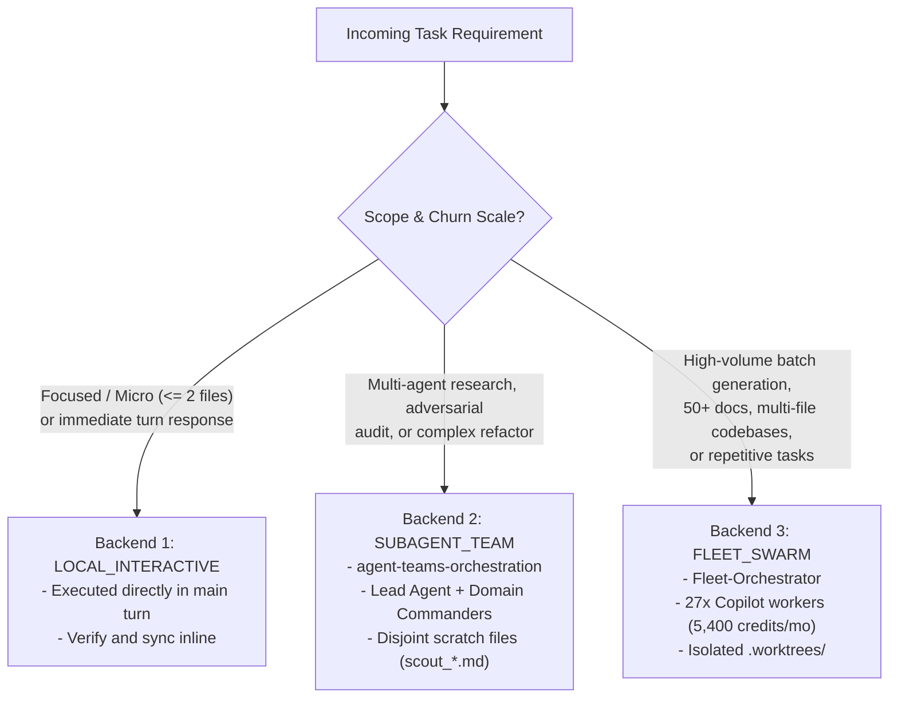

# Adaptive Skill & Repository Routing Matrix

This matrix provides deterministic routing rules mapping incoming task archetypes and operational domains to specialized skills, physical repositories, and execution commands.

---

## 1. Master Routing & Repository Mapping Table

| Task Archetype | Operational Domain | Primary Skills | Physical Repositories & Paths | Supporting Tools & MCPs | Verification Gate |
| :--- | :--- | :--- | :--- | :--- | :--- |
| **`ENGINEERING_DEV`** | Backend, APIs, full-stack, refactors, bugfixes, CLI tools, tests | `github-workflow`<br>`feature-dev`<br>`pr-review-toolkit` | `Claude-Desktop`<br>`Nexus`<br>`AI`<br>`rsvp-reading` | `security-guidance`<br>`split-to-prs`<br>`dsa-complexity-optimizer`<br>`graphify-code-search` | `pytest`<br>`ruff check`<br>`npm test` |
| **`DOMAIN_HARDWARE`** | Embedded systems, firmware, RTOS, DSP, analog circuits, control loops | `embedded-firmware-scaffold`<br>`dsp-signal-engine`<br>`control-systems-sim` | `SPARK` (`F:\...\SPARK`)<br>`Alpha-SuperApp` | `electronics-circuit-synth`<br>`avionic-telecom-analyzer`<br>`rf-link-budget-calc`<br>`systems-concurrency-harness` | Hardware simulation<br>`pytest tests/` |
| **`DOMAIN_AEC_CAD`** | 3D CAD modeling, BIM, FEM structural frames, pipe flow, GIS | `fusion360-mcp`<br>`makerspace` | `AEC-MCP Suite`<br>`makerspace` | `revit-mcp`<br>`autocad-mcp`<br>`rhino-mcp`<br>`etabs-mcp`<br>`qgis-mcp` | Viewport render<br>MCP response check |
| **`RESEARCH_ACADEMIC`** | University curriculum, BE ECIE notes, literature survey, paper dossiers | `academic-notebook-architect`<br>`super-nlm`<br>`writing-like-claude` | `brainstorm`<br>`super-nlm`<br>`BiasAperture` | `google-classroom-mcp`<br>`super-nlm-downloads`<br>`doc-archiver`<br>`chat-archiver` | `audit.bat`<br>`audit_calm_writing.py` |
| **`FRONTEND_PRODUCT`** | Web applications, UI components, styling, portfolio onboarding | `design-taste-frontend`<br>`modern-web-guidance`<br>`portfolio-project-manager` | `AaradhyaDT.github.io`<br>`Aaradhya-Dev-Tamrakar.github.io`<br>`react-workshop-ieeekecktm` | `shadcn-context`<br>`fluid-wordmark-collapse`<br>`google-stitch-integration`<br>`chrome-extensions` | `python scripts/verify.py`<br>(26 categories) |
| **`SWARM_ORCHESTRATION`** | Autonomous teams, batch background workers, multi-account fleet pooling | `agent-teams-orchestration`<br>`fleet-orchestrator`<br>`pm-workflow-orchestrator`<br>`slm-router-forge` | `Fleet-Orchestrator`<br>`omnivault` | `automation`<br>`cold-storage-archiver`<br>`systems-concurrency-harness` | `copilot_fleet.py status`<br>(27/27 ready) |
| **`SYSADMIN_SECURITY`** | Windows DFIR artifact triage, NTFS ACL locks, desktop automation | `cyber-forensics`<br>`win-vault`<br>`winpilot` | `Cyber-Forensics`<br>`Win-Vault`<br>`system-optimizer` | `bitwarden`<br>`downloader-scripts`<br>`security-guidance` | `pwsh tests\*.ps1`<br>`.\Vault.bat` |
| **`ECOSYSTEM_META`** | Skills creation, agent rules, plugin authoring, SLM forge, graphify | `skill-development`<br>`slm-router-forge`<br>`agy-customizations`<br>`graphify` | `brainstorm`<br>`Fleet-Orchestrator`<br>`~/.gemini/config/skills/` | `graphify-optimizer`<br>`mcp-integration`<br>`find-skills`<br>`migrate-workflows` | `.\audit.bat --fix`<br>`graphify update .` |

---

## 2. Auxiliary Governance & Protection Skills

The following 10 specialized skills serve as the sub-governors for the 2D Matrix, Flight Envelope, Quota Velocity, and Transactional Recovery subsystems:

| Companion Skill | Subsystem Responsibility | Primary Capability & Invariant | Verification Command |
| :--- | :--- | :--- | :--- |
| **`graphify`** | Blast Criticality Sentry | Computes module node centrality ($C$) and identifies God Nodes ($C > 0.35$). | `graphify query` / `explain` |
| **`split-to-prs`** | Multi-Concern Decoupling | Slices monolithic architectural changes into independent, reviewable micro-PRs. | PR plan review check |
| **`win-vault`** | Filesystem Boundary Sandboxing | Enforces kernel-level NTFS ACL write denial outside designated task worktrees. | `.\Vault.bat` check |
| **`security-guidance`** | Proactive Diff Sanitization | Scans planned diffs for shell injection, unsafe deserialization, and path traversal sinks. | Pattern linter audit |
| **`control-systems-sim`** | Dynamic Flight Envelope | Regulates worker concurrency via closed-loop PID feedback ($K_p, K_i, K_d$) on latency and 429s. | `control_analyzer.py` |
| **`fleet-orchestrator`** | Quota Velocity & Antigravity Bridge | Tracks account exhaustion ($H$) and projects Antigravity chat context and rules into worktrees. | `copilot_fleet.py status` |
| **`systems-concurrency-harness`**| Deadlock Avoidance Validator | Evaluates Banker's safety state on host RAM and locks before claiming new worktrees. | Banker's safety check |
| **`pm-workflow-orchestrator`** | CPM & Velocity Tracking | Manages Macro-CPM float scheduling and tracks Earned Value ($CPI, SPI$) velocity. | EVM check formulas |
| **`cyber-forensics`** | Cryptographic State Triage | Captures pre/post BLAKE3 file hashes to detect collateral mutations or masked binaries. | `EvasionHunter.ps1` |
| **`pr-review-toolkit`** | Pre-Convergence Sentinels | Runs `silent-failure-hunter` and `pr-test-analyzer` to block unhandled exceptions before commit. | Review sentinel check |

---

## 3. Execution Backend Selection Decision Tree



---

## 4. Editorial & Writing Standard Routing

When generating written deliverables or auditing pull requests, select the appropriate tier from `references/calm-authority-writing.md`:

- **Tier L1 (Micro-Surface, 100–300 words)**: PR descriptions, commit notes, portfolio project blurbs (`scripts/add_project.py`).
- **Tier L2 (Editorial Narrative, 800–1,500 words)**: Engineering blog posts, internal dog-fooding case studies.
- **Tier L3 (Technical Spec, 1,000–3,000 words)**: Developer tutorials, SDK architecture, API request diffs.
- **Tier L4 (Model Launch Dossier, 2,000–5,000 words)**: Frontier model releases, pinned benchmark tables.
- **Tier L5 (Exhaustive System Card, 5,000–30,000+ words)**: Formal safety cards, behavioral audits.

Audit every document using:
```powershell
python "F:\Aaradhya-Dev-Tamrakar\brainstorm\.agents\skills\writing-like-claude\scripts\audit_calm_writing.py" --tier <TIER> <path-to-file.md>
```
