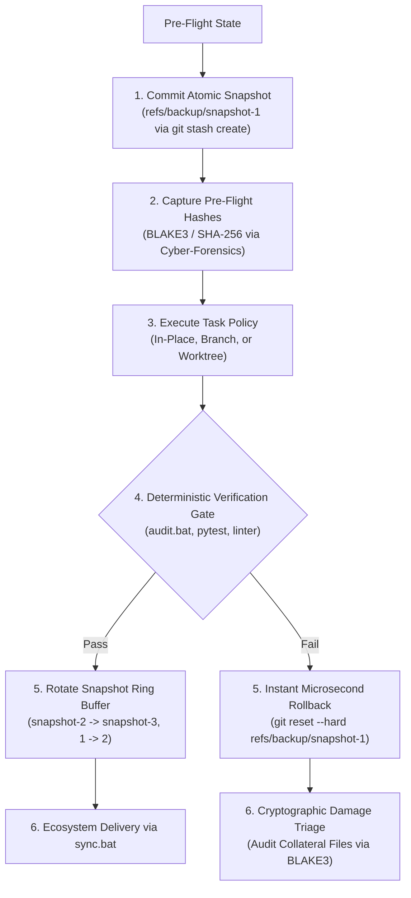
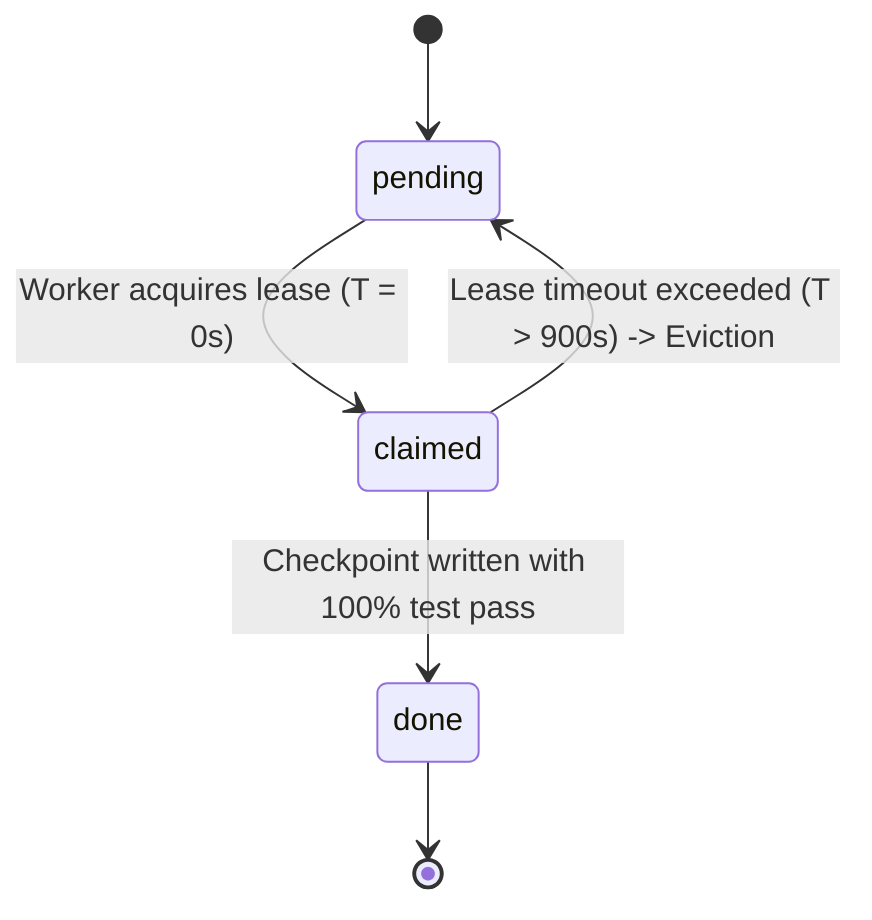

# Transactional Recovery & The Rolling Snapshot Ring Buffer

This document specifies the fault-tolerance protocols, atomic rollback mechanisms, and cryptographic state assurance governing [`adaptive-workflow`](../SKILL.md).

Derived from **CT 612 (Operating System)** and **Cyber-Forensics** standards.

---

## 1. Transactional Recovery Model

In distributed software orchestration, operations can fail due to test regressions, unexpected merge conflicts, API timeouts, or unhandled exceptions. To guarantee zero-loss recovery, `adaptive-workflow` treats every execution as a reversible transaction:



---

## 2. The Rolling 3-Snapshot Ring Buffer

To prevent repository pointer accumulation while preserving an instant safety net, recovery snapshots are stored in a rolling 3-slot ring buffer under `.git/refs/backup/`:

- **`refs/backup/snapshot-1`**: Most recent pre-flight snapshot.
- **`refs/backup/snapshot-2`**: Previous milestone snapshot.
- **`refs/backup/snapshot-3`**: Oldest retained snapshot.

### Snapshot Creation Script (PowerShell):
```powershell
function New-WorkflowSnapshot {
    [CmdletBinding()]
    param([string]$Message = "pre-task-checkpoint")
    
    # Create non-destructive commit object without modifying working tree
    $sha = git stash create "$Message"
    if (-not $sha) {
        # If working tree is clean, point snapshot directly to HEAD
        $sha = git rev-parse HEAD
    }
    
    # Rotate ring buffer: 2 -> 3, 1 -> 2, new -> 1
    $snap1 = git rev-parse --verify --quiet refs/backup/snapshot-1
    $snap2 = git rev-parse --verify --quiet refs/backup/snapshot-2
    
    if ($snap2) { git update-ref refs/backup/snapshot-3 $snap2 }
    if ($snap1) { git update-ref refs/backup/snapshot-2 $snap1 }
    git update-ref refs/backup/snapshot-1 $sha
    
    return $sha
}
```

### Instant Rollback Protocol:
If a task regresses or causes unintended side effects, reset state in $< 50\text{ ms}$:
```powershell
git reset --hard refs/backup/snapshot-1
```

---

## 3. Cryptographic Integrity Triage (`cyber-forensics`)

To verify that multi-agent execution did not cause collateral damage to neighboring files, the orchestrator captures pre- and post-flight file hashes matching `cyber-forensics`:

1. **Pre-Flight Hash Manifest**:
   - Computes BLAKE3 (or SHA-256) hashes of all declared target files and critical sibling files.
2. **Post-Flight Integrity Scan**:
   - Compares working tree state against the pre-flight manifest.
   - Asserts that zero undeclared files outside the target WBS were modified.
   - Checks for accidental PE binary masquerading or hidden NTFS Alternate Data Streams (`ADS`).

---

## 4. Headless Worker Lease Eviction (`fleet-orchestrator`)

For batch tasks dispatched to `Fleet-Orchestrator`, tasks are governed by an atomic state machine to prevent queue deadlocks:



### Eviction Protocol:
- If a worker crashes, hits an API timeout, or terminates unexpectedly, its lease expires at $T = 900\text{ seconds}$.
- The scheduler automatically resets the task from `"claimed"` back to `"pending"`.
- An idle rollover worker claims the task on the next cycle, ensuring that the queue never stalls.

---

## 5. Pre-Convergence Sentinels (`pr-review-toolkit`)

Before the convergence gate unlocks to allow commits or PR creation, two specialized review sentinels run autonomously:

1. **`silent-failure-hunter`**:
   - Inspects modified code for empty `catch` blocks, suppressed exceptions, or unlogged fallbacks.
   - *Pass Requirement*: Zero unhandled silent exceptions.
2. **`pr-test-analyzer`**:
   - Evaluates behavioral test coverage for all modified business logic branches.
   - *Pass Requirement*: $\ge 80\%$ test coverage on new or altered routines.

---

## 6. Windows NTFS File-Locking Resilience & Cleanup

On Windows NTFS filesystems, background antivirus engines (such as Windows Defender real-time protection) or search indexers can hold transient file handles on freshly generated worktrees or projected context files. Furthermore, Git operations frequently mark internal objects read-only (`stat.S_IREAD`).

To eliminate transient `PermissionError` (`[WinError 32]` and `[WinError 5]`), cleanup operations in [`sim/adaptive_orchestrator.py`](../../../../sim/adaptive_orchestrator.py) and `Fleet-Orchestrator` execute via resilient helpers:

1. **Read-Only Attribute Stripping**: Automatically sets `stat.S_IWRITE` via `os.chmod` prior to `unlink()` or inside `shutil.rmtree`'s `onerror` callback.
2. **Exponential Backoff with Jitter**: Retries unlinking across 4 attempts ($50\text{ms}, 150\text{ms}, 350\text{ms}, 700\text{ms}$ with $\pm 30\%$ random jitter) to allow external processes to release locks.
3. **Kernel Shell Fallback**: Employs native `cmd.exe /c rmdir /s /q` as an ultimate fallback on Windows if Python handles remain temporarily blocked.

---

## 7. Fencing Tokens & Pre-Existing File Protection

### 1. Monotonic Fencing Tokens (`INV-FENCE-TOKEN`)
To reject split-brain writes from evicted or stale workers that wake up after their lease expired, `OrchestratorFencingManager` issues monotonic integer tokens per task. During branch integration or merge verification:
- Commits carrying expired worker epochs ($e_{\text{worker}} < e_{\text{active}}$) are strictly rejected.
- Only the latest lease owner ($e_{\text{worker}} == e_{\text{active}}$) can merge worktree changes.

### 2. Pre-Existing File Guard (`INV-PRE-EXIST-GUARD`)
When projecting tasks into Git worktrees:
- The orchestrator resolves the canonical common directory via `git rev-parse --path-format=absolute --git-common-dir`.
- Pre-existing files are archived to `<git_common_dir>/projection_backups/<task_id>/` outside worktree git tracking.
- Upon task teardown, ephemeral files are deleted and pre-existing files are restored cleanly from backup.
