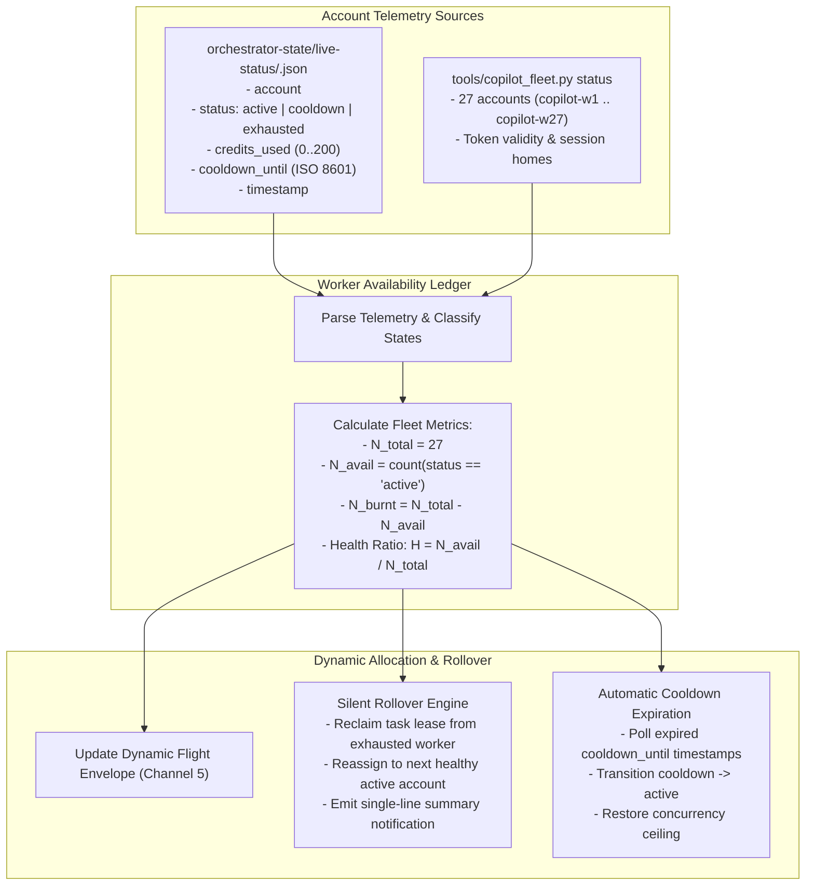

# The Worker Availability Ledger & Quota Depletion Tracking

This document specifies the real-time tracking mechanics for monitoring worker account exhaustion, cooldown quarantines, and dynamic fleet availability in [`adaptive-workflow`](../SKILL.md) and [`Fleet-Orchestrator`](file:///F:/Aaradhya-Dev-Tamrakar/Fleet-Orchestrator).

---

## 1. Fleet Availability Ledger Architecture

High-throughput parallel execution across the 27 GitHub Copilot accounts relies on an accurate, real-time ledger of account health. The **Worker Availability Ledger** continuously reads telemetry from `Fleet-Orchestrator/orchestrator-state/live-status/` to track account states, calculate the Fleet Health Ratio ($H$), and enforce automatic rollover when accounts encounter quota exhaustion or rate limits.



---

## 2. Worker State Classifications

The ledger categorizes each of the 27 pooled accounts into one of three operational states:

1. **`ACTIVE`**:
   - The account possesses a verified PAT token, `credits_used < 200`, and no active cooldown timer (`cooldown_until` is null or expired).
   - Eligible for immediate task dispatch and worktree assignment.
2. **`COOLDOWN`**:
   - The account encountered an HTTP 429 rate limit or network transport timeout.
   - Quarantined until the `cooldown_until` timestamp expires (standard window: 15–60 minutes).
   - Ineligible for new task assignment; running tasks are reclaimed.
3. **`EXHAUSTED` (Burnt Out)**:
   - The account has consumed all 200 monthly AI credits (`credits_used >= 200`).
   - Quarantined until the monthly billing cycle reset.
   - Ineligible for scheduling; permanently excluded from $N_{\text{avail}}$ for the remainder of the billing period.

---

## 3. Mathematical Availability Formulations

The ledger computes real-time availability metrics prior to each work package dispatch:

- **Total Pooled Capacity**:
  $$N_{\text{total}} = 27 \quad (5,400\text{ credits/month})$$
- **Available Workers**:
  $$N_{\text{avail}} = \sum_{w \in \text{Fleet}} \mathbb{I}[w.\text{status} = \text{'ACTIVE'}]$$
- **Depleted / Burnt-Out Count**:
  $$N_{\text{burnt}} = N_{\text{total}} - N_{\text{avail}}$$
- **Fleet Health Ratio ($H$)**:
  $$H = \frac{N_{\text{avail}}}{N_{\text{total}}}$$

### Live-Status Schema (`orchestrator-state/live-status/<worker_id>.json`):
```json
{
  "account": "copilot-w12",
  "status": "active",
  "credits_used": 142,
  "cooldown_until": null,
  "current_task_id": "task_087_dsp_filter",
  "note": "Nominal execution",
  "timestamp": "2026-10-09T07:15:00Z"
}
```

---

## 4. Silent Rollover & Notification Protocol

When a worker burns out (`credits_used >= 200`) or encounters an HTTP 429 during active task execution, the orchestrator triggers the **Silent Rollover Engine**:

1. **Atomic Lease Reclaim**:
   - Revokes the task lease from the affected worker.
   - Preserves partial git worktree changes in `.worktrees/<task_id>` without discarding uncommitted work.
2. **Account Migration**:
   - Reassigns the task JSON to the next available worker with the lowest `credits_used` count.
   - Updates the target worker's `current_task_id`.
3. **Single Summary Terminal Notice**:
   - To maintain zero conversational interruption while preserving auditability, the orchestrator emits a single-line status notification:
   ```
   [FLEET-ROLLOVER] Account copilot-w12 exhausted (200/200 credits) -> migrating task_087 to copilot-w13 (H=0.85)
   ```
   - No interactive modals or blocking confirmation dialogs are presented.

---

## 5. Automatic Cooldown Expiration & Resurgence

Cooldown states are ephemeral. The ledger enforces automated recovery without manual intervention:

1. **Periodic Telemetry Sweep**:
   - At each task dispatch cycle, the ledger compares the current UTC time against all active `cooldown_until` timestamps:
     $$\text{now} \ge w.\text{cooldown\_until}$$
2. **State Reversion**:
   - Upon timestamp expiration, the ledger updates the account status from `COOLDOWN` to `ACTIVE`.
   - $N_{\text{avail}}$ increments by 1; the Fleet Health Ratio $H$ recalculates upward.
3. **Dynamic Concurrency Elevation**:
   - If $H$ crosses above the 0.70 threshold, the Dynamic Flight Envelope automatically lifts concurrency damping, restoring full `TURBO` fanout capacity.
