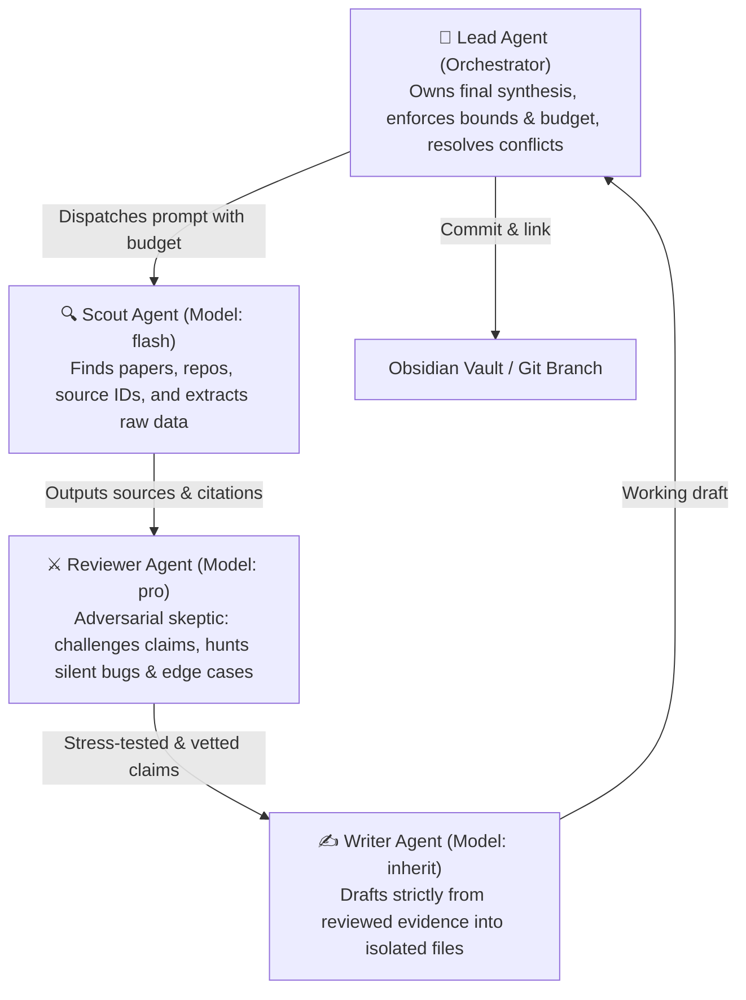

# Agent Teams Orchestration Skill

Activate this skill whenever the user asks to:
- Form an "agent team", "subagent swarm", or "autonomous research crew".
- Run bounded overnight work ("I sleep, the machine stays awake").
- Perform multi-role research or refactoring with adversarial review.
- Follow the Ayush Kumar Shah / Claude Code Agent Teams pattern.

---

## 1. The Core Agent Team Architecture

Whenever orchestrating non-trivial research, architecture review, or deep refactoring, decompose the workflow into four specialized roles:



### Role Invariants:
1. **Scout (`Model: 'flash'`):** Fast, high-throughput information retrieval. Must output explicit source IDs, DOIs, URLs, or file paths. Never theorizes.
2. **Reviewer (`Model: 'pro'`):** The adversarial skeptic. Searches for methodology flaws, unearned claims, performance traps, and edge cases. Applies epistemic governance (`ARCH-RFC-001`).
3. **Writer (`Model: 'inherit'`):** Synthesizes exclusively from *reviewed* evidence. **Rule:** If a claim was not validated by the Reviewer, it cannot enter the draft.
4. **Lead (The Primary Agent):** Owns final delivery, arbitrates deadlocks, and enforces stopping criteria.

---

## 2. Concurrency & Isolation Invariants (CRITICAL)

To avoid race conditions, file corruption, and infinite loops:

1. **Strict File Separation:**
   Subagents **MUST NEVER** edit the same file concurrently. 
   - Scout writes to: `research/scratch/scout_<task>.md`
   - Reviewer writes to: `research/scratch/review_<task>.md`
   - Writer compiles to the target note: `research/notes/<YYYY-MM-DD>_<task>.md`
2. **Workspace Isolation (`invoke_subagent`):**
   When subagents perform code refactors or deep tests, specify `Workspace: 'branch'` to fork an isolated git worktree so concurrent workers do not collide.
3. **Reactive Wakeups (Zero-Polling):**
   Never spin up an agent and poll in a `while` loop. Let the subagent complete asynchronously; the runtime automatically wakes the Lead agent upon completion.

---

## 3. Bounded Execution Safeguards ("I sleep, the machine stays awake")

For long-running or overnight tasks, **NEVER launch unbounded loops**. Always establish:

1. **Explicit Stop Criteria:**
   - E.g., *"Stop after evaluating 3 papers"* or *"Halt when all 5 unit tests pass"*.
2. **Budget & Iteration Caps:**
   - Cap tool calls and subagent recursions to prevent runaway API spend.
3. **Pre-flight Sandbox:**
   - Commit work to an isolated feature branch (`git checkout -b feature/...`).
   - Never push unverified overnight code directly to `main`.
4. **Morning Review Packet:**
   - Always conclude with a structured summary (`walkthrough.md` or a populated `daily-note.md`) detailing:
     - What was tested / verified.
     - What claims passed adversarial review.
     - Exact git diff and pending decisions requiring human approval.

---

## 4. Grounding & Obsidian Knowledge Graph Integration

Every team output must link into the user's permanent knowledge base:
1. **Source Links Beside Claims:** Include verbatim citations beside every finding.
2. **Obsidian Wikilinks:** Use `[[Concept]]` and `[[Project]]` links to attach the note to existing graph nodes (e.g. `[[README]]`, `[[PROFILE]]`, or project specifications).
3. **Epistemic Classification:** Tag findings as `FORMALLY_PROVEN`, `EMPIRICALLY_VERIFIED`, or `HEURISTIC_HYPOTHESIS`.

---

## 5. Automatic Hook into `/teamwork-preview` Slash Command

Whenever the user invokes `/teamwork-preview` or asks to delegate a project to a teamwork swarm, **this skill automatically binds into the 9-step prompt drafting process (`prompt_draft.md`)**:

1. **Step 2 (Ambiguity, Roles & Scale):**
   - Structure the project request around the **Scout**, **Reviewer**, **Writer**, and **Lead** cognitive division of labor.
   - For research/audits, explicitly open the prompt with:
     ```text
     Create a team with specialized roles:
     Scout: find relevant sources, papers, and code symbols.
     Reviewer: challenge claims, audit edge cases, and stress-test assumptions.
     Writer: draft strictly from reviewed evidence.
     Lead: owns the final brief, enforces budget, and resolves conflicts.
     ```
2. **Step 3 (Integrity Mode):**
   - Automatically configure integrity with `ARCH-RFC-001` epistemic provenance: *"Source links stay beside imported claims."*
3. **Step 4 & 5 (Requirements & Verification):**
   - Mandate concurrency isolation: *"Use separate working files."* or `Workspace: 'branch'`.
   - Never allow agents to edit the same file simultaneously.
4. **Step 6 (Acceptance Criteria & Hard Bounding):**
   - Enforce bounded stopping criteria: *"Stop after N items or agreed step budget."*
   - Require passing deterministic tests or reconciliation before self-certifying.
5. **Step 8 & 9 (Working Directory & Delivery):**
   - Ensure the final deliverable compiles into the Obsidian knowledge graph (`[[wikilinks]]`) and writes a summary into today's daily log (`daily-note.md`).
