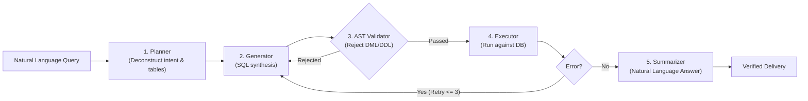

# Week 3: GenAI, Text-to-SQL & Agentic Query Execution

---
relevancy_tier: GOLDEN_REFERENCE
mentor_score: 100/100
fellowship_rating: 8.7/10
classroom_id: 864009032918
quiz_id: 864121469528
local_path: F:\FuseAIF2026\M1\WK3
github_repo: https://github.com/AaradhyaDT/fuseAiF_wk3_text2sql
---

## 1. Overview & Architectural Benchmark
- **Objective**: Build a production-grade, autonomous Text-to-SQL agentic pipeline over the `classicmodels` PostgreSQL database.
- **Benchmark Performance**: **100.0% execution success, 100.0% result accuracy** on a 50-question evaluation benchmark, zero manual retries required.
- **Stack**: Python 3.11, FastAPI, Streamlit, PostgreSQL, Docker, OpenAI API (GPT-4o-mini), Prompt Chaining.



---

## 2. SOTA Industry Best Practices & Production Standards
- **AST-Based SQL Safety (`INV-SAFE-SQL`)**: Never rely on regex string matching to block destructive SQL. Use an SQL AST parser (e.g. `sqlglot` or `sqlparse`) and verify the query root is strictly a `Select` expression. Reject any query containing `Drop`, `Delete`, `Update`, `Insert`, `Alter`, or `Truncate`.
- **Dynamic Schema Pruning**: Instead of dumping all 8 database table schemas into the LLM context window, perform an initial planning step to identify the 2–3 required tables and only supply those column definitions.
- **Self-Correction with Error Reflection**: When database execution returns an error (e.g. `psycopg2.errors.UndefinedColumn`), pass the failed query and the exact database engine error message back to the generator with reflection prompts.

---

## 3. Mentor Evaluation & Quality Rating
- **Assignment Grade**: **100 / 100**.
- **Quiz Score**: **31 / 34** (Gen AI Quiz Assignment).
- **Fellowship Rating**: **8.7 / 10** (Completed, verified against 50 test cases).

---

## 4. Local-First & GitHub Fallback Resolution (`INV-RESOLVE-FUSE`)
- **Local Directory**: [`F:\FuseAIF2026\M1\WK3`](file:///F:/FuseAIF2026/M1/WK3)
  - `task1/`, `task2/`, `task3/`, `task4/` — Step-by-step implementations.
  - `submission/` — Final packaged submission and execution screenshots.
  - `docs/prompts/` — System prompts for Planner, Generator, and Summarizer.
- **GitHub Remote Fallback**:
  - `https://github.com/AaradhyaDT/fuseAiF_wk3_text2sql`
  - Clone: `gh repo clone AaradhyaDT/fuseAiF_wk3_text2sql`

---

## 5. Golden Implementation Snippets

### AST-Based SQL Security Validator
```python
import sqlglot
from sqlglot.expressions import Select, Drop, Delete, Update, Insert

class SQLSecurityGuard:
    FORBIDDEN = (Drop, Delete, Update, Insert)

    @classmethod
    def validate_query(cls, sql_str: str) -> bool:
        """Ensure candidate SQL is strictly a read-only SELECT query."""
        try:
            parsed = sqlglot.parse_one(sql_str)
            if not isinstance(parsed, Select):
                return False
            for expr in parsed.walk():
                if isinstance(expr, cls.FORBIDDEN):
                    return False
            return True
        except Exception:
            return False
```

---

## 6. Classroom Quiz Analysis & Conceptual Traps
- **Quiz ID**: `864121469528` (31/34).
- **Hallucinated Foreign Keys**: Models often invent primary-foreign key relationships that do not exist in the physical schema (e.g., assuming `customer_id` links directly to `product_id`). Always supply explicit foreign key mapping dictionaries in the prompt.
