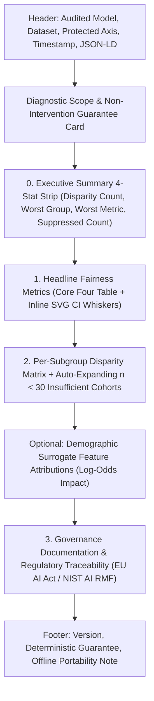

# Compliance Report Harmonizer

This skill defines the canonical standard operating procedure (SOP) for compiling, styling, verifying, and exporting demographic fairness audit dossiers across **HTML** and **PDF** formats.

---

## 1. Core Principles & Harmonized Lexicon

When diverse inputs (arbitrary models, prediction files, demographic datasets, and fairness backends) are audited, the resulting compliance artifacts must be **"cast from the same mold"**. The following pre-calibrated vocabulary must be strictly used in report headers, cards, and audit findings:

| Term | Technical Definition & Invariant | Usage in Auditing Reports |
| :--- | :--- | :--- |
| **Harmonized** | Multiple differing backend primitives (Fairlearn group rates vs. AIF360 classification metrics) and regulatory frameworks (EU AI Act vs. NIST AI RMF) are reconciled into mathematically unified point estimates and compliance mappings. | *"Harmonized Fairness Engine cross-validating binary Core Four metrics across Fairlearn and AIF360 backends."* |
| **Standardized** | The audit pipeline follows immutable schema contracts ($n < 30$ sample suppression, 95% BCa bootstrap CIs with $B \ge 1{,}000$, Pearson's $\chi^2$ significance tests), guaranteeing identical guarantees regardless of audited target. | *"Standardized demographic data ingestion enforcing Milestone M1 schema invariants."* |
| **Uniform** | The visual structure, typography hierarchy, badge color semantics (`PASS` = green, `WARN` = amber, `FAIL` = red, `GUARD` = indigo), and metadata grids share the exact same styling across browser and print. | *"Uniform executive reporting with identical card geometry across all demographic axes."* |
| **Interoperable** | The report operates simultaneously as an air-gapped web dashboard, a paginated regulatory PDF filing, and machine-readable `schema.org` JSON-LD metadata. | *"Interoperable compliance dossier suitable for offline browser inspection and formal PDF filing."* |
| **Cohesive** | Narrative descriptions, metric whiskers, surrogate explainability attributions, and datasheets fit together into a united, non-contradictory regulatory dossier. | *"Cohesive compliance documentation aligning empirical findings with Article 10 of Regulation (EU) 2024/1689."* |

---

## 2. Structural Report Invariants

Every compliance dossier produced under this skill must adhere to the following 5-section visual hierarchy:



### Invariant Rules
1. **$n < 30$ Sample Suppression (NFR-003)**:
   - Subgroups with sample sizes below 30 must **never** display computed disparity values.
   - They must be marked with `insufficient_sample=True`, highlighted with `.badge-guard`, and placed in a dedicated collapsible block (`<details class="insufficient-block">`).
2. **Offline Contract (R-015)**:
   - Exactly **0** external network requests: no external CDN scripts, no Google Fonts, no remote stylesheets, no external images.
   - Vector graphics (confidence interval whiskers, metric bars) must be generated as **raw inline `<svg>`** elements via templating, not client-side JavaScript charting libraries.
3. **Machine-Readable Metadata**:
   - The `<head>` tag must contain `schema.org` JSON-LD of `@type: "Report"` documenting the model, dataset, axis, and software author.

---

## 3. Dual-Format Interoperability & Print Standards

To ensure reports print and export to PDF identically to the on-screen browser experience, every template must embed print-calibrated CSS:

```css
@media print {
    @page {
        size: A4;
        margin: 12mm 15mm;
    }
    body {
        padding: 0;
        background: #ffffff;
        color: #0f172a;
        -webkit-print-color-adjust: exact;
        print-color-adjust: exact;
    }
    .container {
        max-width: 100%;
        margin: 0;
    }
    header, .section-card, .exec-summary, .scope-card {
        break-inside: avoid;
        box-shadow: none !important;
        border: 1px solid #cbd5e1 !important;
    }
    /* Auto-expand collapsed <details> blocks so suppressed subgroups are visible in PDF */
    details.insufficient-block,
    details.insufficient-block > * {
        display: block !important;
    }
    details.insufficient-block summary {
        font-weight: 700;
        margin-bottom: 0.5rem;
    }
    details.insufficient-block summary::before {
        content: "▼ " !important;
    }
    /* Ensure tables paginate cleanly */
    table {
        page-break-inside: auto;
    }
    tr {
        page-break-inside: avoid;
        page-break-after: auto;
    }
    thead {
        display: table-header-group;
    }
}
```

---

## 4. Cross-Platform Headless PDF Compilation (Zero-Dependency Engine)

Exporting HTML dossiers to PDF must be executed deterministically using the host operating system's native Blink engine (Chromium, Google Chrome, or Microsoft Edge). This avoids fragile C-dependencies (such as Cairo, Pango, or TeX distributions) and runs identically on Windows workstations, macOS laptops, and Linux servers/Docker CI runners.

### Cross-Platform Browser Binary Resolution (Windows First)

| Platform | Primary Binary Names / Paths | Environment & Execution Notes |
| :--- | :--- | :--- |
| **Windows (Primary)** | `chrome.exe`, `msedge.exe`, `C:\Program Files\Google\Chrome\Application\chrome.exe`, `C:\Program Files (x86)\Microsoft\Edge\Application\msedge.exe` | Pre-installed natively with Windows; runs out-of-the-box with zero setup. |
| **Linux (Servers, Containers & CI)** | `google-chrome-stable`, `google-chrome`, `chromium-browser`, `chromium`, `/usr/bin/google-chrome`, `/usr/bin/chromium` | Requires `--no-sandbox` and `--disable-setuid-sandbox` for root/Docker container execution (`apt-get install -y chromium-browser`). |
| **macOS** | `/Applications/Google Chrome.app/Contents/MacOS/Google Chrome`, `/Applications/Microsoft Edge.app/Contents/MacOS/Microsoft Edge` | Resolved via Applications bundle or Homebrew (`brew install --cask chromium`). |

### Universal Python Automation Pattern (`scripts/export_report_pdf.py`)

```python
import os
import platform
import shutil
import subprocess
from pathlib import Path


def find_blink_browser() -> Path:
    """Discovers an available Blink-based browser binary across Windows, Linux, and macOS (Windows prioritized)."""
    # 1. Environment variable override
    if env_bin := os.environ.get("BIASAPERTURE_BROWSER_BIN"):
        p = Path(env_bin)
        if p.exists():
            return p

    # 2. PATH resolution (Windows msedge/chrome first, then Linux/macOS)
    for name in [
        "chrome.exe",
        "msedge.exe",
        "chrome",
        "msedge",
        "google-chrome-stable",
        "google-chrome",
        "chromium-browser",
        "chromium",
        "microsoft-edge-stable",
        "microsoft-edge",
    ]:
        if found := shutil.which(name):
            return Path(found)

    # 3. Known OS filesystem locations (Windows prioritized)
    system = platform.system()
    candidates: list[Path] = []

    if system == "Windows":
        candidates = [
            Path(r"C:\Program Files\Google\Chrome\Application\chrome.exe"),
            Path(r"C:\Program Files (x86)\Microsoft\Edge\Application\msedge.exe"),
            Path(r"C:\Program Files\Microsoft\Edge\Application\msedge.exe"),
            Path(
                os.path.expandvars(
                    r"%LOCALAPPDATA%\Google\Chrome\Application\chrome.exe"
                )
            ),
            Path(
                os.path.expandvars(
                    r"%LOCALAPPDATA%\Microsoft\Edge\Application\msedge.exe"
                )
            ),
        ]
    elif system == "Linux":
        candidates = [
            Path("/usr/bin/google-chrome"),
            Path("/usr/bin/google-chrome-stable"),
            Path("/usr/bin/chromium"),
            Path("/usr/bin/chromium-browser"),
            Path("/usr/bin/microsoft-edge"),
            Path("/usr/bin/microsoft-edge-stable"),
            Path("/snap/bin/chromium"),
        ]
    elif system == "Darwin":  # macOS
        candidates = [
            Path(
                "/Applications/Google Chrome.app/Contents/MacOS/Google Chrome"
            ),
            Path(
                "/Applications/Microsoft Edge.app/Contents/MacOS/Microsoft Edge"
            ),
            Path("/Applications/Chromium.app/Contents/MacOS/Chromium"),
        ]

    for p in candidates:
        if p.exists():
            return p

    raise FileNotFoundError(
        f"No Blink-based browser discovered on {system}. "
        "Please install chromium/chrome or set BIASAPERTURE_BROWSER_BIN."
    )


def convert_html_to_pdf(html_path: Path, pdf_path: Path) -> Path:
    """Converts standalone HTML report to high-fidelity PDF with Linux/Docker compatibility."""
    browser = find_blink_browser()
    pdf_path.parent.mkdir(parents=True, exist_ok=True)

    cmd = [
        str(browser),
        "--headless",
        "--disable-gpu",
        "--run-all-compositor-stages-before-draw",
        # Linux / Docker sandbox bypasses (required for non-root / containerized runs)
        "--no-sandbox",
        "--disable-setuid-sandbox",
        "--disable-dev-shm-usage",
        f"--print-to-pdf={pdf_path.resolve()}",
        str(html_path.resolve()),
    ]

    subprocess.run(
        cmd, check=True, capture_output=True, text=True
    )
    return pdf_path
```

---

## 5. Verification Checklist

Before publishing, committing, or delivering a compliance report:
- [ ] **Offline Contract**: 0 external CDN/script/link/font tags (`pytest src/tests/test_offline_report_contract.py`).
- [ ] **Diagnostic Boundary**: Scope card explicitly asserts no model retraining or debiasing.
- [ ] **Sample Size Integrity**: Cohorts with $n < 30$ are marked with `insufficient_sample=True` and point estimates suppressed.
- [ ] **PDF Fidelity**: PDF renders all SVG whiskers, stat cards, and expanded `<details>` chips cleanly on A4 paper with zero clipped content.
- [ ] **Dual-Link Integrity**: Any markdown documentation (e.g. `README.md`) provides paired `[HTML](...) | [PDF](...)` links to both formats.

---

## 6. Origin & Provenance

- **Originating Repository**: [`BiasAperture`](https://github.com/fuseai-fellowship/BiasAperture-A-Diagnostic-Framework-for-Demographic-Bias-Auditing-in-Facial-Analysis-Models) (Fuse AI Fellowship Capstone Project).
- **Core Motivation**: Established during Milestone M5 to solve the dual-format compliance reporting challenge—enabling automated, air-gapped demographic bias audits that produce both interactive offline HTML dossiers and immutable A4 PDFs for EU AI Act Article 10 / NIST AI RMF regulatory filings.
- **Architectural Contribution**: Replaces heavy C-dependent PDF engines (WeasyPrint / Cairo / TeX) with zero-dependency native Blink engine automation (Windows `chrome.exe`/`msedge.exe` prioritized, Linux/Docker container compatibility, and macOS).
