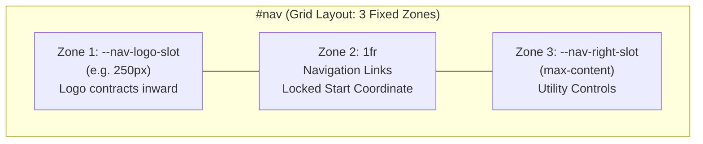

# Fixed-Slot Navbar Architecture & Anti-Displacement Engineering

## 1. The Dynamic Contraction Displacement Problem

When an interactive navbar wordmark collapses from its full string length (e.g. 250px) to a monogram (e.g. 60px) inside a fluid or standard flex/grid container:
- The width of the logo element contracts horizontally by ~190px.
- In layouts where navigation links (`.nav-links`) follow the logo with relative margins (`margin-left: 2rem`) or auto-flow grid columns (`grid-template-columns: auto 1fr auto`), the start coordinate of the adjacent column shifts leftward by the exact delta of the contraction.
- This creates two critical flaws:
  1. **Visual Attention Hijacking**: The user's eye is abruptly pulled away from the subtle wordmark animation toward the massive block of jumping links.
  2. **Click Target Instability**: Interactive targets shift beneath the user's cursor during scroll, risking misclicks and violating Cumulative Layout Shift (CLS) stability standards.

---

## 2. The 3-Zone Fixed-Slot Formula

To guarantee zero horizontal displacement during wordmark contraction and hover expansion:



### CSS Implementation Formula

```css
#nav,
noscript > nav {
  /* Zone 1: Dedicated logo reservation slot */
  --nav-logo-slot: 250px;
  /* Zone 3: Dedicated right-controls reservation slot */
  --nav-right-slot: max-content;

  position: fixed;
  top: 0;
  left: 0;
  right: 0;
  z-index: 100;

  display: grid;
  grid-template-columns: var(--nav-logo-slot) 1fr var(--nav-right-slot);
  column-gap: 1.5rem;
  align-items: center;

  /* Horizontal padding must remain constant across scroll states */
  padding: max(1.75rem, env(safe-area-inset-top, 1.75rem)) 
           max(2.5rem, env(safe-area-inset-right, 2.5rem)) 
           1.75rem 
           max(3rem, env(safe-area-inset-left, 3rem));
  transition: padding-top 0.45s cubic-bezier(0.16, 1, 0.3, 1),
              padding-bottom 0.45s cubic-bezier(0.16, 1, 0.3, 1),
              background 0.35s ease,
              border-color 0.35s ease;
}

#nav.scrolled,
noscript > nav.scrolled {
  /* Tighten vertical height only; never alter horizontal padding */
  padding-top: max(0.85rem, env(safe-area-inset-top, 0.85rem));
  padding-bottom: 0.85rem;
}
```

### Logo Anchoring Inside Zone 1
Anchor `.nav-logo` to the origin of its reserved slot:

```css
.nav-logo {
  width: var(--nav-logo-slot, 250px);
  min-width: var(--nav-logo-slot, 250px);
  display: inline-flex;
  align-items: center;
  justify-content: flex-start;
  white-space: nowrap;
}
```

Because `.nav-logo` continuously occupies `var(--nav-logo-slot)`, when its internal text contracts into initials on scroll:
- The contraction occurs strictly within the empty space on the right of Zone 1.
- Zone 2 (`.nav-links`) and Zone 3 (`.nav-right`) never experience horizontal displacement.

---

## 3. Responsive Breakpoint Strategy

When screen widths shrink below full desktop (e.g. 1050px down to 901px), available horizontal space narrows before the mobile drawer kicks in. Apply calibrated slot compression:

| Breakpoint Tier | Grid Template | Logo Slot Width | Link Spacing |
| :--- | :--- | :--- | :--- |
| **Desktop (≥ 1051px)** | `var(--nav-logo-slot) 1fr var(--nav-right-slot)` | `250px` | `gap: 0.5rem; padding: 0.5rem 0.85rem;` |
| **Compact Desktop (901px – 1050px)** | `var(--nav-logo-slot) 1fr var(--nav-right-slot)` | `230px` | `gap: 0.35rem; padding: 0.5rem 0.6rem; font-size: 0.72rem;` |
| **Mobile Drawer (≤ 900px)** | `flex; justify-content: space-between;` | `auto` (links hidden, hamburger shown) | Hidden (`display: none !important`) |

### Responsive Query Definitions

```css
@media (max-width: 1050px) and (min-width: 901px) {
  #nav,
  noscript > nav {
    --nav-logo-slot: 230px;
    column-gap: 1rem;
    padding-left: max(1.5rem, env(safe-area-inset-left, 1.5rem));
    padding-right: max(1.5rem, env(safe-area-inset-right, 1.5rem));
  }
  .nav-links {
    margin-left: 0;
    gap: 0.35rem;
  }
  .nav-links a {
    padding: 0.5rem 0.6rem;
    font-size: 0.72rem;
  }
}

@media (max-width: 900px) {
  #nav,
  noscript > nav {
    display: flex;
    justify-content: space-between;
    align-items: center;
    grid-template-columns: none;
  }
  .nav-logo {
    width: auto !important;
    min-width: 0 !important;
  }
}
```
