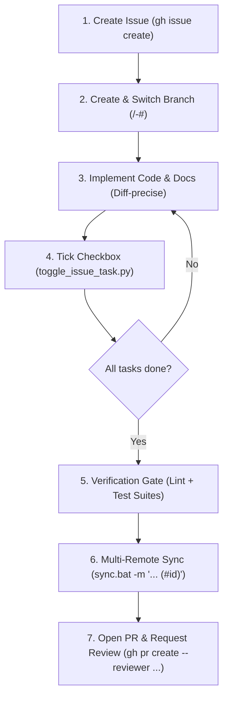

# GitHub Issue to Pull Request Lifecycle Workflow

This skill guides the end-to-end Issue-Driven Development (IDD) lifecycle: from formal issue creation and branch isolation to live task tracking, pre-commit verification, ecosystem multi-remote synchronization, and PR review dispatch.

---

## Core Invariants & Operating Principles

1. **Release SHA & Commit Integrity**: Never use synthetic or placeholder SHA strings (e.g. `rel50`, `rel55`, `upg47`). All commit references in releases, changelogs, or issue discussions must resolve to authentic 7–40 hex Git commit SHAs (`https://github.com/<owner>/<repo>/commit/<sha>`).
2. **Agent Rules Architecture**: Keep full rules and invariants in `AGENTS.md`. `GEMINI.md` must only reference `[@AGENTS.md](AGENTS.md)` to prevent drift.
3. **Multi-Remote Sync**: Always use `.\sync.bat` (or `.\sync.ps1`) when present in the repository root. Never run direct `git commit`/`git push`.

---

## Core Lifecycle Flowchart



---

## Step 1: Scoping & Issue Initialization

Define the scope, motivation, and discrete acceptance criteria before modifying code.

1. **Formulate Title & Body**:
   Follow conventional title style: `[<Type>] <Concise Imperative Summary>` or `<type>(<scope>): <summary>`.
   Structure the body with an **Overview** and markdown checklist **Tasks** (`- [ ] <task>`).
   See [templates.md](examples/templates.md) for standard formats.

2. **Create Issue via GitHub CLI**:
   ```bash
   gh issue create --title "[Refactor] Standardize Codebase Docstrings to NumPy Format" --body "$(cat << 'EOF'
   ## Overview
   Harmonize docstrings across all modules to NumPy standard per technical advisor guidelines.

   ## Tasks
   - [ ] Harmonize schema.py docstrings
   - [ ] Harmonize data_ingestion.py docstrings
   - [ ] Harmonize fairness engine backends
   - [ ] Verify test suite and lint passes
   EOF
   )"
   ```

3. **Capture Issue Number**:
   Extract the issue number (`#<ISSUE_NUMBER>`) from the returned URL (e.g. `#26`). All subsequent branches, commits, and PR descriptions must link to this number.

4. **Enrich Issue Metadata (Type, Milestone, Relationships & Projects)**:
   - **Set Native Issue Type** (`Bug`, `Feature`, `Task`):
     ```bash
     gh api -X PATCH repos/{owner}/{repo}/issues/<ISSUE_NUMBER> -f type="Feature"
     ```
   - **Attach to Milestone**:
     ```bash
     gh issue edit <ISSUE_NUMBER> --milestone "<Milestone Title>"
     ```
   - **Link Sub-Issue Relationships** (Parent ↔ Child hierarchy):
     ```bash
     # Capture GraphQL node IDs for parent and child:
     # gh api graphql -f query='query { repository(owner: "{owner}", name: "{repo}") { issue(number: <NUM>) { id } } }'
     gh api graphql -f query='mutation { addSubIssue(input: { issueId: "<PARENT_NODE_ID>", subIssueId: "<CHILD_NODE_ID>" }) { issue { id } } }'
     ```
   - **Cross-Repo Project Board Tracking (ProjectsV2)**:
     If the target repository belongs to an organization where member project creation is restricted, create and maintain the project board on the personal user namespace (`gh project create --owner @me --title "..."`), link the board to your repository mirror (`linkProjectV2ToRepository`), and add organization issues cross-repo using `addProjectV2ItemById`.

---

## Step 2: Isolated Feature Branch Creation

Never commit multi-step features, refactors, or bug fixes directly to `main`. Always isolate work in a dedicated branch.

1. **Verify Clean Base**:
   Ensure `main` is current:
   ```bash
   git switch main
   git pull origin main
   ```

2. **Branch Naming Standard**:
   `<type>/<short-slug>-#<ISSUE_NUMBER>` (or `<type>/<short-slug>`).
   Examples:
   - `refactor/standardize-docstrings-#26`
   - `feat/statistical-significance-#28`
   - `fix/bootstrap-closure-scope-#29`

3. **Create and Switch**:
   ```bash
   git switch -c <type>/<short-slug>-#<ISSUE_NUMBER>
   ```

---

## Step 3: Implement Code & Behavioral Changes

Apply diff-precise modifications directly to target files:
- Adhere strictly to project architectural constraints (e.g. diagnostic-only scope, frozen schemas).
- Preserve existing comments and docstrings unrelated to current edits.
- Keep modifications wrapped to the repository line limit (e.g. 88 characters for Python `ruff`).

> [!CAUTION]
> **Privacy & Boundary Isolation (Zero Personal Data Leakage)**:
> Never commit or log personal developer resources (e.g. personal NotebookLM workspace IDs, personal notes, private repositories, or local machine configurations) into shared or collaborative repositories. Personal environment details from global agent rules are strictly for local assistant tooling context and must never be committed to shared repositories.

---

## Step 4: Checkpoint Task Tracking

Keep collaborators and stakeholders informed by updating the GitHub issue checklist as work progresses.

### Option A: Deterministic Script (Recommended)
Use the bundled Python helper to toggle tasks without manually reconstructing the entire markdown body:

```powershell
# List existing tasks
python "C:\Users\Aaradhya\.gemini\config\skills\github-issue-pr-workflow\scripts\toggle_issue_task.py" --issue <ISSUE_NUMBER> --list

# Toggle by substring match (marks as [x])
python "C:\Users\Aaradhya\.gemini\config\skills\github-issue-pr-workflow\scripts\toggle_issue_task.py" --issue <ISSUE_NUMBER> --task "schema.py"

# Toggle by 1-based task index
python "C:\Users\Aaradhya\.gemini\config\skills\github-issue-pr-workflow\scripts\toggle_issue_task.py" --issue <ISSUE_NUMBER> --index 1

# Mark all tasks completed
python "C:\Users\Aaradhya\.gemini\config\skills\github-issue-pr-workflow\scripts\toggle_issue_task.py" --issue <ISSUE_NUMBER> --all
```

### Option B: GitHub CLI Direct Edit
```bash
gh issue edit <ISSUE_NUMBER> --body "<FULL_UPDATED_BODY>"
```

### Post Progress Comments
For significant milestones or architectural discoveries, post an audit comment:
```bash
gh issue comment <ISSUE_NUMBER> --body "Completed data ingestion docstring migration. All 85 unit tests passing."
```

---

## Step 5: Pre-Commit Verification Gate

Before staging or committing any code, execute the project test and lint suites. Zero failures are tolerated.

```powershell
# 1. Lint and style check
uv run --extra dev ruff check src/

# 2. Format verification
uv run --extra dev ruff format --check src/

# 3. Unit and integration test suite
uv run --extra dev pytest
```

If tests fail or lints trigger, resolve them before proceeding to version control.

---

## Step 6: Multi-Remote Version Control & Synchronization

Check if the repository utilizes an ecosystem synchronization wrapper (`sync.bat` / `sync.ps1`).

### Rule 1: Ecosystem Repositories (`sync.bat` / `sync.ps1` Present)
- **Direct `git add`, `git commit`, or `git push` are strictly forbidden.**
- Always run commits through `.\sync.bat` to maintain multi-remote integrity (`origin`, `duo`, `org`) and bypass Windows ExecutionPolicy restrictions.
- Format the commit message with conventional type, scope, and issue number:
  ```powershell
  .\sync.bat -m "<type>(<scope>): <summary> (#<ISSUE_NUMBER>)"
  ```
- For safe pulls:
  ```powershell
  .\sync.bat -PullOnly
  ```

See [multi-remote-sync.md](references/multi-remote-sync.md) for full remote hierarchy and conflict-prevention mechanisms.

### Rule 2: Standard Non-Ecosystem Repositories
If `sync.bat` is not present:
```bash
git add -A
git commit -m "<type>(<scope>): <summary> (#<ISSUE_NUMBER>)"
git push -u origin <BRANCH_NAME>
```

---

## Step 7: Open Pull Request & Request Review

Once all issue checklist items are marked `[x]` and commits are pushed:

1. **Construct PR Body**:
   - Provide a clear bulleted summary.
   - Include the issue closing keyword: `Closes #<ISSUE_NUMBER>` (or `Fixes #<ISSUE_NUMBER>`, `Resolves #<ISSUE_NUMBER>`).
   - Include verification proof (e.g. pytest results, ruff status).

2. **Open PR with Complete Metadata & Milestone**:
   ```bash
   gh pr create \
     --base main \
     --head <BRANCH_NAME> \
     --title "<type>(<scope>): <summary> (#<ISSUE_NUMBER>)" \
     --assignee <EXPLICIT_CONTRIBUTOR_USERNAME> \
     --reviewer <RECIPROCAL_REVIEWER_USERNAME> \
     --milestone "<Milestone Title>" \
     --body "$(cat << 'EOF'
   ## Summary
   - Comprehensive summary of changes.
   - Design patterns or architecture adhered to.

   Closes #<ISSUE_NUMBER>

   ## Verification
   - uv run --extra dev ruff check src/: 0 errors.
   - uv run --extra dev pytest: 85/85 tests passed.
   EOF
   )"
   ```

   > [!IMPORTANT]
   > - **Never use ambiguous `@me` in multi-contributor repositories**: Use exact GitHub usernames (`AaradhyaDT`, `tiixsha`) so PR assignments are deterministic regardless of who triggers the command.
   > - **Never use organization names as review or assignee targets**: Use personal contributor handles.
   > - **Reciprocal Review Standard**: Follow the peer review protocol (e.g. Aaradhya assigns `AaradhyaDT` and requests review from `tiixsha`; Tisha assigns `tiixsha` and requests review from `AaradhyaDT`).

3. **Post Issue Cross-Reference Tracking Comment**:
   Immediately post a cross-reference comment on the tracked issue:
   ```bash
   gh issue comment <ISSUE_NUMBER> --body "🔗 **Pull Request Attached**: #<PR_NUMBER> (https://github.com/<owner>/<repo>/pull/<PR_NUMBER>)"
   ```

4. **Verify PR & Attached Commits**:
   ```bash
   gh pr view <PR_NUMBER>
   gh pr view <PR_NUMBER> --json commits,assignees,reviewRequests,milestone
   ```

5. **Retroactive PR-to-Issue Linking & Milestone Backfilling**:
   ```bash
   # Attach milestone to PR and issue
   gh pr edit <PR_NUMBER> --milestone "<Milestone Title>"
   gh issue edit <ISSUE_NUMBER> --milestone "<Milestone Title>"
   ```
   *(For closed milestones, use the GitHub API directly: `gh api repos/:owner/:repo/issues/<NUMBER> --method PATCH -F milestone=<MILESTONE_NUMBER>`)*

4. **Follow-Up Commits**:
   If additional changes or review feedback require pushes, simply run `.\sync.bat -m "..."`. The new commits will automatically attach to the open PR.

5. **Retroactive PR-to-Issue Linking (Open or Merged PRs)**:
   If an open or previously merged PR lacks issue resolution keywords (`Closes #<ID>`), update the PR body via GitHub CLI to backfill the audit trail:
   ```bash
   gh pr edit <PR_NUMBER> --body "## 📌 Purpose
   Feature implementation summary.

   ## 🔗 Related Issues
   Closes #<ISSUE_NUMBER>

   ## 🧪 Testing & Verification
   - [x] Unit tests passing (pytest)
   - [x] Linter clean (ruff)"
   ```

---

## Additional Resources

### Bundled Scripts
- **`scripts/toggle_issue_task.py`**: Deterministic CLI utility to inspect, check, or uncheck issue task items without corrupting issue markdown.

### Reference Documentation
- **`references/gh-cli-cheatsheet.md`**: Quick reference for GitHub CLI flags, filtering, and commands.
- **`references/multi-remote-sync.md`**: Guide to multi-remote push/mirror flows and automated drift prevention.

### Examples
- **`examples/templates.md`**: Markdown templates for bug reports, features, refactors, and pull requests.
