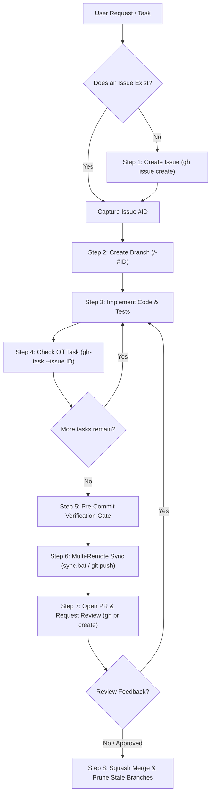

# Default GitHub Development Workflow

This skill defines the canonical standard operating procedure (SOP) for all software development, feature additions, bug fixes, refactors, and version control across GitHub repositories.

---

## 1. Golden Rules & Invariants

1. **Issue Anchoring**: All non-trivial code modifications must link to a tracked GitHub issue with complete sidebar metadata (`--assignee "@me"`, `--label "<labels>"`). The issue number (`#<ID>`) serves as the permanent tracking anchor for branches, commits, PRs, and audit comments.
2. **Branch Isolation**: Never commit multi-step features or refactors directly to `main`. Always branch off `main` using `<type>/<slug>-#<ID>`.
3. **Checkpoint Task Tracking**: Check off acceptance criteria in the issue body progressively as tasks complete (`gh-task --issue <ID> --task "<name>"`).
4. **Verification Gate**: Never commit or push without passing local linters (`ruff`, `eslint`), formatters, and test suites (`pytest`, `npm test`).
5. **Ecosystem Synchronization**: When `sync.ps1` or `sync.bat` exists, raw `git commit`, `git add`, or `git push` are strictly forbidden. All version control must run through `.\sync.bat` (or `.\sync.ps1`).
6. **PR Metadata & Review Dispatch**: Always open pull requests with full sidebar metadata: assign yourself (`--assignee "@me"`), attach labels (`--label "<labels>"`), link the issue with resolution keywords (`Closes #<ID>`), and request peer review from designated teammates (e.g. `--reviewer tiixsha`).
7. **Collaborative Privacy & Boundary Isolation (Zero Personal Leakage)**:
   > [!CAUTION]
   > **Never commit or log personal developer resources into collaborative/public repositories.**
   > Personal NotebookLM IDs, private journals, personal notes, and local machine configs found in global agent rules are strictly for local assistant tooling context. They must **never** be written into shared repository documentation, Markdown files, or committed artifacts.

---

## 2. Decision Tree & Workflow Paths



---

## 3. Step-by-Step Procedure

### Step 1: Scoping & Issue Initialization

Define requirements, acceptance criteria, and technical boundaries before touching code.

1. **Formulate Issue Body**:
   Follow conventional title style: `[<Type>] <Concise Imperative Summary>`. Include an **Overview**, **Scope / Non-Goals**, and a markdown checklist of **Tasks** (`- [ ] <task>`).
   See [templates.md](examples/templates.md) for pre-built formats.

2. **Create via GitHub CLI**:
   ```bash
   gh issue create \
     --title "[Feature] Add Statistical Parity Disparity Metric" \
     --assignee "@me" \
     --label "enhancement,WP4" \
     --body "$(cat << 'EOF'
   ## Overview
   Implement statistical parity difference calculation with BCa confidence intervals.

   ## Tasks
   - [ ] Implement mathematical metric in src/fairness/metrics.py
   - [ ] Add unit tests with synthetic distribution fixtures
   - [ ] Verify test suite passing (pytest) and linting (ruff)
   EOF
   )"
   ```

3. **Record Issue Number**: Note `#<ISSUE_NUMBER>` (e.g., `#28`).

---

### Step 2: Branch Isolation

Isolate development on a dedicated feature or bugfix branch.

1. **Ensure Base is Up to Date**:
   ```bash
   git switch main
   git pull origin main
   ```

2. **Create and Switch to Branch**:
   Convention: `<type>/<short-slug>-#<ISSUE_NUMBER>`.
   ```bash
   git switch -c feat/statistical-parity-#28
   ```

---

### Step 3: Implement Changes

1. Follow repository coding guidelines, type hinting, and docstring conventions (e.g. NumPy docstring format).
2. Respect diagnostic/architectural boundaries and frozen schemas.
3. Keep diffs minimal, focused, and clean.

---

### Step 4: Checkpoint Task Tracking

Provide transparent progress by updating the issue checklist.

Use the global `gh-task` (or `toggle-issue-task`) utility from any terminal:

```bash
# List current tasks
gh-task --issue 28 --list

# Toggle a specific task by substring (marks [x])
gh-task --issue 28 --task "metrics.py"

# Toggle a task by 1-based index
gh-task --issue 28 --index 2

# Mark all tasks complete
gh-task --issue 28 --all
```

For major progress milestones, post an informative audit comment:
```bash
gh issue comment 28 --body "Completed metric math and unit test fixtures. 85 tests passing."
```

---

### Step 5: Pre-Commit Verification Gate

Enforce local verification before staging. Zero errors tolerated.

```powershell
# 1. Lint checks
uv run --extra dev ruff check src/

# 2. Formatting verification
uv run --extra dev ruff format --check src/

# 3. Complete test suite
uv run --extra dev pytest
```

*(For Node.js/TypeScript repos, run `npm run lint` and `npm test`).*

---

### Step 6: Multi-Remote Ecosystem Synchronization

Check for `sync.bat` / `sync.ps1` in the repository root:

#### Case A: Ecosystem Repositories (`sync.bat` present)
- **Do NOT run manual `git commit`, `git push`, or `git add`.**
- Use `.\sync.bat` (automatically handles ExecutionPolicy bypass and pushes to `origin`, `duo`, and `org` mirrors):
  ```powershell
  .\sync.bat -m "feat(fairness): add statistical parity disparity metric (#28)"
  ```
- Pull upstream updates safely:
  ```powershell
  .\sync.bat -PullOnly
  ```

#### Case B: Standard Repositories (No sync wrapper)
```bash
git add -A
git commit -m "feat(fairness): add statistical parity disparity metric (#28)"
git push -u origin feat/statistical-parity-#28
```

---

### Step 7: Open Pull Request & Request Review

1. **Construct PR Body**:
   - Executive bulleted summary of additions/modifications.
   - Issue closing keyword: `Closes #<ISSUE_NUMBER>` (or `Fixes #<ISSUE_NUMBER>`, `Resolves #<ISSUE_NUMBER>`).
   - Verifiable test proof.

2. **Open PR with Complete Sidebar Metadata**:
   ```bash
   gh pr create \
     --base main \
     --head feat/statistical-parity-#28 \
     --title "feat(fairness): add statistical parity disparity metric (#28)" \
     --assignee "@me" \
     --label "enhancement,WP4" \
     --reviewer <COLLABORATOR_USERNAME> \
     --body "$(cat << 'EOF'
   ## Summary
   - Implemented statistical parity difference in src/fairness/metrics.py.
   - Added fixtures and assertions in src/tests/test_metrics.py.

   Closes #28

   ## Verification
   - uv run --extra dev ruff check src/: 100% passing (0 errors).
   - uv run --extra dev pytest: 86 passed in 19.4s.
   EOF
   )"
   ```

3. **Verify PR & Attached Commits**:
   ```bash
   gh pr view <PR_NUMBER>
   gh pr view <PR_NUMBER> --json commits
   ```

---

### Step 8: Post-PR Iteration & Branch Cleanup

1. **Addressing Review Feedback**:
   Make edits, rerun verification tests, and run `.\sync.bat -m "fix(fairness): address review comments (#28)"`. New commits automatically attach to the open PR.

2. **After PR Merge**:
   Switch back to `main`, pull the merged changes, and prune stale local branches:
   ```powershell
   git switch main
   git pull origin main
   
   # Prune local branches whose remote counterparts are gone
   git branch -vv | Select-String ': gone]' | ForEach-Object { ($_.Line.Trim() -split '\s+')[0] } | ForEach-Object { git branch -d $_ }
   ```

---

## 4. Supporting Resources

- **`scripts/toggle_issue_task.py`**: Global task checkbox toggler (aliased to `gh-task` and `toggle-issue-task` in system PATH).
- **`references/gh-cli-cheatsheet.md`**: Complete reference for `gh issue`, `gh pr`, `gh repo` commands.
- **`references/multi-remote-sync.md`**: Architectural reference for `sync.bat`/`sync.ps1` multi-remote mirroring.
- **`examples/templates.md`**: Issue and PR templates for features, bug fixes, refactors, and research tracks.
