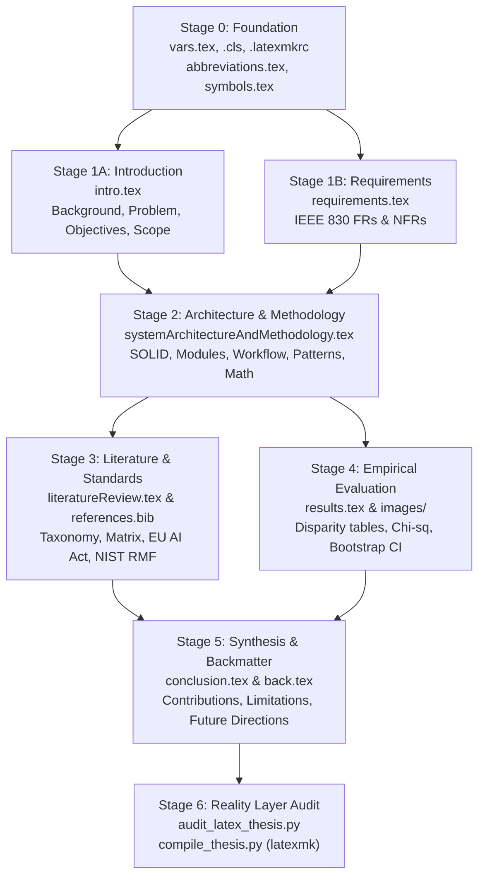

# CPM DAG Thesis Orchestration & Context Firebreaks

This reference outlines the **Adaptive Orchestration Protocol** (`adaptive-workflow`) for authoring, reviewing, and compiling comprehensive academic thesis reports and fellowship capstone monographs without context degradation or hallucinated references.

---

## 1. The Context Firebreak Invariant (`INV-CTX-FIREBREAK`)

Monolithic drafting of a 60–120 page academic thesis in a single LLM context window invariably causes:
1. **Context Saturation**: Degraded reasoning as prompt tokens approach window limits.
2. **Hallucinated Cross-References**: Invention of non-existent section numbers, figures, or citations.
3. **Stylistic Drift**: Loss of the Anthropic calm-authority voice, degenerating into conversational marketing filler.

### The Solution: Isolated Stage Gates
Each chapter is drafted in an **isolated execution context** ($<5{,}000$ tokens), reading only its formal dependency contracts from previous stages, and writing exclusively to its designated `.tex` file in `src/chapters/`.

---

## 2. Mathematical Critical Path Method (CPM) DAG

Drafting follows a deterministic Precedence Diagramming Method (PDM) DAG:



### Critical Path Breakdown:
1. **Critical Path ($TS = 0$)**:
   $$\text{Stage 0} \to \text{Stage 1B (Requirements)} \to \text{Stage 2 (Architecture)} \to \text{Stage 4 (Empirical)} \to \text{Stage 5 (Conclusion)} \to \text{Stage 6 (Audit)}$$
   The architecture and empirical results define the scientific validity of the thesis.
2. **Parallel Float Branches ($TS > 0$)**:
   - `literatureReview.tex` and `references.bib` can be drafted concurrently once the core methodology and theoretical bounds are defined in Stage 2.
   - `intro.tex` can be refined in parallel with `requirements.tex`.

---

## 3. Cognitive Division of Labor (Multi-Agent Swarm)

When operating with autonomous subagents (`invoke_subagent` or `/teamwork-preview`), delegate tasks across specialized roles:

| Role | Agent / Model | Execution Target | Responsibilities |
| :--- | :--- | :--- | :--- |
| **Scout** | `research` (Flash) | `references.bib`, raw papers | Harvests authentic DOI/arXiv citations, extracts mathematical definitions from literature, profiles regulatory clauses. |
| **Reviewer** | `self` (Pro) | `audit_latex_thesis.py` | Audits drafts for banned hype words, broken `\cref` targets, missing BibTeX keys, and enforces sample size guards ($n \ge 30$). |
| **Writer** | `self` (Inherit) | `src/chapters/*.tex` | Synthesizes calm-authority LaTeX chapters adhering to IEEE/IOE typography, booktabs, and active voice. |
| **Lead Orchestrator** | Main Chat | `main.tex`, `vars.tex`, `sync.bat` | Coordinates CPM gates, runs fast-path zero-AI compilers, inspects logs, and ensures repository commit integrity. |

---

## 4. Tier 0 Fast Paths (Zero-AI Reality Layer)

Never invoke high-parameter LLMs to check compilation errors or syntax validity. Always execute deterministic local CLI fast paths:

```powershell
# 1. Audit calm-authority style and reference integrity (< 100 ms)
python scripts/audit_latex_thesis.py .

# 2. Compile document using multi-pass latexmk (< 3 seconds)
python scripts/compile_thesis.py .

# 3. Synchronize repository state with commit proof
.\sync.bat -m "docs(thesis): draft methodology and architecture chapters"
```
