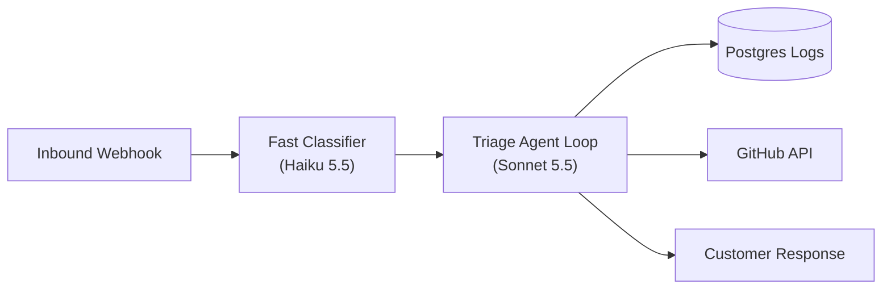

# How Our Team Rebuilt Inbound Triage with Claude Managed Agents

*How an autonomous agent loop now resolves 68% of technical support inquiries, and how that changed our on-call rotations.*

---

In early 2026, our developer platform team faced an unsustainable on-call burden. We were receiving over 1,200 technical triage requests per week across API key disputes, webhook delivery failures, and SDK configuration issues. Engineers spent an average of 18 hours per weekly rotation manually correlating server logs, leaving little focus for platform infrastructure.

We rebuilt our inbound triage system around Claude Managed Agents. Today, the agent loop resolves 68% of inbound inquiries with zero human handoff, reducing median response latency from 4.2 hours to 45 seconds. Here is how the system works, what broke during early testing, and how our operational workflow adapted.

---

## The System Architecture

The triage system operates as a deterministic, tool-augmented agent loop:

When a developer submits a support ticket, the webhook triggers a lightweight classifier running on Claude Haiku 5.5. The classifier extracts the reported error code, SDK version, and account ID, rejecting malformed submissions immediately.

If the ticket involves valid technical debugging, it routes to a persistent Claude Sonnet 5.5 agent loop equipped with three read-only tools:
1. `fetch_webhook_delivery_logs(account_id, timestamp_range)`
2. `search_github_issues(error_string, repo)`
3. `verify_tls_certificate(endpoint_url)`

The agent inspects the customer's delivery logs, identifies the root cause (such as an expired SSL certificate or a 413 payload truncation), formats an exact technical explanation, and posts the resolution.

---

## Early Failure Modes & Adaptations

During our initial pilot, the system struggled with two distinct failure modes:

1. **Hallucinated Log References**: When customer logs showed no errors, the agent occasionally hypothesized potential misconfigurations rather than admitting that logs were clean. We resolved this by modifying the system prompt to enforce an explicit non-goal: *"If zero error entries appear within the specified timestamp window, output an explicit log-clear assertion and request the customer's client-side trace."*
2. **Rate Limit Retries**: During traffic spikes, rapid parallel tool execution occasionally saturated internal database connection pools. We restructured the tool execution harness to run through an async bounded queue with exponential backoff and jitter.

---

## How It Changed How We Work

The biggest shift was not the metric reduction—though cutting triage hours by 70% was substantial—but the nature of on-call work. Engineers no longer spend their rotations reading routine nginx error logs. Instead, engineers review weekly discrepancy dossiers: edge-case tickets where the agent lacked adequate tool visibility or where customer requests exposed documentation ambiguities.

Building reliable agent systems does not eliminate human engineering; it shifts human attention toward boundary definitions and tool design.

---

## Getting Started

If you are building autonomous triage loops:
- Read our [Tool Use Best Practices Guide](https://platform.claude.com/docs/en/agents-and-tools/tool-use).
- Inspect the [Managed Agents Architecture](https://platform.claude.com/docs/en/managed-agents/overview).
