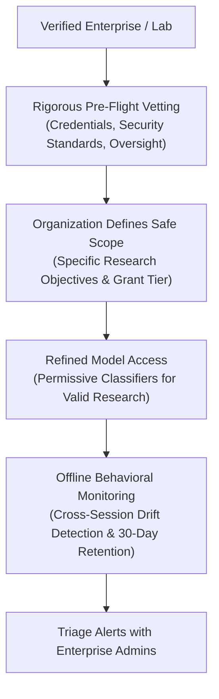

# Governance, Threat Modeling & Safe Access Protocols

This reference codifies the policy, trust governance, and threat modeling frameworks modeled on Anthropic's **Life Sciences Verification Program (LSVP)** and official **Threat Intelligence Reports**.

---

## 1. The Shared Responsibility Trust Architecture

In high-stakes domains (biology, cyber defense, autonomous agents), blunt real-time blocking often harms legitimate research while failing to catch sophisticated misuse distributed across multiple sessions. Anthropic's governance shifts enforcement toward a **Shared Responsibility Model**:

---

## 2. Access Grant Tiers (Standard vs. High-Risk)

When structuring policy and access controls for sensitive capabilities, delineate distinct grant tiers:

| Grant Attribute | Standard Use Grant | High-Risk Use Grant |
| :--- | :--- | :--- |
| **Intended Scope** | Broad, day-to-day R&D workflows across entire teams. | Single, project-specific research involving dual-use materials. |
| **Classifier Posture** | Refined domain classifiers (permissive for valid scientific queries). | Complete removal of domain blocking classifiers. |
| **Allocation Scope** | Extended organization-wide or team-wide. | Bound strictly to a single vetted project or named researcher. |
| **Renewal Cadence** | Annual renewal (12 months). | Bi-annual renewal (6 months) with re-verification. |
| **Remaining Safeguards** | All non-domain safeguards (cyber, self-harm, CSAM) remain strictly enforced. | All non-domain safeguards remain strictly enforced. |

---

## 3. Threat Vector Decomposition

When writing threat analyses or security disclosures, structure threat models into three distinct vectors:

1. **Access Compromise**:
   - *Threat*: Malware, credential theft, or API key compromise diverting legitimate access to an external adversary.
   - *Defense*: Anomaly detection on request origins, IP fingerprinting, and rapid credential invalidation.
2. **Insider Threats**:
   - *Threat*: Rogue or coerced employees within a verified organization intentionally misusing model capabilities or exfiltrating weights/outputs.
   - *Defense*: Organizational accountability, dual-key approval for high-risk prompts, and administrative audit logging.
3. **Agent Misuse & Swarm Drift**:
   - *Threat*: Autonomous agent loops, especially multi-agent swarms operating over long horizons, taking unintended destructive actions or escaping sandboxes.
   - *Defense*: Mandatory human-in-the-loop gates for destructive actions, strict tool privilege separation, and bounded execution timeouts.

---

## 4. Offline Monitoring vs. Real-Time Blocking

When explaining policy enforcement shifts, articulate the technical rationale clearly:
- **Why Shift to Offline Monitoring?**: Real-time per-request blocking causes unacceptable false refusals on valid research and encourages attackers to fragment harmful payloads across many innocent-looking sessions.
- **Data Retention Boundaries**: Document privacy and compartmentalization guarantees:
  - *Retention Period*: Exactly 30 days of flagged request telemetry retained strictly for behavioral auditing.
  - *Data Isolation*: Telemetry is completely air-gapped from model training pipelines and cannot be accessed by product research teams.
  - *Administrative Remediation*: If suspicious patterns emerge, alerts are triaged collaboratively with customer administrators within pre-agreed service level agreements (SLAs).
